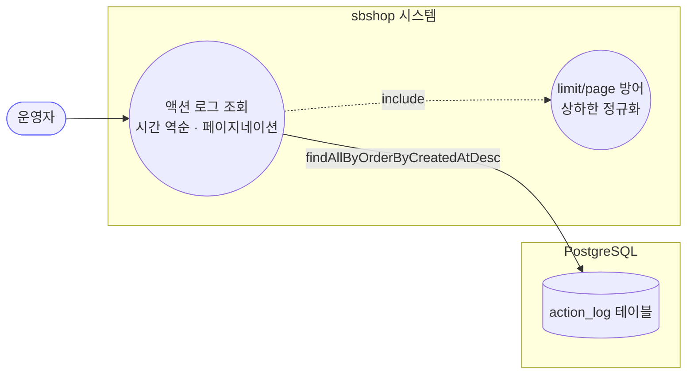
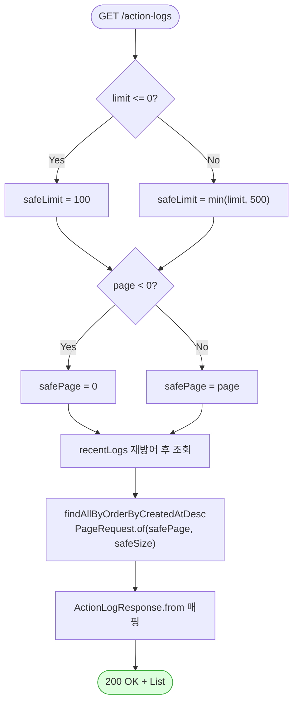

# GET /action-logs — 사용자 활동 기록 조회

## 1. 개요

이 기능은 "누가 무슨 작업을 언제 했는지"를 적어 둔 활동 기록(ActionLog)을 최신 순서로 화면에 뿌려 주는 조회 기능입니다. 시스템은 아무것도 바꾸지 않고 기록을 읽어 오기만 합니다.

| 항목 | 내용 (쉬운 설명) |
|------|------|
| **Method / URL** | `GET /api/v1/action-logs?limit={n}&page={p}` — "활동 기록을 몇 개(limit)씩, 몇 번째 묶음(page)으로 달라"고 요청하는 주소입니다. |
| **목적** | 활동 기록을 **최근 것부터** 정해진 개수만큼 잘라(페이지 단위) 가져와, 프론트가 그대로 쓰기 쉬운 **단순한 목록 형태**로 돌려줍니다. |
| **핵심 상태전이** | 없음 — **읽기만 하는 조회**라 데이터를 바꾸지 않습니다(`@Transactional(readOnly = true)`). |
| **부수효과** | 없음 — DB를 들여다보기만 합니다. |
| **응답** | `200 OK` + 기록 목록(`List<ActionLogResponse>`). 프론트와의 약속상 "총 개수·페이지 정보로 감싼 형태"가 아니라 **그냥 나열된 배열**로 줍니다. |

**요청에 붙일 수 있는 값(쿼리 파라미터)**

| 값 | 타입 | 기본값 | 잘못된 값이 오면 어떻게 막나 |
|----------|------|:------:|------|
| `limit` (한 번에 몇 개) | int | 100 | `0 이하로 오면 → 100으로`, 아무리 커도 `최대 500까지만`. 이 방어를 컨트롤러(L45)와 서비스(L60) 두 군데서 이중으로 합니다. |
| `page` (몇 번째 묶음) | int | 0 | `음수로 오면 → 0으로`. 역시 컨트롤러(L46)와 서비스(L59) 두 군데서 이중으로 막습니다. |

## 2. 호출 체인

아래는 요청이 들어와서 응답이 나갈 때까지 코드가 거치는 순서입니다. 각 줄 오른쪽은 실제 파일과 줄 번호입니다.

```
ActionLogController.getActionLogs()                    api/.../controller/ActionLogController.java:41-51
  ├─ safeLimit = limit<=0 ? 100 : min(limit,500)       :45   (DEFAULT_LIMIT=100 L26, MAX_LIMIT=500 L27)
  ├─ safePage  = max(page, 0)                           :46
  └─ ActionLogService.recentLogs(safePage, safeLimit)  core/.../actionlog/ActionLogService.java:57-62  @Transactional(readOnly=true)
       ├─ safePage = max(page,0), safeSize = size<=0?100:min(size,500)  :59-60  (재방어)
       └─ ActionLogRepository.findAllByOrderByCreatedAtDesc(PageRequest.of(...))  core/.../actionlog/repository/ActionLogRepository.java:14
  └─ .map(ActionLogResponse::from).toList()             ActionLogController.java:47-49
       └─ ActionLogResponse.from(ActionLog)             api/.../dto/actionlog/ActionLogResponse.java:17-25
```

→ 쉽게 말하면:
1. 입구(컨트롤러)가 요청을 받아, 넘어온 `limit`·`page` 값을 **안전한 범위로 다듬습니다**(너무 크거나 음수면 바로잡음).
2. 다듬은 값을 서비스에 넘기면, 서비스가 **한 번 더 같은 방어를 하고** DB에 "최신 순으로 이 만큼 달라"고 요청합니다.
3. DB가 돌려준 기록들을 **화면에 보내기 좋은 모양(ActionLogResponse)으로 바꿔** 목록으로 만들어 응답합니다.

**돌려주는 각 기록의 항목 (`ActionLogResponse`, `ActionLogResponse.java:9-15`)**

| 필드 | 타입 | 쉬운 설명 |
|------|------|------|
| `id` | Long | 기록 하나하나를 구분하는 고유 번호 |
| `actionType` | String | 무슨 작업이었는지(예: `STOCK_SYNC` = 재고 동기화) |
| `marketType` | String | 어느 마켓 관련인지(비어 있을 수 있음) |
| `actionStatus` | String | 성공/실패 같은 상태(값이 없어도 안전하게 처리, L22) |
| `message` | String | 상세 메시지(기록할 때 최대 1000자까지만 저장) |
| `createdAt` | LocalDateTime | 언제 있었는지 — **이 시각을 기준으로 최신 순 정렬** |

## 3. 유스케이스 다이어그램

👉 이 그림은 운영자가 "활동 기록 조회"를 요청하면 시스템이 값(limit/page)을 안전하게 다듬은 뒤 DB에서 최신 순으로 읽어 온다는 전체 그림을 보여줍니다.



## 4. 시퀀스 다이어그램

👉 이 그림은 요청 하나가 컨트롤러 → 서비스 → DB → 응답으로 시간 순서대로 어떻게 오가는지, 그리고 중간에 값 다듬기가 두 번(컨트롤러·서비스) 일어난다는 걸 보여줍니다.

```mermaid
sequenceDiagram
    autonumber
    actor U as 운영자
    participant C as ActionLogController
    participant S as ActionLogService
    participant R as ActionLogRepository
    participant DTO as ActionLogResponse
    Note over S: recentLogs 는 @Transactional(readOnly=true)<br/>쓰기 없음 → 롤백 대상 없음

    U->>C: GET /action-logs?limit&page
    C->>C: safeLimit / safePage 정규화 (L45-46)
    C->>S: recentLogs(safePage, safeLimit)
    Note over S: 서비스도 page/size 재방어 (L59-60)
    S->>R: findAllByOrderByCreatedAtDesc(PageRequest)
    R-->>S: List&lt;ActionLog&gt;
    S-->>C: List&lt;ActionLog&gt;
    C->>DTO: from(log) 매핑 (stream)
    DTO-->>C: List&lt;ActionLogResponse&gt;
    C-->>U: 200 OK + 평면 배열
```

## 5. 순서도 (플로우차트)

👉 이 그림은 "limit이 0 이하면 100으로, page가 음수면 0으로" 다듬은 뒤 조회하고 목록으로 응답하기까지의 갈림길을 순서대로 보여줍니다.



## 6. 상태 전이표

이 기능은 **읽기 전용**이라 시스템의 상태를 하나도 바꾸지 않습니다. 그래서 바뀌는 상태가 없습니다.

| 진입 상태 | 허용? | 결과 상태 | 부수효과 | 비고 (쉬운 설명) |
|-----------|:-----:|-----------|----------|------|
| — | — | — | — | **바뀌는 상태 없음(조회만)**. 읽기 전용이라 어떤 데이터도 변경하지 않습니다. |

## 7. 🔎 발견사항

### MISCA-1 · 🟡 SMELL — 아무도 안 쓰는 `findTop100ByOrderByCreatedAtDesc()` 메서드가 남아 있음
- **무엇이 문제인가:** 저장소 코드에 "최신 100개만 가져오는" 메서드가 하나 선언돼 있는데, 실제 조회는 그걸 안 쓰고 다른 메서드(페이지 방식)만 씁니다. 전체 코드를 뒤져도 이 100개짜리 메서드를 부르는 곳이 없습니다.
- **근거:** `ActionLogRepository.java:11` 에 `findTop100ByOrderByCreatedAtDesc()` 가 선언돼 있으나, 조회 경로(`recentLogs` L61)는 `findAllByOrderByCreatedAtDesc(Pageable)` 만 사용한다. 전체 코드에서 top100 메서드 호출부가 없다.
- **왜 문제인가:** 지금 당장 고장 나는 건 아니지만, 나중에 코드를 손볼 때 "조회 경로가 두 개인가?" 하고 헷갈릴 수 있습니다.
- **어떻게 고치면 되나:** 정말 안 쓰는 게 맞으면 지우고, 편의상 남겨 둘 이유가 있으면 주석으로 그 이유를 적어 둡니다.

### MISCA-2 · 🔵 NOTE — 페이지로 나눠 주긴 하는데 "전체가 몇 개인지 / 다음 페이지가 있는지"는 안 알려 줌
- **무엇이 문제인가:** 응답이 그냥 목록만 주고, "총 몇 건이다" 또는 "다음 페이지가 남았다" 같은 정보는 함께 주지 않습니다. 이는 프론트와의 약속(단순 배열 유지)을 지키려는 의도입니다.
- **근거:** `ActionLogController.java:41-51` 은 평면 `List` 만 반환(프론트 계약 유지 목적). `recentLogs(page,size)`(`ActionLogService.java:57-62`)는 윈도우만 반환하고 total count·hasNext 를 제공하지 않는다.
- **왜 문제인가:** 프론트가 페이지를 넘겨 가며 봐도, "이게 마지막 페이지인지"를 응답만으로는 확실히 알 수 없습니다(빈 목록이나 개수가 모자란 걸 보고 짐작해야 함).
- **어떻게 고치면 되나:** 나중에 프론트가 진짜 페이지 넘김 UI를 만들 때, 총 개수·다음 페이지 여부를 헤더나 확장된 응답으로 함께 주는 걸 검토합니다. 지금은 일부러 그렇게 만든 것이라 참고(NOTE) 수준입니다.

### MISCA-3 · 🔵 NOTE — `limit`/`page` 다듬기가 컨트롤러와 서비스 두 군데에 똑같이 있음(이중 방어)
- **무엇이 문제인가:** "0 이하면 100으로, 최대 500까지, 음수 페이지는 0으로" 같은 다듬기 규칙이 컨트롤러와 서비스 양쪽에 각각 들어 있습니다. 일부러 "다중 방어"로 그렇게 해 둔 것입니다.
- **근거:** 컨트롤러 L45-46 과 서비스 L59-60 이 동일한 상하한 정규화(`<=0→100`, `min(...,500)`, `max(page,0)`)를 각각 수행한다. 주석(L38-39)에 "다중 방어" 로 명시됨.
- **왜 문제인가:** 기준 숫자(100·500)가 두 파일에 흩어져 있어, 한쪽만 고치면 두 곳의 규칙이 서로 어긋날 수 있습니다.
- **어떻게 고치면 되나:** 이중 방어는 그대로 두되, 기준 숫자를 한 군데(예: 공통 상수)에만 정의해 두고 양쪽이 그걸 가져다 쓰게 하면 값이 어긋날 걱정이 없어집니다.

## 8. 테스트 커버리지 메모

이 기능을 검증하는 테스트가 무엇을 확인하고, 무엇을 아직 안 보는지 정리한 것입니다.

- `ActionLogControllerTest.java` — 응답이 단순 배열로 나오는지(프론트 약속), 페이지 값이 잘 전달되는지, 음수 페이지가 0으로 막히는지, limit의 최소·최대 방어가 되는지 4가지를 확인(`returnsFlatArray`/`passesPageToService`/`clampsNegativePage`/`clampsLimitBounds`).
- `ActionLogServiceTest.java` — 기록을 넣은 뒤 최신 순으로 나오는지, limit을 지키는지, 페이지별로 잘 잘라 주는지, 값 하나만 넘겨도 첫 페이지로 동작하는지, 잘못된 page/size를 막는지 5가지를 확인.
- **아직 안 보는 경우:** ① 아무도 안 쓰는 `findTop100...` 메서드(MISCA-1)는 검증할 필요가 없고, ② "총 개수·다음 페이지" 기능(MISCA-2)은 아직 안 만들어서 테스트가 없습니다. 지금의 조회 약속 자체는 충실히 검증되고 있습니다.

---
*(쉬운 설명판 · 2026-07-17 재작성)*
*생성: 2026-07-17 · 근거: 현재 워킹트리*
