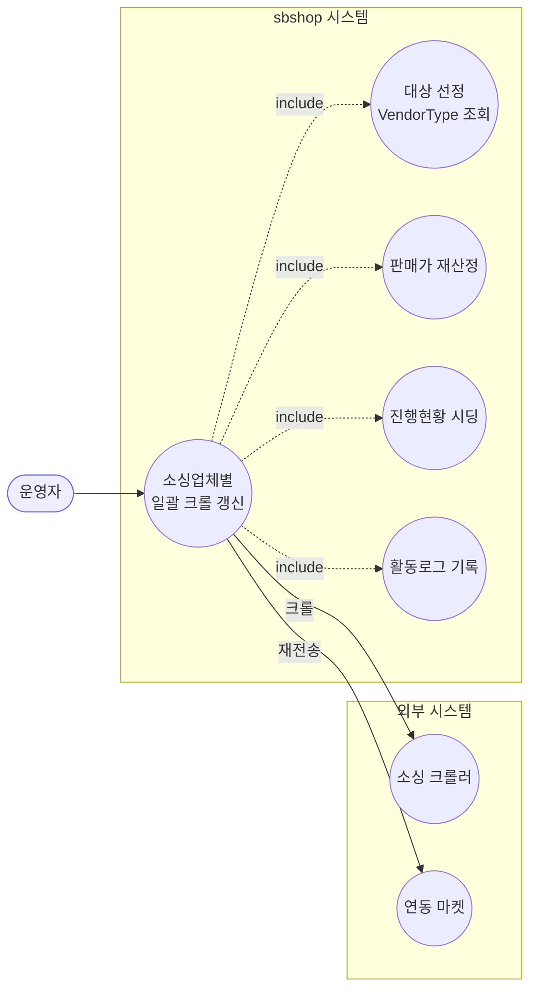
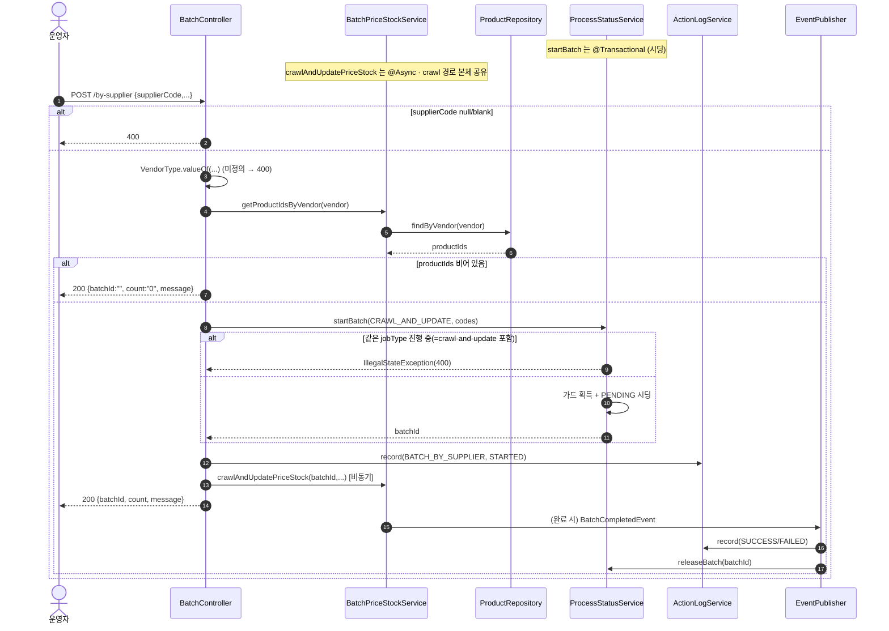

# POST /by-supplier — 소싱업체별 크롤 일괄 업데이트

## 1. 개요

| 항목 | 내용 |
|------|------|
| **Method / URL** | `POST /api/v1/products/batch/by-supplier` (바디 `SupplierBatchRequest`) |
| **목적** | `supplierCode`(VendorType)에 해당하는 모든 상품 id를 조회한 뒤, crawl-and-update 와 동일한 크롤 기반 가격·재고 일괄 갱신을 수행한다. 대상 선정만 다르고 처리 본체는 crawl 경로와 공유한다. |
| **핵심 상태전이** | ProcessStatus: `PENDING`(시딩) → `SUCCESS`/`FAILED`(상품별). Product: 재고상태·가격 갱신. |
| **부수효과** | 소싱 크롤 + throttle 500ms + 연동 마켓 재전송 + ActionLog STARTED/완료 + jobType 가드(crawl과 동일 jobType 공유). |
| **응답** | `200 OK` + `{batchId, count, message}` (정상·0건 동일 키셋). 0건 시 `batchId=""`, `count="0"`. |

## 2. 호출 체인

```
BatchController.updateBySupplier()                           api/.../controller/BatchController.java:123-156
  ├─ supplierCode null/blank → IllegalArgumentException(400)  :126-128
  ├─ VendorType.valueOf(supplierCode.toUpperCase())          :129   (미정의 코드 → IllegalArgumentException 400)
  ├─ batchPriceStockService.getProductIdsByVendor(vendor)    :130
  │     └─ productRepository.findByVendor(vendor).map(getId)  core/.../product/BatchPriceStockService.java:188-192
  │            → ProductRepository.findByVendor              core/.../domain/product/ProductRepository.java:30
  ├─ productIds.isEmpty() → 200 {batchId:"", count:"0", message}  :131-137   (조기 반환·배치 미시작)
  ├─ productCodes = productIds.map(String::valueOf)          :138
  ├─ startBatchWithLog(CRAWL_AND_UPDATE_PRICE_STOCK, ...)    :140-144 → :48-56
  │     ├─ processStatusService.startBatch(jobType, codes)  core/.../process/ProcessStatusService.java:45-74  @Transactional
  │     └─ actionLogService.record(BATCH_BY_SUPPLIER, STARTED)  :54
  └─ batchPriceStockService.crawlAndUpdatePriceStock(batchId, productIds, margin/coupon/minMargin, BATCH_BY_SUPPLIER)
                                                              core/.../product/BatchPriceStockService.java:44-107  @Async("productBatchExecutor")
        └─ (crawl-and-update 문서 §2 와 동일 본체)           :48-106
        └─ eventPublisher.publishEvent(BatchCompletedEvent, BATCH_BY_SUPPLIER)  :104-106
              ├─ ActionLogBatchListener → record(SUCCESS/FAILED)  core/.../actionlog/ActionLogBatchListener.java:22-27
              └─ BatchGuardReleaseListener → releaseBatch  core/.../process/BatchGuardReleaseListener.java:26-29
  └─ 200 {batchId, count, message}                           :151-155
```

**요청 바디 (`SupplierBatchRequest`, `SupplierBatchRequest.java:5-10`)**

| 필드 | 타입 | 필수 | 비고 |
|------|------|------|------|
| `supplierCode` | String | 필수 | null/blank → 400 (`:126-128`). `VendorType.valueOf(toUpperCase())` 로 파싱 |
| `marginRate` | BigDecimal | 선택 | 기본 15 (`:147`) |
| `couponRate` | BigDecimal | 선택 | 기본 20 (`:148`) |
| `minMarginPrice` | BigDecimal | 선택 | 기본 5000 (`:149`) |

## 3. 유스케이스 다이어그램



## 4. 시퀀스 다이어그램



## 5. 순서도 (플로우차트)


## 6. 상태 전이표

| 진입 조건 | ProcessStatus 결과 | 응답 | 비고 |
|-----------|:------------------:|------|------|
| supplierCode null/blank | (시작 안 함) | 400 | `:126-128` |
| VendorType 미정의 코드 | (시작 안 함) | 400 | `valueOf` 예외 (`:129`), 메시지 비친화(BATA-12) |
| 해당 업체 상품 0건 | (시작 안 함) | 200 `{batchId:"", count:"0"}` | 조기 반환 (`:131-137`) |
| 상품 ≥1건 | `PENDING`→`SUCCESS`/`FAILED` (crawl 본체) | 200 `{batchId, count, message}` | `:140-155` |
| crawl 본체 상세 전이 | — | — | crawl-and-update 문서 §6 참조 |

## 7. 🔎 발견사항

### BATA-12 · 🟡 SMELL — 미정의 supplierCode가 VendorType.valueOf의 원시 예외로 400 처리되어 메시지가 비친화적
- **근거:** `BatchController.java:129` `VendorType.valueOf(request.supplierCode().toUpperCase())` 는 미정의 코드에 대해 `IllegalArgumentException: No enum constant ...VendorType.XXX` 를 던진다. null/blank 는 `:126-128` 에서 한국어 메시지로 명시 거부하는데, 잘못된 코드는 enum 원시 메시지가 그대로 노출된다.
- **영향:** 클라이언트가 오타/미지원 업체 코드를 보냈을 때 어떤 값이 유효한지 알기 어려운 내부 구현 노출 메시지를 받는다. null/blank 경로와 응답 품질 비대칭.
- **제안:** valueOf 를 try/catch 로 감싸 "지원하지 않는 소싱업체 코드입니다: XXX (허용: ...)" 형태의 명시적 400 메시지로 통일.

### BATA-13 · 🔵 NOTE — crawl-and-update와 동일 jobType을 사용해 두 배치가 상호 배타적으로 실행됨
- **근거:** 이 엔드포인트는 `JobType.CRAWL_AND_UPDATE_PRICE_STOCK`(`BatchController.java:141`)으로 `startBatch` 를 호출한다. 이는 `/crawl-and-update`(`:70`)와 같은 jobType 이라 `runningJobTypes` 가드(`ProcessStatusService.java:48`) 상 둘 중 하나가 진행 중이면 다른 하나가 400 으로 거부된다.
- **영향:** "업체 전체 크롤"과 "선택 상품 크롤"이 논리적으로 별개 작업임에도 동시에 돌릴 수 없다. 크롤 소싱 rate-limit 보호 관점에서 의도된 직렬화일 수 있으나 명시되지 않았다.
- **제안:** by-supplier 전용 JobType 도입 여부 검토, 또는 크롤 계열 상호 직렬화가 의도임을 문서화.

### BATA-14 · 🟠 GAP — 대상 선정 후 배치 시작 사이의 상품 삭제/변경에 대한 원자성 부재
- **근거:** `getProductIdsByVendor`(`:130`)로 id 목록을 먼저 조회한 뒤 별도로 `startBatch`(시딩)·`@Async` 크롤이 진행된다. 선정 시점과 실제 처리 시점 사이에 상품이 삭제되면 crawl 본체 `productReader.findById`(`BatchPriceStockService.java:50-51`)가 orElseThrow → 해당 productCode 는 markFailed 로 집계된다.
- **영향:** 기능적 치명 결함은 아니나(개별 FAILED로 흡수), 선정~처리 간 시차로 "존재하지 않는 상품 처리 실패"가 정상 케이스에서도 발생할 수 있다. count 응답값(선정 시점)과 실제 처리 대상 수가 어긋날 수 있다.
- **제안:** 시차로 인한 FAILED 는 "삭제됨" 등 사유를 구분해 표기하거나, count 가 선정 시점 스냅샷임을 응답/문서에 명시.

## 8. 테스트 커버리지 메모

- `BatchControllerSupplierValidationTest` — supplierCode null/blank 등 진입 검증.
- `BatchControllerTriggerCharacterizationTest.updateBySupplier_characterization` / `updateBySupplier_emptyProducts_characterization` — 정상·0건 동일 키셋 `{batchId, count, message}` 계약(F-BATCH-B2 회귀).
- crawl 본체 관련 `BatchForwardsStockStatusTest` 등은 crawl-and-update 문서 참조.
- **비어있는 케이스:** ① 미정의 supplierCode 예외 메시지(BATA-12), ② crawl/by-supplier jobType 상호 배타 동작(BATA-13), ③ 선정~처리 시차 FAILED(BATA-14), ④ 다수 상품 시 count 정확성.

---
*생성: 2026-07-17 · 근거: 현재 워킹트리*
