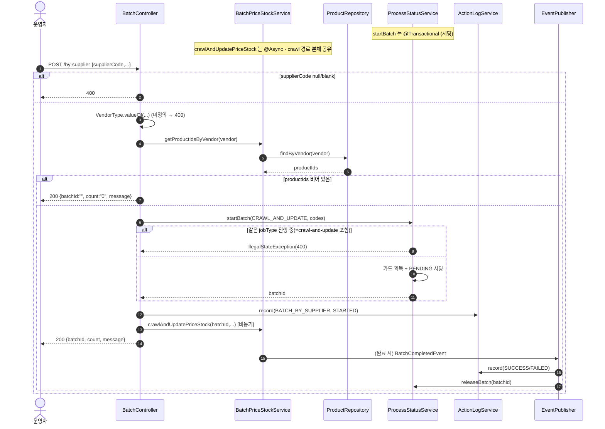
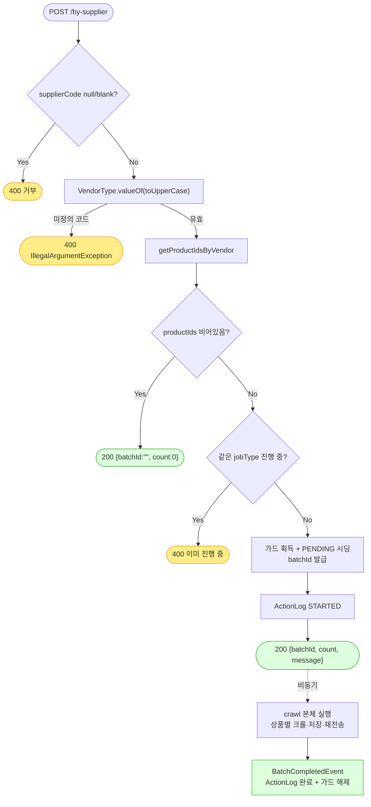

# POST /by-supplier — 소싱업체별 크롤 일괄 업데이트

## 1. 개요

> 쉽게 말하면: "이 소싱업체에서 들여오는 상품 전부"를 한 번에 골라, crawl-and-update와 똑같은 방식으로 소싱 사이트를 긁어 가격·재고를 맞춰 주는 기능입니다. 대상을 "고른 상품"이 아니라 "업체 전체"로 뽑는다는 점만 다르고, 실제 처리 몸통은 crawl 경로와 똑같이 씁니다.

| 항목 | 내용 |
|------|------|
| **Method / URL** | `POST /api/v1/products/batch/by-supplier` (바디 `SupplierBatchRequest`) |
| **목적** | `supplierCode`(공급처 종류 VendorType)에 해당하는 상품 번호를 모두 조회한 뒤, crawl-and-update와 동일한 크롤 기반 가격·재고 일괄 갱신을 수행합니다. 대상 뽑는 방법만 다르고 처리 몸통은 crawl 경로를 함께 씁니다. |
| **핵심 상태전이** | 진행표(ProcessStatus): `PENDING`(대기줄) → 상품별로 `SUCCESS`/`FAILED`. 상품(Product): 재고상태·가격 갱신. |
| **부수효과** | 소싱 크롤 + 상품마다 500ms 쉬기 + 연동 마켓에 값 다시 보내기 + 활동로그 시작/끝 기록 + 동시실행 잠금(crawl과 같은 잠금 종류를 공유). |
| **응답** | `200 OK` + `{batchId, count, message}` (정상일 때나 0건일 때나 같은 키 구성). 대상이 0건이면 `batchId=""`, `count="0"`. |

## 2. 호출 체인

> 각 줄 끝의 `파일:줄번호`는 실제 코드 위치이고, "→ 쉽게 말하면"은 그 단계가 하는 일을 풀어 쓴 것입니다.

```
BatchController.updateBySupplier()                           api/.../controller/BatchController.java:123-156
  ├─ supplierCode null/blank → IllegalArgumentException(400)  :126-128
  │     → 쉽게 말하면: 업체 코드가 비어 있으면 400으로 거절.
  ├─ VendorType.valueOf(supplierCode.toUpperCase())          :129   (미정의 코드 → IllegalArgumentException 400)
  │     → 쉽게 말하면: 업체 코드를 정해진 공급처 종류로 바꿈. 없는 코드면 400(단, 메시지가 불친절함 — BATA-12).
  ├─ batchPriceStockService.getProductIdsByVendor(vendor)    :130
  │     └─ productRepository.findByVendor(vendor).map(getId)  core/.../product/BatchPriceStockService.java:188-192
  │            → ProductRepository.findByVendor              core/.../domain/product/ProductRepository.java:30
  │     → 쉽게 말하면: 그 업체에 속한 상품 번호를 DB에서 전부 뽑음.
  ├─ productIds.isEmpty() → 200 {batchId:"", count:"0", message}  :131-137   (조기 반환·배치 미시작)
  │     → 쉽게 말하면: 뽑힌 상품이 하나도 없으면 배치를 시작하지 않고 바로 "0건" 응답으로 끝냄.
  ├─ productCodes = productIds.map(String::valueOf)          :138
  │     → 쉽게 말하면: 상품 번호들을 진행표용 코드로 바꿈.
  ├─ startBatchWithLog(CRAWL_AND_UPDATE_PRICE_STOCK, ...)    :140-144 → :48-56
  │     ├─ processStatusService.startBatch(jobType, codes)  core/.../process/ProcessStatusService.java:45-74  @Transactional
  │     │     → 쉽게 말하면: 동시실행 잠금 잡고, 상품마다 "대기중" 한 줄씩 깔고, 작업표 번호 발급.
  │     └─ actionLogService.record(BATCH_BY_SUPPLIER, STARTED)  :54
  │           → 쉽게 말하면: 활동로그에 "시작함" 한 줄 남김.
  └─ batchPriceStockService.crawlAndUpdatePriceStock(batchId, productIds, margin/coupon/minMargin, BATCH_BY_SUPPLIER)
                                                              core/.../product/BatchPriceStockService.java:44-107  @Async("productBatchExecutor")
        └─ (crawl-and-update 문서 §2 와 동일 본체)           :48-106
        │     → 쉽게 말하면: 상품 하나씩 크롤 → 판매가 계산 → 저장 → 마켓 재전송 → 성공/실패 표시(crawl 문서와 동일).
        └─ eventPublisher.publishEvent(BatchCompletedEvent, BATCH_BY_SUPPLIER)  :104-106
              │     → 쉽게 말하면: 다 돌면 "배치 끝" 신호를 쏨.
              ├─ ActionLogBatchListener → record(SUCCESS/FAILED)  core/.../actionlog/ActionLogBatchListener.java:22-27
              │     → 쉽게 말하면: 활동로그에 최종 성공/실패 결과를 남김.
              └─ BatchGuardReleaseListener → releaseBatch  core/.../process/BatchGuardReleaseListener.java:26-29
                    → 쉽게 말하면: 다음 작업을 위해 잠금을 풀어줌.
  └─ 200 {batchId, count, message}                           :151-155
        → 쉽게 말하면: 작업표 번호와 대상 상품 수를 담아 즉시 응답.
```

**요청 바디 (`SupplierBatchRequest`, `SupplierBatchRequest.java:5-10`)** — 요청에 담아 보내는 값들입니다.

| 필드 | 타입 | 필수 | 비고 |
|------|------|------|------|
| `supplierCode` | String | 필수 | 비면 400 (`:126-128`). 대문자로 바꿔 공급처 종류(`VendorType`)로 해석 |
| `marginRate` | BigDecimal | 선택 | 마진율. 안 주면 기본 15 (`:147`) |
| `couponRate` | BigDecimal | 선택 | 쿠폰율. 안 주면 기본 20 (`:148`) |
| `minMarginPrice` | BigDecimal | 선택 | 최소 마진 금액. 안 주면 기본 5000 (`:149`) |

## 3. 유스케이스 다이어그램

👉 이 그림은 운영자가 이 기능을 쓸 때 시스템이 안에서 하는 일들(업체로 대상 뽑기·판매가 재계산·진행표 준비·활동로그)과, 밖으로 소싱 크롤러·연동 마켓에 어떻게 연결되는지를 보여줍니다.


## 4. 시퀀스 다이어그램

👉 이 그림은 요청부터 끝까지 각 부품이 주고받는 순서를 시간 순으로 보여줍니다. "업체로 상품 목록 뽑기 → 0건이면 바로 종료, 아니면 잠금·대기줄 준비 → 즉시 응답 → 뒤에서 crawl 몸통 실행"의 흐름입니다.



## 5. 순서도 (플로우차트)

👉 이 그림은 "업체 코드 검사 → 공급처 종류로 변환 → 업체 상품 뽑기 → 0건이면 바로 200 종료, 아니면 잠금·대기줄 준비 → 즉시 응답 → 뒤에서 crawl 몸통 실행"의 갈림길을 보여줍니다. 노란 상자는 거절, 초록 상자는 정상 마무리입니다.



## 6. 상태 전이표

> 요청이 어떤 상황이면 진행표에 어떻게 남고 어떤 응답이 나가는지 보는 표입니다.

| 진입 조건 | ProcessStatus 결과 | 응답 | 비고 |
|-----------|:------------------:|------|------|
| 업체 코드가 비어 있음 | (시작 안 함) | 400 | `:126-128` |
| 없는 업체 코드 | (시작 안 함) | 400 | 변환 중 예외 (`:129`), 메시지가 불친절(BATA-12) |
| 그 업체 상품이 0건 | (시작 안 함) | 200 `{batchId:"", count:"0"}` | 바로 종료 (`:131-137`) |
| 상품 1건 이상 | `PENDING`→`SUCCESS`/`FAILED` (crawl 몸통) | 200 `{batchId, count, message}` | `:140-155` |
| crawl 몸통 세부 전이 | — | — | crawl-and-update 문서 §6 참조 |

## 7. 🔎 발견사항

### BATA-12 · 🟡 SMELL — 없는 업체 코드가 내부 변환 함수의 날것 예외로 400 처리되어 메시지가 불친절함
- **무엇이 문제인가:** `BatchController.java:129`의 `VendorType.valueOf(request.supplierCode().toUpperCase())`는 없는 코드에 대해 `IllegalArgumentException: No enum constant ...VendorType.XXX`라는 내부 구현이 그대로 드러난 예외를 던집니다. 코드가 비어 있는 경우(`:126-128`)는 한국어로 친절히 거절하는데, 잘못된 코드는 이런 날것의 영어 메시지가 그대로 노출됩니다.
- **근거:** `BatchController.java:129`
- **영향:** 사용자가 오타를 냈거나 지원하지 않는 업체 코드를 보냈을 때, 어떤 값이 유효한지 알 수 없는 내부 구현 노출 메시지를 받습니다. 코드 없음 경로와 응답 품질이 짝이 안 맞습니다.
- **제안:** 변환을 try/catch로 감싸 "지원하지 않는 소싱업체 코드입니다: XXX (허용: ...)" 같은 명확한 400 메시지로 통일합니다.

### BATA-13 · 🔵 NOTE — crawl-and-update와 같은 잠금(jobType)을 써서 두 배치가 동시에 못 돎
- **무엇이 문제인가:** 이 기능은 `JobType.CRAWL_AND_UPDATE_PRICE_STOCK`(`BatchController.java:141`)이라는 잠금 종류로 `startBatch`를 부릅니다. 이는 `/crawl-and-update`(`:70`)와 같은 종류라, 동시실행을 막는 잠금(`runningJobTypes`, `ProcessStatusService.java:48`) 때문에 하나가 돌고 있으면 다른 하나는 400으로 거절됩니다.
- **근거:** `BatchController.java:141`, `ProcessStatusService.java:48`
- **영향:** "업체 전체 크롤"과 "고른 상품 크롤"은 논리적으로 별개 작업인데도 동시에 못 돌립니다. 소싱 사이트 호출 속도 제한을 보호하려고 일부러 순서대로만 돌게 한 것일 수 있으나, 그렇다는 명시가 없습니다.
- **제안:** by-supplier 전용 잠금 종류를 둘지 검토하거나, 크롤 계열끼리 순서대로만 돌게 하는 것이 의도라면 문서에 남깁니다.

### BATA-14 · 🟠 GAP — 대상을 뽑은 시점과 실제 처리 시점 사이에 상품이 바뀌면 그 틈에 대한 보장이 없음
- **무엇이 문제인가:** `getProductIdsByVendor`(`:130`)로 상품 번호 목록을 먼저 뽑은 뒤, 별도로 대기줄 만들기(`startBatch`)와 뒤에서 도는 크롤이 진행됩니다. 뽑은 시점과 실제 처리 시점 사이에 상품이 삭제되면, 크롤 몸통의 `productReader.findById`(`BatchPriceStockService.java:50-51`)가 못 찾아 예외로 튕겨 그 상품은 실패(markFailed)로 집계됩니다.
- **근거:** `BatchPriceStockService.java:50-51`
- **영향:** 치명적 결함은 아니지만(개별 실패로 흡수됨), 뽑기~처리 사이의 시차 때문에 "존재하지 않는 상품 처리 실패"가 정상 상황에서도 생길 수 있습니다. 또 응답에 담긴 대상 수(count, 뽑은 시점 기준)와 실제 처리한 상품 수가 어긋날 수 있습니다.
- **제안:** 시차로 인한 실패는 "삭제됨" 같은 사유를 구분해 표시하거나, count가 "뽑은 시점의 스냅샷"임을 응답·문서에 명시합니다.

## 8. 테스트 커버리지 메모

> 이미 있는 테스트와, 아직 없어 위험이 남는 부분입니다.

- `BatchControllerSupplierValidationTest` — 업체 코드가 비어 있는 경우 등 진입 검증.
- `BatchControllerTriggerCharacterizationTest.updateBySupplier_characterization` / `updateBySupplier_emptyProducts_characterization` — 정상일 때와 0건일 때 같은 키 구성 `{batchId, count, message}`를 돌려주는지 확인(F-BATCH-B2 회귀).
- crawl 몸통 관련 `BatchForwardsStockStatusTest` 등은 crawl-and-update 문서 참조.
- **아직 테스트가 없는 부분:** ① 없는 업체 코드의 예외 메시지(BATA-12), ② crawl/by-supplier가 서로 막는 동작(BATA-13), ③ 뽑기~처리 시차로 인한 실패(BATA-14), ④ 상품이 많을 때 count 정확성.

---
*(쉬운 설명판 · 2026-07-17 재작성)*
*생성: 2026-07-17 · 근거: 현재 워킹트리*
