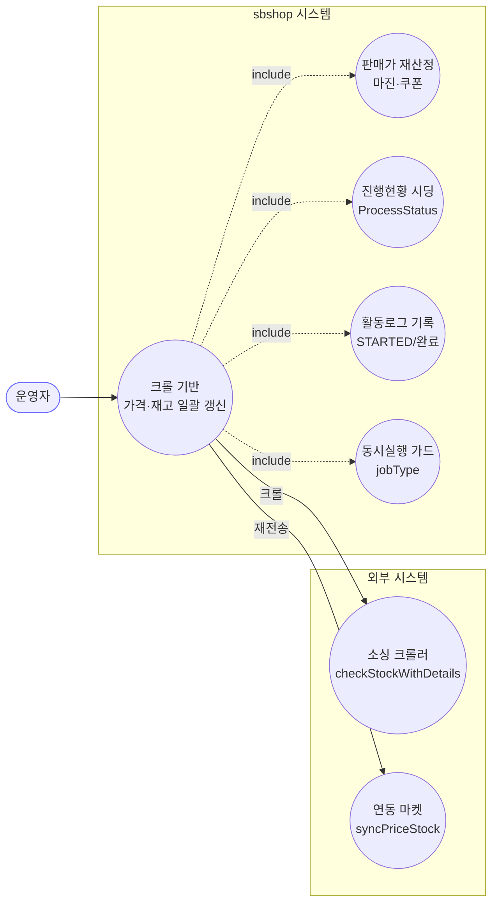
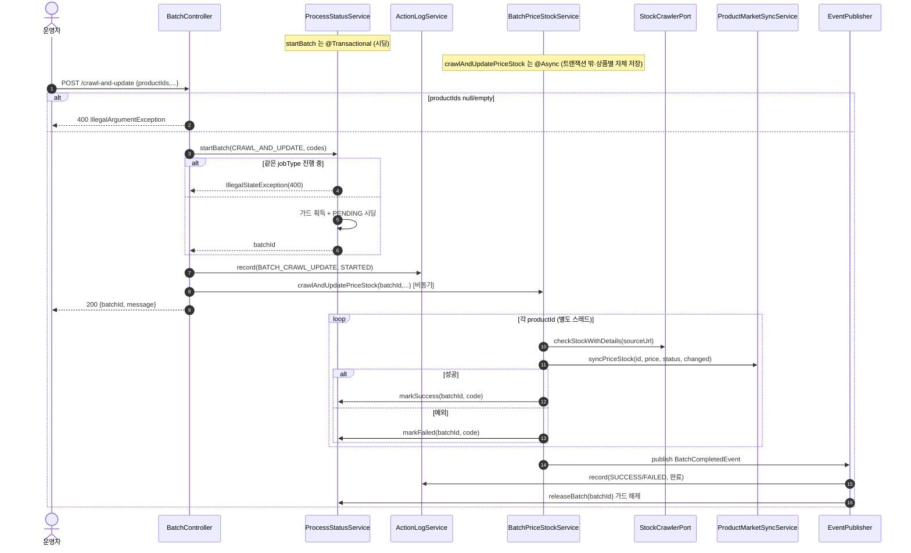

# POST /crawl-and-update — 크롤 기반 가격·재고 일괄 업데이트

## 1. 개요

> 쉽게 말하면: 운영자가 여러 상품을 골라 "이 상품들, 소싱 사이트에서 지금 값을 긁어와 우리 가격·재고를 한꺼번에 맞춰줘"라고 시키는 기능입니다. 실제 작업은 뒤에서 따로 돌고, 화면에는 곧바로 "접수했습니다(작업표 번호)"만 돌려줍니다.

| 항목 | 내용 |
|------|------|
| **Method / URL** | `POST /api/v1/products/batch/crawl-and-update` (바디 `CrawlAndUpdateRequest`) |
| **목적** | 고른 상품(`productIds`)마다 소싱 사이트 주소를 열어(크롤) 매입가·재고·재고상태를 알아내고, 마진율·쿠폰율로 판매가를 다시 계산한 뒤, 우리 DB와 연동된 마켓에 그 값을 다시 보내 맞춥니다. 실제 처리는 뒤에서 따로(`@Async`) 돌고, 입구 코드는 작업표 번호(`batchId`)만 즉시 돌려줍니다. |
| **핵심 상태전이** | 진행표(ProcessStatus): `PENDING`(대기줄 만들기) → 상품별로 `SUCCESS`/`FAILED`. 상품(Product): 재고상태를 `IN_STOCK`(재고있음)/`OUT_OF_STOCK`(품절)/그 외로 갱신. |
| **부수효과** | 소싱 사이트 크롤(`checkStockWithDetails`) + 상품 하나 처리할 때마다 500ms 쉬기(throttle) + 연동 마켓에 값 다시 보내기(`syncPriceStock`) + 활동로그에 STARTED(시작)/SUCCESS·FAILED(끝) 기록 + 같은 종류 작업이 동시에 못 돌게 막는 잠금(jobType 가드) 잡기·풀기. |
| **응답** | `200 OK` + `{batchId, message}`. 얼마나 진행됐는지는 `/status/{batchId}` 를 반복 조회(폴링)해 확인합니다. |

## 2. 호출 체인

> 아래는 요청이 들어온 뒤 코드가 거치는 순서입니다. 각 줄 끝의 `파일:줄번호`는 실제 코드 위치이고, "→ 쉽게 말하면"은 그 단계가 하는 일을 풀어 쓴 것입니다.

```
BatchController.crawlAndUpdate()                              api/.../controller/BatchController.java:58-80
  ├─ request.productIds() null/empty → IllegalArgumentException(400)   :62-64
  │     → 쉽게 말하면: 고른 상품이 하나도 없으면 여기서 바로 "잘못된 요청(400)"으로 거절.
  ├─ productCodes = productIds.map(String::valueOf)          :65-67
  │     → 쉽게 말하면: 상품 번호들을 진행표에 쓸 문자열 코드로 바꿔둠.
  ├─ startBatchWithLog(CRAWL_AND_UPDATE_PRICE_STOCK, ...)    :69-72 → :48-56
  │     ├─ processStatusService.startBatch(jobType, codes)  core/.../process/ProcessStatusService.java:45-74  @Transactional
  │     │     ├─ runningJobTypes.add(jobType) 실패 시 IllegalStateException(400)  :48-51
  │     │     │     → 쉽게 말하면: 같은 종류 작업이 이미 돌고 있으면 잠금을 못 잡아 "이미 진행 중(400)"으로 거절.
  │     │     ├─ batchId = UUID.substring(0,8)               :52
  │     │     │     → 쉽게 말하면: 이번 작업을 부를 8자리 이름표(작업표 번호)를 만듦.
  │     │     └─ 상품별 ProcessStatus PENDING 시딩·save       :54-64
  │     │           → 쉽게 말하면: 상품마다 "대기중" 한 줄씩 진행표에 미리 깔아 둠.
  │     └─ actionLogService.record(BATCH_CRAWL_UPDATE, STARTED)  :54
  │           → 쉽게 말하면: 활동로그에 "이 작업 시작함" 한 줄 남김.
  └─ batchPriceStockService.crawlAndUpdatePriceStock(batchId, productIds, margin/coupon/minMargin, actionType)
                                                              core/.../product/BatchPriceStockService.java:44-107  @Async("productBatchExecutor")
        │     → 쉽게 말하면: 여기부터는 뒤에서 따로 도는 실제 처리(운영자는 이미 응답을 받았음).
        └─ for each productId:                               :48-103
             ├─ productReader.findById() → orElseThrow       :50-51
             │     → 쉽게 말하면: 상품을 DB에서 찾음. 없으면 예외로 튕겨 실패 처리로 감.
             ├─ sourcingUrl null/empty → markFailed·continue :53-59
             │     → 쉽게 말하면: 긁어올 소싱 주소가 없으면 이 상품은 "실패"로 적고 건너뜀.
             ├─ productStockCrawlerPort.checkStockWithDetails(sourceUrl)  :61  (외부 크롤 포트)
             │     → 쉽게 말하면: 소싱 사이트를 실제로 열어 값(가격·재고)을 긁어옴.
             ├─ marginCalculator.calculateSalePrice(...)     :67-68
             │     → 쉽게 말하면: 마진·쿠폰을 적용해 우리 판매가를 다시 계산.
             ├─ changed 판정(가격·상태 변화)                 :71-75
             │     → 쉽게 말하면: 예전 값과 비교해 실제로 바뀐 게 있는지 확인.
             ├─ product.update()/updateStockStatus()/updateRestockDate() + productWriter.save()  :83-86
             │     → 쉽게 말하면: 바뀐 값을 상품에 반영하고 DB에 저장.
             ├─ productMarketSyncService.syncPriceStock(id, price, status, changed)  :90-91
             │       core/.../product/ProductMarketSyncService.java:43-48 → syncInternal :50-
             │     → 쉽게 말하면: 연동된 마켓들에도 새 가격·재고를 다시 보냄.
             ├─ processStatusService.markSuccess(batchId, code, msg)  :92-96
             │     → 쉽게 말하면: 진행표에서 이 상품을 "성공"으로 표시.
             ├─ Thread.sleep(CRAWL_THROTTLE_MS=500)          :97/42
             │     → 쉽게 말하면: 소싱 사이트에 무리 안 주려고 다음 상품 전에 0.5초 쉼.
             └─ catch Exception → log + markFailed + failCount++  :98-102
                   → 쉽게 말하면: 처리 중 무슨 오류든 나면 이 상품을 "실패"로 적고 실패 수를 늘림.
        └─ eventPublisher.publishEvent(BatchCompletedEvent)  :104-106
              │     → 쉽게 말하면: 모든 상품을 다 돌면 "배치 끝났다"는 신호를 쏨.
              ├─ ActionLogBatchListener.onBatchCompleted → record(SUCCESS/FAILED)  core/.../actionlog/ActionLogBatchListener.java:22-27
              │     → 쉽게 말하면: 그 신호를 받아 활동로그에 최종 성공/실패 결과를 남김.
              └─ BatchGuardReleaseListener.onBatchCompleted → releaseBatch(batchId)  core/.../process/BatchGuardReleaseListener.java:26-29
                    → 쉽게 말하면: 같은 종류 작업을 다시 돌릴 수 있게 잠금을 풀어줌.
```

**요청 바디 (`CrawlAndUpdateRequest`, `CrawlAndUpdateRequest.java:6-11`)** — 요청에 담아 보내는 값들입니다.

| 필드 | 타입 | 필수 | 비고 |
|------|------|------|------|
| `productIds` | List\<Long\> | 필수 | 처리할 상품 번호 목록. 비어 있으면 400으로 거절 (`:62-64`) |
| `marginRate` | BigDecimal | 선택 | 마진율. 안 주면 기본 15 (`:75`) |
| `couponRate` | BigDecimal | 선택 | 쿠폰율. 안 주면 기본 20 (`:76`) |
| `minMarginPrice` | BigDecimal | 선택 | 최소 마진 금액. 안 주면 기본 5000 (`:77`) |

## 3. 유스케이스 다이어그램

👉 이 그림은 운영자가 이 기능을 쓸 때 시스템이 안에서 어떤 일들(판매가 재계산·진행표 준비·활동로그·동시실행 잠금)을 함께 하고, 밖으로는 소싱 크롤러·연동 마켓과 어떻게 연결되는지를 보여줍니다.



## 4. 시퀀스 다이어그램

👉 이 그림은 요청이 들어온 순간부터 끝날 때까지, 각 부품(컨트롤러·진행표·활동로그·처리기·크롤러·마켓전송·이벤트)이 서로 주고받는 순서를 시간 순으로 보여줍니다. 위쪽은 즉시 응답까지, 아래 반복 상자는 뒤에서 따로 도는 상품별 처리입니다.



## 5. 순서도 (플로우차트)

👉 이 그림은 "요청 거절 여부 → 잠금·대기줄 준비 → 즉시 응답 → 뒤에서 상품 하나씩 크롤·저장·마켓전송" 순으로 갈림길(마름모)에서 어디로 가는지를 보여줍니다. 노란 상자는 거절/실패, 초록 상자는 정상 마무리입니다.


## 6. 상태 전이표

> 상품 하나가 어떤 상황(진입 조건)에 놓이면 진행표에 어떻게 남고, 상품·마켓에 무슨 일이 일어나는지 한눈에 보는 표입니다.

| 진입 조건 | ProcessStatus 결과 | Product 부수효과 | 마켓 전송 | 비고 |
|-----------|:------------------:|------------------|-----------|------|
| 상품이 DB에 없음 | `FAILED`(실패) | — | — | 못 찾아 예외 → 실패로 잡힘 (`:50-51,98-100`) |
| 긁어올 소싱 주소가 없음 | `FAILED`(실패) | — | — | 대놓고 건너뜀 (`:53-59`) |
| 크롤 성공 · 값이 바뀜 | `SUCCESS`(성공) | 가격·재고·상태 갱신 | 모든 연동 마켓에 다시 보냄 | `changed=true` (`:75,90`) |
| 크롤 성공 · 값이 그대로 | `SUCCESS`(성공) | 같은 값으로 갱신 | Cafe24는 건너뜀 | 바뀐 게 없어 Cafe24 재전송 생략 (`ProductMarketSyncService.java:59-`) |
| 크롤/저장 중 오류 | `FAILED`(실패) | 일부만 저장됐을 수 있음 | 시도 여부 무관 | 오류를 삼키고 실패 수만 늘림 (`:98-102`) |
| 전체 끝(실패 0건) | — | — | — | "배치 끝" 신호에 성공=true |
| 전체 끝(실패 1건 이상) | — | — | — | 성공=false, 활동로그는 FAILED |

## 7. 🔎 발견사항

### BATA-1 · 🟠 GAP — 성공으로 적어 둔 상품이 바로 뒤의 "쉬는 시간" 중단 때문에 실패로 뒤집힘
- **무엇이 문제인가:** 상품을 성공으로 표시(`markSuccess`)한 **바로 뒤에** 다음 상품 전 쉬는 시간(`Thread.sleep(CRAWL_THROTTLE_MS)`)을 둡니다. 그런데 이 쉬는 코드가 오류를 잡는 try 블록 안에 있어서, 배포·재시작 등으로 작업 처리기가 중단되면(`InterruptedException`) 아래 catch(`:98-102`)로 떨어져 **방금 성공으로 적은 그 상품을 다시 `markFailed`(실패)로 덮어써 버립니다.** 상품 갱신도 마켓 전송도 이미 다 끝났는데 진행표에만 "실패"로 뒤집히는 것입니다.
- **근거:** `BatchPriceStockService.java:92-97`
- **영향:** 배포/재시작으로 처리기가 멈추는 순간 처리 중이던 상품이 "실제로는 성공했는데 화면엔 실패"로 남아, 운영자가 안 해도 될 재처리를 하게 됩니다. 쉬는 시간은 그냥 대기일 뿐 실패가 아닌데도요.
- **제안:** 쉬는 코드를 성공 표시 앞으로 옮기거나 try 밖(다음 반복 들어가기 전)으로 빼냅니다. 최소한 중단 예외(`InterruptedException`)만은 따로 처리해 이미 적은 성공을 지키게 합니다.

### BATA-2 · 🟠 GAP — 같은 상품 번호를 두 번 넣으면 한 줄이 영원히 "대기중"으로 남음
- **무엇이 문제인가:** 대기줄을 만드는 `startBatch`(`ProcessStatusService.java:54-64`)는 상품 코드마다 한 줄씩 깔기 때문에, `productIds`에 같은 번호가 두 번 있으면 같은 코드의 줄이 2개 생깁니다. 그런데 상태를 갱신하는 `updateStep`(`:91-95`)은 `filter(productCode==).findFirst()`로 **딱 한 줄만** 고쳐서, 나머지 중복 줄은 성공/실패 표시가 닿지 못하고 계속 `PENDING`(대기중)으로 남습니다.
- **근거:** `ProcessStatusService.java:54-64`, `:91-95`
- **영향:** 진행률을 세는 `getBatchSummary`(`:143-153`)에서 전체(total)에는 중복 줄이 들어가지만 성공+실패 합계는 거기에 못 미쳐, 배치가 100%에 절대 도달하지 못하고 폴링 화면에는 "영원히 진행중"으로 보입니다.
- **제안:** 시작할 때 상품 번호 중복을 없애거나(distinct), 진행표 갱신 키를 (batchId, productCode) 하나로만 존재하도록 강제합니다.

### BATA-3 · 🔵 NOTE — by-supplier와 같은 잠금(jobType)을 나눠 써서 둘이 동시에 못 돎
- **무엇이 문제인가:** 이 기능과 `/by-supplier`(`BatchController.java:141`)는 둘 다 `JobType.CRAWL_AND_UPDATE_PRICE_STOCK`이라는 같은 종류로 `startBatch`를 부릅니다. 동시실행을 막는 잠금(`runningJobTypes`, `ProcessStatusService.java:48`)이 이 "종류" 단위라, 하나가 돌고 있으면 다른 하나는 400으로 거절됩니다.
- **근거:** `BatchController.java:141`, `ProcessStatusService.java:48`
- **영향:** "고른 상품만 크롤"과 "소싱업체 전체 크롤"은 논리적으로 다른 작업인데도 동시에 못 돌립니다. 일부러 그렇게 보수적으로 막은 것일 수 있으나 명시가 없습니다.
- **제안:** by-supplier 전용 잠금 종류를 따로 둘지 검토하거나, 서로 막는 게 의도라면 그 사실을 문서에 남깁니다.

### BATA-4 · 🟡 SMELL — 시작 로그와 끝 로그가 다른 경로로 남아, 끝 로그가 통째로 빠질 수 있음
- **무엇이 문제인가:** "시작(STARTED)" 로그는 요청을 받은 컨트롤러 쪽(`BatchController.java:54`)이 남기고, "끝(SUCCESS/FAILED)" 로그는 뒤에서 도는 작업이 끝날 때 쏘는 `BatchCompletedEvent`(`BatchPriceStockService.java:104`)를 받아 `ActionLogBatchListener`(`ActionLogBatchListener.java:22-27`)가 남깁니다. 만약 그 뒤에서 도는 작업이 끝 신호를 쏘기 전에 JVM 종료(배포)로 죽어버리면, 시작 로그만 남고 끝 로그는 영영 빠집니다(대기중으로 방치된 줄은 `recoverOrphanedPending`이 복구하지만, 활동로그의 끝 기록까지 남겨 주지는 않습니다).
- **근거:** `BatchController.java:54`, `BatchPriceStockService.java:104`, `ActionLogBatchListener.java:22-27`
- **영향:** 활동로그에 "시작만 있고 끝이 없는" 배치가 생겨, 나중에 이력을 되짚을 때 흐름이 끊깁니다.
- **제안:** 부팅 시 방치된 배치를 복구(`recoverOrphanedPending`)할 때, 활동로그에도 대응하는 "끝(중단)" 기록을 함께 남기는 것을 검토합니다.

## 8. 테스트 커버리지 메모

> 이미 있는 테스트와, 아직 테스트가 없어 위험이 남는 부분을 정리한 것입니다.

- `BatchControllerCrawlValidationTest` — 상품 목록이 비면 400으로 거절하는지 확인(이건 결함이 아니라 방어가 잘 되어 있음을 검증).
- `BatchControllerTriggerCharacterizationTest.crawlAndUpdate_characterization` — 작업 종류·시작 로그·`{batchId,message}` 응답 형식이 약속대로인지 확인.
- `BatchForwardsStockStatusTest` — 크롤로 얻은 재고상태가 상품에 잘 전달되는지 확인.
- `BatchCompletedEventPublishTest` / `ActionLogBatchListenerTest` / `ProcessStatusServiceTest` — 끝 신호·잠금 해제·상태 조회 확인.
- **아직 테스트가 없는 부분:** ① 성공 표시 뒤 쉬는 시간 중단으로 상태가 뒤집히는 경우(BATA-1), ② 같은 상품 번호를 넣었을 때 대기중이 남는 경우(BATA-2), ③ 크롤이 일부만 실패했을 때 실패 수·끝 신호(성공=false) 경로.

---
*(쉬운 설명판 · 2026-07-17 재작성)*
*생성: 2026-07-17 · 근거: 현재 워킹트리*
