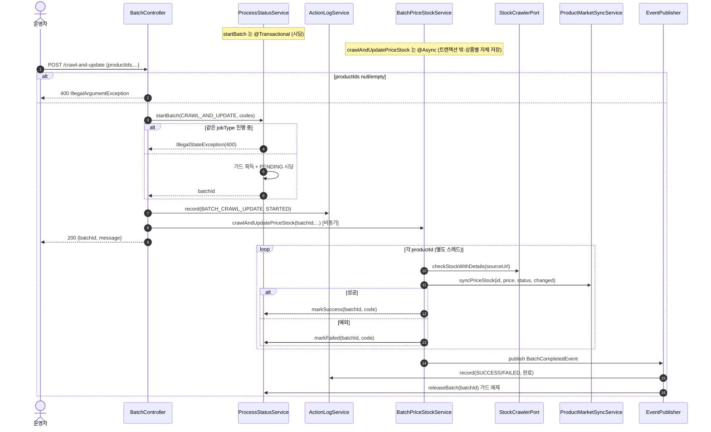
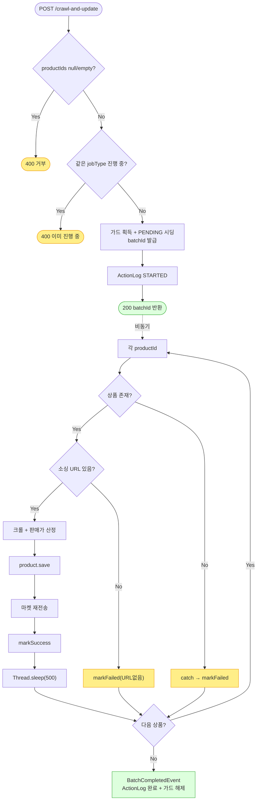

# POST /crawl-and-update — 크롤 기반 가격·재고 일괄 업데이트

## 1. 개요

| 항목 | 내용 |
|------|------|
| **Method / URL** | `POST /api/v1/products/batch/crawl-and-update` (바디 `CrawlAndUpdateRequest`) |
| **목적** | `productIds` 각 상품의 소싱 URL을 크롤해 매입가·재고·재고상태를 얻고, 마진·쿠폰율로 판매가를 재산정한 뒤 DB·연동 마켓에 반영한다. 실제 처리는 `@Async` 로 분리되고 컨트롤러는 `batchId` 만 즉시 반환한다. |
| **핵심 상태전이** | ProcessStatus: `PENDING`(시딩) → `SUCCESS`/`FAILED`(상품별). Product: 재고상태 `IN_STOCK`/`OUT_OF_STOCK`/기타로 갱신. |
| **부수효과** | 소싱 사이트 크롤(`checkStockWithDetails`) + 상품별 500ms throttle + 연동 마켓 재전송(`syncPriceStock`) + ActionLog STARTED(진입) / SUCCESS·FAILED(완료 이벤트) + jobType 동시실행 가드 획득·해제. |
| **응답** | `200 OK` + `{batchId, message}`. 진행현황은 `/status/{batchId}` 폴링. |

## 2. 호출 체인

```
BatchController.crawlAndUpdate()                              api/.../controller/BatchController.java:58-80
  ├─ request.productIds() null/empty → IllegalArgumentException(400)   :62-64
  ├─ productCodes = productIds.map(String::valueOf)          :65-67
  ├─ startBatchWithLog(CRAWL_AND_UPDATE_PRICE_STOCK, ...)    :69-72 → :48-56
  │     ├─ processStatusService.startBatch(jobType, codes)  core/.../process/ProcessStatusService.java:45-74  @Transactional
  │     │     ├─ runningJobTypes.add(jobType) 실패 시 IllegalStateException(400)  :48-51
  │     │     ├─ batchId = UUID.substring(0,8)               :52
  │     │     └─ 상품별 ProcessStatus PENDING 시딩·save       :54-64
  │     └─ actionLogService.record(BATCH_CRAWL_UPDATE, STARTED)  :54
  └─ batchPriceStockService.crawlAndUpdatePriceStock(batchId, productIds, margin/coupon/minMargin, actionType)
                                                              core/.../product/BatchPriceStockService.java:44-107  @Async("productBatchExecutor")
        └─ for each productId:                               :48-103
             ├─ productReader.findById() → orElseThrow       :50-51
             ├─ sourcingUrl null/empty → markFailed·continue :53-59
             ├─ productStockCrawlerPort.checkStockWithDetails(sourceUrl)  :61  (외부 크롤 포트)
             ├─ marginCalculator.calculateSalePrice(...)     :67-68
             ├─ changed 판정(가격·상태 변화)                 :71-75
             ├─ product.update()/updateStockStatus()/updateRestockDate() + productWriter.save()  :83-86
             ├─ productMarketSyncService.syncPriceStock(id, price, status, changed)  :90-91
             │       core/.../product/ProductMarketSyncService.java:43-48 → syncInternal :50-
             ├─ processStatusService.markSuccess(batchId, code, msg)  :92-96
             ├─ Thread.sleep(CRAWL_THROTTLE_MS=500)          :97/42
             └─ catch Exception → log + markFailed + failCount++  :98-102
        └─ eventPublisher.publishEvent(BatchCompletedEvent)  :104-106
              ├─ ActionLogBatchListener.onBatchCompleted → record(SUCCESS/FAILED)  core/.../actionlog/ActionLogBatchListener.java:22-27
              └─ BatchGuardReleaseListener.onBatchCompleted → releaseBatch(batchId)  core/.../process/BatchGuardReleaseListener.java:26-29
```

**요청 바디 (`CrawlAndUpdateRequest`, `CrawlAndUpdateRequest.java:6-11`)**

| 필드 | 타입 | 필수 | 비고 |
|------|------|------|------|
| `productIds` | List\<Long\> | 필수 | null/empty → 400 (`:62-64`) |
| `marginRate` | BigDecimal | 선택 | 기본 15 (`:75`) |
| `couponRate` | BigDecimal | 선택 | 기본 20 (`:76`) |
| `minMarginPrice` | BigDecimal | 선택 | 기본 5000 (`:77`) |

## 3. 유스케이스 다이어그램


## 4. 시퀀스 다이어그램



## 5. 순서도 (플로우차트)



## 6. 상태 전이표

| 진입 조건 | ProcessStatus 결과 | Product 부수효과 | 마켓 전송 | 비고 |
|-----------|:------------------:|------------------|-----------|------|
| 상품 미존재 | `FAILED` | — | — | orElseThrow → catch (`:50-51,98-100`) |
| 소싱 URL 없음 | `FAILED` | — | — | 명시 스킵 (`:53-59`) |
| 크롤 성공 · 변경 있음 | `SUCCESS` | 가격·재고·상태 갱신 | 전 마켓 재전송 | `changed=true` (`:75,90`) |
| 크롤 성공 · 변경 없음 | `SUCCESS` | 갱신(동일값) | Cafe24 스킵 | `changed=false` → Cafe24 재전송 생략 (`ProductMarketSyncService.java:59-`) |
| 크롤/저장 중 예외 | `FAILED` | 부분 저장 가능 | 시도 여부 무관 | catch 삼킴, failCount++ (`:98-102`) |
| 전체 완료(fail 0) | — | — | — | BatchCompletedEvent success=true |
| 전체 완료(fail>0) | — | — | — | success=false, ActionLog FAILED |

## 7. 🔎 발견사항

### BATA-1 · 🟠 GAP — markSuccess 이후 `Thread.sleep` 인터럽트가 이미 성공한 행을 FAILED로 뒤집음
- **근거:** `BatchPriceStockService.java:92-97` — `markSuccess` 로 SUCCESS 를 기록한 **뒤** `Thread.sleep(CRAWL_THROTTLE_MS)` 를 호출한다. sleep 은 try 블록 안이라 `InterruptedException`(또는 executor shutdown 시)이 발생하면 `:98-102` catch 로 떨어져 **같은 productCode 행을 `markFailed`(FAILED)로 덮어쓴다.** 실제 상품 갱신·마켓 전송은 이미 성공했는데 진행현황만 실패로 뒤집힌다.
- **영향:** 배포/재시작으로 executor 가 중단되는 순간 처리 중이던 상품이 "성공했으나 FAILED 표기"로 남아 운영자가 불필요한 재처리를 하게 된다. throttle 은 대기일 뿐 실패가 아니다.
- **제안:** sleep 을 성공 기록 이전으로 옮기거나 try 밖(다음 반복 진입 전)으로 분리. 최소한 `InterruptedException` 은 별도 처리해 성공 기록을 보존.

### BATA-2 · 🟠 GAP — 중복 productId 입력 시 일부 행이 PENDING에 영구 잔류
- **근거:** `startBatch`(`ProcessStatusService.java:54-64`)는 productCode마다 행을 시딩하므로 `productIds`에 같은 id가 2회 있으면 같은 productCode 행이 2개 생긴다. 그러나 `updateStep`(`:91-95`)은 `filter(productCode==).findFirst()` 로 **딱 한 행만** 갱신한다. 나머지 중복 행은 markSuccess/markFailed가 닿지 못해 `PENDING`으로 남는다.
- **영향:** `getBatchSummary`(`:143-153`)의 total 에는 중복 행이 포함되나 success+failed 는 미달 → 배치가 100%에 도달하지 못하고 폴링이 무한 진행중으로 보인다.
- **제안:** 진입부에서 productIds 중복 제거(distinct), 또는 ProcessStatus 갱신 키를 (batchId, productCode) 유니크로 강제.

### BATA-3 · 🔵 NOTE — by-supplier와 동일한 jobType을 공유해 동시 실행이 상호 차단됨
- **근거:** 이 엔드포인트와 `/by-supplier`(`BatchController.java:141`)는 모두 `JobType.CRAWL_AND_UPDATE_PRICE_STOCK` 으로 `startBatch` 를 호출한다. `runningJobTypes` 가드(`ProcessStatusService.java:48`)는 jobType 단위라 둘 중 하나가 진행 중이면 다른 하나가 400 으로 거부된다.
- **영향:** "특정 상품 목록 크롤"과 "소싱업체별 크롤"은 논리적으로 다른 작업인데 동시 실행이 막힌다. 의도된 보수적 설계일 수 있으나 문서화 필요.
- **제안:** by-supplier 전용 JobType 도입 여부를 검토하거나, 상호 차단이 의도임을 명시.

### BATA-4 · 🟡 SMELL — 진입 STARTED와 완료 이벤트가 서로 다른 경로로 기록되어 완료 로그 누락 리스크
- **근거:** STARTED는 컨트롤러 스레드(`BatchController.java:54`)가, 완료(SUCCESS/FAILED)는 `@Async` 종료 시 발행되는 `BatchCompletedEvent`(`BatchPriceStockService.java:104`) → `ActionLogBatchListener`(`ActionLogBatchListener.java:22-27`)가 기록한다. `@Async` 스레드가 JVM 종료(배포)로 이벤트 발행 전에 죽으면 STARTED만 남고 완료 로그가 영구 누락된다(고아 PENDING은 `recoverOrphanedPending`이 복구하나 ActionLog 완료 기록은 남지 않음).
- **영향:** 활동로그 상 "시작만 있고 끝이 없는" 배치가 생길 수 있어 감사 추적이 끊긴다.
- **제안:** 부팅 시 고아 배치 복구(`recoverOrphanedPending`) 시 대응하는 ActionLog 완료(중단) 기록도 함께 남기는 것을 검토.

## 8. 테스트 커버리지 메모

- `BatchControllerCrawlValidationTest` — productIds null/empty → 400 진입 검증(BATA 아님, 방어 존재).
- `BatchControllerTriggerCharacterizationTest.crawlAndUpdate_characterization` — jobType·STARTED 로그·{batchId,message} 응답 계약.
- `BatchForwardsStockStatusTest` — 크롤 재고상태가 Product에 전달됨.
- `BatchCompletedEventPublishTest` / `ActionLogBatchListenerTest` / `ProcessStatusServiceTest` — 완료 이벤트·가드 해제·상태 조회.
- **비어있는 케이스:** ① markSuccess 후 sleep 인터럽트 시 상태 뒤집힘(BATA-1), ② 중복 productId 시 PENDING 잔류(BATA-2), ③ 크롤 부분실패 시 failCount·완료 이벤트 success=false 경로의 단위 검증.

---
*생성: 2026-07-17 · 근거: 현재 워킹트리*
