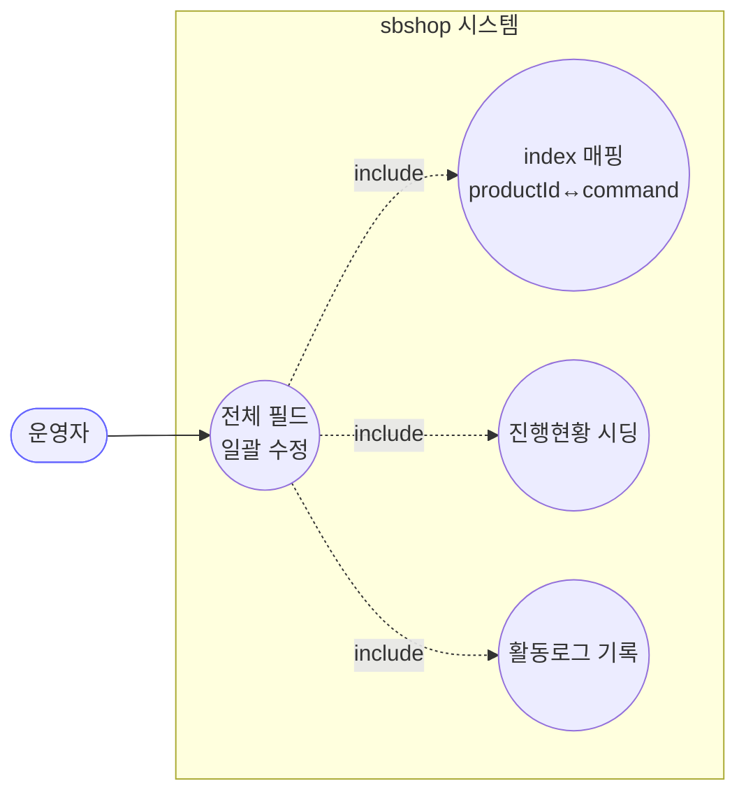
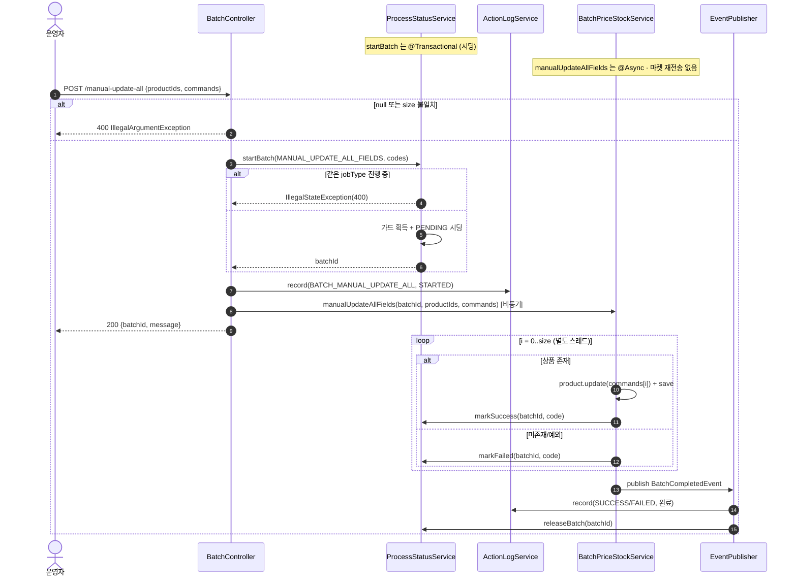

# POST /manual-update-all — 전체 필드 일괄 업데이트

## 1. 개요

> 쉽게 말하면: 운영자가 여러 상품을 골라 각 상품에 "이 상품은 이렇게 바꿔라"라는 수정 명령(command)을 그대로 적용하는 기능입니다. 상품번호 목록과 명령 목록을 같은 순서(같은 자리)로 짝지어 처리합니다. 단, 이 기능은 연동 마켓에는 값을 다시 보내지 않고 DB만 바꿉니다.

| 항목 | 내용 |
|------|------|
| **Method / URL** | `POST /api/v1/products/batch/manual-update-all` (바디 `ManualUpdateAllRequest`) |
| **목적** | `productIds[i]` 상품에 `commands[i]`(수정 명령 `ProductUpdateCommand`)를 그대로 적용하는 전체 필드 일괄 수정. 목록에서 **같은 자리(index)**끼리 상품번호와 명령을 짝짓습니다. |
| **핵심 상태전이** | 진행표(ProcessStatus): `PENDING`(대기줄) → 상품별로 `SUCCESS`/`FAILED`. 상품(Product): 명령에 담긴 필드들을 갱신. |
| **부수효과** | 상품 저장만 함 — **연동 마켓에 값 다시 보내기(`syncPriceStock`) 없음** · 크롤 없음 · 쉬는 시간 없음 + 활동로그 시작/끝 기록 + 같은 종류 작업 동시실행 잠금. |
| **응답** | `200 OK` + `{batchId, message}`. |

## 2. 호출 체인

> 각 줄 끝의 `파일:줄번호`는 실제 코드 위치이고, "→ 쉽게 말하면"은 그 단계가 하는 일을 풀어 쓴 것입니다.

```
BatchController.manualUpdateAll()                            api/.../controller/BatchController.java:99-121
  ├─ productIds null || commands null || size 불일치 → IllegalArgumentException(400)  :104-110
  │     → 쉽게 말하면: 두 목록 중 하나가 없거나 길이가 서로 다르면 여기서 400으로 거절.
  ├─ productCodes = productIds.map(String::valueOf)          :111-113
  │     → 쉽게 말하면: 상품 번호들을 진행표용 코드로 바꿈.
  ├─ startBatchWithLog(MANUAL_UPDATE_ALL_FIELDS, ...)        :115-118 → :48-56
  │     ├─ processStatusService.startBatch(jobType, codes)  core/.../process/ProcessStatusService.java:45-74  @Transactional
  │     │     → 쉽게 말하면: 동시실행 잠금 잡고, 상품마다 "대기중" 한 줄씩 깔고, 작업표 번호 발급.
  │     └─ actionLogService.record(BATCH_MANUAL_UPDATE_ALL, STARTED)  :54
  │           → 쉽게 말하면: 활동로그에 "시작함" 한 줄 남김.
  └─ batchPriceStockService.manualUpdateAllFields(batchId, productIds, commands)
                                                              core/.../product/BatchPriceStockService.java:161-186  @Async("productBatchExecutor")
        │     → 쉽게 말하면: 여기부터는 뒤에서 따로 도는 실제 처리.
        └─ for i in 0..productIds.size():                    :165-182
             ├─ productId = productIds.get(i)                :167
             │     → 쉽게 말하면: i번째 상품 번호를 꺼냄.
             ├─ productReader.findById(productId) → orElseThrow  :168-169
             │     → 쉽게 말하면: 상품을 DB에서 찾음. 없으면 예외로 튕겨 실패 처리.
             ├─ command = commands.get(i)                    :171   (index 매핑)
             │     → 쉽게 말하면: 같은 자리(i번째)의 수정 명령을 꺼냄. ← 순서가 어긋나면 엉뚱한 상품에 적용됨(BATA-10).
             ├─ product.update(command) + productWriter.save()  :172-173
             │     → 쉽게 말하면: 명령대로 상품 필드를 바꾸고 DB에 저장.
             ├─ processStatusService.markSuccess(batchId, code, "전체 필드 수정 완료")  :175-176
             │     → 쉽게 말하면: 진행표에서 이 상품을 "성공"으로 표시.
             └─ catch Exception → log + markFailed + failCount++  :177-181
                   → 쉽게 말하면: 오류가 나면 "실패"로 적고 실패 수를 늘림.
        └─ eventPublisher.publishEvent(BatchCompletedEvent, BATCH_MANUAL_UPDATE_ALL)  :183-185
              │     → 쉽게 말하면: 다 돌면 "배치 끝" 신호를 쏨.
              ├─ ActionLogBatchListener → record(SUCCESS/FAILED)  core/.../actionlog/ActionLogBatchListener.java:22-27
              │     → 쉽게 말하면: 활동로그에 최종 성공/실패 결과를 남김.
              └─ BatchGuardReleaseListener → releaseBatch  core/.../process/BatchGuardReleaseListener.java:26-29
                    → 쉽게 말하면: 다음 작업을 위해 잠금을 풀어줌.
```

**요청 바디 (`ManualUpdateAllRequest`, `ManualUpdateAllRequest.java:6-9`)** — 요청에 담아 보내는 값들입니다.

| 필드 | 타입 | 필수 | 비고 |
|------|------|------|------|
| `productIds` | List\<Long\> | 필수 | 없거나 commands와 길이가 다르면 400 (`:104-110`) |
| `commands` | List\<ProductUpdateCommand\> | 필수 | 같은 자리(index)로 productIds와 짝지음 |

## 3. 유스케이스 다이어그램

👉 이 그림은 운영자가 이 기능을 쓸 때 시스템이 안에서 하는 일들(자리 맞춰 상품↔명령 짝짓기·진행표 준비·활동로그)을 보여줍니다. 이 기능은 소싱 크롤러도 연동 마켓 전송도 하지 않습니다.



## 4. 시퀀스 다이어그램

👉 이 그림은 요청부터 끝까지 각 부품이 주고받는 순서를 시간 순으로 보여줍니다. 마켓 전송 부품이 없다는 점(뒤에서 도는 처리가 상품 저장만 함)이 다른 기능과 다릅니다.



## 5. 순서도 (플로우차트)

👉 이 그림은 "목록 없음/길이 불일치면 거절 → 잠금·대기줄 준비 → 즉시 응답 → 뒤에서 i번째 상품마다 명령 적용·저장"의 갈림길을 보여줍니다. 노란 상자는 거절/실패, 초록 상자는 정상 마무리입니다.

```mermaid
flowchart TD
    START([POST /manual-update-all]) --> V{productIds/commands null<br/>또는 size 불일치?}
    V -- Yes --> E400([400 거부]):::warn
    V -- No --> SEED[가드 획득 + PENDING 시딩<br/>batchId 발급]
    SEED --> LOG[ActionLog STARTED]
    LOG --> RESP([200 batchId 반환]):::ok
    RESP -.비동기.-> LOOP["for i = 0..size"]
    LOOP --> FIND{productIds[i] 상품 존재?}
    FIND -- No --> CATCH["catch → markFailed"]:::warn
    FIND -- Yes --> UPD["product.update(commands[i]) + save"]
    UPD --> MS[markSuccess]
    MS --> NEXT{다음 i?}
    CATCH --> NEXT
    NEXT -- Yes --> LOOP
    NEXT -- No --> EVT[BatchCompletedEvent<br/>ActionLog 완료 + 가드 해제]:::ok

    classDef ok fill:#dfd,stroke:#3a3;
    classDef warn fill:#fe8,stroke:#e90;
```

## 6. 상태 전이표

> 상품 하나가 어떤 상황이면 진행표에 어떻게 남고 무슨 일이 일어나는지 보는 표입니다. 이 기능은 어느 경우에도 마켓에 값을 다시 보내지 않습니다.

| 진입 조건 | ProcessStatus 결과 | Product 부수효과 | 마켓 전송 | 비고 |
|-----------|:------------------:|------------------|-----------|------|
| 목록 없음 또는 길이 불일치 | (시작 안 함) | — | — | 진입 자체를 400으로 거절 (`:104-110`) |
| 상품이 DB에 없음 | `FAILED`(실패) | — | — | 못 찾아 예외 → 실패로 잡힘 (`:168-169,177-179`) |
| 상품 있음 | `SUCCESS`(성공) | 명령대로 필드 갱신·저장 | **없음** | 마켓엔 반영 안 됨 (`:172-176`) |
| 저장 중 오류 | `FAILED`(실패) | 일부만 저장됐을 수 있음 | — | 오류를 삼키고 실패 수만 늘림 (`:177-181`) |
| productIds 빈 목록(commands도 빔) | 대기줄 0줄 | — | — | 길이가 같아 400을 통과 → 폴링하면 404 (BATA-8) |

## 7. 🔎 발견사항

### BATA-8 · 🟠 GAP — 빈 목록(productIds=[], commands=[])은 길이가 같아 400을 통과해 "조회조차 안 되는 작업표 번호"가 돌아옴
- **무엇이 문제인가:** `BatchController.java:104-110`의 방어는 "목록 없음"과 "두 목록 길이 다름"만 막습니다. `productIds=[]` · `commands=[]`는 길이가 같으므로(0==0) 그대로 통과합니다. 이후 대기줄 만드는 루프가 한 번도 안 돌아 "대기중" 줄이 하나도 없습니다.
- **근거:** `BatchController.java:104-110`
- **영향:** 200 `{batchId, message}`를 받지만, 그 번호로 `/status`·`/summary`를 조회하면 전체가 0이라 "없음(404)"이 납니다(`ProcessStatusService.java:128-130,147-149`). manual-update-price-stock의 BATA-5와 같은 유형입니다. 아무 의미 없는 빈 배치가 성립합니다.
- **제안:** `productIds.isEmpty()`도 400으로 거절합니다(다른 기능들의 빈 목록 방어와 맞춤).

### BATA-9 · 🔵 NOTE — 전체 필드 수정이 연동 마켓엔 반영되지 않음(가격·재고 변경이 섞여 있어도)
- **무엇이 문제인가:** `manualUpdateAllFields`(`BatchPriceStockService.java:161-186`)는 `product.update(command)` + `save`만 하고, 마켓에 값을 보내는 `productMarketSyncService.syncPriceStock`은 부르지 않습니다. 반면 crawl·manual-update-price-stock 경로는 갱신 후 마켓에 다시 보냅니다. 그런데 수정 명령(`ProductUpdateCommand`)에는 판매가·재고처럼 마켓에 영향을 주는 필드도 담길 수 있습니다.
- **근거:** `BatchPriceStockService.java:161-186`
- **영향:** 이 경로로 판매가/재고를 바꾸면 DB만 바뀌고 쿠팡·스마트스토어·Cafe24 등 연동 마켓에는 반영되지 않아, 마켓과 DB가 서로 다른 값을 갖게 될 수 있습니다. "메타·전체 필드 수정은 마켓 미반영"이 일부러 정한 설계일 수도 있으나, 그렇다는 명시가 없습니다.
- **제안:** 전체 필드 수정 시 가격·재고 변경분을 마켓에 다시 보낼지 정책으로 확정하고 문서에 남깁니다. 필요하면 명령의 변경분을 기준으로 `syncPriceStock`을 연동합니다.

### BATA-10 · 🟡 SMELL — 두 목록을 "자리(순서)"로만 짝지어 서비스 깊숙이까지 유지해, 순서가 어긋나면 데이터가 오염됨
- **무엇이 문제인가:** 컨트롤러는 두 목록의 길이만 확인하고(`:104-110`), 실제 짝짓기는 서비스의 `commands.get(i)`(`BatchPriceStockService.java:171`)에서 "같은 자리(index)"로 일어납니다. manual-update-price-stock은 F-BATCH-M1로 이 병렬 목록을 하나의 묶음(items)으로 바꿔 순서 어긋남을 원천 차단했는데, 이 경로만 아직 병렬 목록입니다.
- **근거:** `BatchController.java:104-110`, `BatchPriceStockService.java:171`
- **영향:** 상품번호와 명령이 한 덩어리로 묶인 게 아니라 "위치"로만 연결돼 있어, 프론트에서 배열 순서가 어긋나면 엉뚱한 상품에 명령이 적용될 수 있습니다(오류 없이 조용히 데이터가 오염됨).
- **제안:** manual-update-price-stock처럼 `{productId, command}` 묶음 목록으로 계약을 통일합니다.

### BATA-11 · 🟠 GAP — 같은 상품 번호를 두 번 넣으면 한 줄이 "대기중"으로 남음 (공통 구조)
- **무엇이 문제인가:** 상태를 갱신하는 `updateStep`(`ProcessStatusService.java:91-95`)의 `findFirst`가 중복된 상품 코드 줄 중 딱 하나만 고칩니다. `productIds`에 중복이 있으면 나머지 줄이 `PENDING`(대기중)으로 남습니다.
- **근거:** `ProcessStatusService.java:91-95`
- **영향:** 진행률(summary)이 100%에 도달하지 못해 폴링 화면이 "영원히 진행중"으로 보입니다.
- **제안:** 시작할 때 상품 번호 중복을 없애거나, 상태 갱신 키를 하나로만 존재하도록 맞춥니다.

## 8. 테스트 커버리지 메모

> 이미 있는 테스트와, 아직 없어 위험이 남는 부분입니다.

- `BatchControllerManualUpdateAllValidationTest` — 목록 없음·길이 불일치를 400으로 거절하는지 확인(F-BATCH-A2/SP-3 회귀). **단, 빈 목록이 통과하는 경우는 검증 안 됨**(BATA-8).
- `BatchControllerTriggerCharacterizationTest.manualUpdateAll_characterization` — 작업 종류·시작 로그·응답 형식이 약속대로인지 확인.
- **아직 테스트가 없는 부분:** ① 빈 목록 → 조회 안 되는 작업표 번호(BATA-8), ② 마켓 미반영 정책(BATA-9), ③ 순서 어긋남에 의한 오염(BATA-10), ④ 같은 상품 번호 중복(BATA-11), ⑤ 명령 적용 후 실제 필드가 제대로 바뀌는지의 단위 검증.

---
*(쉬운 설명판 · 2026-07-17 재작성)*
*생성: 2026-07-17 · 근거: 현재 워킹트리*
