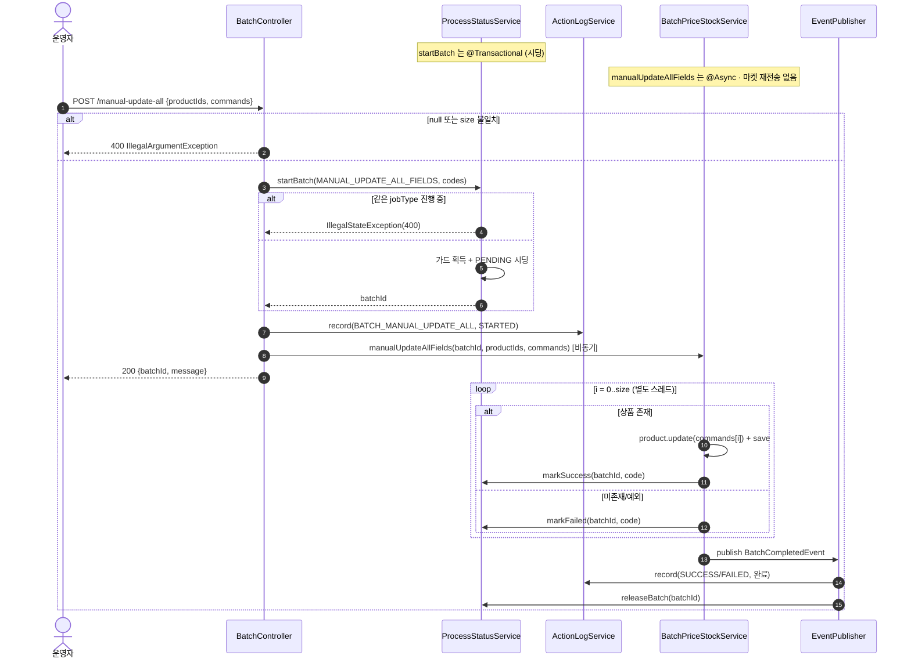

# POST /manual-update-all — 전체 필드 일괄 업데이트

## 1. 개요

| 항목 | 내용 |
|------|------|
| **Method / URL** | `POST /api/v1/products/batch/manual-update-all` (바디 `ManualUpdateAllRequest`) |
| **목적** | `productIds[i]` 상품에 `commands[i]`(`ProductUpdateCommand`)를 그대로 적용하는 전체 필드 일괄 수정. index 위치로 productId↔command 를 매핑한다. |
| **핵심 상태전이** | ProcessStatus: `PENDING`(시딩) → `SUCCESS`/`FAILED`(상품별). Product: command 에 담긴 필드 갱신. |
| **부수효과** | Product 저장만 수행 — **마켓 재전송(`syncPriceStock`) 없음** · 크롤 없음 · throttle 없음 + ActionLog STARTED/완료 + jobType 가드. |
| **응답** | `200 OK` + `{batchId, message}`. |

## 2. 호출 체인

```
BatchController.manualUpdateAll()                            api/.../controller/BatchController.java:99-121
  ├─ productIds null || commands null || size 불일치 → IllegalArgumentException(400)  :104-110
  ├─ productCodes = productIds.map(String::valueOf)          :111-113
  ├─ startBatchWithLog(MANUAL_UPDATE_ALL_FIELDS, ...)        :115-118 → :48-56
  │     ├─ processStatusService.startBatch(jobType, codes)  core/.../process/ProcessStatusService.java:45-74  @Transactional
  │     └─ actionLogService.record(BATCH_MANUAL_UPDATE_ALL, STARTED)  :54
  └─ batchPriceStockService.manualUpdateAllFields(batchId, productIds, commands)
                                                              core/.../product/BatchPriceStockService.java:161-186  @Async("productBatchExecutor")
        └─ for i in 0..productIds.size():                    :165-182
             ├─ productId = productIds.get(i)                :167
             ├─ productReader.findById(productId) → orElseThrow  :168-169
             ├─ command = commands.get(i)                    :171   (index 매핑)
             ├─ product.update(command) + productWriter.save()  :172-173
             ├─ processStatusService.markSuccess(batchId, code, "전체 필드 수정 완료")  :175-176
             └─ catch Exception → log + markFailed + failCount++  :177-181
        └─ eventPublisher.publishEvent(BatchCompletedEvent, BATCH_MANUAL_UPDATE_ALL)  :183-185
              ├─ ActionLogBatchListener → record(SUCCESS/FAILED)  core/.../actionlog/ActionLogBatchListener.java:22-27
              └─ BatchGuardReleaseListener → releaseBatch  core/.../process/BatchGuardReleaseListener.java:26-29
```

**요청 바디 (`ManualUpdateAllRequest`, `ManualUpdateAllRequest.java:6-9`)**

| 필드 | 타입 | 필수 | 비고 |
|------|------|------|------|
| `productIds` | List\<Long\> | 필수 | null 또는 commands 와 size 불일치 → 400 (`:104-110`) |
| `commands` | List\<ProductUpdateCommand\> | 필수 | index 위치로 productIds 와 매핑 |

## 3. 유스케이스 다이어그램


## 4. 시퀀스 다이어그램



## 5. 순서도 (플로우차트)

```mermaid
flowchart TD
    START([POST /manual-update-all]) --> V{productIds/commands null<br/>또는 size 불일치?}
    V -- Yes --> E400([400 거부]):::warn
    V -- No --> SEED[가드 획득 + PENDING 시딩<br/>batchId 발급]
    SEED --> LOG[ActionLog STARTED]
    LOG --> RESP([200 batchId 반환]):::ok
    RESP -.비동기.-> LOOP["for i = 0..size"]
    LOOP --> FIND{productIds[i] 상품 존재?}
    FIND -- No --> CATCH["catch → markFailed"]:::warn
    FIND -- Yes --> UPD["product.update(commands[i]) + save"]
    UPD --> MS[markSuccess]
    MS --> NEXT{다음 i?}
    CATCH --> NEXT
    NEXT -- Yes --> LOOP
    NEXT -- No --> EVT[BatchCompletedEvent<br/>ActionLog 완료 + 가드 해제]:::ok

    classDef ok fill:#dfd,stroke:#3a3;
    classDef warn fill:#fe8,stroke:#e90;
```

## 6. 상태 전이표

| 진입 조건 | ProcessStatus 결과 | Product 부수효과 | 마켓 전송 | 비고 |
|-----------|:------------------:|------------------|-----------|------|
| null 또는 size 불일치 | (시작 안 함) | — | — | 400 진입 거부 (`:104-110`) |
| 상품 미존재 | `FAILED` | — | — | orElseThrow → catch (`:168-169,177-179`) |
| 상품 존재 | `SUCCESS` | command 필드 갱신·save | **없음** | 마켓 미반영 (`:172-176`) |
| update/save 중 예외 | `FAILED` | 부분 저장 가능 | — | catch 삼킴, failCount++ (`:177-181`) |
| productIds=빈 리스트(commands도 빈) | 시딩 0행 | — | — | size 일치라 400 통과 → 폴링 시 404 (BATA-8) |

## 7. 🔎 발견사항

### BATA-8 · 🟠 GAP — 빈 리스트(productIds=[], commands=[])는 size 일치라 400을 통과해 "폴링 불가 batchId" 반환
- **근거:** `BatchController.java:104-110` 의 가드는 null 과 **size 불일치**만 막는다. `productIds=[]` · `commands=[]` 는 size 가 같아(0==0) 통과한다. 이후 `startBatch` 의 시딩 루프가 0회라 PENDING 행이 없다.
- **영향:** 200 `{batchId, message}` 를 받지만 그 batchId 로 `/status`·`/summary` 조회 시 total==0 → 404(`ProcessStatusService.java:128-130,147-149`). BATA-5(manual-update-price-stock)와 동일 유형. 무의미 배치 성립.
- **제안:** `productIds.isEmpty()` 도 400으로 거부(다른 트리거의 empty 가드와 정합).

### BATA-9 · 🔵 NOTE — 전체 필드 수정이 연동 마켓에 반영되지 않음(가격·재고 변경 포함 가능)
- **근거:** `manualUpdateAllFields`(`BatchPriceStockService.java:161-186`)는 `product.update(command)` + `save` 만 하고 `productMarketSyncService.syncPriceStock` 을 호출하지 않는다. 반면 crawl·manual-update-price-stock 경로는 갱신 후 마켓 재전송을 수행한다. `ProductUpdateCommand` 에는 salePrice·stock 등 마켓에 영향 주는 필드도 담길 수 있다.
- **영향:** 이 경로로 판매가/재고를 바꾸면 DB만 갱신되고 쿠팡·스마트스토어·Cafe24 등 연동 마켓에는 반영되지 않아 마켓과 DB가 불일치할 수 있다. 의도된 "메타/전체 필드 수정은 마켓 미반영" 설계일 수 있으나 명시가 없다.
- **제안:** 전체 필드 수정 시 가격·재고 변경분에 대한 마켓 재전송 필요 여부를 정책으로 확정하고 문서화. 필요 시 command diff 기반 syncPriceStock 연동.

### BATA-10 · 🟡 SMELL — 두 병렬 리스트 index 매핑이 서비스 깊숙이까지 유지되어 순서 오염에 취약
- **근거:** 컨트롤러는 size 만 검증하고(`:104-110`), 실제 매핑은 서비스 `commands.get(i)`(`BatchPriceStockService.java:171`)에서 index 로 일어난다. manual-update-price-stock 은 F-BATCH-M1 로 병렬 배열을 쌍(items)으로 바꿔 오염을 원천 차단했는데(`PriceStockItem`), 이 경로만 여전히 병렬 리스트다.
- **영향:** productId 와 command 가 쌍이 아니라 위치로 묶여, 프론트에서 배열 순서가 어긋나면 엉뚱한 상품에 command 가 적용될 수 있다(런타임 예외 없이 데이터 오염).
- **제안:** manual-update-price-stock 과 동일하게 `{productId, command}` 쌍 리스트로 계약 통일.

### BATA-11 · 🟠 GAP — 중복 productId 시 일부 행 PENDING 잔류 (공통 구조)
- **근거:** `updateStep` 의 `findFirst`(`ProcessStatusService.java:91-95`)가 중복 productCode 행 중 하나만 갱신. productIds 에 중복이 있으면 나머지 행이 PENDING.
- **영향:** summary 가 100% 미달 → 폴링 무한 진행중.
- **제안:** 진입부 distinct 또는 상태 갱신 키 정합화.

## 8. 테스트 커버리지 메모

- `BatchControllerManualUpdateAllValidationTest` — null·size 불일치 → 400 진입 검증(F-BATCH-A2/SP-3 회귀). **단, 빈 리스트 통과 케이스는 미검증**(BATA-8).
- `BatchControllerTriggerCharacterizationTest.manualUpdateAll_characterization` — MANUAL_UPDATE_ALL_FIELDS jobType·STARTED 로그·응답 계약.
- **비어있는 케이스:** ① 빈 리스트 → 폴링 불가 batchId(BATA-8), ② 마켓 미반영 정책(BATA-9), ③ index 오염(BATA-10), ④ 중복 productId(BATA-11), ⑤ command 적용 후 실제 필드 반영 단위 검증.

---
*생성: 2026-07-17 · 근거: 현재 워킹트리*
