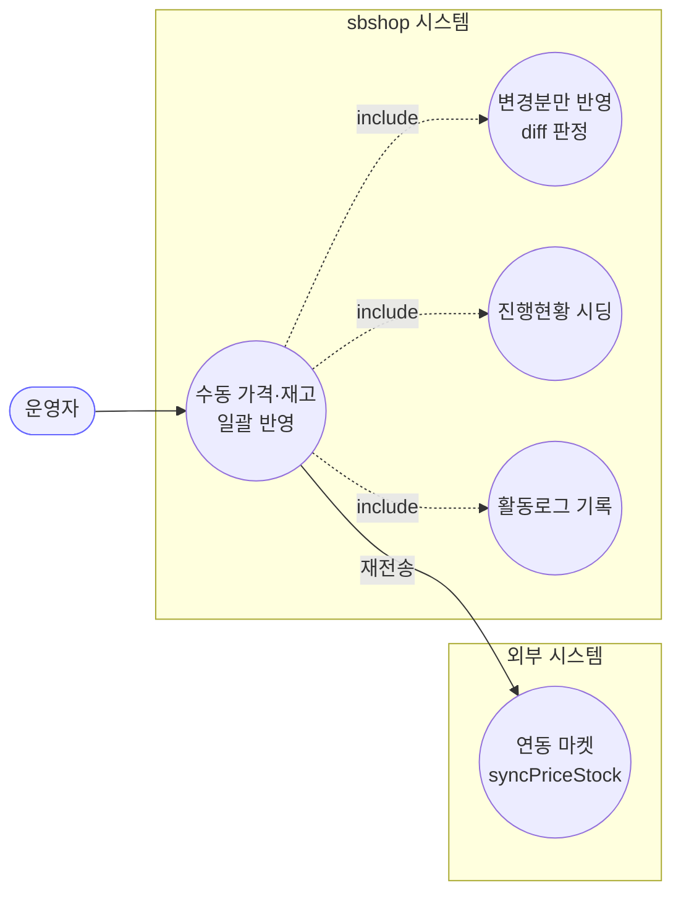
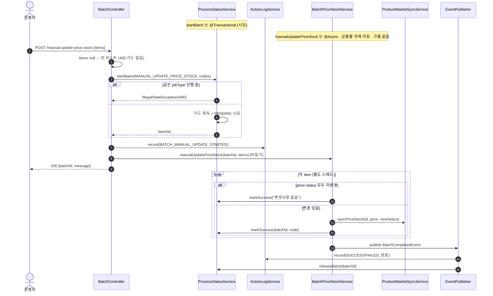

# POST /manual-update-price-stock — 수동 가격·재고 일괄 업데이트

## 1. 개요

| 항목 | 내용 |
|------|------|
| **Method / URL** | `POST /api/v1/products/batch/manual-update-price-stock` (바디 `ManualUpdateRequest`) |
| **목적** | 운영자가 지정한 `items`(productId·price·stock 쌍)를 크롤 없이 직접 반영한다. 재고 수량으로 재고상태(IN_STOCK/OUT_OF_STOCK)를 파생하고, 변경분만 DB·연동 마켓에 반영한다. |
| **핵심 상태전이** | ProcessStatus: `PENDING`(시딩) → `SUCCESS`/`FAILED`(상품별). Product: 판매가·재고상태 갱신(변경분만). |
| **부수효과** | 연동 마켓 재전송(`syncPriceStock`, throttle 없음) + ActionLog STARTED/완료 + jobType 가드 획득·해제. 외부 크롤 없음. |
| **응답** | `200 OK` + `{batchId, message}`. |

## 2. 호출 체인

```
BatchController.manualUpdate()                               api/.../controller/BatchController.java:82-97
  ├─ items = request.items() != null ? items : new ArrayList<>()   :86   (null → 빈 리스트, 가드 없음)
  ├─ productCodes = items.map(item -> String.valueOf(item.productId()))  :87-89
  ├─ startBatchWithLog(MANUAL_UPDATE_PRICE_STOCK, ...)       :91-94 → :48-56
  │     ├─ processStatusService.startBatch(jobType, codes)  core/.../process/ProcessStatusService.java:45-74  @Transactional
  │     └─ actionLogService.record(BATCH_MANUAL_UPDATE, STARTED)  :54
  └─ batchPriceStockService.manualUpdatePriceStock(batchId, items)
                                                              core/.../product/BatchPriceStockService.java:109-159  @Async("productBatchExecutor")
        └─ for each PriceStockItem item:                     :113-155
             ├─ productReader.findById(item.productId()) → orElseThrow  :116-117
             ├─ newStatus = stock null ? old : (stock<=0 ? OUT_OF_STOCK : IN_STOCK)  :124-125
             ├─ priceChanged / statusChanged 판정            :126-127
             ├─ 둘 다 미변경 → markSuccess("변경사항 없음")·continue  :129-133
             ├─ product.update(salePrice)/updateStockStatus() + save  :135-140
             ├─ productMarketSyncService.syncPriceStock(id, price, newStatus)  :143-144  (changed 인자 없음 → 항상 전송)
             ├─ processStatusService.markSuccess(batchId, code, msg)  :145-149
             └─ catch Exception → log + markFailed + failCount++  :150-154
        └─ eventPublisher.publishEvent(BatchCompletedEvent, BATCH_MANUAL_UPDATE)  :156-158
              ├─ ActionLogBatchListener → record(SUCCESS/FAILED)  core/.../actionlog/ActionLogBatchListener.java:22-27
              └─ BatchGuardReleaseListener → releaseBatch  core/.../process/BatchGuardReleaseListener.java:26-29
```

**요청 바디 (`ManualUpdateRequest`, `ManualUpdateRequest.java:10-12` / `PriceStockItem.java:10`)**

| 필드 | 타입 | 필수 | 비고 |
|------|------|------|------|
| `items` | List\<PriceStockItem\> | 사실상 필수 | null 이면 빈 리스트로 대체(가드 없음, BATA-5) |
| `items[].productId` | Long | 필수 | — |
| `items[].price` | BigDecimal | 선택 | null 이면 미변경 |
| `items[].stock` | Integer | 선택 | null 이면 상태 미변경 |

## 3. 유스케이스 다이어그램



## 4. 시퀀스 다이어그램



## 5. 순서도 (플로우차트)


## 6. 상태 전이표

| 진입 조건 | ProcessStatus 결과 | Product 부수효과 | 마켓 전송 | 비고 |
|-----------|:------------------:|------------------|-----------|------|
| 상품 미존재 | `FAILED` | — | — | orElseThrow → catch (`:116-117,150-152`) |
| price·status 모두 미변경 | `SUCCESS` | 없음 | 없음 | early continue (`:129-133`) |
| 가격 또는 상태 변경 | `SUCCESS` | 판매가·재고상태 갱신 | 항상 재전송 | `syncPriceStock` changed 인자 없음(`:143-144`) |
| stock null | 상태 유지 | 상태 미변경 | 가격만 반영 가능 | `newStatus=oldStatus`(`:124`) |
| 저장/전송 중 예외 | `FAILED` | 부분 저장 가능 | 시도 여부 무관 | catch 삼킴, failCount++ (`:150-154`) |
| items=빈 리스트 | 시딩 0행 | — | — | batchId 반환되나 폴링 시 404(BATA-5) |

## 7. 🔎 발견사항

### BATA-5 · 🟠 GAP — 빈/누락 items를 400으로 거부하지 않아 "폴링 불가한 batchId"가 반환됨
- **근거:** `BatchController.java:86` 은 `items` 가 null 이면 빈 리스트로 대체하고 빈 리스트에 대한 400 가드가 없다. crawl-and-update(`:62-64`)·manual-update-all(`:104-110`)은 명시적으로 빈/불일치를 400으로 막는데 이 경로만 비대칭. 빈 리스트로 `startBatch` 하면 `ProcessStatusService.java:54-64` 루프가 0회 → **PENDING 행을 하나도 시딩하지 않는다.**
- **영향:** 컨트롤러는 `{batchId, message}` 를 200으로 반환하지만 그 batchId 로 `/status/{batchId}`·`/status/{batchId}/summary` 를 조회하면 total==0 이라 `ResourceNotFoundException`(404)이 난다(`ProcessStatusService.java:128-130,147-149`). 운영자는 "시작됨" 응답을 받고도 진행현황을 볼 수 없다. 게다가 가드는 획득되지만 이벤트가 정상 발행되어 해제되므로 잠김은 아니나, 무의미한 배치가 성립한다.
- **제안:** `items` null/empty → 400 거부(다른 세 트리거와 정합). 최소한 빈 배치일 때 batchId 대신 명시적 "대상 없음" 응답.

### BATA-6 · 🟡 SMELL — 변경분 재전송에 crawl 경로의 `changed` 스킵 최적화가 적용되지 않아 항상 마켓 재전송
- **근거:** 이 경로는 `syncPriceStock(id, price, newStatus)`(3-인자, `BatchPriceStockService.java:143-144`)를 호출하는데, 이 오버로드는 `ProductMarketSyncService.java:34-37` 에서 `changed=true` 로 고정된다. crawl-and-update(`:90-91`)는 `changed` 를 계산해 Cafe24 재전송을 스킵하는 반면, 수동 경로는 이미 "가격·상태 변경 있음"으로 진입했음에도 Cafe24 변경감지 최적화 대상에서 제외된다.
- **영향:** 동작상 오류는 아니나(변경분만 진입하므로 대개 전송이 필요함), 두 배치 경로의 마켓 전송 정책이 비대칭이라 유지보수 시 혼동 소지. crawl과 달리 diff 후에도 changed 신호를 downstream 에 넘기지 않는다.
- **제안:** 진입 diff 결과(priceChanged/statusChanged)를 4-인자 오버로드의 `changed` 로 넘겨 정책을 통일할지 검토.

### BATA-7 · 🟠 GAP — 중복 productId 시 일부 행 PENDING 잔류 (crawl 경로와 동일 구조)
- **근거:** `updateStep`(`ProcessStatusService.java:91-95`)의 `findFirst` 는 중복 productCode 행 중 하나만 갱신한다. items 에 같은 productId가 2회 들어오면 나머지 행이 PENDING 으로 남는다.
- **영향:** `getBatchSummary` 가 100%에 도달하지 못해 폴링이 무한 진행중.
- **제안:** items 진입부 productId distinct 또는 상태 갱신 키 정합화.

## 8. 테스트 커버리지 메모

- `BatchManualUpdatePairBindingTest` — productId·price·stock 쌍이 올바른 상품에 묶여 반영(병렬 배열 오염 방지, F-BATCH-M1 회귀).
- `BatchControllerTriggerCharacterizationTest.manualUpdate_characterization` — MANUAL_UPDATE_PRICE_STOCK jobType·STARTED 로그·응답 계약.
- `ProcessStatusServiceTest` — 상태 조회·404 판정.
- **비어있는 케이스:** ① items null/empty 진입(BATA-5, 400 가드 부재 자체가 미검증), ② 변경없음 early-return 경로의 markSuccess 문구, ③ 중복 productId PENDING 잔류(BATA-7), ④ 마켓 재전송 부분실패 시 메시지 표면화.

---
*생성: 2026-07-17 · 근거: 현재 워킹트리*
