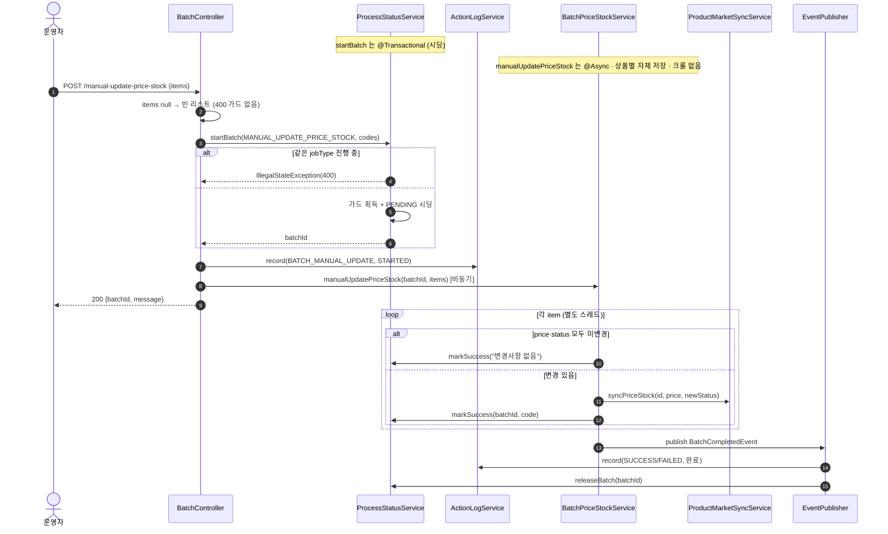
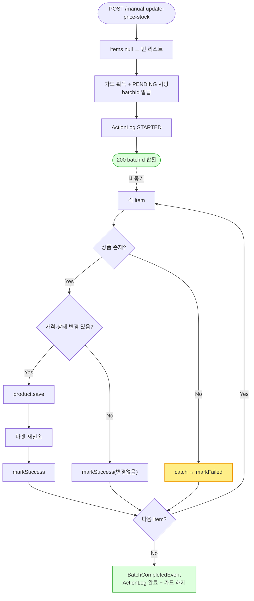

# POST /manual-update-price-stock — 수동 가격·재고 일괄 업데이트

## 1. 개요

> 쉽게 말하면: 소싱 사이트를 긁지 않고, 운영자가 손으로 정한 "이 상품은 얼마·몇 개"를 여러 상품에 한꺼번에 반영하는 기능입니다. 값이 실제로 바뀐 상품만 골라 DB와 연동 마켓에 보냅니다.

| 항목 | 내용 |
|------|------|
| **Method / URL** | `POST /api/v1/products/batch/manual-update-price-stock` (바디 `ManualUpdateRequest`) |
| **목적** | 운영자가 지정한 `items`(상품번호·가격·재고 묶음)를 크롤 없이 그대로 반영합니다. 재고 수량을 보고 재고상태(재고있음/품절)를 정하고, 실제로 바뀐 부분만 DB와 연동 마켓에 반영합니다. |
| **핵심 상태전이** | 진행표(ProcessStatus): `PENDING`(대기줄) → 상품별로 `SUCCESS`/`FAILED`. 상품(Product): 판매가·재고상태 갱신(바뀐 것만). |
| **부수효과** | 연동 마켓에 값 다시 보내기(`syncPriceStock`, 여기는 쉬는 시간 없음) + 활동로그 시작/끝 기록 + 같은 종류 작업 동시실행 잠금 잡기·풀기. 소싱 사이트 크롤은 하지 않음. |
| **응답** | `200 OK` + `{batchId, message}`. |

## 2. 호출 체인

> 각 줄 끝의 `파일:줄번호`는 실제 코드 위치이고, "→ 쉽게 말하면"은 그 단계가 하는 일을 풀어 쓴 것입니다.

```
BatchController.manualUpdate()                               api/.../controller/BatchController.java:82-97
  ├─ items = request.items() != null ? items : new ArrayList<>()   :86   (null → 빈 리스트, 가드 없음)
  │     → 쉽게 말하면: 넘어온 목록이 없으면 빈 목록으로 대체(막지 않음). ← 뒤의 BATA-5 문제의 원인.
  ├─ productCodes = items.map(item -> String.valueOf(item.productId()))  :87-89
  │     → 쉽게 말하면: 각 항목의 상품번호를 진행표용 코드로 바꿈.
  ├─ startBatchWithLog(MANUAL_UPDATE_PRICE_STOCK, ...)       :91-94 → :48-56
  │     ├─ processStatusService.startBatch(jobType, codes)  core/.../process/ProcessStatusService.java:45-74  @Transactional
  │     │     → 쉽게 말하면: 동시실행 잠금 잡고, 상품마다 "대기중" 한 줄씩 진행표에 깔고, 작업표 번호 발급.
  │     └─ actionLogService.record(BATCH_MANUAL_UPDATE, STARTED)  :54
  │           → 쉽게 말하면: 활동로그에 "시작함" 한 줄 남김.
  └─ batchPriceStockService.manualUpdatePriceStock(batchId, items)
                                                              core/.../product/BatchPriceStockService.java:109-159  @Async("productBatchExecutor")
        │     → 쉽게 말하면: 여기부터는 뒤에서 따로 도는 실제 처리.
        └─ for each PriceStockItem item:                     :113-155
             ├─ productReader.findById(item.productId()) → orElseThrow  :116-117
             │     → 쉽게 말하면: 상품을 DB에서 찾음. 없으면 예외로 튕겨 실패 처리.
             ├─ newStatus = stock null ? old : (stock<=0 ? OUT_OF_STOCK : IN_STOCK)  :124-125
             │     → 쉽게 말하면: 재고 수량이 없으면 상태 그대로, 0 이하면 품절, 아니면 재고있음으로 정함.
             ├─ priceChanged / statusChanged 판정            :126-127
             │     → 쉽게 말하면: 가격이나 상태가 실제로 바뀌었는지 확인.
             ├─ 둘 다 미변경 → markSuccess("변경사항 없음")·continue  :129-133
             │     → 쉽게 말하면: 바뀐 게 하나도 없으면 "성공(변경없음)"으로 적고 다음으로 넘어감.
             ├─ product.update(salePrice)/updateStockStatus() + save  :135-140
             │     → 쉽게 말하면: 바뀐 값을 상품에 반영하고 DB에 저장.
             ├─ productMarketSyncService.syncPriceStock(id, price, newStatus)  :143-144  (changed 인자 없음 → 항상 전송)
             │     → 쉽게 말하면: 연동 마켓에 값을 보냄. 여기는 "바뀐 것만" 신호가 없어 항상 보냄.
             ├─ processStatusService.markSuccess(batchId, code, msg)  :145-149
             │     → 쉽게 말하면: 진행표에서 이 상품을 "성공"으로 표시.
             └─ catch Exception → log + markFailed + failCount++  :150-154
                   → 쉽게 말하면: 오류가 나면 "실패"로 적고 실패 수를 늘림.
        └─ eventPublisher.publishEvent(BatchCompletedEvent, BATCH_MANUAL_UPDATE)  :156-158
              │     → 쉽게 말하면: 다 돌면 "배치 끝" 신호를 쏨.
              ├─ ActionLogBatchListener → record(SUCCESS/FAILED)  core/.../actionlog/ActionLogBatchListener.java:22-27
              │     → 쉽게 말하면: 활동로그에 최종 성공/실패 결과를 남김.
              └─ BatchGuardReleaseListener → releaseBatch  core/.../process/BatchGuardReleaseListener.java:26-29
                    → 쉽게 말하면: 다음 작업을 위해 잠금을 풀어줌.
```

**요청 바디 (`ManualUpdateRequest`, `ManualUpdateRequest.java:10-12` / `PriceStockItem.java:10`)** — 요청에 담아 보내는 값들입니다.

| 필드 | 타입 | 필수 | 비고 |
|------|------|------|------|
| `items` | List\<PriceStockItem\> | 사실상 필수 | 없으면 빈 목록으로 대체(막지 않음, BATA-5) |
| `items[].productId` | Long | 필수 | 상품 번호 |
| `items[].price` | BigDecimal | 선택 | 없으면 가격 안 바꿈 |
| `items[].stock` | Integer | 선택 | 없으면 재고상태 안 바꿈 |

## 3. 유스케이스 다이어그램

👉 이 그림은 운영자가 이 기능을 쓸 때 시스템이 안에서 하는 일들(바뀐 것만 반영·진행표 준비·활동로그)과, 밖으로 연동 마켓에 값을 다시 보내는 관계를 보여줍니다. 이 기능은 소싱 크롤러를 쓰지 않습니다.


## 4. 시퀀스 다이어그램

👉 이 그림은 요청부터 끝까지 각 부품이 주고받는 순서를 시간 순으로 보여줍니다. 아래 반복 상자는 뒤에서 따로 도는 항목별 처리이고, "바뀐 게 없으면 그냥 성공, 바뀌었으면 마켓에 보내고 성공"의 갈래를 담고 있습니다.



## 5. 순서도 (플로우차트)

👉 이 그림은 "목록 없으면 빈 목록으로 → 잠금·대기줄 준비 → 즉시 응답 → 뒤에서 항목 하나씩: 바뀐 게 있으면 저장·마켓전송, 없으면 그냥 성공"의 갈림길을 보여줍니다.



## 6. 상태 전이표

> 항목 하나가 어떤 상황이면 진행표에 어떻게 남고, 상품·마켓에 무슨 일이 일어나는지 보는 표입니다.

| 진입 조건 | ProcessStatus 결과 | Product 부수효과 | 마켓 전송 | 비고 |
|-----------|:------------------:|------------------|-----------|------|
| 상품이 DB에 없음 | `FAILED`(실패) | — | — | 못 찾아 예외 → 실패로 잡힘 (`:116-117,150-152`) |
| 가격·상태 둘 다 안 바뀜 | `SUCCESS`(성공) | 없음 | 없음 | 바로 다음으로 넘김 (`:129-133`) |
| 가격 또는 상태가 바뀜 | `SUCCESS`(성공) | 판매가·재고상태 갱신 | 항상 다시 보냄 | "바뀐 것만" 신호가 없어 항상 전송 (`:143-144`) |
| 재고 수량(stock)이 없음 | 상태 그대로 | 상태 안 바꿈 | 가격만 반영될 수 있음 | 상태는 옛 값 유지 (`:124`) |
| 저장/전송 중 오류 | `FAILED`(실패) | 일부만 저장됐을 수 있음 | 시도 여부 무관 | 오류를 삼키고 실패 수만 늘림 (`:150-154`) |
| items가 빈 목록 | 대기줄 0줄 | — | — | 작업표 번호는 주지만 폴링하면 404 (BATA-5) |

## 7. 🔎 발견사항

### BATA-5 · 🟠 GAP — 빈/누락 목록을 막지 않아 "조회조차 안 되는 작업표 번호"가 돌아옴
- **무엇이 문제인가:** `BatchController.java:86`은 `items`가 없으면 빈 목록으로 바꾸는데, 빈 목록을 400으로 막는 방어가 없습니다. 형제 기능인 crawl-and-update(`:62-64`)와 manual-update-all(`:104-110`)은 빈/불일치를 400으로 확실히 막는데 이 경로만 그렇지 않아 짝이 안 맞습니다. 빈 목록으로 `startBatch`를 하면 대기줄 만드는 루프(`ProcessStatusService.java:54-64`)가 한 번도 안 돌아 **"대기중" 줄을 하나도 안 깝니다.**
- **근거:** `BatchController.java:86`
- **영향:** 컨트롤러는 `{batchId, message}`를 200으로 돌려주지만, 그 번호로 `/status/{batchId}`·`/summary`를 조회하면 전체가 0이라 "없음(404)"이 납니다(`ProcessStatusService.java:128-130,147-149`). 운영자는 "시작됨" 응답을 받고도 진행현황을 아예 볼 수 없습니다. 잠금은 잡히지만 끝 신호가 정상적으로 풀어주므로 잠긴 채로 방치되지는 않으나, 아무 의미 없는 빈 배치가 성립합니다.
- **제안:** `items`가 없거나 비면 400으로 거절합니다(다른 세 기능과 맞춤). 최소한 빈 배치일 땐 번호 대신 "대상 없음"이라는 명확한 응답을 줍니다.

### BATA-6 · 🟡 SMELL — crawl 경로에 있는 "안 바뀐 마켓은 건너뛰기" 최적화가 여기엔 없어 항상 마켓에 보냄
- **무엇이 문제인가:** 이 경로는 마켓 전송을 3-인자짜리 `syncPriceStock(id, price, newStatus)`(`BatchPriceStockService.java:143-144`)로 부르는데, 이 형태는 내부에서 "바뀐 것만" 신호를 무조건 참(`changed=true`)으로 고정합니다(`ProductMarketSyncService.java:34-37`). 반면 crawl-and-update(`:90-91`)는 실제로 바뀐지를 계산해 Cafe24 재전송을 건너뛰는데, 수동 경로는 이미 "바뀐 것만 골라 들어왔음에도" 이 건너뛰기 최적화 대상에서 빠집니다.
- **근거:** `BatchPriceStockService.java:143-144`, `ProductMarketSyncService.java:34-37`
- **영향:** 동작이 틀린 건 아니지만(어차피 바뀐 것만 들어오니 대개 보내는 게 맞음), 두 배치 경로의 마켓 전송 방식이 서로 달라 나중에 손볼 때 헷갈릴 소지가 있습니다. crawl과 달리, 바뀐지 판정한 결과를 뒤 단계로 넘겨 주지 않습니다.
- **제안:** 들어올 때 판정한 결과(가격 바뀜/상태 바뀜)를 4-인자 형태의 "바뀐 것만" 신호로 넘겨 두 경로 방식을 통일할지 검토합니다.

### BATA-7 · 🟠 GAP — 같은 상품 번호를 두 번 넣으면 한 줄이 "대기중"으로 남음 (crawl 경로와 같은 구조)
- **무엇이 문제인가:** 상태를 갱신하는 `updateStep`(`ProcessStatusService.java:91-95`)의 `findFirst`는 중복된 상품 코드 줄 중 딱 하나만 고칩니다. `items`에 같은 상품 번호가 두 번 들어오면 나머지 줄이 `PENDING`(대기중)으로 남습니다.
- **근거:** `ProcessStatusService.java:91-95`
- **영향:** 진행률(summary)이 100%에 도달하지 못해 폴링 화면이 "영원히 진행중"으로 보입니다.
- **제안:** 시작할 때 상품 번호 중복을 없애거나, 상태 갱신 키를 하나로만 존재하도록 맞춥니다.

## 8. 테스트 커버리지 메모

> 이미 있는 테스트와, 아직 없어 위험이 남는 부분입니다.

- `BatchManualUpdatePairBindingTest` — 상품번호·가격·재고 묶음이 올바른 상품에 정확히 붙는지 확인(순서가 뒤섞여 엉뚱한 상품에 붙는 사고 방지, F-BATCH-M1 회귀).
- `BatchControllerTriggerCharacterizationTest.manualUpdate_characterization` — 작업 종류·시작 로그·응답 형식이 약속대로인지 확인.
- `ProcessStatusServiceTest` — 상태 조회·없음(404) 판정 확인.
- **아직 테스트가 없는 부분:** ① 목록이 없거나 빈 채로 들어오는 경우(BATA-5, 400으로 막는 방어 자체가 검증 안 됨), ② "변경없음"으로 바로 넘기는 경로의 성공 문구, ③ 같은 상품 번호 중복 시 대기중 잔류(BATA-7), ④ 마켓 재전송이 일부 실패했을 때 그 사실이 메시지에 드러나는지.

---
*(쉬운 설명판 · 2026-07-17 재작성)*
*생성: 2026-07-17 · 근거: 현재 워킹트리*
