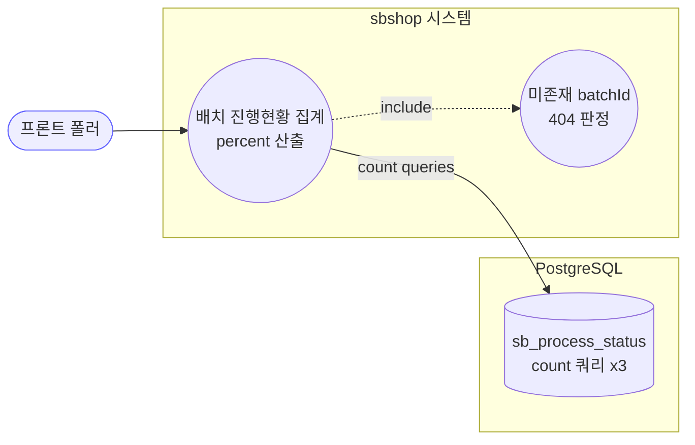

# GET /status/{batchId}/summary — 배치 진행현황 경량 집계(폴링용)

## 1. 개요

| 항목 | 내용 |
|------|------|
| **Method / URL** | `GET /api/v1/products/batch/status/{batchId}/summary` |
| **목적** | 전체 상세 행 대신 count 쿼리만으로 total/success/failed/pending/done/percent 를 산출해 프론트 폴링에 경량 응답을 준다. |
| **핵심 상태전이** | 없음(읽기 전용 조회). `@Transactional(readOnly = true)` |
| **부수효과** | 없음. count 쿼리 3회만 수행. |
| **응답** | `200 OK` + `BatchSummary` / 미존재 batchId(total=0) 는 `404` |

## 2. 호출 체인

```
BatchController.getBatchSummary()                            api/.../controller/BatchController.java:174-178
  ├─ @PathVariable String batchId                            :175-176
  └─ processStatusService.getBatchSummary(batchId)           core/.../process/ProcessStatusService.java:142-154  @Transactional(readOnly=true)
       ├─ repository.countByBatchId(batchId) → total         :144
       │    └─ ProcessStatusRepository.java:28
       ├─ total == 0 → throw ResourceNotFoundException        :147-150 (F-BATCH-SM1)
       ├─ repository.countByBatchIdAndProcessStatus(batchId, SUCCESS) → success  :151
       │    └─ ProcessStatusRepository.java:30
       ├─ repository.countByBatchIdAndProcessStatus(batchId, FAILED) → failed    :152
       └─ BatchSummary.of(batchId, total, success, failed)   :153
            └─ BatchSummary.of(...)                           core/.../process/BatchSummary.java:16-21
                 ├─ done = success + failed                   :17
                 ├─ pending = total - done                    :18
                 └─ percent = total==0 ? 0 : round(done*100/total)  :19
  └─ 예외 매핑: ResourceNotFoundException → 404               api/.../exception/GlobalExceptionHandler.java:28-34
```

**경로 파라미터**

| 파라미터 | 위치 | 타입 | 필수 | 비고 |
|----------|------|------|:---:|------|
| `batchId` | path | String | ✅ | total=0(행 없음)이면 404 |

**응답 스키마(`BatchSummary`, `BatchSummary.java:7-14`)**

| 필드 | 타입 | 산출식 |
|------|------|--------|
| `batchId` | String | 입력값 그대로 |
| `total` | long | countByBatchId |
| `success` | long | count(SUCCESS) |
| `failed` | long | count(FAILED) |
| `pending` | long | total − (success+failed) |
| `done` | long | success + failed |
| `percent` | int | round(done×100/total), total=0이면 0 |

## 3. 유스케이스 다이어그램



## 4. 시퀀스 다이어그램

```mermaid
sequenceDiagram
    autonumber
    actor U as 프론트 폴러
    participant C as BatchController
    participant S as ProcessStatusService
    participant R as ProcessStatusRepository
    participant B as BatchSummary
    participant H as GlobalExceptionHandler
    Note over S: getBatchSummary 는 @Transactional(readOnly=true)

    U->>C: GET /status/{batchId}/summary
    C->>S: getBatchSummary(batchId)
    S->>R: countByBatchId(batchId)
    R-->>S: total
    alt total == 0
        S->>H: throw ResourceNotFoundException
        H-->>U: 404
    else total &gt; 0
        S->>R: countByBatchIdAndProcessStatus(batchId, SUCCESS)
        R-->>S: success
        S->>R: countByBatchIdAndProcessStatus(batchId, FAILED)
        R-->>S: failed
        S->>B: of(batchId, total, success, failed)
        B-->>S: BatchSummary(done, pending, percent)
        S-->>C: BatchSummary
        C-->>U: 200 OK + BatchSummary
    end
```

## 5. 순서도 (플로우차트)


## 6. 상태 전이표

> **상태 전이 없음(조회 전용).** 아래는 입력 조건별 응답 결과 매핑이다.

| 진입 조건 | 응답 | 비고 |
|-----------|------|------|
| batchId 존재 + 완료 전(success=failed=0) | `200` + percent=0 | 폴링 유지 보증 — 404 아님(:147 total>0)  |
| batchId 존재 + 일부 완료 | `200` + percent=round(done×100/total) | done=success+failed(:151-153) |
| batchId 존재 + 전부 완료 | `200` + percent=100 | pending=0 |
| batchId 미존재(total=0) | `404` | 정상 배치는 최소 1행 → total=0=미존재(:147-150) |

## 7. 🔎 발견사항

### BATB-3 · 🔵 NOTE — pending 은 PENDING 행 count 가 아니라 total−done 파생값이라, 비-PENDING·비-terminal 상태가 생기면 의미가 어긋남
- **근거:** `BatchSummary.java:18` `pending = total - done`(done = success + failed). 현재 `ProcessStatusType` 은 PENDING/SUCCESS/FAILED 3값뿐(`ProcessStatusType.java`)이라 `pending == count(PENDING)` 이 성립한다. 그러나 산출 근거가 "PENDING count"가 아니라 "total에서 완료를 뺀 나머지"다.
- **영향:** 현재는 정확. 다만 향후 중간 상태(예: RUNNING/SKIPPED)를 enum 에 추가하면 그 행들이 done 에 안 잡혀 `pending` 에 합산되어 "대기 중" 으로 잘못 표시된다. done/percent 도 함께 왜곡된다.
- **제안:** 상태값 확장 시 pending 을 명시적 count(PENDING) 로 바꾸거나, terminal 집합(done)의 정의를 enum 과 동기화하도록 주석/테스트로 고정.

### BATB-4 · 🟡 SMELL — summary 는 count 쿼리 3회를 개별 발행(단일 GROUP BY 집계로 통합 가능)
- **근거:** `ProcessStatusService.java:144,151,152` 가 `countByBatchId`, `countByBatchIdAndProcessStatus(SUCCESS)`, `countByBatchIdAndProcessStatus(FAILED)` 를 각각 호출해 배치당 폴링 1회에 DB 왕복 3회가 발생한다. 이 엔드포인트는 프론트가 주기적으로 폴링하는 경로다(파일 상단 주석 "폴링용 경량 집계").
- **영향:** 경량화 목적(전 행 대신 count)은 달성했으나 폴링 빈도 × 배치 수만큼 왕복 3배. 다행히 count 쿼리는 인덱스 있으면 저렴하나, 다수 배치 동시 폴링 시 부하 누적 가능.
- **제안:** `select processStatus, count(*) ... where batchId=? group by processStatus` 단일 쿼리로 total/success/failed/pending 을 한 번에 산출하도록 리포지토리 메서드 추가 검토.

## 8. 테스트 커버리지 메모

- 서비스 단위 테스트 존재: `core/.../process/ProcessStatusServiceTest.java`
  - `getBatchSummary_computesAggregate`(:67-81) — total/success/failed → done/pending/percent 산출 검증
  - `getBatchSummary_zeroTotal_throwsNotFound`(:85-91) — total=0 미존재 404 (F-BATCH-SM1)
  - `getBatchSummary_inProgressZeroPercent_returns200`(:95-106) — 진행중(total>0, 0%) 은 404 아님, 폴링 유지 보증
- **비어있는 케이스:** ① percent 반올림 경계(예: done=1,total=3 → 33) 정밀 검증 미확인 ② pending 파생 로직이 PENDING 실제 count 와 일치함을 강제하는 테스트 없음(BATB-3 회귀 방지 부재) ③ 컨트롤러 레벨 200/404 JSON 계약 테스트 미검색.

---
*생성: 2026-07-17 · 근거: 현재 워킹트리*
