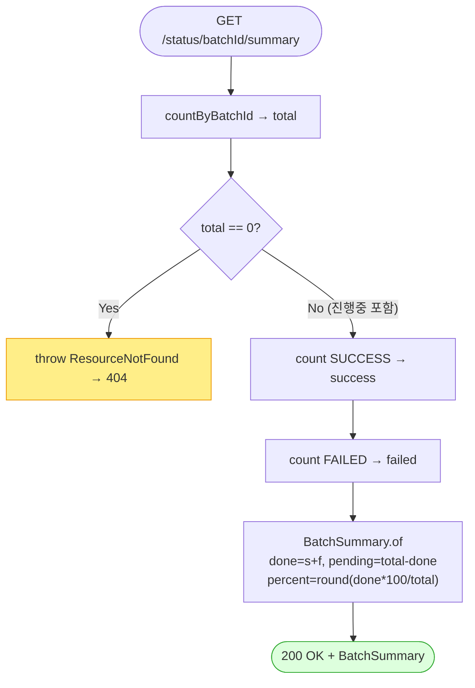

# GET /status/{batchId}/summary — 배치 진행현황 요약(화면 진행바용 가벼운 집계)

## 1. 개요

이 API는 배치 하나가 "지금 몇 %까지 됐는지"를 아주 가볍게 요약해서 알려줍니다. 상품별 상세 목록을 전부 내려주는 대신, "전체 몇 건 / 성공 몇 건 / 실패 몇 건 / 남은 건 / 완료 비율(%)"만 숫자로 계산해 돌려줍니다. 화면이 진행바를 그리려고 몇 초마다 반복해서 물어보는(폴링) 용도라서, 최대한 가볍게 만들었습니다.

| 항목 | 내용(쉬운 설명) |
|------|------|
| **Method / URL** | `GET /api/v1/products/batch/status/{batchId}/summary` — 배치 번호 뒤에 `/summary`를 붙여 부릅니다. |
| **목적** | 상세 줄을 다 가져오지 않고, 개수만 세는 쿼리로 전체/성공/실패/대기/완료건수/진행률(percent)을 계산해 화면 폴링에 가볍게 응답합니다. |
| **핵심 상태전이** | 없음(그냥 읽어오기만 함). 데이터를 바꾸지 않는 "읽기 전용" 조회입니다. `@Transactional(readOnly = true)` |
| **부수효과** | 없음. 개수 세기 쿼리 3번만 돌립니다. |
| **응답** | 정상이면 `200 OK`와 요약(`BatchSummary`). 존재하지 않는 배치(전체 건수 total=0)면 `404`. |

## 2. 호출 체인

아래는 이 요청이 코드 안에서 어떤 순서로 처리되는지를 보여줍니다. 각 줄 오른쪽은 실제 코드 위치입니다.

```
BatchController.getBatchSummary()                            api/.../controller/BatchController.java:174-178
  ├─ @PathVariable String batchId                            :175-176
  └─ processStatusService.getBatchSummary(batchId)           core/.../process/ProcessStatusService.java:142-154  @Transactional(readOnly=true)
       ├─ repository.countByBatchId(batchId) → total         :144
       │    └─ ProcessStatusRepository.java:28
       ├─ total == 0 → throw ResourceNotFoundException        :147-150 (F-BATCH-SM1)
       ├─ repository.countByBatchIdAndProcessStatus(batchId, SUCCESS) → success  :151
       │    └─ ProcessStatusRepository.java:30
       ├─ repository.countByBatchIdAndProcessStatus(batchId, FAILED) → failed    :152
       └─ BatchSummary.of(batchId, total, success, failed)   :153
            └─ BatchSummary.of(...)                           core/.../process/BatchSummary.java:16-21
                 ├─ done = success + failed                   :17
                 ├─ pending = total - done                    :18
                 └─ percent = total==0 ? 0 : round(done*100/total)  :19
  └─ 예외 매핑: ResourceNotFoundException → 404               api/.../exception/GlobalExceptionHandler.java:28-34
```

→ 쉽게 말하면: 입구(BatchController)가 배치 번호를 받아 서비스에 넘깁니다. 서비스는 먼저 그 배치의 전체 줄 수(total)를 셉니다. 0개면 "그런 배치 없음"이라며 404를 냅니다. 있으면 성공 건수와 실패 건수를 각각 세고, 이 세 숫자로 나머지를 계산합니다 — 완료 건수(done)는 성공+실패, 남은 건수(pending)는 전체에서 완료를 뺀 값, 진행률(percent)은 완료÷전체×100을 반올림한 값입니다. 이렇게 계산한 요약을 화면에 돌려줍니다.

**경로 파라미터**

| 파라미터 | 위치 | 타입 | 필수 | 비고(쉬운 설명) |
|----------|------|------|:---:|------|
| `batchId` | path | String | ✅ | 조회할 배치 번호. 줄이 하나도 없으면(total=0) 404. |

**응답 스키마(`BatchSummary`, `BatchSummary.java:7-14`)** — 돌려주는 숫자들의 뜻과 계산식입니다.

| 필드 | 타입 | 산출식(쉬운 설명) |
|------|------|--------|
| `batchId` | String | 물어본 배치 번호 그대로 |
| `total` | long | 전체 건수 (countByBatchId) |
| `success` | long | 성공한 건수 (count(SUCCESS)) |
| `failed` | long | 실패한 건수 (count(FAILED)) |
| `pending` | long | 아직 안 끝난 건수 = 전체 − (성공+실패) |
| `done` | long | 끝난 건수 = 성공 + 실패 |
| `percent` | int | 진행률 = 완료×100÷전체를 반올림, 전체가 0이면 0 |

## 3. 유스케이스 다이어그램

👉 이 그림은 화면 폴러(진행바를 그리려고 반복해서 물어보는 쪽)가 이 기능으로 진행률을 얻고, 없는 배치면 404가 나가는 관계를 보여줍니다.


## 4. 시퀀스 다이어그램

👉 이 그림은 요청 하나가 시간 순서대로 처리되는 과정을 보여줍니다. 먼저 전체 건수를 세서 0이면 404로 빠지고, 아니면 성공·실패 건수를 센 뒤 요약을 계산해 돌려주는 흐름입니다.

```mermaid
sequenceDiagram
    autonumber
    actor U as 프론트 폴러
    participant C as BatchController
    participant S as ProcessStatusService
    participant R as ProcessStatusRepository
    participant B as BatchSummary
    participant H as GlobalExceptionHandler
    Note over S: getBatchSummary 는 @Transactional(readOnly=true)

    U->>C: GET /status/{batchId}/summary
    C->>S: getBatchSummary(batchId)
    S->>R: countByBatchId(batchId)
    R-->>S: total
    alt total == 0
        S->>H: throw ResourceNotFoundException
        H-->>U: 404
    else total &gt; 0
        S->>R: countByBatchIdAndProcessStatus(batchId, SUCCESS)
        R-->>S: success
        S->>R: countByBatchIdAndProcessStatus(batchId, FAILED)
        R-->>S: failed
        S->>B: of(batchId, total, success, failed)
        B-->>S: BatchSummary(done, pending, percent)
        S-->>C: BatchSummary
        C-->>U: 200 OK + BatchSummary
    end
```

## 5. 순서도 (플로우차트)

👉 이 그림은 "전체 건수가 0이면 404, 아니면 성공·실패를 세서 진행률을 계산하고 200을 돌려주는" 판단 흐름을 갈림길로 보여줍니다.



## 6. 상태 전이표

> **상태 전이 없음(조회 전용).** 이 API는 데이터를 바꾸지 않습니다. 아래 표는 "어떤 상황에서 어떤 응답이 나가는지"를 정리한 것입니다.

| 진입 조건(쉬운 설명) | 응답 | 비고 |
|-----------|------|------|
| 배치는 있지만 아직 하나도 안 끝났을 때(성공=실패=0) | `200` + percent=0 | 아직 진행 중이어도 404가 아니라 200 — 화면 폴링이 계속 돌 수 있게 보장(:147 total>0) |
| 배치가 있고 일부만 끝났을 때 | `200` + percent=round(done×100/total) | 완료 건수 = 성공+실패(:151-153) |
| 배치가 있고 전부 끝났을 때 | `200` + percent=100 | 남은 건수(pending)=0 |
| 존재하지 않는 배치(total=0) | `404` | 정상 배치는 최소 1줄이 있으므로, total=0이면 없는 배치로 봄(:147-150) |

## 7. 🔎 발견사항

### BATB-3 · 🔵 NOTE — "남은 건수(pending)"를 실제 대기(PENDING) 줄 수로 세지 않고 "전체−완료"로 계산해서, 새로운 중간 상태가 생기면 뜻이 어긋남
- **무엇이 문제인가:** "아직 안 끝난 건수(pending)"를 실제로 대기(PENDING) 상태인 줄을 세어서 구하지 않고, "전체 건수에서 끝난 건수(성공+실패)를 뺀 나머지"로 계산합니다. 지금은 상태 종류가 대기·성공·실패 세 개뿐이라 "전체−완료 = 대기 건수"가 딱 맞아떨어져서 문제가 없습니다.
- **근거:** `BatchSummary.java:18` `pending = total - done`(done = success + failed). 현재 `ProcessStatusType` 은 PENDING/SUCCESS/FAILED 3값뿐(`ProcessStatusType.java`)이라 `pending == count(PENDING)` 이 성립한다. 그러나 산출 근거가 "PENDING count"가 아니라 "total에서 완료를 뺀 나머지"다.
- **왜 문제인가:** 지금은 정확합니다. 다만 나중에 "실행중(RUNNING)"이나 "건너뜀(SKIPPED)" 같은 새로운 중간 상태를 추가하면, 그 줄들은 "끝난 것(done)"에 안 잡히므로 전부 "남은 건수(pending)"에 뭉뚱그려 더해집니다. 그러면 실제로는 실행 중이거나 건너뛴 것을 "아직 대기 중"으로 잘못 표시하게 되고, 완료 건수와 진행률(percent)까지 함께 틀어집니다.
- **어떻게 고치면 되나:** 상태 종류를 늘릴 때 pending을 실제 대기(PENDING) 줄 수를 세는 방식으로 바꾸거나, "끝난 것으로 치는 상태 집합(done)"의 정의를 상태 종류와 항상 맞추도록 주석·테스트로 고정합니다.

### BATB-4 · 🟡 SMELL — 요약 하나를 만들 때 개수 세기 쿼리를 3번 따로 날림(한 번의 묶음 집계 쿼리로 합칠 수 있음)
- **무엇이 문제인가:** 요약 하나를 계산하려고 개수 세기 쿼리를 세 번 따로 보냅니다 — 전체 개수, 성공 개수, 실패 개수. 즉 화면이 한 번 물어볼 때마다 DB에 3번 왕복합니다. 그런데 이 API는 화면이 진행바를 위해 몇 초마다 계속 반복 호출하는 경로입니다.
- **근거:** `ProcessStatusService.java:144,151,152` 가 `countByBatchId`, `countByBatchIdAndProcessStatus(SUCCESS)`, `countByBatchIdAndProcessStatus(FAILED)` 를 각각 호출해 배치당 폴링 1회에 DB 왕복 3회가 발생한다. 이 엔드포인트는 프론트가 주기적으로 폴링하는 경로다(파일 상단 주석 "폴링용 경량 집계").
- **왜 문제인가:** "상세 목록 대신 개수만 센다"는 가벼움 목표는 이뤘지만, 폴링 횟수 × 배치 수만큼 왕복이 3배가 됩니다. 개수 세기 쿼리는 인덱스가 있으면 저렴한 편이라 다행이지만, 여러 배치를 동시에 폴링하면 부하가 쌓일 수 있습니다.
- **어떻게 고치면 되나:** `select processStatus, count(*) ... where batchId=? group by processStatus` 처럼 상태별 개수를 한 번의 쿼리로 묶어서 전체/성공/실패/대기를 한꺼번에 계산하는 방식을 검토합니다.

## 8. 테스트 커버리지 메모

- 서비스 단위 테스트 존재: `core/.../process/ProcessStatusServiceTest.java` — 이 기능이 제대로 도는지 확인하는 자동 테스트가 이미 있습니다.
  - `getBatchSummary_computesAggregate`(:67-81) — 전체/성공/실패로부터 완료·남은건수·진행률이 제대로 계산되는지 확인
  - `getBatchSummary_zeroTotal_throwsNotFound`(:85-91) — 전체가 0이면 없는 배치로 보고 404가 나는지 확인 (F-BATCH-SM1)
  - `getBatchSummary_inProgressZeroPercent_returns200`(:95-106) — 진행 중(전체>0, 0%)일 때 404가 아니라 200이 나와 폴링이 계속되는지 확인
- **아직 테스트가 없는 부분:** ① 진행률 반올림 경계(예: 완료=1, 전체=3 → 33%)가 정확한지 세밀하게 확인하는 테스트가 없습니다. ② "남은 건수(pending)"가 실제 대기(PENDING) 줄 수와 일치하는지 강제로 확인하는 테스트가 없습니다(BATB-3 재발 방지 장치 부재). ③ 입구(컨트롤러) 단계에서 200/404 응답 JSON 형태를 확인하는 테스트가 안 보입니다.

---
*(쉬운 설명판 · 2026-07-17 재작성)*
*생성: 2026-07-17 · 근거: 현재 워킹트리*
