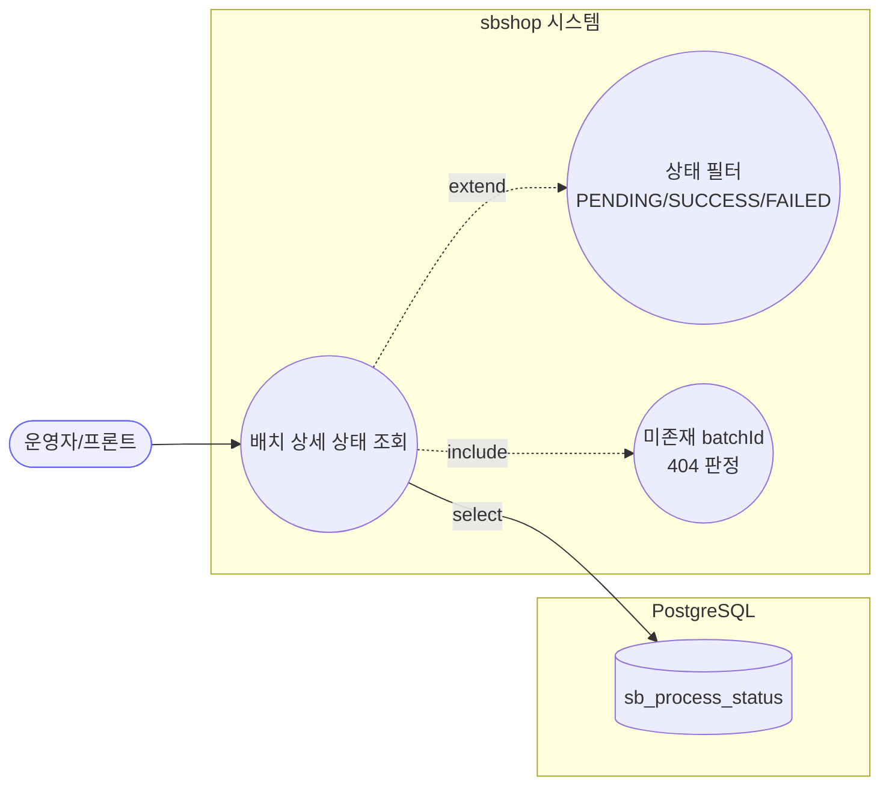

# GET /status/{batchId} — 배치 하나의 상세 진행 상태 조회

## 1. 개요

이 API는 "특정 작업 묶음(배치) 하나가 지금 어떻게 처리되고 있는지"를 상품별로 하나하나 자세히 보여줍니다. 예를 들어 상품 100개를 한꺼번에 마켓에 올리는 작업을 돌렸다면, 그 100개가 각각 성공했는지·실패했는지·아직 대기 중인지를 줄 단위로 보여주는 화면입니다.

| 항목 | 내용(쉬운 설명) |
|------|------|
| **Method / URL** | `GET /api/v1/products/batch/status/{batchId}` (선택 쿼리 `?status=PENDING\|SUCCESS\|FAILED`) — 주소 끝에 배치 번호를 넣어 부르고, 원하면 "성공한 것만" 또는 "실패한 것만" 골라 볼 수 있습니다. |
| **목적** | 특정 배치의 상품별 처리 상태 행을 전부, 최신 것부터 순서대로 돌려줍니다. `status`를 붙이면 그 상태(대기/성공/실패)에 해당하는 줄만 걸러서 보여줍니다(F-BATCH-S3). |
| **핵심 상태전이** | 없음(그냥 읽어오기만 함). 데이터를 바꾸지 않는 "읽기 전용" 조회입니다. `@Transactional(readOnly = true)` |
| **부수효과** | 없음. 데이터베이스에서 읽어오기만 하고 아무것도 고치지 않습니다. |
| **응답** | 정상이면 `200 OK`와 함께 상태 목록(`List<ProcessStatusResponse>`)을 돌려줍니다. 존재하지 않는 배치 번호면 `404`(없는 자원이라는 뜻, ResourceNotFoundException)를 냅니다. |

## 2. 호출 체인

아래는 이 요청이 코드 안에서 어떤 순서로 손을 거쳐 처리되는지를 보여줍니다. 각 줄 오른쪽은 실제 코드 위치(파일:줄번호)입니다.

```
BatchController.getBatchStatus()                              api/.../controller/BatchController.java:162-171
  ├─ @PathVariable String batchId                            :164
  ├─ @RequestParam(name="status", required=false) ProcessStatusType status  :165-166 (enum 바인딩)
  └─ processStatusService.getBatchStatus(batchId, status)    core/.../process/ProcessStatusService.java:124-140  @Transactional(readOnly=true)
       ├─ status == null 분기:                               :125-133
       │    ├─ repository.findByBatchIdOrderByStartedAtDesc(batchId)  :127
       │    │    └─ ProcessStatusRepository.java:19
       │    └─ isEmpty() → throw ResourceNotFoundException   :128-131
       └─ status != null 분기(필터):                          :134-139
            ├─ repository.countByBatchId(batchId) == 0 → throw ResourceNotFoundException  :135-138
            │    └─ ProcessStatusRepository.java:28
            └─ repository.findByBatchIdAndProcessStatusOrderByStartedAtDesc(batchId, status)  :139
                 └─ ProcessStatusRepository.java:25-26
  └─ .map(ProcessStatusResponse::from)                       BatchController.java:168
       └─ ProcessStatusResponse.from(ProcessStatus)          api/.../dto/batch/ProcessStatusResponse.java:28-43
  └─ 예외 매핑: ResourceNotFoundException → 404               api/.../exception/GlobalExceptionHandler.java:28-34
  └─ 예외 매핑: 잘못된 status 값(enum 바인딩 실패) → 400        api/.../exception/GlobalExceptionHandler.java:19-25
```

→ 쉽게 말하면: 요청을 받는 입구(BatchController)가 배치 번호와 "어떤 상태만 볼지(status)" 값을 받아 서비스(ProcessStatusService)에 넘깁니다. 서비스는 두 갈래로 나뉩니다. ① status를 안 넣었으면 그 배치의 모든 줄을 가져오고, 하나도 없으면 "없는 배치"라며 404를 냅니다. ② status를 넣었으면 먼저 "그 배치에 줄이 몇 개나 있나"를 세어 0개면 404를 내고, 아니면 그 상태에 맞는 줄만 걸러서 가져옵니다. 마지막으로 가져온 결과를 화면용 형태(ProcessStatusResponse)로 바꿔 돌려줍니다. status에 이상한 값(예: 존재하지 않는 상태 이름)을 넣으면 입구에서 걸러 400을 냅니다.

**경로/쿼리 파라미터**

| 파라미터 | 위치 | 타입 | 필수 | 비고(쉬운 설명) |
|----------|------|------|:---:|------|
| `batchId` | path | String | ✅ | 조회할 배치 번호. 그런 배치가 없으면 404. |
| `status` | query | `ProcessStatusType` | ✕ | 대기(PENDING)/성공(SUCCESS)/실패(FAILED) 중 하나만 골라 보기. 정해진 값 외의 글자를 넣으면 400(MethodArgumentTypeMismatch). |

## 3. 유스케이스 다이어그램

👉 이 그림은 운영자(또는 화면)가 이 기능으로 무엇을 할 수 있는지 — 배치 상세를 조회하고, 상태별로 걸러 보고, 없는 배치면 404가 나가는 관계 — 를 한눈에 보여줍니다.



## 4. 시퀀스 다이어그램

👉 이 그림은 요청 하나가 시간 순서대로 입구→서비스→DB를 오가며 처리되는 과정을 보여줍니다. status를 넣었을 때와 안 넣었을 때 길이 갈리고, 결과가 없으면 중간에 404로 빠지는 흐름입니다.

```mermaid
sequenceDiagram
    autonumber
    actor U as 운영자/프론트
    participant C as BatchController
    participant S as ProcessStatusService
    participant R as ProcessStatusRepository
    participant M as ProcessStatusResponse
    participant H as GlobalExceptionHandler
    Note over S: getBatchStatus 는 @Transactional(readOnly=true)

    U->>C: GET /status/{batchId}?status=
    C->>S: getBatchStatus(batchId, status)
    alt status == null (전 행)
        S->>R: findByBatchIdOrderByStartedAtDesc(batchId)
        R-->>S: List&lt;ProcessStatus&gt;
        alt 결과 비어있음
            S->>H: throw ResourceNotFoundException
            H-->>U: 404
        end
    else status != null (필터)
        S->>R: countByBatchId(batchId)
        R-->>S: count
        alt count == 0
            S->>H: throw ResourceNotFoundException
            H-->>U: 404
        else count &gt; 0
            S->>R: findByBatchIdAndProcessStatusOrderByStartedAtDesc(batchId, status)
            R-->>S: List&lt;ProcessStatus&gt; (필터, 공집합 가능)
        end
    end
    S-->>C: List&lt;ProcessStatus&gt;
    C->>M: map(from)
    M-->>C: List&lt;ProcessStatusResponse&gt;
    C-->>U: 200 OK + List&lt;ProcessStatusResponse&gt;
```

## 5. 순서도 (플로우차트)

👉 이 그림은 "무슨 조건이면 어디로 가는지"를 갈림길 형태로 보여줍니다. status 값이 이상하면 400, 배치에 줄이 하나도 없으면 404, 정상이면 200으로 목록을 돌려주는 판단 흐름입니다.


## 6. 상태 전이표

> **상태 전이 없음(조회 전용).** 이 API는 데이터를 바꾸지 않습니다. 아래 표는 "어떤 조건으로 들어오면 어떤 응답이 나가는지"를 정리한 것입니다.

| 진입 조건(쉬운 설명) | 응답 | 비고 |
|-----------|------|------|
| 배치가 존재하고 상태 필터를 안 걸었을 때 | `200` + 전체 줄(최신 것부터) | 원래 동작을 그대로 지킴(:125-132) |
| 배치가 존재하고 성공/실패/대기 중 하나로 걸렀을 때 | `200` + 해당 줄만(맞는 게 없으면 빈 목록) | 줄이 있는지 먼저 센 뒤 걸러냄(:134-139) |
| 존재하지 않는 배치를 상태 필터 없이 조회 | `404` | 가져온 결과가 아예 없음(:128-131) |
| 존재하지 않는 배치를 상태 필터를 걸어 조회 | `404` | 줄 개수를 세보니 0개(:135-138) |
| 상태 값에 엉뚱한 글자를 넣음(예: `?status=DONE`) | `400` | 정해진 상태 이름이 아니라 입구에서 거부(:19-25) |

## 7. 🔎 발견사항

### BATB-1 · 🟡 SMELL — 배치가 없는지 판단하는 방법이 상태 필터 유무에 따라 두 갈래로 갈라져 있음(필터 없을 땐 조회 결과로, 필터 있을 땐 별도 개수 세기 쿼리로)
- **무엇이 문제인가:** "그런 배치가 존재하는가"를 확인하는 방법이 두 곳에서 서로 다르게 짜여 있습니다. 상태 필터를 안 걸었을 때는 `findByBatchIdOrderByStartedAtDesc`로 가져온 결과가 비었는지(`isEmpty()`)로 404를 판단하고, 상태 필터를 걸었을 때는 `countByBatchId`로 개수를 한 번 더 세서 404를 판단한 뒤 다시 걸러 조회합니다. 즉 필터를 걸면 DB에 쿼리를 두 번(개수 세기 + 실제 조회) 보냅니다.
- **근거:** `ProcessStatusService.java:125-139`. status==null 이면 `findByBatchIdOrderByStartedAtDesc` 결과의 `isEmpty()` 로 404를 판정하고, status!=null 이면 별도 `countByBatchId` 쿼리를 한 번 더 쏘아 404를 판정한 뒤 필터 조회를 한다. 필터 경로는 항상 쿼리 2회(count + select)다.
- **왜 문제인가:** 동작 자체는 정확합니다("필터 결과가 비었을 때"와 "배치가 아예 없을 때"를 구분하려고 일부러 이렇게 만든 설계입니다). 다만 필터 조회를 할 때마다 개수 세기 쿼리가 하나 더 붙습니다. 이 상세 조회는 자주 반복 호출하는 화면이 아니라서 성능 영향은 크지 않지만, "배치가 없는지 판단하는 책임"이 두 군데로 나뉘어 있어 나중에 코드를 고칠 때 한쪽만 고치고 다른 쪽을 빠뜨릴 위험이 있습니다.
- **어떻게 고치면 되나:** 필터 경로에서도 실제 조회 결과가 비었을 때만 개수를 다시 세도록(즉 결과가 없을 때만 추가 쿼리) 미루거나, "배치 존재 여부 판단"을 하나의 공용 함수로 빼서 한 곳에서만 관리하도록 합니다.

### BATB-2 · 🔵 NOTE — 삭제 표시용 상태값(RecordStatus)을 응답의 `status` 필드로 그대로 내보내고, 조회 쿼리는 삭제된 행을 걸러내지 않음
- **무엇이 문제인가:** 이 시스템에는 이름이 비슷한 상태값이 두 개 있습니다. 하나는 "이 상품 처리가 성공/실패/대기 중"이라는 처리 상태(`processStatus`)이고, 다른 하나는 "이 데이터 줄이 살아있음/보관됨/삭제됨"이라는 데이터 관리용 상태(RecordStatus)입니다. 그런데 응답을 만들 때 후자(RecordStatus)를 그대로 `status`라는 필드 이름으로 내보내고 있어서, 앞의 처리 상태와 헷갈릴 수 있습니다. 게다가 조회 쿼리가 "삭제됨(DELETED)" 표시된 줄을 걸러내지 않습니다.
- **근거:** `ProcessStatusResponse.java:31` 이 `s.getStatus().name()`(BaseEntity.status = RecordStatus ACTIVE/ARCHIVED/DELETED, `BaseEntity.java:23-24`)을 응답 `status` 필드로 담는다. 이는 배치 처리상태(`processStatus`)와 이름이 유사해 혼동 소지가 있다. 또한 `findByBatchIdOrderByStartedAtDesc`/`findByBatchIdAndProcessStatus...`(`ProcessStatusRepository.java:19,25`) 는 RecordStatus=DELETED 행을 제외하지 않는다.
- **왜 문제인가:** 지금은 이 처리상태 데이터가 소프트 삭제(삭제 표시만 하고 실제로는 남겨두기)되는 경로가 없어서 전부 "살아있음(ACTIVE)"이라 실제 문제는 없습니다. 다만 응답에 "처리상태"와 "레코드상태" 두 필드가 나란히 나가서 화면이나 이를 받아쓰는 쪽에서 혼동할 수 있습니다.
- **어떻게 고치면 되나:** 두 필드의 의미 차이를 문서로 명확히 남깁니다(주석은 이미 있음). 나중에 이 처리상태를 소프트 삭제하는 기능이 생기면, 조회 쿼리에서 삭제된 줄을 걸러낼지 다시 검토합니다.

## 8. 테스트 커버리지 메모

- 서비스 단위 테스트 존재: `core/.../process/ProcessStatusServiceTest.java` — 이 기능이 제대로 도는지 확인하는 자동 테스트가 이미 있습니다.
  - `getBatchStatus_returnsStatuses`(:40-52) — 기본 조회가 잘 되는지 확인
  - `getBatchStatus_unknownBatchId_throwsNotFound`(:55-63) — 필터 없이 없는 배치를 조회하면 404가 나는지 확인 (F-BATCH-S2)
  - `getBatchStatus_withStatusFilter_returnsOnlyMatching`(:166-179) — 상태로 걸렀을 때 해당하는 것만 나오는지 확인 (F-BATCH-S3)
  - `getBatchStatus_nullFilter_returnsAllLikeBefore`(:182-193) — 필터를 안 걸면 예전처럼 전부 나오는지 확인
  - `getBatchStatus_withFilter_unknownBatchId_throwsNotFound`(:196-205) — 필터를 걸고 없는 배치를 조회하면 404가 나는지 확인
  - `getBatchStatus_withFilter_existingBatchNoMatch_returnsEmpty`(:208-219) — 배치는 있지만 맞는 게 없으면 404가 아니라 빈 목록으로 200이 나오는지 확인
- **아직 테스트가 없는 부분:** ① 입구(컨트롤러) 단계에서 `?status=`에 잘못된 값을 넣었을 때 400이 제대로 나가는지 직접 확인하는 테스트가 안 보입니다. ② 응답을 만드는 `ProcessStatusResponse.from`에 일부 값이 비어(null) 들어올 때(작업종류/단계/처리상태가 null) 잘 처리되는지 확인하는 테스트가 안 보입니다(`ResponseDtoContractTest`는 있으나 이 경우가 포함됐는지는 따로 확인이 필요).

---
*(쉬운 설명판 · 2026-07-17 재작성)*
*생성: 2026-07-17 · 근거: 현재 워킹트리*
