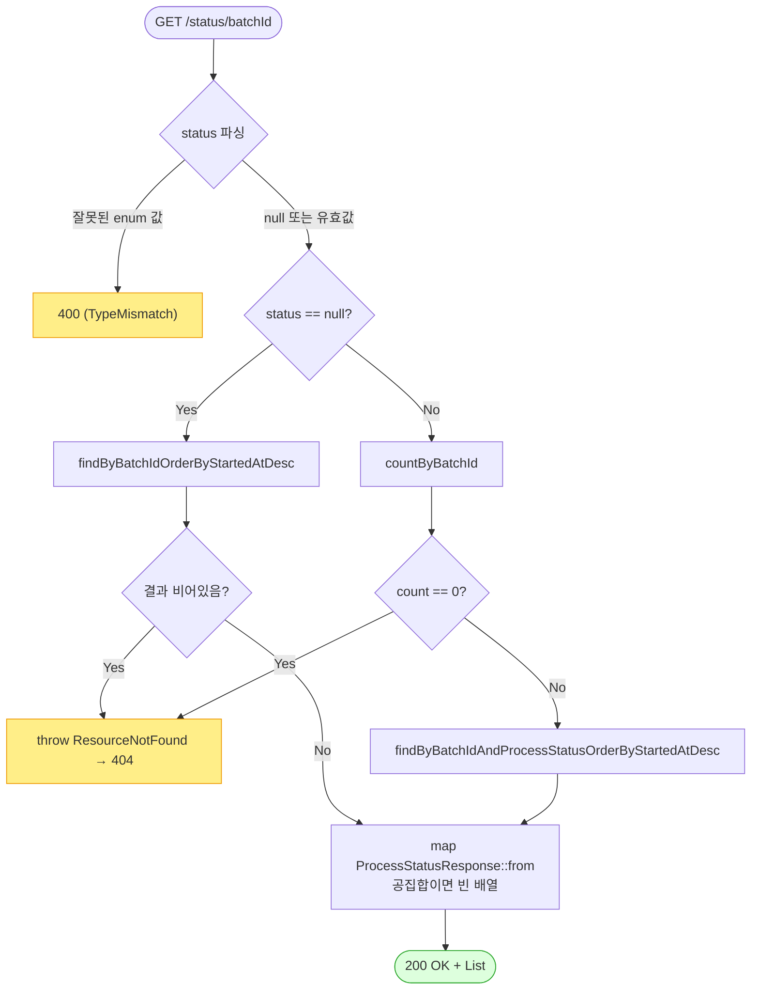

# GET /status/{batchId} — 배치 상세 상태 조회

## 1. 개요

| 항목 | 내용 |
|------|------|
| **Method / URL** | `GET /api/v1/products/batch/status/{batchId}` (선택 쿼리 `?status=PENDING\|SUCCESS\|FAILED`) |
| **목적** | 특정 배치의 상품별 처리 상태 행 전체를 최신순으로 반환한다. `status` 파라미터가 있으면 해당 상태 행만 필터한다(F-BATCH-S3). |
| **핵심 상태전이** | 없음(읽기 전용 조회). `@Transactional(readOnly = true)` |
| **부수효과** | 없음. DB 조회만 수행. |
| **응답** | `200 OK` + `List<ProcessStatusResponse>` / 미존재 batchId 는 `404`(ResourceNotFoundException) |

## 2. 호출 체인

```
BatchController.getBatchStatus()                              api/.../controller/BatchController.java:162-171
  ├─ @PathVariable String batchId                            :164
  ├─ @RequestParam(name="status", required=false) ProcessStatusType status  :165-166 (enum 바인딩)
  └─ processStatusService.getBatchStatus(batchId, status)    core/.../process/ProcessStatusService.java:124-140  @Transactional(readOnly=true)
       ├─ status == null 분기:                               :125-133
       │    ├─ repository.findByBatchIdOrderByStartedAtDesc(batchId)  :127
       │    │    └─ ProcessStatusRepository.java:19
       │    └─ isEmpty() → throw ResourceNotFoundException   :128-131
       └─ status != null 분기(필터):                          :134-139
            ├─ repository.countByBatchId(batchId) == 0 → throw ResourceNotFoundException  :135-138
            │    └─ ProcessStatusRepository.java:28
            └─ repository.findByBatchIdAndProcessStatusOrderByStartedAtDesc(batchId, status)  :139
                 └─ ProcessStatusRepository.java:25-26
  └─ .map(ProcessStatusResponse::from)                       BatchController.java:168
       └─ ProcessStatusResponse.from(ProcessStatus)          api/.../dto/batch/ProcessStatusResponse.java:28-43
  └─ 예외 매핑: ResourceNotFoundException → 404               api/.../exception/GlobalExceptionHandler.java:28-34
  └─ 예외 매핑: 잘못된 status 값(enum 바인딩 실패) → 400        api/.../exception/GlobalExceptionHandler.java:19-25
```

**경로/쿼리 파라미터**

| 파라미터 | 위치 | 타입 | 필수 | 비고 |
|----------|------|------|:---:|------|
| `batchId` | path | String | ✅ | 미존재 시 404 |
| `status` | query | `ProcessStatusType` | ✕ | PENDING/SUCCESS/FAILED. 잘못된 값 → 400(MethodArgumentTypeMismatch) |

## 3. 유스케이스 다이어그램


## 4. 시퀀스 다이어그램

```mermaid
sequenceDiagram
    autonumber
    actor U as 운영자/프론트
    participant C as BatchController
    participant S as ProcessStatusService
    participant R as ProcessStatusRepository
    participant M as ProcessStatusResponse
    participant H as GlobalExceptionHandler
    Note over S: getBatchStatus 는 @Transactional(readOnly=true)

    U->>C: GET /status/{batchId}?status=
    C->>S: getBatchStatus(batchId, status)
    alt status == null (전 행)
        S->>R: findByBatchIdOrderByStartedAtDesc(batchId)
        R-->>S: List&lt;ProcessStatus&gt;
        alt 결과 비어있음
            S->>H: throw ResourceNotFoundException
            H-->>U: 404
        end
    else status != null (필터)
        S->>R: countByBatchId(batchId)
        R-->>S: count
        alt count == 0
            S->>H: throw ResourceNotFoundException
            H-->>U: 404
        else count &gt; 0
            S->>R: findByBatchIdAndProcessStatusOrderByStartedAtDesc(batchId, status)
            R-->>S: List&lt;ProcessStatus&gt; (필터, 공집합 가능)
        end
    end
    S-->>C: List&lt;ProcessStatus&gt;
    C->>M: map(from)
    M-->>C: List&lt;ProcessStatusResponse&gt;
    C-->>U: 200 OK + List&lt;ProcessStatusResponse&gt;
```

## 5. 순서도 (플로우차트)



## 6. 상태 전이표

> **상태 전이 없음(조회 전용).** 아래는 입력 조건별 응답 결과 매핑이다.

| 진입 조건 | 응답 | 비고 |
|-----------|------|------|
| batchId 존재 + status=null | `200` + 전 행(최신순) | 기존 비파괴 계약(:125-132) |
| batchId 존재 + status=SUCCESS/FAILED/PENDING | `200` + 필터 행(공집합이면 빈 배열) | count>0 확인 후 필터(:134-139) |
| batchId 미존재 + status=null | `404` | findByBatchId... 결과 empty(:128-131) |
| batchId 미존재 + status 지정 | `404` | countByBatchId==0(:135-138) |
| 잘못된 status 값(예: `?status=DONE`) | `400` | enum 바인딩 실패 → MethodArgumentTypeMismatch(:19-25) |

## 7. 🔎 발견사항

### BATB-1 · 🟡 SMELL — 미존재 판정 경로가 status 유무에 따라 이원화(비필터는 조회 결과, 필터는 별도 count 쿼리)
- **근거:** `ProcessStatusService.java:125-139`. status==null 이면 `findByBatchIdOrderByStartedAtDesc` 결과의 `isEmpty()` 로 404를 판정하고, status!=null 이면 별도 `countByBatchId` 쿼리를 한 번 더 쏘아 404를 판정한 뒤 필터 조회를 한다. 필터 경로는 항상 쿼리 2회(count + select)다.
- **영향:** 동작은 정확하나(필터 공집합과 미존재 구분을 위해 의도된 설계) 필터 조회마다 count 쿼리가 추가된다. 상세 조회는 폴링용이 아니라 빈도가 낮아 성능 영향은 경미하나, "미존재 판정" 책임이 두 경로에 분산돼 있어 유지보수 시 한쪽만 고칠 위험이 있다.
- **제안:** 필터 경로에서도 select 결과가 비었을 때만 count로 재확인하도록(공집합일 때만 추가 쿼리) 지연 판정하거나, 미존재 판정을 단일 헬퍼로 추출.

### BATB-2 · 🔵 NOTE — RecordStatus(소프트 삭제 status) 를 응답 `status` 필드로 그대로 노출하며, 조회 쿼리는 RecordStatus 를 필터하지 않음
- **근거:** `ProcessStatusResponse.java:31` 이 `s.getStatus().name()`(BaseEntity.status = RecordStatus ACTIVE/ARCHIVED/DELETED, `BaseEntity.java:23-24`)을 응답 `status` 필드로 담는다. 이는 배치 처리상태(`processStatus`)와 이름이 유사해 혼동 소지가 있다. 또한 `findByBatchIdOrderByStartedAtDesc`/`findByBatchIdAndProcessStatus...`(`ProcessStatusRepository.java:19,25`) 는 RecordStatus=DELETED 행을 제외하지 않는다.
- **영향:** ProcessStatus 는 소프트 삭제되는 경로가 현재 없어 실질 문제는 없으나(전부 ACTIVE), 응답 계약에 처리상태(`processStatus`)와 레코드상태(`status`) 두 필드가 나란히 노출돼 프론트/소비자가 혼동할 수 있다.
- **제안:** DTO 필드명 문서화(주석은 이미 있음). 향후 ProcessStatus 소프트삭제 도입 시 조회 쿼리 RecordStatus 필터 여부 재검토.

## 8. 테스트 커버리지 메모

- 서비스 단위 테스트 존재: `core/.../process/ProcessStatusServiceTest.java`
  - `getBatchStatus_returnsStatuses`(:40-52) — 기본 조회
  - `getBatchStatus_unknownBatchId_throwsNotFound`(:55-63) — status=null 미존재 404 (F-BATCH-S2)
  - `getBatchStatus_withStatusFilter_returnsOnlyMatching`(:166-179) — status 필터 (F-BATCH-S3)
  - `getBatchStatus_nullFilter_returnsAllLikeBefore`(:182-193) — null 필터 비파괴
  - `getBatchStatus_withFilter_unknownBatchId_throwsNotFound`(:196-205) — 필터 경로 미존재 404
  - `getBatchStatus_withFilter_existingBatchNoMatch_returnsEmpty`(:208-219) — 필터 공집합 200(404 아님)
- **비어있는 케이스:** ① 컨트롤러 레벨(@WebMvcTest)에서 잘못된 `?status=` 값 → 400 매핑을 직접 검증하는 테스트 미검색 ② `ProcessStatusResponse.from` 의 null enum(jobType/step/processStatus null) 매핑 계약 검증 미검색(`ResponseDtoContractTest` 존재하나 해당 케이스 포함 여부 별도 확인 필요).

---
*생성: 2026-07-17 · 근거: 현재 워킹트리*
