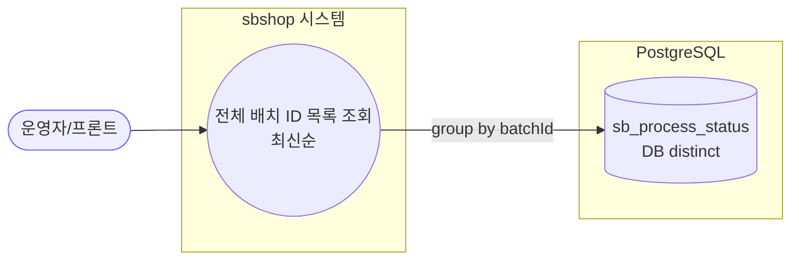
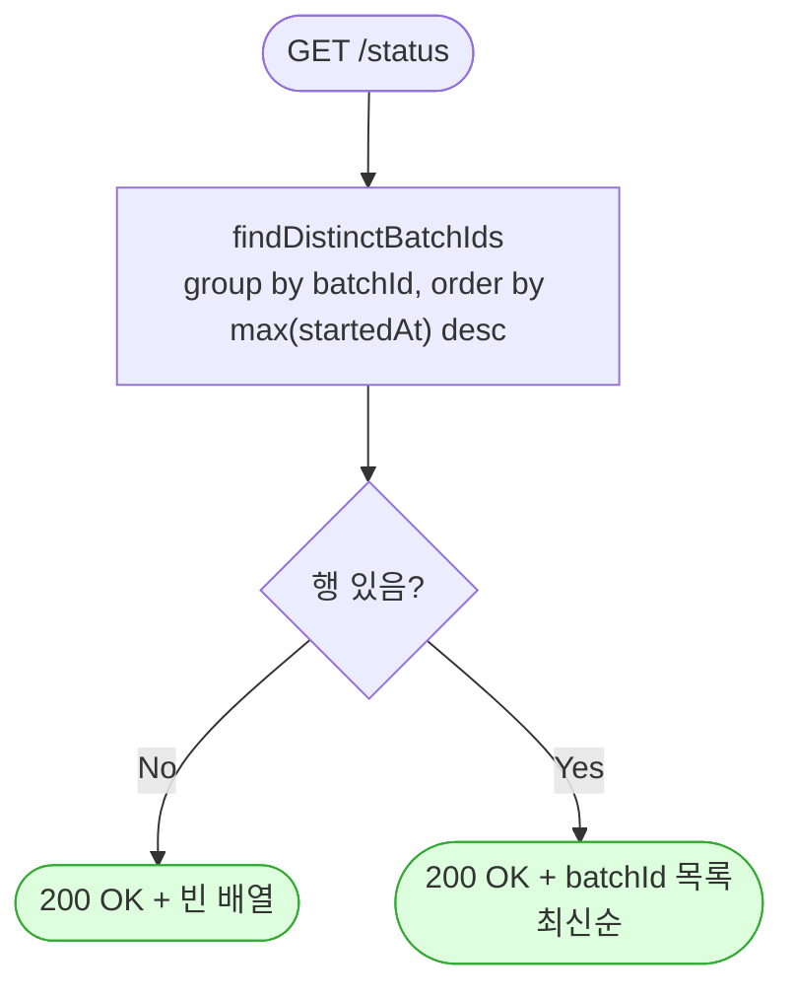

# GET /status — 전체 배치 ID 목록 조회

## 1. 개요

| 항목 | 내용 |
|------|------|
| **Method / URL** | `GET /api/v1/products/batch/status` (파라미터 없음) |
| **목적** | 존재하는 모든 배치의 batchId 를 최신순(각 batchId 최대 startedAt 내림차순)으로 반환한다. |
| **핵심 상태전이** | 없음(읽기 전용 조회). 서비스 메서드에 트랜잭션 애노테이션 없음 |
| **부수효과** | 없음. DB distinct 쿼리 1회. |
| **응답** | `200 OK` + `List<String>`(배치 없으면 빈 배열) |

## 2. 호출 체인

```
BatchController.getAllBatchIds()                             api/.../controller/BatchController.java:180-183
  └─ processStatusService.getAllBatchIds()                  core/.../process/ProcessStatusService.java:156-160  @Transactional(readOnly=true)
       └─ repository.findDistinctBatchIds()                 :159
            └─ ProcessStatusRepository.findDistinctBatchIds()  ProcessStatusRepository.java:16-17
                 └─ @Query "select p.batchId from ProcessStatus p group by p.batchId order by max(p.startedAt) desc"
  └─ ResponseEntity.ok(List<String>)                        BatchController.java:182
```

**파라미터:** 없음.

**응답:** `List<String>` — batchId 문자열 목록. 배치가 하나도 없으면 빈 배열 `[]`(200).

## 3. 유스케이스 다이어그램



## 4. 시퀀스 다이어그램

```mermaid
sequenceDiagram
    autonumber
    actor U as 운영자/프론트
    participant C as BatchController
    participant S as ProcessStatusService
    participant R as ProcessStatusRepository
    Note over S: getAllBatchIds 는 @Transactional(readOnly=true)

    U->>C: GET /status
    C->>S: getAllBatchIds()
    S->>R: findDistinctBatchIds()
    Note over R: group by batchId<br/>order by max(startedAt) desc
    R-->>S: List&lt;String&gt; (없으면 빈 목록)
    S-->>C: List&lt;String&gt;
    C-->>U: 200 OK + List&lt;String&gt;
```

## 5. 순서도 (플로우차트)



## 6. 상태 전이표

> **상태 전이 없음(조회 전용).** 부수효과·상태 가드 없음.

| 진입 조건 | 응답 | 비고 |
|-----------|------|------|
| 배치 존재 | `200` + batchId 목록(최신순) | max(startedAt) desc 정렬 |
| 배치 없음 | `200` + `[]` | 404 던지지 않음(목록 조회 계약) |

## 7. 🔎 발견사항

### BATB-5 · 🔵 NOTE — 페이징·상한 없이 전체 배치 ID 를 반환(이력 누적 시 목록 무한 증가)
- **근거:** `ProcessStatusService.java:159` → `findDistinctBatchIds()`(`ProcessStatusRepository.java:16-17`)는 조건·LIMIT 없이 존재하는 모든 distinct batchId 를 반환한다. 주석(:158)은 과거 "전 행 findAll 후 메모리 distinct"의 OOM 을 DB distinct 로 해소했다고 명시하나, 반환 목록 자체의 상한은 없다.
- **영향:** batchId 는 배치 실행마다 신규 생성(`ProcessStatusService.java:52`)되어 무한 누적된다. 배치 이력이 수만 건 쌓이면 응답 목록이 매우 커지고, 프론트가 이 목록 전체를 소비하는 경우 렌더/전송 비용 증가. row 를 정리하는 보존정책(retention)이 없으면 sb_process_status 도 무한 성장.
- **제안:** 최근 N개 제한(LIMIT) 또는 페이징 파라미터 추가, 그리고 오래된 ProcessStatus 행 보존정책(TTL/아카이브) 도입 검토.

## 8. 테스트 커버리지 메모

- 서비스 단위 테스트 존재: `core/.../process/ProcessStatusServiceTest.java`
  - `getAllBatchIds_usesDistinctQuery_notFindAll`(:141-150) — findDistinctBatchIds 사용, findAll 미호출 검증 (F-BATCH-ST1 OOM 방지)
  - `getAllBatchIds_preservesLatestFirstOrder`(:154-163) — 리포지토리 최신순 정렬 보존 검증 (F-BATCH-ST2)
- **비어있는 케이스:** ① 배치가 하나도 없을 때 빈 배열 200 반환 계약 검증 미검색 ② `@Query` 의 `group by ... order by max(startedAt) desc` 실제 정렬을 검증하는 리포지토리(@DataJpaTest) 통합 테스트 미검색(서비스 테스트는 리포지토리를 mock 하므로 쿼리 정확성은 미검증).

---
*생성: 2026-07-17 · 근거: 현재 워킹트리*
