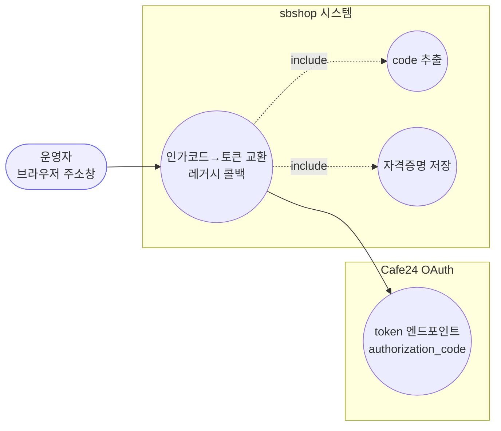
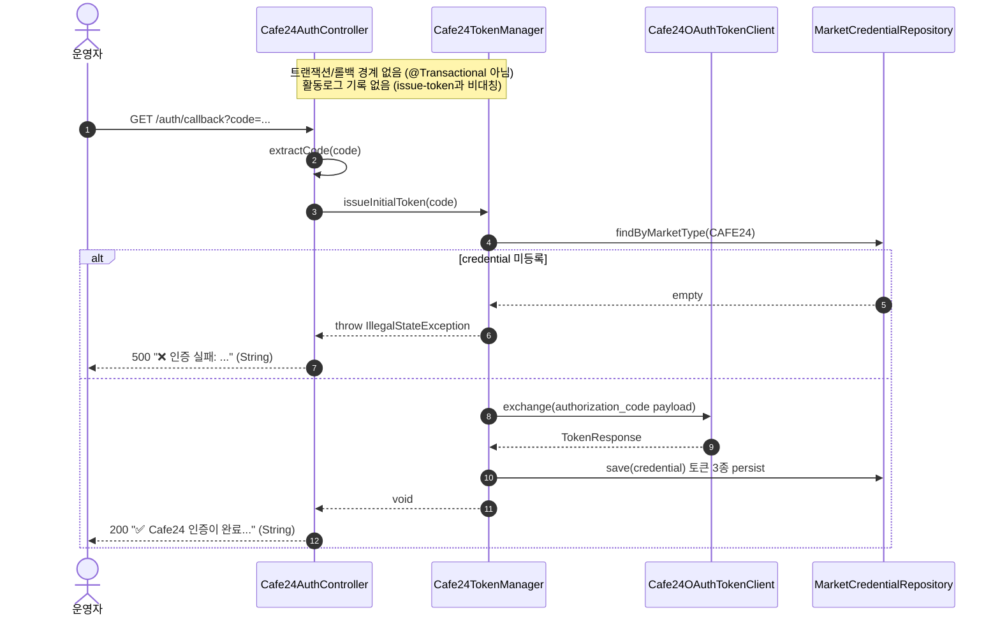

# GET /auth/callback — (레거시) 인가코드 콜백

## 1. 개요

| 항목 | 내용 |
|------|------|
| **Method / URL** | `GET /api/admin/sync/cafe24/auth/callback?code=...` |
| **목적** | (레거시) 브라우저 주소창 직접 입력용 콜백. Cafe24 리다이렉트의 `code` 파라미터로 리프레시 토큰을 발급·저장한다. 신규 UI는 `POST /issue-token` 사용. |
| **핵심 상태전이** | 인증 코드 → `MarketCredential`(CAFE24)의 accessToken·refreshToken·tokenExpiresAt 저장. |
| **부수효과** | Cafe24 OAuth 토큰 교환 1회 + `MarketCredential` 저장. **활동로그 기록 없음**(issue-token과 비대칭 — 의도된 설계). |
| **응답** | 성공 `200 + 안내 문자열`(String), 실패 `500 + "❌ 인증 실패: ..." 문자열`. |

## 2. 호출 체인

```
Cafe24AuthController.handleCafe24AuthCode(@RequestParam code)   api/.../controller/Cafe24AuthController.java:198-208
  ├─ log.info("카페24 인증 코드 수신 완료")                    Cafe24AuthController.java:201
  ├─ exchangeAuthorizationCode(code)                           Cafe24AuthController.java:203 / 121-123
  │     └─ extractCode(rawCode)                                Cafe24AuthController.java:122 / 178-193
  │     └─ cafe24TokenManager.issueInitialToken(code)          infrastructure/.../cafe24/Cafe24TokenManager.java:132-144  (@Transactional 아님)
  │           ├─ getCredential() → null 이면 IllegalStateException  Cafe24TokenManager.java:133-136
  │           ├─ tokenClient.exchange(clientId, accessKey, secretKey, payload)  Cafe24TokenManager.java:140-141
  │           └─ persist(credential, resp)                     Cafe24TokenManager.java:102-110 (marketCredentialRepository.save)
  ├─ (성공) 200 + "✅ Cafe24 인증이 완료되었습니다..." (String)  Cafe24AuthController.java:204
  └─ (예외) 500 + "❌ 인증 실패: " + e.getMessage() (String)     Cafe24AuthController.java:205-207
```

**요청 파라미터**

| 파라미터 | 타입 | 필수 | 비고 |
|----------|------|------|------|
| `code` | String (`@RequestParam("code")`) | 필수 | 미제공 시 Spring이 `MissingServletRequestParameterException` 발생. `code=...` 포함 URL도 `extractCode`가 처리. |

## 3. 유스케이스 다이어그램



## 4. 시퀀스 다이어그램



## 5. 순서도(플로우차트)


## 6. 상태 전이표

| 진입 상태 | 트리거 | 허용 | 결과 상태 | 부수효과 | HTTP |
|-----------|--------|------|-----------|----------|------|
| 미인증/재인증 필요 | 유효 code(파라미터) | O | 인증됨 (토큰 3종 저장) | OAuth 교환 + `MarketCredential.save`. **활동로그 없음** | 200 |
| 임의 상태 | code 파라미터 누락 | X | 변경 없음 | 없음(Spring이 핸들러 진입 전 거부) | 400 |
| credential 미등록 | 유효 code | X | 변경 없음 | 없음 | 500 |
| 임의 상태 | OAuth 교환 실패(만료 code 등) | X | 변경 없음 | 없음 | 500 |
| 임의 상태 | 빈 문자열 code(`?code=`) | 조건부 | 변경 없음(교환 실패로 귀결) | OAuth 교환 시도 후 실패 | 500 |

## 7. 🔎 발견사항

- **[🟠 GAP] CAFE-6 — 콜백에는 issue-token의 blank-code 가드가 없어 빈 code로 무의미한 교환 시도**
  - 근거: `POST /issue-token`은 `code == null || code.isBlank()` 이면 400으로 조기 반환한다(`Cafe24AuthController.java:97-99`). 반면 `handleCafe24AuthCode`(L198-208)는 이 가드 없이 곧장 `exchangeAuthorizationCode`로 진행한다. `@RequestParam("code")`는 파라미터 자체가 없을 때만 400을 내므로, `?code=`(빈 값)이나 공백은 그대로 통과해 `issueInitialToken("")`까지 도달한다.
  - 영향: 빈/공백 code로 불필요한 Cafe24 OAuth 교환을 호출하고, 실패 메시지를 500으로 사용자에게 노출한다. 정상 상태(입력 누락)를 400 대신 500으로 표시하는 비일관.
  - 제안: 콜백에도 동일한 blank-code 가드를 추가(400 또는 명확한 안내), 또는 두 엔드포인트가 공유하는 `exchangeAuthorizationCode`에서 추출 후 blank이면 `IllegalArgumentException`을 던져 `GlobalExceptionHandler.handleIllegalArgument`(GlobalExceptionHandler.java:44-50)로 400 처리되게 한다.

- **[🔵 NOTE] CAFE-7 — 예외 메시지를 응답 본문에 그대로 노출**
  - 근거: 실패 시 `"❌ 인증 실패: " + e.getMessage()`(`Cafe24AuthController.java:206`)를 응답 본문으로 반환한다. `issue-token`도 유사하게 메시지를 노출한다(L111).
  - 영향: 레거시 브라우저-직접-입력용 화면이라 관리자만 접근하는 전제이나, 예외 메시지에 Cafe24 응답 snippet(Cafe24RestClient.enrich, 최대 300자)이 실려 내부 정보가 화면에 표시될 수 있다. 보안 비중요 환경이므로 낮은 우선순위.
  - 제안: 운영 노출이 아닌 관리자 전용임을 확인. 필요 시 일반화된 메시지 + 서버 로그 상세로 분리.

- **[🔵 NOTE] CAFE-8 — 신규 UI가 `POST /issue-token`을 쓰는데 레거시 콜백이 계속 노출**
  - 근거: 클래스 주석 L195-197이 "(레거시) 신규 UI는 POST /issue-token 사용"이라 명시. 두 경로가 같은 `exchangeAuthorizationCode`를 공유(F-CAFE-12, L116-123).
  - 영향: 동작 결함은 없으나, GET 방식 콜백은 활동로그를 남기지 않고 응답 형태(String)도 달라 관측성이 낮다. 유지 대상인지/폐기 대상인지 불명확.
  - 제안: 여전히 Cafe24 앱 리다이렉트 URI로 등록돼 필요한지 확인. 불필요하면 폐기, 필요하면 활동로그 기록을 추가할지 검토(현재는 의도적 비대칭으로 테스트가 고정).

## 8. 테스트 커버리지 메모

- **`Cafe24AuthControllerTokenExchangeTest`** (`api/src/test/java/com/sbshop/agent/api/controller/Cafe24AuthControllerTokenExchangeTest.java`) — 콜백 경로도 특성화한다.
  - 커버(auth/callback): 전체 URL에서 code만 추출해 `issueInitialToken("ABC123")` 호출(L61-69), 활동로그를 남기지 않음(비대칭 보존, L95-101), 실패 시 500 + 문자열 본문("인증 실패"·"boom" 포함, L115-124).
  - **비어있는 케이스**: (1) CAFE-6 관련 — `?code=`(빈 문자열)·공백 code로 호출 시의 동작(교환 시도 후 500)을 검증하는 테스트 없음. (2) `@RequestParam("code")` 누락 시 400을 내는 경로는 컨트롤러 단위 테스트(메서드 직접 호출)에서는 검증 불가(MockMvc/통합 테스트 부재). (3) `credential 미등록`(IllegalStateException) 실제 경로는 `boom` RuntimeException으로 대체돼 미검증. (4) 성공 안내 문자열 전문 검증은 부분 문자열("Cafe24 인증이 완료")만.

*생성: 2026-07-17 · 근거: 현재 워킹트리*
