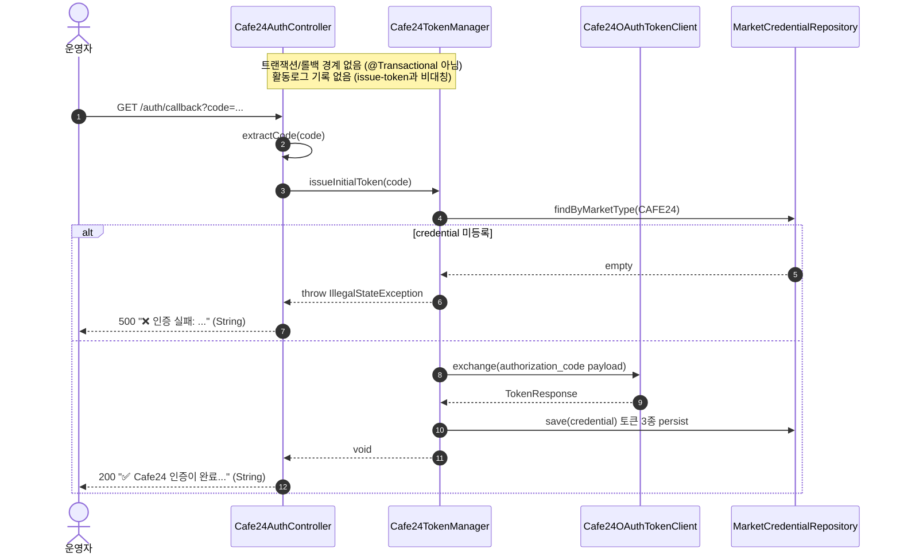
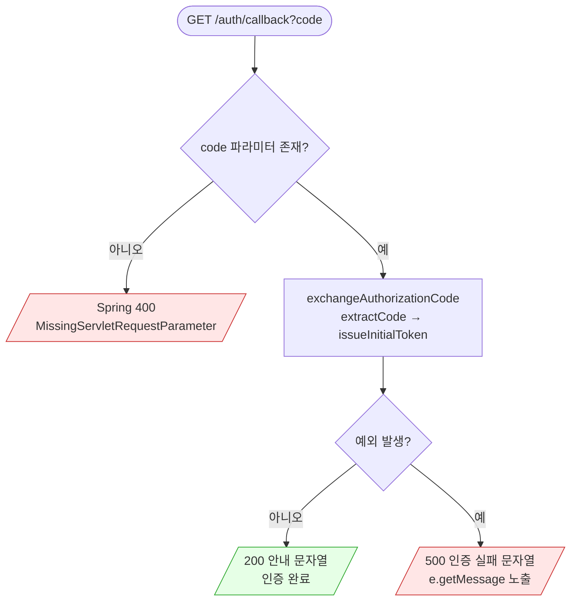

# GET /auth/callback — (레거시) 인가코드 콜백

## 1. 개요

> 이 표는 "이 기능이 무엇을 하고, 무슨 흔적을 남기는가"를 한눈에 보여줍니다.

| 항목 | 내용 |
|------|------|
| **Method / URL** | `GET /api/admin/sync/cafe24/auth/callback?code=...` |
| **목적** | (예전 방식) 브라우저 주소창에 직접 붙여 넣어 쓰던 콜백 기능입니다. Cafe24가 로그인 뒤 돌려보내는 주소의 `code` 값으로 재접속용 열쇠(리프레시 토큰)를 발급·저장합니다. 지금의 새 화면은 이 대신 `POST /issue-token`을 씁니다. |
| **핵심 상태전이** | 인증 코드를 넣으면 → `MarketCredential`(CAFE24)에 출입증(accessToken)·재접속 열쇠(refreshToken)·만료시각(tokenExpiresAt)이 저장됩니다. |
| **부수효과** | Cafe24 OAuth 토큰 교환 1회 + `MarketCredential` 저장. **활동로그는 남기지 않음**(issue-token과 다른 점 — 일부러 그렇게 둔 설계). |
| **응답** | 성공 시 `200 + 안내 문자열`(그냥 String 한 줄), 실패 시 `500 + "❌ 인증 실패: ..." 문자열`. |

## 2. 호출 체인

> 아래는 "요청이 들어오면 어떤 코드가 순서대로 어디를 거치는가"를 보여주는 지도입니다.

```
Cafe24AuthController.handleCafe24AuthCode(@RequestParam code)   api/.../controller/Cafe24AuthController.java:198-208
  ├─ log.info("카페24 인증 코드 수신 완료")                    Cafe24AuthController.java:201
  ├─ exchangeAuthorizationCode(code)                           Cafe24AuthController.java:203 / 121-123
  │     └─ extractCode(rawCode)                                Cafe24AuthController.java:122 / 178-193
  │     └─ cafe24TokenManager.issueInitialToken(code)          infrastructure/.../cafe24/Cafe24TokenManager.java:132-144  (@Transactional 아님)
  │           ├─ getCredential() → null 이면 IllegalStateException  Cafe24TokenManager.java:133-136
  │           ├─ tokenClient.exchange(clientId, accessKey, secretKey, payload)  Cafe24TokenManager.java:140-141
  │           └─ persist(credential, resp)                     Cafe24TokenManager.java:102-110 (marketCredentialRepository.save)
  ├─ (성공) 200 + "✅ Cafe24 인증이 완료되었습니다..." (String)  Cafe24AuthController.java:204
  └─ (예외) 500 + "❌ 인증 실패: " + e.getMessage() (String)     Cafe24AuthController.java:205-207
```

**흐름을 쉽게 풀면:**
- `handleCafe24AuthCode(@RequestParam code)` → 쉽게 말하면 "주소에 붙은 `code` 값을 받아서 인증 처리를 시작한다".
- `exchangeAuthorizationCode(code)` → 쉽게 말하면 "코드를 뽑고, Cafe24와 교환해 열쇠를 받아 저장하는 공통 로직을 부른다"(issue-token과 같은 함수를 함께 씀).
- `issueInitialToken(code)` → 쉽게 말하면 "실제로 토큰 창구와 코드를 주고받아 열쇠 3종을 받아 저장한다". 우리 쪽 인증정보가 없으면 오류(IllegalStateException)를 냅니다.
- 성공하면 초록색 안내 문자열을, 실패하면 오류 메시지를 담은 문자열을 그대로 화면에 돌려줍니다. (issue-token과 달리 활동로그는 남기지 않습니다.)

**요청 파라미터**

| 파라미터 | 타입 | 필수 | 비고 |
|----------|------|------|------|
| `code` | String (`@RequestParam("code")`) | 필수 | 이 값이 아예 없으면 Spring이 먼저 `MissingServletRequestParameterException`을 냄. `code=...`가 들어간 URL을 통째로 넣어도 `extractCode`가 코드만 뽑아 처리. |

## 3. 유스케이스 다이어그램

> 👉 이 그림은 운영자가 브라우저 주소창에 코드를 붙여 넣으면, 시스템이 코드를 뽑아 Cafe24와 교환하고 열쇠를 저장하는 (레거시) 경로를 보여줍니다.


## 4. 시퀀스 다이어그램

> 👉 이 그림은 코드가 들어온 뒤 "우리 인증정보가 없으면 500 / 정상이면 열쇠 저장 후 200"으로 갈리는 과정을 시간 순서대로 보여줍니다(활동로그는 남기지 않는 점에 주목).



## 5. 순서도(플로우차트)

> 👉 이 그림은 "code 파라미터가 있나?"부터 "교환 중 오류 났나?"까지 갈림길에 따라 결과가 Spring 400 / 200(성공) / 500(실패)으로 나뉘는 길을 한 장으로 보여줍니다.



## 6. 상태 전이표

> 이 표는 "어떤 상황에서 무엇을 하면, 결과 상태가 어떻게 바뀌고 무슨 흔적이 남는가"를 정리한 것입니다.

| 진입 상태 | 트리거 | 허용 | 결과 상태 | 부수효과 | HTTP |
|-----------|--------|------|-----------|----------|------|
| 아직 인증 안 됨 / 재인증 필요 | 유효한 코드(파라미터) | O | 인증됨 (열쇠 3종 저장) | OAuth 교환 + `MarketCredential.save`. **활동로그 없음** | 200 |
| 어떤 상태든 | code 파라미터 아예 없음 | X | 바뀌는 것 없음 | 없음(Spring이 핸들러에 들어오기도 전에 막음) | 400 |
| 우리 쪽 인증정보 미등록 | 유효한 코드 | X | 바뀌는 것 없음 | 없음 | 500 |
| 어떤 상태든 | OAuth 교환 실패(만료 코드 등) | X | 바뀌는 것 없음 | 없음 | 500 |
| 어떤 상태든 | 빈 문자열 코드(`?code=`) | 조건부 | 바뀌는 것 없음(교환 실패로 끝남) | OAuth 교환을 시도했다가 실패 | 500 |

## 7. 🔎 발견사항

- **[🟠 GAP] CAFE-6 — 콜백에는 issue-token이 가진 "빈 코드 막기"가 없어, 빈 코드로도 헛교환을 시도함**
  - 무엇이 문제인가: `POST /issue-token`은 코드가 `null`이거나 공백뿐이면 곧바로 400으로 끝냅니다(`Cafe24AuthController.java:97-99`). 그런데 이 콜백 `handleCafe24AuthCode`(L198-208)에는 그런 사전 검사가 없어서, 바로 `exchangeAuthorizationCode`로 들어갑니다. `@RequestParam("code")`는 "파라미터 자체가 없을 때"만 400을 내기 때문에, `?code=`처럼 값이 비어 있거나 공백만 있는 경우는 그대로 통과해 `issueInitialToken("")`(빈 코드로 교환)까지 가 버립니다.
  - 왜 문제인가: 빈/공백 코드로 굳이 Cafe24에 OAuth 교환을 시도하고, 그 실패 메시지를 500으로 사용자에게 보여 줍니다. 사실은 "입력이 빠진 것"(400이 어울림)인데 "서버 오류"(500)처럼 표시돼 일관성이 없습니다.
  - 어떻게 고치면 되나: 이 콜백에도 issue-token과 똑같은 "빈 코드 막기"를 넣거나(400 또는 명확한 안내), 두 기능이 함께 쓰는 `exchangeAuthorizationCode`에서 코드를 뽑은 뒤 비어 있으면 `IllegalArgumentException`을 던져 `GlobalExceptionHandler.handleIllegalArgument`(GlobalExceptionHandler.java:44-50)를 통해 400으로 처리되게 합니다.

- **[🔵 NOTE] CAFE-7 — 오류 메시지를 화면 응답에 그대로 노출함**
  - 무엇이 문제인가: 실패하면 `"❌ 인증 실패: " + e.getMessage()`(`Cafe24AuthController.java:206`)를 그대로 화면 응답으로 돌려줍니다. issue-token도 비슷하게 메시지를 노출합니다(L111).
  - 왜 문제인가: 이 화면은 예전 방식(브라우저 직접 입력)이라 관리자만 본다는 전제이지만, 오류 메시지 안에 Cafe24 응답 조각(Cafe24RestClient.enrich가 최대 300자까지 붙임)이 실려 내부 정보가 화면에 드러날 수 있습니다. 다만 보안이 중요하지 않은 환경이라 우선순위는 낮습니다.
  - 어떻게 고치면 되나: 정말 관리자만 접근하는지 확인합니다. 필요하면 화면에는 일반화된 메시지만 보이고, 자세한 내용은 서버 로그에만 남기도록 분리합니다.

- **[🔵 NOTE] CAFE-8 — 새 화면은 `POST /issue-token`을 쓰는데 이 옛 콜백이 아직 열려 있음**
  - 무엇이 문제인가: 클래스 주석 L195-197에 "(레거시) 새 UI는 POST /issue-token을 쓴다"고 적혀 있습니다. 두 경로는 같은 `exchangeAuthorizationCode`를 함께 씁니다(F-CAFE-12, L116-123).
  - 왜 문제인가: 동작에 결함은 없지만, 이 GET 콜백은 활동로그를 남기지 않고 응답 형태도 그냥 문자열이라 "무슨 일이 있었는지 관찰"하기가 어렵습니다. 이걸 계속 유지할지 없앨지가 불분명합니다.
  - 어떻게 고치면 되나: 이 주소가 아직 Cafe24 앱의 리다이렉트 URI로 등록돼 꼭 필요한지 확인합니다. 필요 없으면 없애고, 필요하면 활동로그를 추가할지 검토합니다(지금은 "일부러 로그를 안 남긴다"는 전제로 테스트가 고정돼 있습니다).

## 8. 테스트 커버리지 메모

- **`Cafe24AuthControllerTokenExchangeTest`** (`api/src/test/java/com/sbshop/agent/api/controller/Cafe24AuthControllerTokenExchangeTest.java`) — 이 콜백 경로도 함께 확인합니다.
  - 이미 확인하는 경우(auth/callback): 전체 URL을 넣어도 코드만 뽑아 `issueInitialToken("ABC123")`을 부르는지(L61-69), 활동로그를 남기지 않는지(일부러 다르게 둔 점을 유지, L95-101), 실패 시 500 + 문자열 본문("인증 실패"·"boom" 포함)인지(L115-124).
  - **아직 확인 안 하는 경우**: (1) CAFE-6 관련 — `?code=`(빈 문자열)이나 공백 코드로 부를 때의 동작(교환을 시도했다가 500)을 확인하는 테스트가 없습니다. (2) `@RequestParam("code")`가 빠졌을 때 400이 나는 경로는, 이 단위 테스트(메서드를 직접 부르는 방식)로는 확인할 수 없습니다(MockMvc나 통합 테스트가 없음). (3) 우리 쪽 인증정보 미등록(IllegalStateException)의 진짜 경로는 `boom` RuntimeException으로 대체돼 확인되지 않습니다. (4) 성공 안내 문자열은 전체가 아니라 일부("Cafe24 인증이 완료")만 대조합니다.

*(쉬운 설명판 · 2026-07-17 재작성)*

*생성: 2026-07-17 · 근거: 현재 워킹트리*
