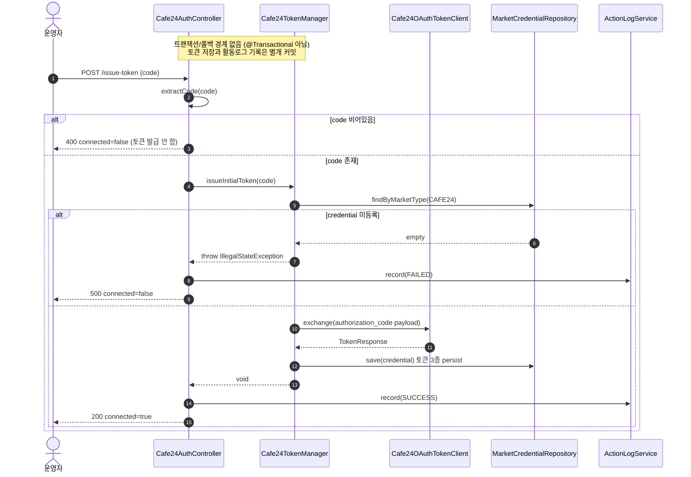

# POST /issue-token — 인가코드로 리프레시 토큰 발급

## 1. 개요

> 이 표는 "이 기능이 무엇을 하고, 무슨 흔적을 남기는가"를 한눈에 보여줍니다.

| 항목 | 내용 |
|------|------|
| **Method / URL** | `POST /api/admin/sync/cafe24/issue-token` (바디 `IssueTokenRequest{code}`) |
| **목적** | Cafe24에서 로그인하면 화면(리다이렉트)으로 넘어오는 "인증 코드"를 받아, 그것을 Cafe24와 교환해 앞으로 계속 자동 접속할 수 있는 재접속용 열쇠(리프레시 토큰)를 받아 저장합니다. 사용자가 인증 코드만 붙여 넣든, `code=...`가 들어간 전체 주소(URL)를 통째로 붙여 넣든, 그 안에서 코드만 뽑아 씁니다. |
| **핵심 상태전이** | 인증 코드를 넣으면 → `MarketCredential`(CAFE24)에 접속 출입증(accessToken)·재접속 열쇠(refreshToken)·만료시각(tokenExpiresAt)이 저장되어 재인증이 완료됩니다. |
| **부수효과** | Cafe24 OAuth 토큰 교환 1회 + `MarketCredential` 저장 + 활동로그(`CAFE24_AUTH`, 성공이면 SUCCESS/실패면 FAILED) 기록. |
| **응답** | 성공 시 `200 + Cafe24Status(true)`, 코드가 비었으면 `400 + connected=false`, 그 밖의 실패는 `500 + connected=false`. |

## 2. 호출 체인

> 아래는 "요청이 들어오면 어떤 코드가 순서대로 어디를 거치는가"를 보여주는 지도입니다.

```
Cafe24AuthController.issueToken(IssueTokenRequest)            api/.../controller/Cafe24AuthController.java:93-114
  ├─ extractCode(request.code())                             Cafe24AuthController.java:96 / 178-193
  │     └─ (null/blank) → 400 badRequest                     Cafe24AuthController.java:97-99
  ├─ exchangeAuthorizationCode(code)                         Cafe24AuthController.java:101 / 121-123
  │     └─ extractCode(rawCode) [다시 추출]                  Cafe24AuthController.java:122
  │     └─ cafe24TokenManager.issueInitialToken(code)        infrastructure/.../cafe24/Cafe24TokenManager.java:132-144  (@Transactional 아님)
  │           ├─ getCredential() → null 이면 IllegalStateException  Cafe24TokenManager.java:133-136
  │           ├─ tokenClient.exchange(clientId, accessKey, secretKey, payload)  Cafe24TokenManager.java:140-141
  │           │     ("grant_type=authorization_code&code=%s&redirect_uri=%s")  Cafe24TokenManager.java:137-139
  │           └─ persist(credential, resp)                   Cafe24TokenManager.java:102-110 (marketCredentialRepository.save)
  ├─ (성공) actionLogService.record(CAFE24_AUTH, "CAFE24", SUCCESS, ...)  Cafe24AuthController.java:103-104
  │     └─ ActionLogService.record(...)                      core/.../application/actionlog/ActionLogService.java:28
  │     └─ 200 + Cafe24Status(true, "발급·저장되었습니다")   Cafe24AuthController.java:105
  └─ (예외) actionLogService.record(..., FAILED, ...) + 500  Cafe24AuthController.java:106-113
```

**흐름을 쉽게 풀면:**
- `extractCode(request.code())` → 쉽게 말하면 "사용자가 붙여 넣은 값에서 진짜 인증 코드만 골라낸다". 비어 있으면 여기서 바로 400으로 끝냅니다.
- `exchangeAuthorizationCode(code)` → 쉽게 말하면 "골라낸 코드를 Cafe24와 교환해 열쇠를 받아 온다". (이 안에서 코드를 한 번 더 뽑는데, 이는 아래 CAFE-4에서 지적하는 중복입니다.)
- `issueInitialToken(code)` → 쉽게 말하면 "실제로 Cafe24 토큰 창구와 코드를 주고받아 열쇠 3종을 받아 저장한다". 이때 우리 쪽 인증정보(clientId 등)가 없으면 오류(IllegalStateException)를 냅니다.
- `persist(credential, resp)` → 쉽게 말하면 "받아 온 출입증·재접속 열쇠·만료시각을 DB에 저장한다".
- `actionLogService.record(...)` → 쉽게 말하면 "이 인증 시도가 성공했는지 실패했는지를 활동 기록에 남긴다".

**요청 바디 (`IssueTokenRequest`, `Cafe24AuthController.java:35`)**

| 필드 | 타입 | 필수 | 비고 |
|------|------|------|------|
| `code` | String | 필수 | 인증 코드 자체, 또는 `code=...`가 들어간 전체 리다이렉트 주소. `extractCode`가 그 안에서 코드만 뽑음. 값이 비어 있으면 400. |

## 3. 유스케이스 다이어그램

> 👉 이 그림은 운영자가 인증 코드를 넣으면, 시스템이 붙여 넣은 URL에서 코드를 뽑고(→ Cafe24와 교환) 열쇠를 저장하며 활동로그까지 남기는 전체 그림을 보여줍니다.


## 4. 시퀀스 다이어그램

> 👉 이 그림은 코드가 들어온 순간부터 "비었으면 400 / 인증정보 없으면 500 / 정상이면 열쇠 저장 후 200"으로 갈리는 과정을 시간 순서대로 보여줍니다.



## 5. 순서도(플로우차트)

> 👉 이 그림은 "코드가 비었나?" 갈림길과 "교환 중 오류 났나?" 갈림길에 따라 결과가 400 / 200(성공) / 500(실패)으로 나뉘는 길을 한 장으로 보여줍니다.


## 6. 상태 전이표

> 이 표는 "어떤 상황에서 무엇을 하면, 결과 상태가 어떻게 바뀌고 무슨 흔적이 남는가"를 정리한 것입니다.

| 진입 상태 | 트리거 | 허용 | 결과 상태 | 부수효과 | HTTP |
|-----------|--------|------|-----------|----------|------|
| 아직 인증 안 됨 / 재인증 필요 (재접속 열쇠 없음·만료) | 유효한 코드 제출 | O | 인증됨 (출입증·재접속 열쇠·만료시각 저장) | OAuth 교환 + `MarketCredential.save` + 활동로그 SUCCESS | 200 |
| 어떤 상태든 | 빈 코드 제출 | X | 바뀌는 것 없음 | 없음(교환·활동로그 모두 건너뜀) | 400 |
| 우리 쪽 인증정보 미등록 (clientId/secret 없음) | 유효한 코드 제출 | X | 바뀌는 것 없음 | 활동로그 FAILED만 남김 | 500 |
| 어떤 상태든 | OAuth 교환 실패(1회용 코드 만료 등) | X | 바뀌는 것 없음 | 활동로그 FAILED만 남김 | 500 |

## 7. 🔎 발견사항

- **[🟡 SMELL] CAFE-4 — 코드 뽑기(추출)를 두 번 함(중복 호출)**
  - 무엇이 문제인가: `issueToken`이 이미 `extractCode(request.code())`로 코드를 한 번 뽑아 놓고(`Cafe24AuthController.java:96`), 그 뽑은 값을 `exchangeAuthorizationCode(code)`에 넘깁니다(L101). 그런데 `exchangeAuthorizationCode`는 넘겨받은 값을 또 `extractCode(rawCode)` 합니다(`Cafe24AuthController.java:122`). 같은 뽑기를 두 번 하는 셈입니다.
  - 왜 문제인가: `extractCode`는 이미 순수한 코드면 그대로 돌려주기 때문에(멱등) 결과가 틀어지진 않습니다. 다만 같은 파싱을 두 번 하고, "여기서 이미 뽑았다"와 "저기서 또 뽑는다"가 공존해 코드를 읽는 사람이 "이 함수는 뽑힌 값을 받는 건가, 원본을 받는 건가?"를 헷갈리기 쉽습니다. 나중에 손볼 때 실수하기 좋은 지점입니다.
  - 어떻게 고치면 되나: `exchangeAuthorizationCode`가 원본을 받아 딱 한 번만 `extractCode`하도록 정리하고, `issueToken`에서는 "비었는지"만 따로 검사합니다. (단, 빈 값 판정을 "뽑은 결과" 기준으로 해야 하므로 순서 정리가 필요합니다.)

- **[🔵 NOTE] CAFE-5 — 토큰 저장과 활동로그가 한 묶음으로 처리되지 않음(원자적이지 않음)**
  - 무엇이 문제인가: 열쇠를 저장하는 `issueInitialToken`의 `persist`와, 컨트롤러가 활동로그를 남기는 `actionLogService.record`(L103-104)는 서로 다른 순간에 벌어지는 별개의 작업이고, 하나로 묶여 실패 시 함께 되돌아가는(@Transactional) 구조가 아닙니다.
  - 왜 문제인가: 토큰 저장은 성공했는데 그 뒤 활동로그 기록만 실패하는 경우, 이미 "성공(200)" 응답은 나가 버리고 로그만 빠질 수 있습니다(반대 순서, 즉 로그만 남고 토큰이 안 저장되는 경우는 코드상 생기지 않습니다). 돈이나 데이터 정합성에는 영향이 없고, 감사(기록) 정확도에만 국한된 문제입니다.
  - 어떻게 고치면 되나: 기록 정확도가 중요하면, 로그 기록이 실패해도 응답에 영향을 주지 않도록 지금 구조를 유지하되 로그 실패 자체를 따로 모니터링합니다. 현재 설계가 의도된 것이라면 문서로 남기는 것으로 충분합니다.

## 8. 테스트 커버리지 메모

- **`Cafe24AuthControllerTokenExchangeTest`** (`api/src/test/java/com/sbshop/agent/api/controller/Cafe24AuthControllerTokenExchangeTest.java`) — `/issue-token`과 `/auth/callback`이 공유하는 로직과, 둘 사이의 다른 점을 확인합니다.
  - 이미 확인하는 경우(issue-token): 전체 URL을 넣어도 코드만 뽑아 `issueInitialToken("ABC123")`을 부르는지(L50-59), 성공 시 활동로그를 SUCCESS로 남기는지(L73-80), 실패 시 활동로그 FAILED + 500인지(L82-93), 빈 코드면 400이면서 토큰 발급을 건너뛰는지(L105-113).
  - **아직 확인 안 하는 경우**: (1) CAFE-4 관련 — `extractCode`가 두 번 불리는지/두 번 불려도 결과가 같은지(멱등)는 검사하지 않습니다(가짜 부품은 최종 인자만 확인). (2) 우리 쪽 인증정보 미등록(IllegalStateException) 경로가 이 단위 테스트에서는 `boom`이라는 일반 RuntimeException으로 대체돼서, 진짜 `IllegalStateException`이 여기서 500으로 나가는지는 확인하지 못합니다(다만 `catch(Exception)`으로 잡으므로 최종 경로는 동일). (3) 응답 메시지의 "1회용·짧은 시간만 유효" 같은 안내 문구는 검증하지 않습니다.

*(쉬운 설명판 · 2026-07-17 재작성)*

*생성: 2026-07-17 · 근거: 현재 워킹트리*
