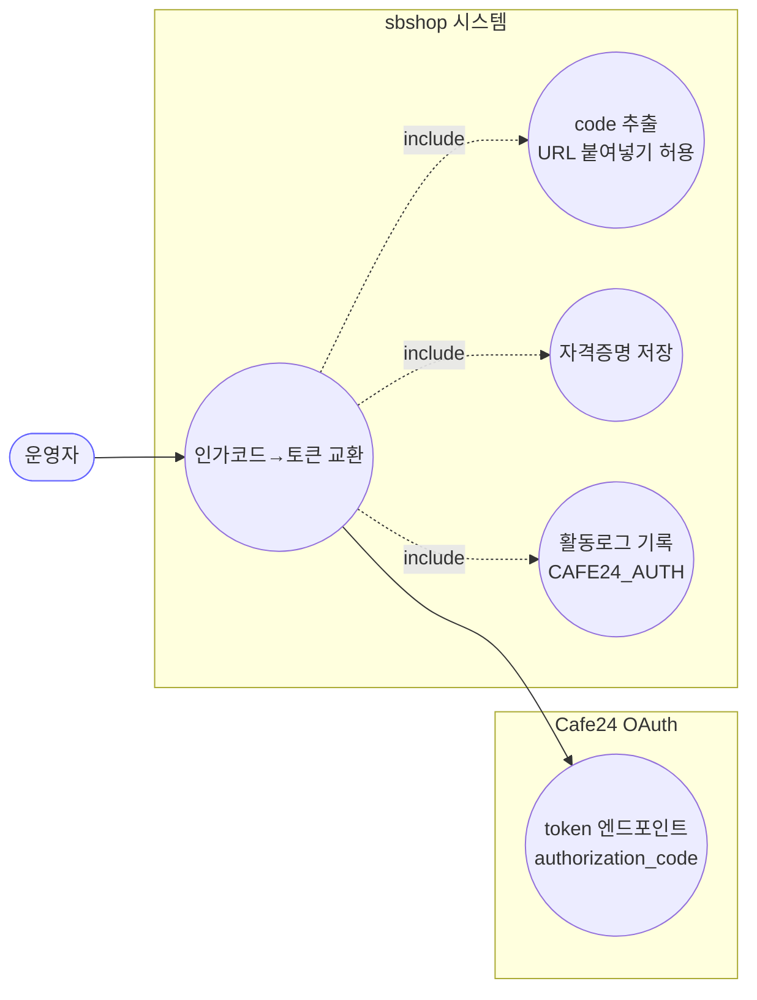
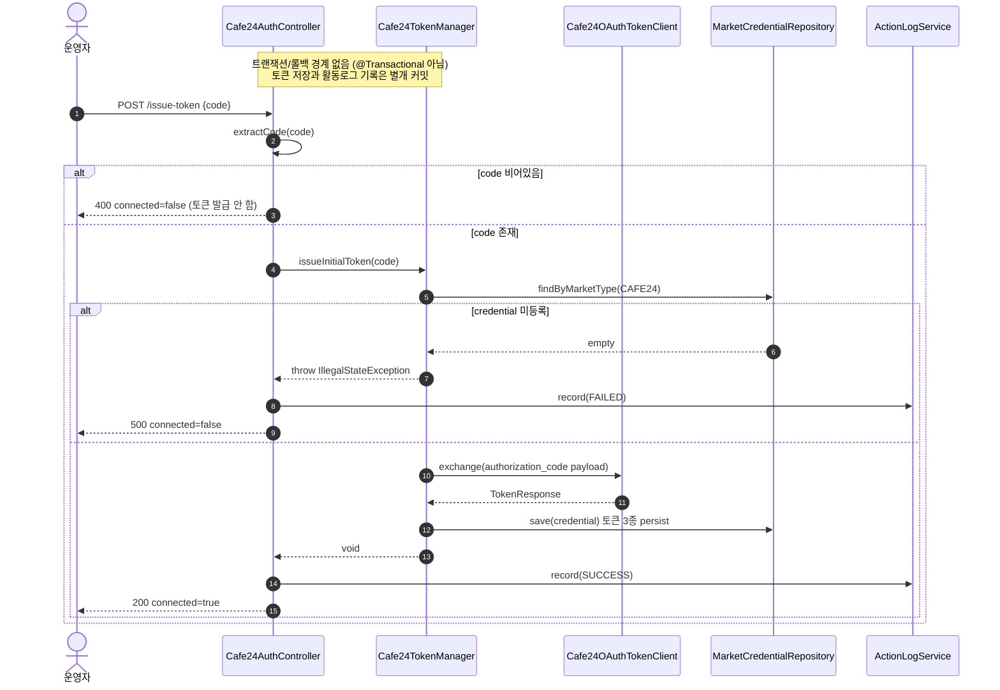
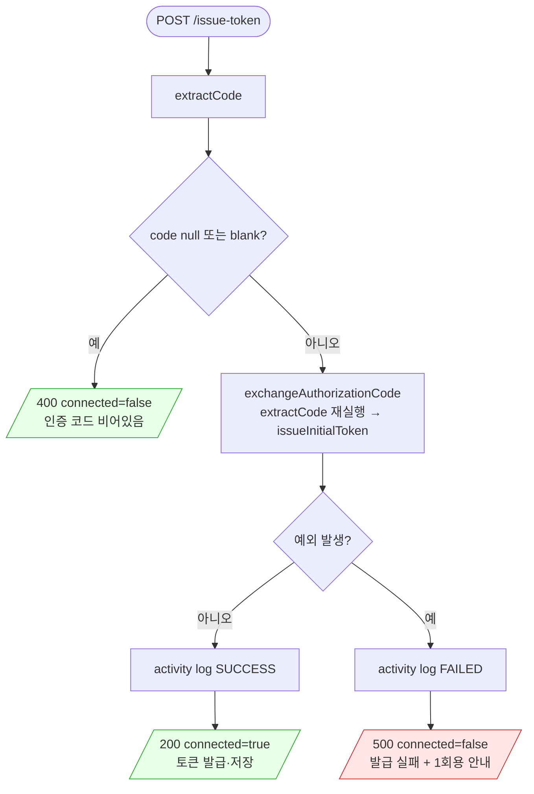

# POST /issue-token — 인가코드로 리프레시 토큰 발급

## 1. 개요

| 항목 | 내용 |
|------|------|
| **Method / URL** | `POST /api/admin/sync/cafe24/issue-token` (바디 `IssueTokenRequest{code}`) |
| **목적** | 리다이렉트로 받은 인증 코드(또는 `code=...`를 포함한 전체 URL)에서 code를 추출해 Cafe24 OAuth `authorization_code` 교환으로 리프레시 토큰을 발급·저장한다. |
| **핵심 상태전이** | 인증 코드 → `MarketCredential`(CAFE24)의 accessToken·refreshToken·tokenExpiresAt 저장. 재인증 완료. |
| **부수효과** | Cafe24 OAuth 토큰 교환 1회 + `MarketCredential` 저장 + 활동로그(`CAFE24_AUTH`, SUCCESS/FAILED) 기록. |
| **응답** | 성공 `200 + Cafe24Status(true)`, 빈 코드 `400 + connected=false`, 실패 `500 + connected=false`. |

## 2. 호출 체인

```
Cafe24AuthController.issueToken(IssueTokenRequest)            api/.../controller/Cafe24AuthController.java:93-114
  ├─ extractCode(request.code())                             Cafe24AuthController.java:96 / 178-193
  │     └─ (null/blank) → 400 badRequest                     Cafe24AuthController.java:97-99
  ├─ exchangeAuthorizationCode(code)                         Cafe24AuthController.java:101 / 121-123
  │     └─ extractCode(rawCode) [다시 추출]                  Cafe24AuthController.java:122
  │     └─ cafe24TokenManager.issueInitialToken(code)        infrastructure/.../cafe24/Cafe24TokenManager.java:132-144  (@Transactional 아님)
  │           ├─ getCredential() → null 이면 IllegalStateException  Cafe24TokenManager.java:133-136
  │           ├─ tokenClient.exchange(clientId, accessKey, secretKey, payload)  Cafe24TokenManager.java:140-141
  │           │     ("grant_type=authorization_code&code=%s&redirect_uri=%s")  Cafe24TokenManager.java:137-139
  │           └─ persist(credential, resp)                   Cafe24TokenManager.java:102-110 (marketCredentialRepository.save)
  ├─ (성공) actionLogService.record(CAFE24_AUTH, "CAFE24", SUCCESS, ...)  Cafe24AuthController.java:103-104
  │     └─ ActionLogService.record(...)                      core/.../application/actionlog/ActionLogService.java:28
  │     └─ 200 + Cafe24Status(true, "발급·저장되었습니다")   Cafe24AuthController.java:105
  └─ (예외) actionLogService.record(..., FAILED, ...) + 500  Cafe24AuthController.java:106-113
```

**요청 바디 (`IssueTokenRequest`, `Cafe24AuthController.java:35`)**

| 필드 | 타입 | 필수 | 비고 |
|------|------|------|------|
| `code` | String | 필수 | 인증 코드 또는 `code=...`를 포함한 전체 리다이렉트 URL. `extractCode`가 파싱. blank면 400. |

## 3. 유스케이스 다이어그램



## 4. 시퀀스 다이어그램



## 5. 순서도(플로우차트)



## 6. 상태 전이표

| 진입 상태 | 트리거 | 허용 | 결과 상태 | 부수효과 | HTTP |
|-----------|--------|------|-----------|----------|------|
| 미인증/재인증 필요 (refreshToken 없음/만료) | 유효 code 제출 | O | 인증됨 (accessToken·refreshToken·tokenExpiresAt 저장) | OAuth 교환 + `MarketCredential.save` + 활동로그 SUCCESS | 200 |
| 임의 상태 | blank code | X | 변경 없음 | 없음(토큰 교환·활동로그 모두 건너뜀) | 400 |
| credential 미등록 (clientId/secret 없음) | 유효 code 제출 | X | 변경 없음 | 활동로그 FAILED만 | 500 |
| 임의 상태 | OAuth 교환 실패(1회용 code 만료 등) | X | 변경 없음 | 활동로그 FAILED만 | 500 |

## 7. 🔎 발견사항

- **[🟡 SMELL] CAFE-4 — code 추출을 두 번 수행(중복 호출)**
  - 근거: `issueToken`이 `extractCode(request.code())`로 이미 code를 추출(`Cafe24AuthController.java:96`)한 뒤, 추출된 값을 `exchangeAuthorizationCode(code)`에 넘긴다(L101). 그런데 `exchangeAuthorizationCode`는 인자를 다시 `extractCode(rawCode)` 한다(`Cafe24AuthController.java:122`).
  - 영향: `extractCode`는 멱등(이미 순수 code면 그대로 반환)이라 동작 결함은 없다. 다만 같은 파싱을 두 번 수행하고, "이미 추출됨"과 "다시 추출함"이 공존해 독자가 계약을 오해하기 쉽다. 유지보수 위험.
  - 제안: `exchangeAuthorizationCode`가 raw 입력을 받아 한 번만 `extractCode`하도록 하고, `issueToken`은 blank 검사만 별도로 하되 중복 추출을 제거한다. (blank 가드가 추출 결과 기준이어야 하므로 순서 정리 필요.)

- **[🔵 NOTE] CAFE-5 — 토큰 저장과 활동로그가 원자적이지 않음**
  - 근거: `issueInitialToken`의 `persist`(자격증명 저장)와 컨트롤러의 `actionLogService.record`(L103-104)는 서로 다른 시점의 별개 작업이며 `@Transactional`로 묶이지 않는다.
  - 영향: 토큰 저장은 성공했으나 활동로그 기록이 실패하는 경우, 성공 응답(200)은 이미 나가고 로그만 누락될 수 있다(반대 순서는 코드상 발생하지 않음). 재무·정합성 영향은 없고 감사 로그 정확도 문제에 국한.
  - 제안: 감사 정확도가 중요하면 로그 기록 실패가 응답에 영향 주지 않도록(현 구조 유지) 하되, 로그 실패 자체를 별도 모니터링한다. 현 설계 의도라면 문서화로 충분.

## 8. 테스트 커버리지 메모

- **`Cafe24AuthControllerTokenExchangeTest`** (`api/src/test/java/com/sbshop/agent/api/controller/Cafe24AuthControllerTokenExchangeTest.java`) — `/issue-token`·`/auth/callback` 공유 로직과 비대칭을 특성화한다.
  - 커버(issue-token): 전체 URL에서 code만 추출해 `issueInitialToken("ABC123")` 호출(L50-59), 성공 시 활동로그 SUCCESS(L73-80), 실패 시 활동로그 FAILED + 500(L82-93), blank code → 400 + 토큰발급 skip(L105-113).
  - **비어있는 케이스**: (1) CAFE-4 관련 — `extractCode`가 두 번 호출되는지/멱등인지는 검증하지 않음(mock은 최종 인자만 확인). (2) `credential 미등록`(IllegalStateException) 경로가 컨트롤러 단위 테스트에선 `boom` RuntimeException으로 대체돼, 실제 `IllegalStateException`이 이 엔드포인트에서 500으로 나가는지는 미검증(단, catch(Exception)이므로 동일 경로). (3) 응답 메시지의 "1회용·단시간 유효" 안내 문구는 미검증.

*생성: 2026-07-17 · 근거: 현재 워킹트리*
