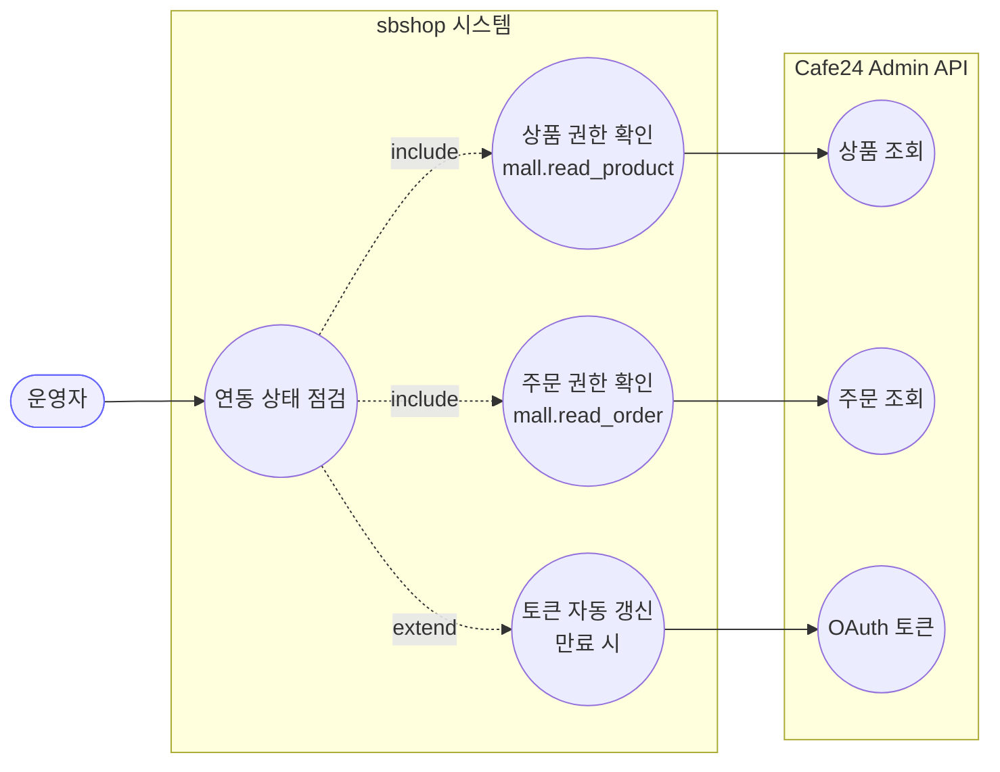
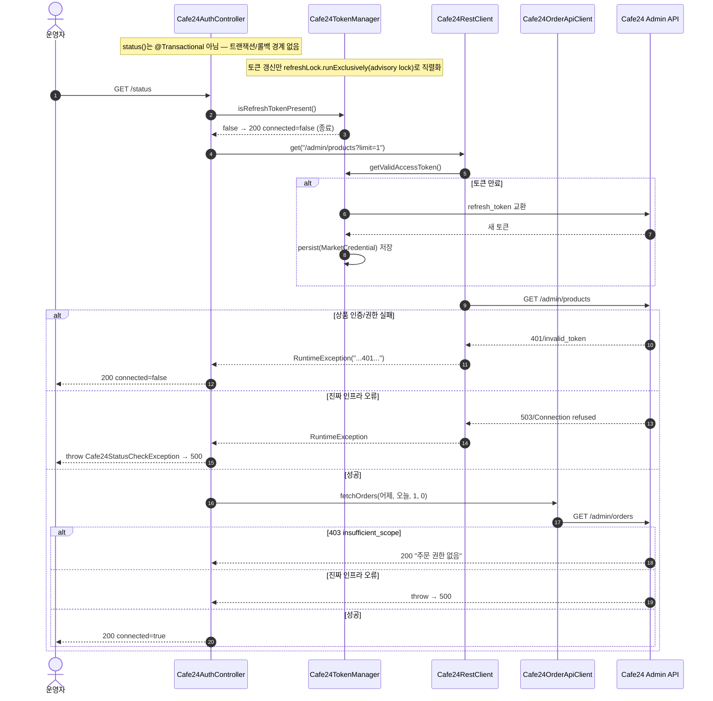

# GET /status — Cafe24 연동 상태 점검

## 1. 개요

> 이 표는 "이 기능이 무엇을 하고, 무슨 흔적을 남기는가"를 한눈에 보여줍니다.

| 항목 | 내용 |
|------|------|
| **Method / URL** | `GET /api/admin/sync/cafe24/status` |
| **목적** | "Cafe24와 지금 정상적으로 연결돼 있나?"를 확인하는 기능입니다. 단순히 재접속용 열쇠(리프레시 토큰)가 저장돼 있는지만 보지 않고, 실제로 Cafe24의 상품 목록과 주문 목록을 한 번씩 불러봐서 잘 응답하면 "정상 연동", 인증이나 권한에서 막히면 "다시 로그인(재인증) 필요"라고 판정합니다. |
| **핵심 상태전이** | 데이터를 바꾸는 기능이 아니라 들여다보기만 하는(조회) 기능이라, 우리 DB나 마켓의 상태를 바꾸지 않습니다. (단, 접속용 열쇠가 만료돼 있으면 확인하는 김에 새 열쇠로 갱신·저장하는 부수적 효과는 생길 수 있습니다.) |
| **부수효과** | Cafe24에 상품 조회(`/admin/products?limit=1`) 1회 + 주문 조회(`fetchOrders`) 1회를 보냅니다. 접속 열쇠가 만료돼 있으면 `Cafe24TokenManager`가 자동으로 새 열쇠를 받아와 `MarketCredential`(마켓 인증정보)에 저장할 수 있습니다. |
| **응답** | `200 OK` + `Cafe24Status(connected, message)`(연결됨 여부 + 안내문). 인증·권한이 막힌 경우도 "비정상"이 아니라 "정상적으로 확인된 결과"로 보고 `200 + connected=false`로 답합니다. 진짜 서버·네트워크 고장 같은 인프라 오류는 예외로 위로 던져져 `500`이 됩니다. |

## 2. 호출 체인

> 아래는 "요청이 들어오면 어떤 코드가 순서대로 어디를 거치는가"를 보여주는 지도입니다. 각 줄 아래의 "→ 쉽게 말하면"이 그 단계가 무슨 뜻인지 풀어 준 설명입니다.

```
Cafe24AuthController.status()                                api/.../controller/Cafe24AuthController.java:42-88
  ├─ cafe24TokenManager.isRefreshTokenPresent()              infrastructure/.../cafe24/Cafe24TokenManager.java:44-47
  │     └─ marketCredentialRepository.findByMarketType(CAFE24)   Cafe24TokenManager.java:40-42
  │     └─ (없으면) 200 + connected=false 반환                Cafe24AuthController.java:44-47
  ├─ cafe24RestClient.get("/admin/products?limit=1")         infrastructure/.../cafe24/client/Cafe24RestClient.java:25-37
  │     ├─ tokenManager.getApiUrl()                          Cafe24TokenManager.java:112-118
  │     ├─ tokenManager.getValidAccessToken()                Cafe24TokenManager.java:49-69  (만료 시 refreshLock.runExclusively → doRefresh → persist)
  │     └─ (실패) enrich → throw RuntimeException            Cafe24RestClient.java:33-36
  │           ├─ isAuthFailure(e)==false → throw Cafe24StatusCheckException  Cafe24AuthController.java:55-59 / 164-168
  │           └─ isAuthFailure(e)==true  → 200 + connected=false            Cafe24AuthController.java:60-62
  ├─ cafe24OrderApiPort.fetchOrders(어제, 오늘, 1, 0)        core/.../order/port/Cafe24OrderApiPort.java:21
  │     └─ Cafe24OrderApiClient.fetchOrders()               infrastructure/.../cafe24/client/Cafe24OrderApiClient.java:24-39
  │           └─ restClient.get("/admin/orders?...")        Cafe24OrderApiClient.java:32
  │           ├─ (403/insufficient_scope) → 200 + 권한없음 메시지  Cafe24AuthController.java:72-76
  │           ├─ isAuthFailure==false → throw Cafe24StatusCheckException  Cafe24AuthController.java:79-83
  │           └─ isAuthFailure==true  → 200 + connected=false            Cafe24AuthController.java:84-85
  └─ 성공 → 200 + Cafe24Status(true, "정상 연동 중...")      Cafe24AuthController.java:87
  (Cafe24StatusCheckException → GlobalExceptionHandler.handleGeneral → 500)  api/.../exception/GlobalExceptionHandler.java:52-63
```

**흐름을 쉽게 풀면:**
- `isRefreshTokenPresent()` → 쉽게 말하면 "재접속용 열쇠가 아예 저장돼 있기는 한가?"부터 봅니다. 없으면 더 볼 것도 없이 "연결 안 됨(재인증 필요)"으로 바로 답합니다.
- `get("/admin/products?limit=1")` → 쉽게 말하면 "상품 목록을 딱 1개만 시험 삼아 불러본다". 여기서 인증·권한이 막히면 "정상적으로 확인된 실패(재인증 필요)"로, 진짜 서버 고장이면 500으로 갈립니다.
- `getValidAccessToken()` → 쉽게 말하면 "지금 쓸 수 있는 출입증(액세스 토큰)을 챙긴다. 만료됐으면 자동으로 새로 발급받아 저장한다".
- `fetchOrders(어제, 오늘, 1, 0)` → 쉽게 말하면 "어제~오늘 주문을 1건만 시험 삼아 불러본다". 여기서 권한이 없으면(403) "주문 권한 없음"으로 안내합니다.
- `Cafe24StatusCheckException → 500` → 쉽게 말하면 "이건 인증 문제가 아니라 진짜 고장이다 싶으면, 전용 오류를 위로 던져 500으로 처리한다".

**보조 메서드 (판정을 도와주는 도우미 함수들)**
- `isAuthFailure(Throwable)` — 오류 메시지 전체를 훑어 401·403·invalid_grant·invalid_token·insufficient_scope·unauthorized·재인증·"토큰 갱신 실패"·"credential 미등록" 같은 단어가 들어있는지 봅니다. → 쉽게 말하면 "이 실패가 '로그인·권한 문제'인가, 아니면 '진짜 고장'인가"를 글자로 알아보는 함수. `Cafe24AuthController.java:133-144`
- `fullMessage(Throwable)` — 원인에 원인이 꼬리를 무는 오류 사슬의 메시지를 최대 20단계까지 이어 붙입니다(자기 자신을 원인으로 도는 무한루프는 막음). → 쉽게 말하면 "겹겹이 쌓인 오류 설명을 한 줄로 모아 본다". `Cafe24AuthController.java:147-161`
- `rootMessage(Throwable)` — 맨 밑바닥의 진짜 원인 메시지만 꺼냅니다. → 쉽게 말하면 "가장 근본 원인 한 문장만 뽑는다". `Cafe24AuthController.java:170-176`

## 3. 유스케이스 다이어그램

> 👉 이 그림은 운영자가 "연동 상태 점검"을 누르면, 시스템이 상품 권한·주문 권한을 함께 확인하고 필요하면 토큰을 자동 갱신하며, Cafe24의 상품·주문·토큰 창구를 각각 어떻게 쓰는지 보여줍니다.



## 4. 시퀀스 다이어그램

> 👉 이 그림은 요청이 들어온 순간부터 상품·주문을 시험 조회하고, 그 결과가 "정상 연동 / 재인증 필요 / 진짜 고장(500)" 중 어디로 갈리는지를 시간 순서대로 보여줍니다.



## 5. 순서도(플로우차트)

> 👉 이 그림은 "열쇠 있나? → 상품 조회 → 주문 조회" 순으로 갈림길마다 어떤 조건이면 어떤 결과(초록=정상 응답, 빨강=500 오류)로 빠지는지를 한 장으로 보여줍니다.


## 6. 상태 전이표

> 이 표는 "이 기능이 어떤 상태를 어떻게 바꾸는가"를 정리한 것입니다. 이 기능은 조회 전용이라 사실상 아무 상태도 바꾸지 않습니다.

| 진입 상태 | 트리거 | 허용 | 결과 상태 | 부수효과 | HTTP |
|-----------|--------|------|-----------|----------|------|
| (조회 전용) | GET /status | — | **바뀌는 상태 없음(그냥 확인만)** | 상품·주문을 각 1회 읽어봄. 접속 열쇠가 만료돼 있으면 `MarketCredential`의 토큰 값이 새로 저장될 수 있음 | 200 / 500 |

> 이 기능은 데이터의 상태를 바꾸지 않고 확인만 하는 조회 기능입니다. 유일하게 실제로 뭔가를 저장하는 경우는 접속 열쇠가 만료됐을 때 `Cafe24TokenManager.doRefresh → persist`(Cafe24TokenManager.java:80-110)가 새 열쇠를 저장하는 것뿐인데, 이건 상태 점검을 하다 보니 따라오는 부수 효과이지 이 기능이 원래 하려던 일은 아닙니다.

## 7. 🔎 발견사항

- **[🟠 GAP] CAFE-1 — 상태 점검용 주문 조회에, 약속과 다른 날짜 형식(`yyyy-MM-dd`)을 넘김**
  - 무엇이 문제인가: 상태 점검이 주문을 시험 조회할 때 날짜를 "년-월-일"(예: 2026-07-17)만 넘깁니다. 근거: `Cafe24AuthController.java:66-68` 은 `DateTimeFormatter.ofPattern("yyyy-MM-dd")` 형식으로 `fetchOrders(어제, 오늘, 1, 0)` 을 호출합니다. 그런데 이 창구의 약속(포트 계약) `Cafe24OrderApiPort.java:15-16` 은 날짜를 "년-월-일 시:분:초"(`"yyyy-MM-dd HH:mm:ss"`)로 넘기라고 정해 두었고, 실제 구현 `Cafe24OrderApiClient.java:26-32` 는 받은 값을 그대로 URL에 실어 Cafe24로 보냅니다. 즉 약속한 형식보다 시:분:초가 빠진 값을 보내고 있습니다.
  - 왜 문제인가: Cafe24가 시각 없는 날짜를 거부하거나 다르게 해석하면, 인증·권한은 멀쩡한데도 주문 점검만 실패할 수 있습니다. 그러면 이 실패가 "인증 문제도 403도 아닌 실패"로 분류돼 `Cafe24StatusCheckException`으로 던져져 500이 나거나, 반대로 실제로는 정상인데 화면에는 "점검 실패"라고 뜰 수 있습니다. 결국 "정상 연동됐다"는 판정을 믿기 어려워집니다.
  - 어떻게 고치면 되나: 약속대로 "년-월-일 시:분:초" 형식(예: `어제 00:00:00`~`오늘 23:59:59`)으로 맞추거나, 반대로 창구 문서의 형식 규정을 실제 허용 범위에 맞게 완화해 약속과 실제를 일치시킵니다.

- **[🟡 SMELL] CAFE-2 — 상태 판별을 "오류 메시지에 특정 글자가 들어있나"로 판단함**
  - 무엇이 문제인가: 이 실패가 "로그인·권한 문제"인지 "진짜 고장"인지를 가릴 때, 오류 메시지 안에 `"401"`, `"403"`, `"insufficient_scope"` 같은 글자가 들어 있는지로 판단합니다. 근거: `isAuthFailure`(`Cafe24AuthController.java:133-144`)와 주문 권한 판정(`Cafe24AuthController.java:72`)이 그렇게 문자열 포함 여부로 갈립니다. 원래 있던 HTTP 상태코드는 `Cafe24RestClient.enrich`(Cafe24RestClient.java:44-49)가 메시지 문장 안에 글자로 녹여 넣고, 정작 원래 오류의 종류(타입)는 사라집니다.
  - 왜 문제인가: Cafe24가 돌려준 응답 본문(최대 300자 요약)에 우연히 `"403"`·`"401"` 같은 숫자가 섞여 있으면, 진짜 원인이 아닌데도 그걸 인증 실패로 잘못 판단할 수 있습니다. 또 나중에 Cafe24 쪽이 상태코드 전달 방식을 조금만 바꿔도 이 판단이 소리 없이 어긋납니다. 글자에 의존하는 판정이라 깨지기 쉽습니다.
  - 어떻게 고치면 되나: `Cafe24RestClient`가 HTTP 상태코드를 오류 안에 제대로(전용 오류 타입·상태 필드로) 담아 두고, 컨트롤러는 글자가 아니라 그 상태코드 숫자로 판단하도록 바꿉니다.

- **[🔵 NOTE] CAFE-3 — 조회 기능인데 부수적으로 접속 열쇠를 갱신·저장함**
  - 무엇이 문제인가: `status()`가 `getValidAccessToken`(Cafe24TokenManager.java:49-69)을 부르는 과정에서 만료된 토큰을 자동으로 새로 받아 `persist`(Cafe24TokenManager.java:102-110)로 `MarketCredential`에 저장합니다. 그런데 `status()` 자체는 `@Transactional`(하나로 묶어 실패 시 되돌리는 안전장치)이 걸려 있지 않습니다.
  - 왜 문제인가: 그냥 "상태만 확인"할 줄 알았던 GET 요청이 실제로는 DB에 값을 쓰는(토큰 교체) 일까지 하는 것이라, 호출하는 쪽에서는 조금 뜻밖일 수 있습니다. 다만 이건 "만료되면 자동으로 갱신한다"는 의도된 설계입니다. 두 개의 JVM이 동시에 갱신하려 다투는 문제는 advisory lock으로 막아 둡니다.
  - 어떻게 고치면 되나: 의도된 동작이므로 따로 고칠 것은 없고 문서로 남기면 충분합니다. 위 상태 전이표에도 부수효과로 적어 두었습니다.

## 8. 테스트 커버리지 메모

- **`Cafe24AuthControllerStatusTest`** (`api/src/test/java/com/sbshop/agent/api/controller/Cafe24AuthControllerStatusTest.java`) — `status()`가 상황별로 올바른 HTTP 응답을 주는지를, 가짜 부품(mock)을 끼운 순수 단위 테스트로 확인합니다.
  - 이미 확인하는 경우: 재접속 열쇠 없음→200(L50-59), 토큰 만료/무효→200(L61-74), 상품 조회 401→200(L76-87), 주문 권한 없음(insufficient_scope/403)→200(L89-102), 정상 연동→200 connected=true(L104-116), 상품 조회 인프라 오류(Connection refused)→위로 던짐(L120-130), 상품 5xx→위로 던짐(L132-141), 주문 인프라 오류(권한 문제 아님)→위로 던짐(L143-154).
  - **아직 확인 안 하는 경우**: (1) CAFE-1 관련 — 날짜 형식이 약속(`yyyy-MM-dd HH:mm:ss`)과 다르다는 사실을 잡아내는 테스트가 없습니다(가짜 부품이 `anyString()`이라 형식을 검사하지 않음). (2) 토큰이 만료됐을 때 자동으로 갱신·저장까지 실제로 일어나는 전 과정은 이 단위 테스트 범위 밖입니다. (3) `Cafe24StatusCheckException`이 실제로 `GlobalExceptionHandler.handleGeneral`을 거쳐 진짜 500이 되는지(끝에서 끝까지) 확인하는 테스트는 없습니다(위로 던져지는지까지만 확인).

*(쉬운 설명판 · 2026-07-17 재작성)*

*생성: 2026-07-17 · 근거: 현재 워킹트리*
