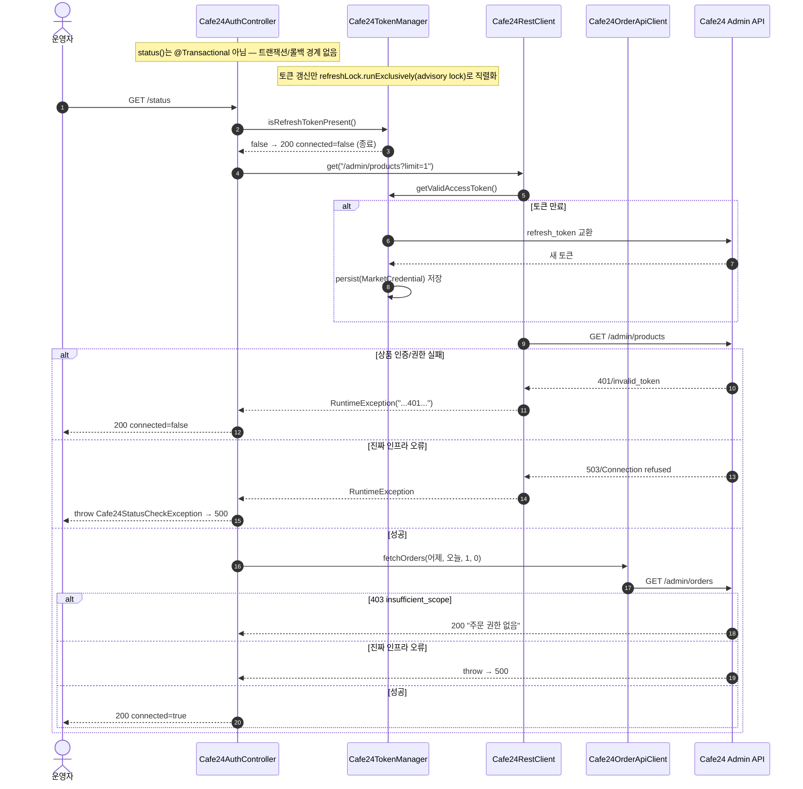
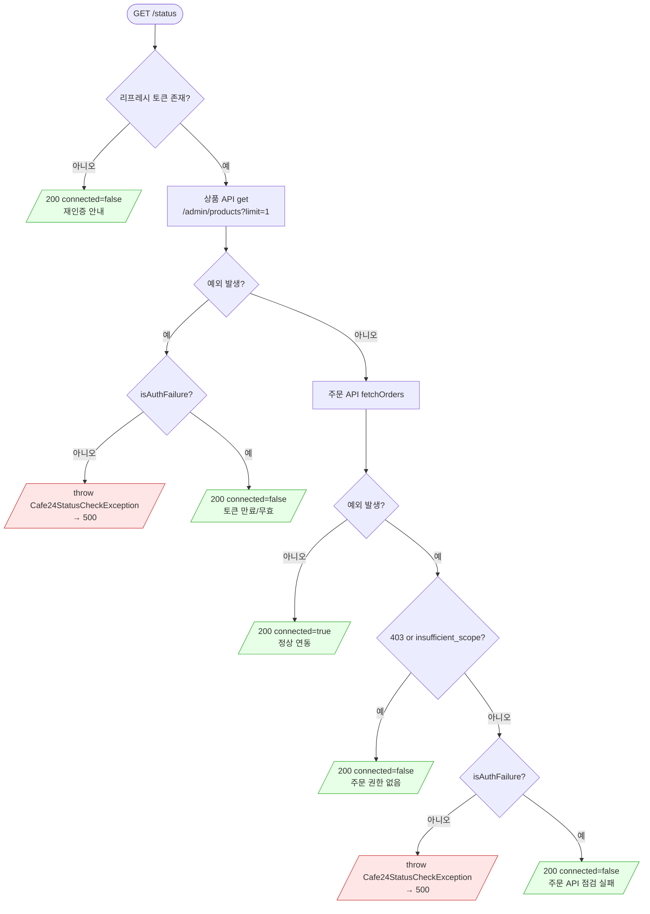

# GET /status — Cafe24 연동 상태 점검

## 1. 개요

| 항목 | 내용 |
|------|------|
| **Method / URL** | `GET /api/admin/sync/cafe24/status` |
| **목적** | 리프레시 토큰의 '존재'가 아니라 '유효성'을 검증한다. 실제 Cafe24 상품 API·주문 API를 한 번씩 호출해 성공하면 정상 연동, 인증/권한 실패면 재인증 필요로 판정한다. |
| **핵심 상태전이** | 상태 전이 없음(조회). DB·마켓 상태를 변경하지 않음. (단, 토큰 만료 시 `getValidAccessToken`이 부수적으로 토큰 갱신·persist를 유발할 수 있음.) |
| **부수효과** | Cafe24 상품 조회(`/admin/products?limit=1`) + 주문 조회(`fetchOrders`) 각 1회. 토큰 만료 시 `Cafe24TokenManager`가 자동 갱신 시도 → `MarketCredential` 저장 가능. |
| **응답** | `200 OK` + `Cafe24Status(connected, message)`. 인증/권한 실패(정상 상태)는 `200 + connected=false`. 진짜 인프라 오류는 예외 전파 → `500`. |

## 2. 호출 체인

```
Cafe24AuthController.status()                                api/.../controller/Cafe24AuthController.java:42-88
  ├─ cafe24TokenManager.isRefreshTokenPresent()              infrastructure/.../cafe24/Cafe24TokenManager.java:44-47
  │     └─ marketCredentialRepository.findByMarketType(CAFE24)   Cafe24TokenManager.java:40-42
  │     └─ (없으면) 200 + connected=false 반환                Cafe24AuthController.java:44-47
  ├─ cafe24RestClient.get("/admin/products?limit=1")         infrastructure/.../cafe24/client/Cafe24RestClient.java:25-37
  │     ├─ tokenManager.getApiUrl()                          Cafe24TokenManager.java:112-118
  │     ├─ tokenManager.getValidAccessToken()                Cafe24TokenManager.java:49-69  (만료 시 refreshLock.runExclusively → doRefresh → persist)
  │     └─ (실패) enrich → throw RuntimeException            Cafe24RestClient.java:33-36
  │           ├─ isAuthFailure(e)==false → throw Cafe24StatusCheckException  Cafe24AuthController.java:55-59 / 164-168
  │           └─ isAuthFailure(e)==true  → 200 + connected=false            Cafe24AuthController.java:60-62
  ├─ cafe24OrderApiPort.fetchOrders(어제, 오늘, 1, 0)        core/.../order/port/Cafe24OrderApiPort.java:21
  │     └─ Cafe24OrderApiClient.fetchOrders()               infrastructure/.../cafe24/client/Cafe24OrderApiClient.java:24-39
  │           └─ restClient.get("/admin/orders?...")        Cafe24OrderApiClient.java:32
  │           ├─ (403/insufficient_scope) → 200 + 권한없음 메시지  Cafe24AuthController.java:72-76
  │           ├─ isAuthFailure==false → throw Cafe24StatusCheckException  Cafe24AuthController.java:79-83
  │           └─ isAuthFailure==true  → 200 + connected=false            Cafe24AuthController.java:84-85
  └─ 성공 → 200 + Cafe24Status(true, "정상 연동 중...")      Cafe24AuthController.java:87
  (Cafe24StatusCheckException → GlobalExceptionHandler.handleGeneral → 500)  api/.../exception/GlobalExceptionHandler.java:52-63
```

**보조 메서드**
- `isAuthFailure(Throwable)` — 예외 체인 전체 메시지에 401·403·invalid_grant·invalid_token·insufficient_scope·unauthorized·재인증·"토큰 갱신 실패"·"credential 미등록" 포함 여부. `Cafe24AuthController.java:133-144`
- `fullMessage(Throwable)` — 예외 체인 메시지 연결(최대 20단계, self-cause 가드). `Cafe24AuthController.java:147-161`
- `rootMessage(Throwable)` — 최종 원인 메시지. `Cafe24AuthController.java:170-176`

## 3. 유스케이스 다이어그램


## 4. 시퀀스 다이어그램



## 5. 순서도(플로우차트)



## 6. 상태 전이표

| 진입 상태 | 트리거 | 허용 | 결과 상태 | 부수효과 | HTTP |
|-----------|--------|------|-----------|----------|------|
| (조회 전용) | GET /status | — | **상태 전이 없음(조회)** | 상품·주문 API 각 1회 read. 토큰 만료 시 `MarketCredential` 토큰 필드 갱신 저장 가능 | 200 / 500 |

> 이 API는 도메인 상태를 전이시키지 않는 조회 API다. 유일한 쓰기 부수효과는 토큰 만료 시 `Cafe24TokenManager.doRefresh → persist`(Cafe24TokenManager.java:80-110)의 자격증명 토큰 갱신뿐이며, 이는 상태 점검의 부작용이지 이 API의 의도된 전이가 아니다.

## 7. 🔎 발견사항

- **[🟠 GAP] CAFE-1 — 상태 점검 주문 조회에 포트 계약과 다른 날짜 포맷(`yyyy-MM-dd`)을 전달**
  - 근거: `Cafe24AuthController.java:66-68` 은 `DateTimeFormatter.ofPattern("yyyy-MM-dd")` 로 `fetchOrders(어제, 오늘, 1, 0)` 을 호출한다. 그러나 포트 계약 `Cafe24OrderApiPort.java:15-16` 은 `startDate/endDate` 를 `"yyyy-MM-dd HH:mm:ss"` 로 규정하고, 구현 `Cafe24OrderApiClient.java:26-32` 는 값을 그대로 URL 인코딩해 `start_date/end_date` 로 전달한다.
  - 영향: Cafe24가 시각 없는 날짜를 거부하거나 다르게 해석하면, 실제 인증/권한은 정상인데도 주문 점검이 실패해 `isAuthFailure` 분기(비-403·비-인증)에서 `Cafe24StatusCheckException`으로 전파 → 500이 되거나, 반대로 정상인데 "점검 실패" 메시지가 표시될 수 있다. 정상 연동 판정의 신뢰도를 떨어뜨린다.
  - 제안: 포트 계약대로 `"yyyy-MM-dd HH:mm:ss"`(예: `어제 00:00:00`~`오늘 23:59:59`)로 포맷을 맞추거나, 포트 문서의 포맷 규정을 실제 허용 범위로 완화해 계약을 일치시킨다.

- **[🟡 SMELL] CAFE-2 — 상태 판별을 예외 메시지 문자열 매칭에 의존**
  - 근거: `isAuthFailure`(`Cafe24AuthController.java:133-144`)와 주문 권한 판정(`Cafe24AuthController.java:72`)이 `"401"`, `"403"`, `"insufficient_scope"` 등 문자열 포함 여부로 정상/인프라 오류를 분기한다. 원 상태코드는 `Cafe24RestClient.enrich`(Cafe24RestClient.java:44-49)가 메시지에 문자열로 녹여 넣은 뒤 원 예외 타입은 유실된다.
  - 영향: Cafe24 응답 본문(최대 300자 snippet)에 우연히 `"403"`·`"401"` 문자열이 섞이면 오분류될 수 있고, 상태코드 전달 방식 변경 시 조용히 깨진다. 응답 본문이 예외 메시지에 실려 잘못된 분기를 유발할 여지가 있다.
  - 제안: `Cafe24RestClient`가 HTTP 상태코드를 예외에 구조적으로 보존(전용 예외 타입·상태 필드)하도록 하고, 컨트롤러는 문자열이 아닌 상태코드로 분기한다.

- **[🔵 NOTE] CAFE-3 — 조회 API가 부수적으로 자격증명을 갱신·저장**
  - 근거: `status()`가 `getValidAccessToken`(Cafe24TokenManager.java:49-69)을 통해 만료 토큰을 자동 갱신하며 `persist`(Cafe24TokenManager.java:102-110)로 `MarketCredential`을 저장한다. `status()` 자체는 `@Transactional`이 아니다.
  - 영향: GET 상태 점검이 DB 쓰기(토큰 회전)를 유발하는 것은 의도된 설계이나(만료 자동 갱신), 순수 조회를 기대하는 호출자에겐 비직관적이다. advisory lock으로 2 JVM 경쟁은 방지된다.
  - 제안: 의도된 동작이므로 문서화만 필요. 상태 표에 부수효과로 명시함.

## 8. 테스트 커버리지 메모

- **`Cafe24AuthControllerStatusTest`** (`api/src/test/java/com/sbshop/agent/api/controller/Cafe24AuthControllerStatusTest.java`) — `status()`의 HTTP 시맨틱을 순수 단위 테스트(생성자 주입 mock)로 특성화한다.
  - 커버: 리프레시 토큰 없음→200(L50-59), 토큰 만료/무효→200(L61-74), 상품 401→200(L76-87), 주문 insufficient_scope/403→200(L89-102), 정상 연동→200 connected=true(L104-116), 상품 인프라 오류(Connection refused)→전파(L120-130), 상품 5xx→전파(L132-141), 주문 인프라 오류(비-권한)→전파(L143-154).
  - **비어있는 케이스**: (1) CAFE-1 관련 — 날짜 포맷이 계약(`yyyy-MM-dd HH:mm:ss`)과 다르다는 사실을 잡는 테스트 없음(mock은 `anyString()`으로 포맷을 검증하지 않음). (2) 토큰 만료 시 자동 갱신·persist가 일어나는 통합 경로는 이 단위 테스트 범위 밖. (3) `Cafe24StatusCheckException`이 실제로 `GlobalExceptionHandler.handleGeneral`을 통해 500이 되는 엔드투엔드 경로는 미검증(전파 여부만 확인).

*생성: 2026-07-17 · 근거: 현재 워킹트리*
