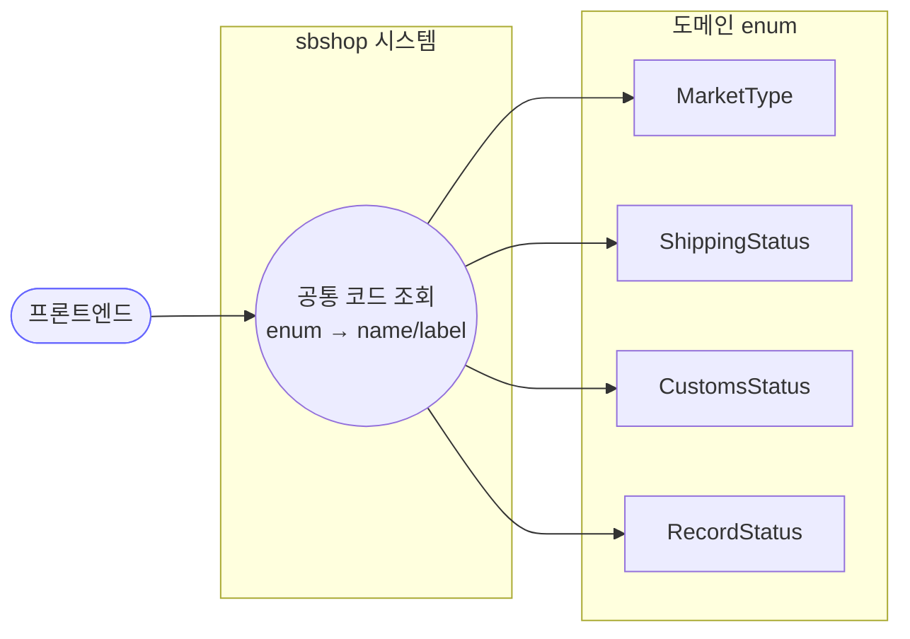

# GET /common/codes — 공통 코드(선택 목록) 조회

## 1. 개요

이 기능은 프론트 화면의 드롭다운 메뉴나 라벨(예: "쿠팡", "배송중")에 쓰는 **정해진 값 목록**을 서버가 한꺼번에 모아 돌려주는 기능입니다. 마켓 종류·배송 상태·통관 상태·기록 상태, 이렇게 네 가지 목록을 줍니다.

| 항목 | 내용 (쉬운 설명) |
|------|------|
| **Method / URL** | `GET /api/v1/common/codes` — "화면에서 쓸 선택 목록들을 한 번에 달라"고 요청하는 주소입니다. |
| **목적** | 프론트가 드롭다운·라벨에 쓰는 값 묶음(마켓/배송상태/통관상태/기록상태)을 각각 `{코드값, 한글라벨}` 쌍의 목록으로 한꺼번에 돌려줍니다. |
| **핵심 상태전이** | 없음 — 미리 정해진 값들을 그냥 나열할 뿐, DB도 안 건드리고 아무것도 바꾸지 않습니다. |
| **부수효과** | 없음 — 메모리 안에 이미 있는 고정 값들만 뽑아 옵니다. |
| **응답** | `200 OK` + 네 가지 목록을 담은 묶음(`Map`). 키는 `marketType`(마켓)/`shippingStatus`(배송상태)/`customsStatus`(통관상태)/`recordStatus`(기록상태). |

## 2. 호출 체인

아래는 요청이 들어와 네 가지 목록을 만들어 응답하기까지의 순서입니다. 오른쪽은 실제 파일·줄 번호입니다.

```
CommonCodeController.getCommonCodes()          api/.../controller/CommonCodeController.java:26-36
  ├─ enumMap.put("marketType",     toEnumValues(MarketType.class))    :30
  ├─ enumMap.put("shippingStatus", toEnumValues(ShippingStatus.class)):31
  ├─ enumMap.put("customsStatus",  toEnumValues(CustomsStatus.class)) :32
  ├─ enumMap.put("recordStatus",   toEnumValues(RecordStatus.class))  :33
  └─ toEnumValues(Class)                        CommonCodeController.java:38-42
       └─ Arrays.stream(e.getEnumConstants())
            .map(EnumMapperValue::new)          core/.../common/enums/EnumMapperValue.java:5-7
                 └─ (getName(), getLabel())     core/.../common/enums/EnumMapperType.java:4-6
```

→ 쉽게 말하면:
1. 컨트롤러가 네 종류의 목록을 하나씩 만들어 묶음(Map)에 담습니다.
2. 각 목록은 `toEnumValues`라는 작은 함수가 만드는데, 이 함수는 해당 종류의 **미리 정해진 값들을 전부 훑어**,
3. 각 값을 `{코드값(name), 한글라벨(label)}` 형태로 바꿔 목록으로 만들어 줍니다.

**돌려주는 목록의 원본이 되는 값들**

| 응답 키 | 원본 | 파일 | 값 개수 |
|---------|------|------|:------:|
| `marketType` (마켓 종류) | MarketType | core/.../order/enums/MarketType.java:9-16 | 7개 (쿠팡…알수없음) |
| `shippingStatus` (배송 상태) | ShippingStatus | core/.../order/enums/ShippingStatus.java:10-19 | 9개 (알수없음…교환됨) |
| `customsStatus` (통관 상태) | CustomsStatus | core/.../order/enums/CustomsStatus.java:9-14 | 5개 (대기…우편번호오류) |
| `recordStatus` (기록 상태) | RecordStatus | core/.../common/RecordStatus.java:9-12 | 3개 (사용중/보관됨/삭제됨) |

**목록 하나하나의 모양 (`EnumMapperValue`, `EnumMapperValue.java:3`)**

| 필드 | 타입 | 쉬운 설명 |
|------|------|------|
| `name` | String | 시스템이 쓰는 코드값(getName) |
| `label` | String | 사람이 읽는 한글 표시명(getLabel) |

## 3. 유스케이스 다이어그램

👉 이 그림은 프론트가 "공통 코드 조회"를 한 번 요청하면 네 종류의 값 목록(마켓/배송상태/통관상태/기록상태)을 한꺼번에 받아 간다는 걸 보여줍니다.



## 4. 시퀀스 다이어그램

👉 이 그림은 요청이 들어오면 네 종류의 값들을 하나씩 훑어 `{코드값, 한글라벨}`로 바꾼 뒤, 순서를 지켜 묶음으로 만들어 돌려주는 흐름을 시간 순으로 보여줍니다.

```mermaid
sequenceDiagram
    autonumber
    actor F as 프론트엔드
    participant C as CommonCodeController
    participant E as EnumMapperValue
    Note over C: 트랜잭션 없음 · DB 접근 없음<br/>순수 인메모리 매핑 → 롤백 경계 없음

    F->>C: GET /common/codes
    loop 4개 enum 클래스
        C->>C: getEnumConstants()
        C->>E: new EnumMapperValue(constant)
        E-->>C: {name, label}
    end
    C->>C: LinkedHashMap 조립 (삽입 순서 보존)
    C-->>F: 200 OK + Map&lt;String, List&gt;
```

## 5. 순서도 (플로우차트)

👉 이 그림은 네 종류의 목록(마켓 → 배송상태 → 통관상태 → 기록상태)을 차례로 만들어 하나의 묶음으로 응답하는 과정을 보여줍니다.


## 6. 상태 전이표

이 기능은 미리 정해진 값을 나열해 줄 뿐이라 바뀌는 상태가 없습니다.

| 진입 상태 | 허용? | 결과 상태 | 부수효과 | 비고 (쉬운 설명) |
|-----------|:-----:|-----------|----------|------|
| — | — | — | — | **바뀌는 상태 없음(조회만)**. 고정된 값 목록만 돌려줍니다. |

## 7. 🔎 발견사항

### MISCA-4 · 🟠 GAP — 프론트가 쓰는 다른 목록들이 이 응답에 빠져 있음
- **무엇이 문제인가:** 이 기능은 네 종류(마켓/배송상태/통관상태/기록상태)만 돌려줍니다. 그런데 같은 방식으로 "코드값과 한글라벨"을 만들 수 있는 다른 목록들(예: 상품 재고 상태 `StockStatus`, 작업 상태 `ActionStatus`, 등록·소싱 상태 등)은 여기에 안 들어 있습니다.
- **근거:** `CommonCodeController.java:30-33` 은 4개 enum(marketType/shippingStatus/customsStatus/recordStatus)만 노출한다. 그러나 `EnumMapperType` 계약을 구현한 다른 도메인 enum(예: 상품 `StockStatus` — `ProductSyncService.java:15,85` 에서 사용, `ActionStatus`/등록·소싱 상태 등)은 포함되지 않는다.
- **왜 문제인가:** 프론트가 상품 재고 상태·작업 상태의 한글 표시명을 서버에서 못 받으면, 어쩔 수 없이 프론트 코드에 직접 적어 넣게 됩니다. 그러면 나중에 서버 쪽 한글 라벨이 바뀌어도 프론트는 옛날 값을 그대로 써서 서로 어긋납니다.
- **어떻게 고치면 되나:** 프론트가 실제로 필요한 목록이 무엇인지 확인해 빠진 걸 추가하거나, "코드값·라벨을 만들 수 있는 목록"을 시스템이 스스로 찾아 자동으로 모아 주는 방식을 검토합니다.

### MISCA-5 · 🟡 SMELL — 어떤 목록을 내보낼지가 컨트롤러에 손으로 적혀 있어(추가 시 빠뜨리기 쉬움)
- **무엇이 문제인가:** 내보낼 목록이 `enumMap.put(...)` 네 줄로 사람이 직접 적어 둔 형태입니다. 새 목록을 추가하려면 반드시 이 파일을 손봐야 하는데, 깜빡 잊어도 컴퓨터가 "빠졌다"고 알려 주지 못합니다.
- **근거:** enum 등록이 `enumMap.put(...)` 4줄로 수작업(`CommonCodeController.java:30-33`). 새 enum 추가 시 이 파일을 반드시 수정해야 하며, 컴파일러가 누락을 잡아주지 못한다.
- **왜 문제인가:** 새 목록을 만들 때 여기에 등록하는 걸 잊기 쉬워서, MISCA-4처럼 "프론트에 필요한 목록이 빠지는" 일이 또 생깁니다.
- **어떻게 고치면 되나:** 내보낼 목록들을 한곳(상수 배열/설정)에 모아 두거나, 시스템이 대상 목록을 자동으로 찾아 등록하게 바꿉니다.

### MISCA-6 · 🔵 NOTE — 매번 다시 계산하고, 로그인 없이 누구나 볼 수 있음
- **무엇이 문제인가:** 값 목록은 항상 똑같은데도 요청이 올 때마다 매번 새로 만들어 냅니다. 또 이 기능은 로그인·권한 확인 없이 열려 있습니다.
- **근거:** 매 요청마다 4개 enum을 stream 매핑해 새 Map 을 생성(`CommonCodeController.java:27-35`). 컨트롤러는 `@CrossOrigin(origins = "*")`(L23)로 개방, 인증 가드 없음.
- **왜 문제인가:** 값이 안 바뀌는데 매번 다시 만드는 건 살짝 낭비입니다(경미). 다만 내용 자체가 "쿠팡", "배송중" 같은 공개용 라벨이라, 로그인 없이 열려 있어도 사실상 위험은 없습니다.
- **어떻게 고치면 되나:** 한 번 만든 결과를 저장해 두고 재사용(캐시)하면 매번 다시 계산할 필요가 없어집니다. 인증은 데이터가 민감하지 않아 굳이 필요 없으며, 기록용 참고(NOTE)입니다.

## 8. 테스트 커버리지 메모

- 이 기능(`CommonCodeController`)을 **직접 검증하는 테스트가 발견되지 않았습니다.**
- **아직 안 보는 경우:** ① 응답 묶음에 네 종류 키가 다 있고 순서가 맞는지, ② 각 목록의 코드값·한글라벨이 정확한지(특히 한글 표시명), ③ 새 목록을 추가했을 때 등록이 빠지지 않는지(MISCA-4/5). 이 값 목록이 프론트 드롭다운의 원본이 되므로, 최소한 결과를 통째로 비교하는 계약 테스트 1건이라도 두는 걸 권장합니다.

---
*(쉬운 설명판 · 2026-07-17 재작성)*
*생성: 2026-07-17 · 근거: 현재 워킹트리*
