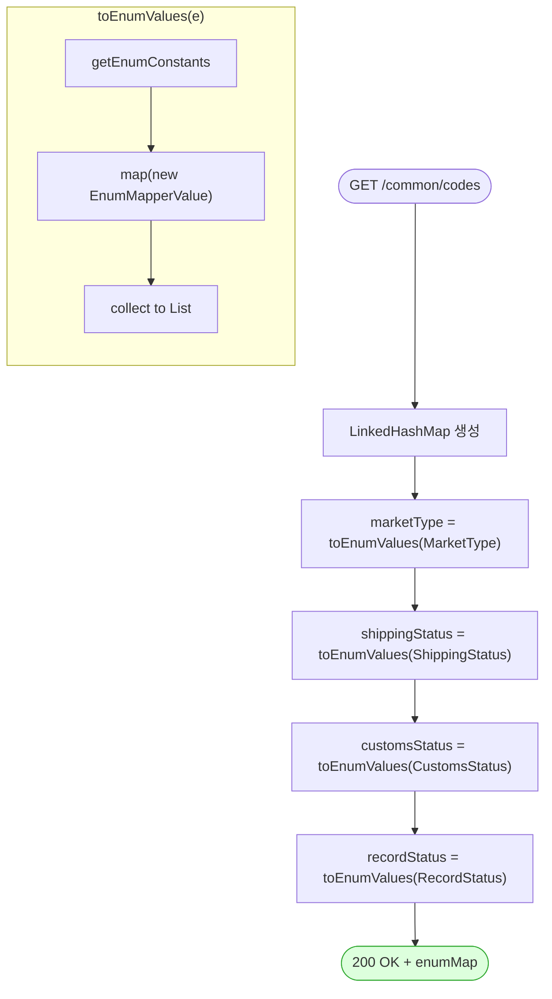

# GET /common/codes — 공통 enum 코드 조회

## 1. 개요

| 항목 | 내용 |
|------|------|
| **Method / URL** | `GET /api/v1/common/codes` |
| **목적** | 프론트가 드롭다운·라벨 매핑에 쓰는 도메인 enum(마켓/배송상태/통관상태/레코드상태)을 `{name, label}` 리스트로 일괄 반환한다. |
| **핵심 상태전이** | 없음(정적 enum 열거, 트랜잭션·DB 접근 없음) |
| **부수효과** | 없음. 인메모리 enum 상수만 매핑. |
| **응답** | `200 OK` + `Map<String, List<EnumMapperValue>>` (키: marketType/shippingStatus/customsStatus/recordStatus) |

## 2. 호출 체인

```
CommonCodeController.getCommonCodes()          api/.../controller/CommonCodeController.java:26-36
  ├─ enumMap.put("marketType",     toEnumValues(MarketType.class))    :30
  ├─ enumMap.put("shippingStatus", toEnumValues(ShippingStatus.class)):31
  ├─ enumMap.put("customsStatus",  toEnumValues(CustomsStatus.class)) :32
  ├─ enumMap.put("recordStatus",   toEnumValues(RecordStatus.class))  :33
  └─ toEnumValues(Class)                        CommonCodeController.java:38-42
       └─ Arrays.stream(e.getEnumConstants())
            .map(EnumMapperValue::new)          core/.../common/enums/EnumMapperValue.java:5-7
                 └─ (getName(), getLabel())     core/.../common/enums/EnumMapperType.java:4-6
```

**노출 enum 원본**

| 응답 키 | enum | 파일 | 상수 수 |
|---------|------|------|:------:|
| `marketType` | MarketType | core/.../order/enums/MarketType.java:9-16 | 7 (COUPANG…UNKNOWN) |
| `shippingStatus` | ShippingStatus | core/.../order/enums/ShippingStatus.java:10-19 | 9 (UNKNOWN…EXCHANGED) |
| `customsStatus` | CustomsStatus | core/.../order/enums/CustomsStatus.java:9-14 | 5 (PENDING…INVALID_ZIPCODE) |
| `recordStatus` | RecordStatus | core/.../common/RecordStatus.java:9-12 | 3 (ACTIVE/ARCHIVED/DELETED) |

**응답 요소 (`EnumMapperValue`, `EnumMapperValue.java:3`)**

| 필드 | 타입 | 출처 |
|------|------|------|
| `name` | String | `enum.name()` (getName) |
| `label` | String | 한글 라벨 (getLabel) |

## 3. 유스케이스 다이어그램


## 4. 시퀀스 다이어그램

```mermaid
sequenceDiagram
    autonumber
    actor F as 프론트엔드
    participant C as CommonCodeController
    participant E as EnumMapperValue
    Note over C: 트랜잭션 없음 · DB 접근 없음<br/>순수 인메모리 매핑 → 롤백 경계 없음

    F->>C: GET /common/codes
    loop 4개 enum 클래스
        C->>C: getEnumConstants()
        C->>E: new EnumMapperValue(constant)
        E-->>C: {name, label}
    end
    C->>C: LinkedHashMap 조립 (삽입 순서 보존)
    C-->>F: 200 OK + Map&lt;String, List&gt;
```

## 5. 순서도 (플로우차트)



## 6. 상태 전이표

| 진입 상태 | 허용? | 결과 상태 | 부수효과 | 비고 |
|-----------|:-----:|-----------|----------|------|
| — | — | — | — | **상태 전이 없음(조회)**. 정적 enum 열거만 반환. |

## 7. 🔎 발견사항

### MISCA-4 · 🟠 GAP — 프론트가 쓰는 다른 enum들이 공통 코드에 미포함
- **근거:** `CommonCodeController.java:30-33` 은 4개 enum(marketType/shippingStatus/customsStatus/recordStatus)만 노출한다. 그러나 `EnumMapperType` 계약을 구현한 다른 도메인 enum(예: 상품 `StockStatus` — `ProductSyncService.java:15,85` 에서 사용, `ActionStatus`/등록·소싱 상태 등)은 포함되지 않는다.
- **영향:** 프론트가 상품 재고상태·액션상태 등의 한글 라벨을 이 엔드포인트에서 얻지 못하면 라벨을 프론트에 하드코딩하게 되어, enum 라벨 변경 시 서버·프론트 드리프트가 발생한다.
- **제안:** 프론트가 실제로 필요로 하는 enum 목록을 확인해 누락분을 추가하거나, `EnumMapperType` 구현 enum을 리플렉션/레지스트리로 자동 수집하는 방식 검토.

### MISCA-5 · 🟡 SMELL — 노출 enum 목록이 컨트롤러에 하드코딩(등록 누락 위험)
- **근거:** enum 등록이 `enumMap.put(...)` 4줄로 수작업(`CommonCodeController.java:30-33`). 새 enum 추가 시 이 파일을 반드시 수정해야 하며, 컴파일러가 누락을 잡아주지 못한다.
- **영향:** 새 도메인 enum 도입 시 공통코드 등록을 잊기 쉬워 MISCA-4 형태의 누락이 재발한다.
- **제안:** enum 클래스 목록을 상수 배열/설정으로 분리하거나, `EnumMapperType` 구현체를 스캔해 자동 등록.

### MISCA-6 · 🔵 NOTE — 무캐시 재계산 및 무인증 개방
- **근거:** 매 요청마다 4개 enum을 stream 매핑해 새 Map 을 생성(`CommonCodeController.java:27-35`). 컨트롤러는 `@CrossOrigin(origins = "*")`(L23)로 개방, 인증 가드 없음.
- **영향:** enum 은 불변인데 요청마다 재계산된다(경미). 데이터 자체가 공개 라벨이라 무인증 노출은 사실상 무해.
- **제안:** 정적 캐시(`@Cacheable` 또는 정적 필드)로 재계산 제거 가능. 인증은 데이터 민감도상 불필요 — 문서화 목적 NOTE.

## 8. 테스트 커버리지 메모

- 이 엔드포인트/컨트롤러(`CommonCodeController`)를 직접 대상으로 하는 테스트가 **검색되지 않음.**
- **비어있는 케이스:** ① 응답 Map 키 4종 존재·순서, ② 각 enum의 name/label 매핑 정확성(특히 label 한글), ③ 새 enum 추가 시 등록 회귀(MISCA-4/5). enum 값이 프론트 드롭다운 계약의 원본이므로 최소 스냅샷/계약 테스트 1건 권장.

---
*생성: 2026-07-17 · 근거: 현재 워킹트리*
