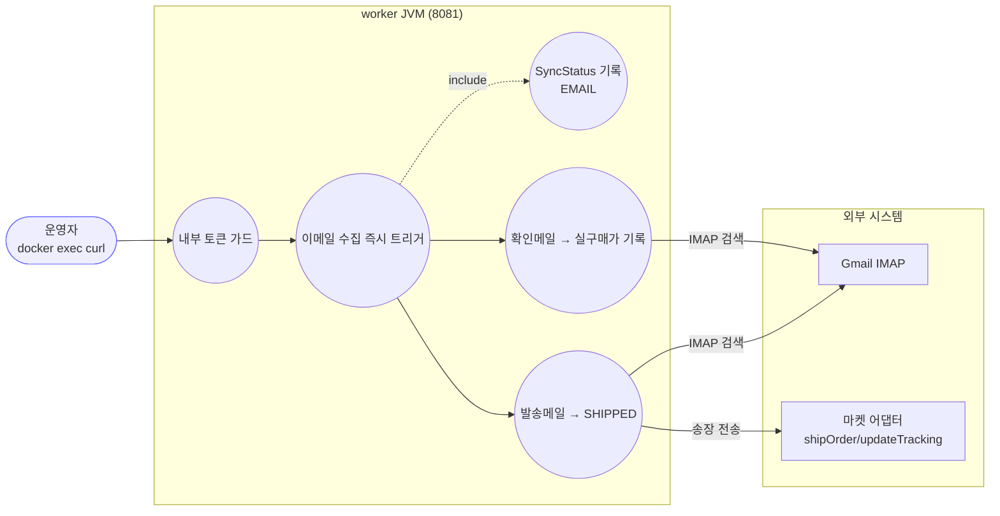
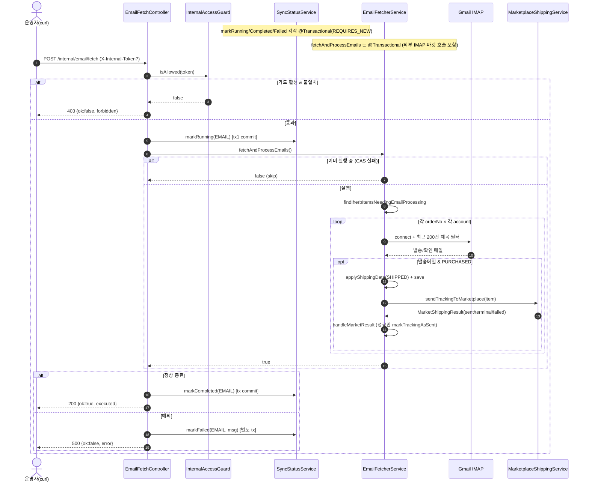
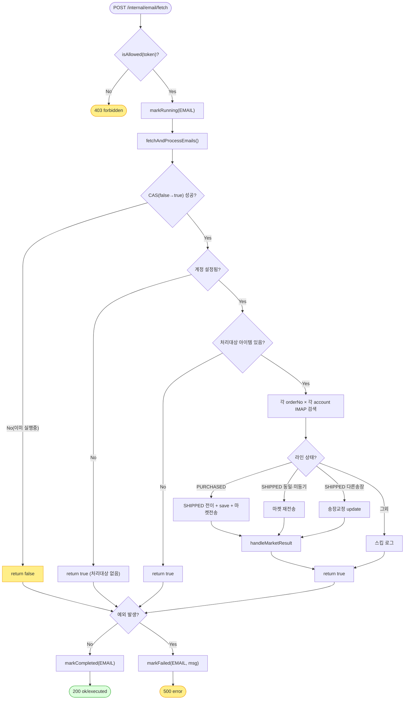

# POST /internal/email/fetch — iHerb 이메일 수집·송장 처리 즉시 트리거 (worker)

## 1. 개요

| 항목 | 내용 |
|------|------|
| **Method / URL** | `POST /internal/email/fetch` (worker JVM, 컨테이너 로컬 8081, nginx 미노출) |
| **목적** | 스케줄러(:00/:30) 대기 없이 iHerb IMAP 이메일 수집 → 발송/확인 메일 파싱 → 송장·실구매가 반영 → 마켓 송장 전송을 즉시 1회 실행한다. 운영/E2E 검증용 수동 트리거. |
| **핵심 상태전이** | 라인아이템 `PURCHASED → SHIPPED`(발송메일 매칭 시). 확인메일은 `sourcingAmount` 기록(상태 무변). `SyncStatus(EMAIL)` `RUNNING → COMPLETED/FAILED`. |
| **부수효과** | IMAP 접속(계정별), 마켓 송장 전송(`shipOrder`/`updateTracking`), 라인아이템 저장, `SyncStatus` DB upsert, 종결/실패 시 ActionLog. 재진입 가드로 동시 호출 스킵. |
| **응답** | 200 `{ok:true, executed:bool, message}` / 403 `{ok:false, message:"forbidden..."}`(토큰 불일치) / 500 `{ok:false, error}`(예외) |

## 2. 호출 체인

```
EmailFetchController.fetch(internalToken)                        worker/.../controller/EmailFetchController.java:39-66  (@PostMapping)
  ├─ internalAccessGuard.isAllowed(internalToken)               :43  → false 면 403 (:45-47)
  │     └─ InternalAccessGuard.isAllowed                        core/.../config/InternalAccessGuard.java:44-49  (토큰 미설정 시 항상 true, 무파손)
  ├─ syncStatusService.markRunning(SyncMarketKeys.EMAIL)        :50  @Transactional(REQUIRES_NEW)  core/.../sync/SyncStatusService.java:27-36
  ├─ emailFetcherService.fetchAndProcessEmails()                :54  @Transactional  worker/.../service/EmailFetcherService.java:59-99
  │     ├─ fetching.compareAndSet(false,true) → false 면 skip 반환 :62-65  (재진입 가드 F-MISC-18)
  │     ├─ properties.getAccounts() 비어있음 → return true       :67-70
  │     ├─ orderLineItemRepository.findIherbItemsNeedingEmailProcessing() :73
  │     ├─ sourcingOrderNo 추출·중복제거                          :80-87
  │     └─ for orderNo: searchAndProcessForOrderNo              :92-94
  │           └─ for account: searchInAccountForOrderNo         :104-198  (IMAP 접속·최근 200건 제목 필터)
  │                 ├─ parser.parseIherbShipment → processIherbShipment  :161-164 / :201-287
  │                 │     ├─ PURCHASED → applyShippingData(SHIPPED)+save  :262-273
  │                 │     ├─ SHIPPED 동일송장·미동기화 → 재시도             :218-236
  │                 │     ├─ SHIPPED 다른송장 → 송장교정(update)           :241-258
  │                 │     └─ marketplaceShippingService.sendTrackingToMarketplace(item, updateFlag) → handleMarketResult :234/256/280 → :296-318
  │                 │           └─ MarketShippingResult sent/terminal/failed  core/.../order/service/MarketShippingResult.java
  │                 └─ parser.parseIherbConfirmation → processIherbConfirmation :173-176 / :321-355
  │                       └─ sourcingAmount 기록(멱등)             :331-353
  ├─ syncStatusService.markCompleted(EMAIL)                     :55  @Transactional(REQUIRES_NEW)  SyncStatusService.java:77-86
  └─ (catch) syncStatusService.markFailed(EMAIL, msg) → 500      :60-64  SyncStatusService.java:88-97

[동일 서비스의 다른 진입점] OrderSyncScheduler.syncOrders (cron 0/30)  worker/.../scheduler/OrderSyncScheduler.java:34-46  → 같은 fetchAndProcessEmails 호출
```

**요청 헤더**

| 헤더 | 타입 | 필수 | 비고 |
|------|------|:---:|------|
| `X-Internal-Token` (`InternalAccessGuard.HEADER_NAME`) | String | 조건부 | `INTERNAL_API_TOKEN` env 설정 시에만 필수. 미설정 시 가드 비활성(모든 요청 통과). |

**응답 바디**

| 필드 | 값 | 조건 |
|------|-----|------|
| `ok` | true | 본처리 정상 종료 |
| `executed` | true/false | 실제 실행=true, 재진입 스킵=false |
| `message` | `"email fetch triggered"` / `"skipped: fetch already in progress"` | executed 값에 따라 |
| `ok/message` | false / `"forbidden: invalid internal token"` | 403 |
| `ok/error` | false / 예외메시지 | 500 |

## 3. 유스케이스 다이어그램



## 4. 시퀀스 다이어그램



## 5. 순서도 (플로우차트)



## 6. 상태 전이표

**엔드포인트 관점의 이중 상태:** (A) `SyncStatus(EMAIL)` 실행상태, (B) 매칭된 라인아이템 배송상태.

### (A) SyncStatus(EMAIL)

| 진입 | 트리거 | 결과 상태 | 비고 |
|------|--------|-----------|------|
| 임의 | markRunning(L50) | `RUNNING` | REQUIRES_NEW 독립 커밋 |
| RUNNING | 정상 종료(L55) | `COMPLETED` | executed 여부와 무관 |
| RUNNING | 예외(L61) | `FAILED` | errorMessage 기록 |

### (B) 라인아이템 배송상태 (processIherbShipment)

| 진입 배송상태 | 조건 | 허용? | 결과 | 마켓 전송 |
|-------------|------|:---:|------|-----------|
| `PURCHASED` | 발송메일 매칭 | ✅ | `SHIPPED`(송장·택배사 반영) | shipOrder(초기등록, update=false) |
| `SHIPPED` 동일송장·마켓동기완료 | trackingSentToMarket=true | — | 미변경 | 스킵 |
| `SHIPPED` 동일송장·마켓미동기 | trackingSentToMarket≠true | ✅(재시도) | 미변경 | shipOrder 재전송 |
| `SHIPPED` 다른송장 | 이메일 실송장 도착 | ✅ | `SHIPPED` 유지·송장 교체 | updateTracking(update=true) |
| 그 외(NEW/CANCELED 등) | — | — | 미변경 | 없음(스킵 로그 L282-284) |
| 확인메일(processIherbConfirmation) | sourcingAmount 미기록 | ✅ | `sourcingAmount` 기록(상태 무변) | 없음 · 멱등(L335) |

## 7. 🔎 발견사항

### MISCB-5 · 🟠 GAP — 재진입 스킵(executed=false)인데도 SyncStatus 는 COMPLETED 로 기록
- **근거:** 컨트롤러는 `markRunning`(`:50`) 후 `fetchAndProcessEmails()`(`:54`)가 재진입 가드로 `false`(스킵)를 반환해도 예외가 없으므로 `markCompleted(EMAIL)`(`:55`)을 호출한다. 즉 실제로 아무 처리도 하지 않은 이번 호출이 EMAIL 동기화를 "완료" 로 덮어쓴다.
- **영향:** 진행 중이던 다른 실행(스케줄러 or 선행 요청)이 아직 RUNNING인데, 스킵된 이번 호출이 `markCompleted` 로 `lastSyncAt` 을 갱신하고 상태를 COMPLETED로 조기 전환한다. `/orders/sync/status` 가 실제 진행 중인 작업을 "완료" 로 오표시할 수 있다. `markRunning`/`markCompleted` 가 원자적 클레임(`tryMarkRunning`)이 아니라 무조건 덮어쓰기라 더 취약.
- **제안:** `executed==false`(스킵)면 상태를 건드리지 않거나, 컨트롤러가 `tryMarkRunning`(`SyncStatusService.java:54-75`)로 클레임 성공한 경우에만 markCompleted/markFailed 를 수행하도록 정합화.

### MISCB-6 · 🟠 GAP — fetchAndProcessEmails 가 단일 @Transactional 이면서 장시간 IMAP·마켓 외부 호출을 트랜잭션 안에 포함
- **근거:** `EmailFetcherService.java:59` `@Transactional` 하위에서 계정별 IMAP 접속(connectiontimeout 10s·timeout 30s, `:125-126`)과 마켓 `sendTrackingToMarketplace`(`:234/256/280`)를 다수 주문번호×계정 루프로 수행한다.
- **영향:** DB 커넥션·트랜잭션을 외부 I/O 동안 장시간 점유(주문번호 N × 계정 M × 최대 40s IMAP). 커넥션 풀 고갈·락 보유 시간 증가 위험. 또한 루프 후반에서 언체크 예외가 나면 앞서 `save` 한 SHIPPED 전이가 함께 롤백되지만 **마켓엔 이미 송장이 나간 상태** → DB/마켓 불일치 창.
- **제안:** 트랜잭션 경계를 라인아이템 처리 단위로 좁히고(주문/아이템별 위임 tx), IMAP 수집은 트랜잭션 밖에서 수행. 최소한 마켓 전송 후 저장 실패 시나리오를 문서화.

### MISCB-7 · 🟡 SMELL — Gmail 최근 200건 제목 필터의 창(window) 한계로 오래된 주문번호 이메일 누락 가능
- **근거:** `searchInAccountForOrderNo` `:141` `int start = Math.max(1, totalMessages - 199)` — 항상 최근 200건만 스캔한다(`searchConfirmationInAccount` `:421` 동일).
- **영향:** 이메일 계정 수신량이 많아 발송/확인 메일이 최근 200건 밖으로 밀리면 해당 주문의 송장/실구매가가 영구 미반영. 재시도해도 창이 계속 밀려 회복되지 않음.
- **제안:** IMAP `SearchTerm`(SubjectTerm/날짜범위) 또는 UID 기반 증분 조회로 창 의존 제거. Gmail SubjectTerm 미지원 제약이 근거라면 최소한 스캔 폭을 설정화하고 미매칭 잔여를 경고 지표로 노출.

### MISCB-8 · 🟡 SMELL — 매 (주문번호 × 계정) 마다 IMAP 재접속 — INBOX 전체 재조회 반복
- **근거:** `searchAndProcessForOrderNo`(`:104-108`)가 주문번호마다 모든 계정을 돌고, 각 호출이 `store.connect`·`inbox.getMessages(start,total)`를 새로 수행(`:129-144`). N개 주문번호면 계정당 N회 접속·N회 최근 200건 로드.
- **영향:** 불필요한 IMAP 접속·메시지 페치 반복으로 지연·서버 부하 증가. 처리대상 주문번호가 많을수록 선형 악화(MISCB-6의 tx 점유와 복합).
- **제안:** 계정당 1회 접속으로 최근 메시지를 한 번 로드한 뒤, 대상 주문번호 집합을 메모리에서 매칭. 접속 재사용으로 왕복 축소.

### MISCB-9 · 🔵 NOTE — 500 응답 바디가 원시 예외 메시지(`e.getMessage()`)를 그대로 노출
- **근거:** `EmailFetchController.java:63-64` `body(Map.of("ok", false, "error", String.valueOf(e.getMessage())))`.
- **영향:** 내부 전용(8081, nginx 미노출) 엔드포인트라 노출 위험은 낮으나, 예외 메시지에 IMAP 호스트·계정 등 세부가 실릴 수 있음. `markFailed` 에도 동일 메시지가 DB에 저장됨.
- **제안:** 내부 트리거임을 감안해 현 상태 유지 가능하나, 운영 로그로 충분하면 응답 바디는 일반화 메시지로 축소 검토.

## 8. 테스트 커버리지 메모

- **존재:**
  - `EmailFetchControllerGuardTest.java`(worker) — 토큰 가드: 활성+헤더누락/불일치 → 403, 일치 → 실행, 비활성 → 통과(4케이스). 서비스는 mock.
  - `EmailFetchControllerSyncStatusTest.java` — 성공 시 `markRunning→markCompleted`, 실패 시 `markRunning→markFailed`, 403 시 아무것도 기록 안 함(3케이스).
  - `EmailFetchControllerResultTest.java` — executed=true/false 가 응답 바디에 반영되는지(2케이스).
  - `EmailFetcherServiceTest.java` — 서비스 단위(파싱·상태전이 등) 테스트 존재.
- **비어있는 케이스:** ① 재진입 스킵(executed=false)일 때 SyncStatus 를 COMPLETED로 덮는 동작(MISCB-5)을 검증/고정하는 테스트 없음 — 회귀 방어 공백. ② 마켓 전송 성공 후 저장/후속 예외 시 롤백-마켓 불일치(MISCB-6). ③ IMAP 200건 창 밖 누락(MISCB-7). ④ 다계정×다주문 접속 반복(MISCB-8)의 성능 계약. 컨트롤러 레벨은 잘 커버되나, 실제 IMAP·마켓 통합 경로와 트랜잭션 경계는 미검증.

---
*생성: 2026-07-17 · 근거: 현재 워킹트리*
