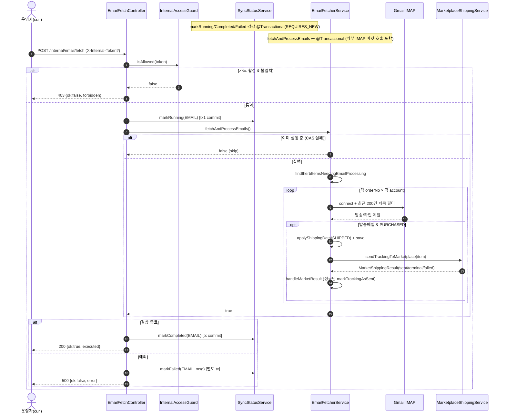

# POST /internal/email/fetch — iHerb 이메일 즉시 수집·송장 반영(worker 전용 수동 트리거)

## 1. 개요

이 기능은 iHerb에서 온 메일함을 지금 당장 한 번 훑어, 발송/확인 메일을 읽고, 거기서 얻은 송장 번호와 실제 구매 금액을 우리 주문에 반영한 뒤 마켓에 송장까지 보내주는 "즉시 실행 버튼"입니다. 평소엔 정해진 시각(매시 00분·30분)에 자동으로 도는데, 그걸 기다리지 않고 손으로 한 번 돌리고 싶을 때(운영 점검이나 테스트) 이 버튼을 씁니다.

| 항목 | 쉬운 설명 |
|------|------|
| **Method / URL** | `POST /internal/email/fetch` (worker 서버, 컨테이너 안쪽 8081 포트, 외부(nginx)로는 안 열림) — 내부에서만 부르는 주소입니다. |
| **목적** | 스케줄러(매시 00분/30분)를 기다리지 않고, iHerb 메일함(IMAP)에서 이메일을 수집 → 발송/확인 메일을 읽어 → 송장·실구매가를 반영 → 마켓에 송장 전송까지를 지금 즉시 1회 실행합니다. 운영 점검·E2E 검증용 수동 실행 버튼입니다. |
| **핵심 상태전이** | 발송 메일이 매칭되면 그 주문 항목이 `PURCHASED(구매완료) → SHIPPED(발송됨)` 로 바뀝니다. 확인 메일은 실구매가(`sourcingAmount`)만 기록하고 상태는 바꾸지 않습니다. 그리고 이메일 동기화 진행 표시(`SyncStatus(EMAIL)`)가 `RUNNING(진행중) → COMPLETED(완료)/FAILED(실패)` 로 바뀝니다. |
| **부수효과** | 계정별로 메일함(IMAP)에 접속, 마켓에 송장 전송(`shipOrder`/`updateTracking`), 주문 항목 저장, 동기화 상태(`SyncStatus`) DB 기록, 끝나거나 실패하면 운영 기록(ActionLog) 남김. 같은 작업이 이미 돌고 있으면(재진입 가드) 새 호출은 건너뜁니다. |
| **응답** | 200 `{ok:true, executed:bool, message}`(정상) / 403 `{ok:false, message:"forbidden..."}`(토큰이 안 맞을 때) / 500 `{ok:false, error}`(중간에 오류가 났을 때) |

## 2. 호출 체인

아래는 이 기능이 실제로 코드에서 어떤 순서로 흘러가는지입니다. 각 단계 아래에 "쉽게 말하면"으로 뜻을 풀어 두었습니다.

```
EmailFetchController.fetch(internalToken)                        worker/.../controller/EmailFetchController.java:39-66  (@PostMapping)
  ├─ internalAccessGuard.isAllowed(internalToken)               :43  → false 면 403 (:45-47)
  │     └─ InternalAccessGuard.isAllowed                        core/.../config/InternalAccessGuard.java:44-49  (토큰 미설정 시 항상 true, 무파손)
  ├─ syncStatusService.markRunning(SyncMarketKeys.EMAIL)        :50  @Transactional(REQUIRES_NEW)  core/.../sync/SyncStatusService.java:27-36
  ├─ emailFetcherService.fetchAndProcessEmails()                :54  @Transactional  worker/.../service/EmailFetcherService.java:59-99
  │     ├─ fetching.compareAndSet(false,true) → false 면 skip 반환 :62-65  (재진입 가드 F-MISC-18)
  │     ├─ properties.getAccounts() 비어있음 → return true       :67-70
  │     ├─ orderLineItemRepository.findIherbItemsNeedingEmailProcessing() :73
  │     ├─ sourcingOrderNo 추출·중복제거                          :80-87
  │     └─ for orderNo: searchAndProcessForOrderNo              :92-94
  │           └─ for account: searchInAccountForOrderNo         :104-198  (IMAP 접속·최근 200건 제목 필터)
  │                 ├─ parser.parseIherbShipment → processIherbShipment  :161-164 / :201-287
  │                 │     ├─ PURCHASED → applyShippingData(SHIPPED)+save  :262-273
  │                 │     ├─ SHIPPED 동일송장·미동기화 → 재시도             :218-236
  │                 │     ├─ SHIPPED 다른송장 → 송장교정(update)           :241-258
  │                 │     └─ marketplaceShippingService.sendTrackingToMarketplace(item, updateFlag) → handleMarketResult :234/256/280 → :296-318
  │                 │           └─ MarketShippingResult sent/terminal/failed  core/.../order/service/MarketShippingResult.java
  │                 └─ parser.parseIherbConfirmation → processIherbConfirmation :173-176 / :321-355
  │                       └─ sourcingAmount 기록(멱등)             :331-353
  ├─ syncStatusService.markCompleted(EMAIL)                     :55  @Transactional(REQUIRES_NEW)  SyncStatusService.java:77-86
  └─ (catch) syncStatusService.markFailed(EMAIL, msg) → 500      :60-64  SyncStatusService.java:88-97

[동일 서비스의 다른 진입점] OrderSyncScheduler.syncOrders (cron 0/30)  worker/.../scheduler/OrderSyncScheduler.java:34-46  → 같은 fetchAndProcessEmails 호출
```

→ 쉽게 말하면:
- **먼저 출입증 검사(isAllowed):** 요청에 담긴 내부 토큰이 맞는지 봅니다(`:43`). 안 맞으면 곧바로 403(출입 거부)으로 끝냅니다. 단, 토큰을 아예 설정 안 해 둔 환경에서는 이 검사가 항상 통과합니다.
- **"진행중" 표시 켜기(markRunning):** 이메일 동기화가 지금 돌고 있다고 상태판에 켭니다(`:50`). 이 기록은 본작업과 분리된 독립 저장(REQUIRES_NEW)이라 따로 확정됩니다.
- **본작업 실행(fetchAndProcessEmails):** 실제로 메일을 수집·처리합니다(`:54`).
  - 먼저 같은 작업이 이미 돌고 있으면 이번 호출은 그냥 건너뜁니다(재진입 가드, `:62-65`). → 쉽게 말하면 "이미 누가 돌리고 있으면 중복으로 안 돌린다".
  - 메일 계정이 하나도 설정 안 돼 있으면 할 일이 없으니 바로 끝냅니다(`:67-70`).
  - 이메일 처리가 필요한 iHerb 주문 항목들을 찾고(`:73`), 거기서 구매 주문번호를 뽑아 중복을 제거합니다(`:80-87`).
  - 그다음 주문번호마다, 그리고 계정마다 메일함에 접속해 최근 200건 제목을 훑어(`:104-198`) 관련 메일을 찾습니다.
    - **발송 메일**을 찾으면(`processIherbShipment`): 항목이 `PURCHASED` 면 `SHIPPED` 로 바꿔 저장하고(`:262-273`), 이미 `SHIPPED` 인데 송장이 같고 아직 마켓에 안 보냈으면 다시 보내며(`:218-236`), 송장이 다르면 송장을 새 값으로 고쳐 보냅니다(`:241-258`). 그리고 마켓에 송장을 전송(`sendTrackingToMarketplace`)한 뒤 그 결과(보냄/최종불가/실패)를 처리합니다.
    - **확인 메일**을 찾으면(`processIherbConfirmation`): 실구매가(`sourcingAmount`)만 기록합니다. 여러 번 처리해도 같은 결과가 되도록(멱등) 만들어져 있습니다(`:331-353`).
- **끝나면 "완료" 표시(markCompleted):** 정상 종료되면 상태판을 완료로 바꿉니다(`:55`).
- **오류 나면 "실패" 표시(markFailed):** 중간에 예외가 나면 상태판을 실패로 바꾸고 500으로 응답합니다(`:60-64`).
- **또 다른 진입점:** 위 본작업(`fetchAndProcessEmails`)은 정해진 시각에 도는 스케줄러(cron 00분/30분)도 똑같이 호출합니다. 즉 손으로 누르는 이 버튼과 자동 스케줄이 같은 처리 로직을 씁니다.

**요청 헤더**

| 헤더 | 타입 | 필수 | 쉬운 뜻 |
|------|------|:---:|------|
| `X-Internal-Token` (`InternalAccessGuard.HEADER_NAME`) | String | 조건부 | 내부 출입증(토큰)입니다. `INTERNAL_API_TOKEN` 환경설정이 켜져 있을 때만 꼭 필요합니다. 설정을 안 해 두면 이 검사가 꺼져서 모든 요청이 그냥 통과합니다. |

**응답 바디**

| 필드 | 값 | 언제 그런가 |
|------|-----|------|
| `ok` | true | 본처리가 정상적으로 끝났을 때 |
| `executed` | true/false | 실제로 돌렸으면 true, 이미 돌고 있어서 건너뛰었으면 false |
| `message` | `"email fetch triggered"` / `"skipped: fetch already in progress"` | executed 값에 따라(실행됨 / 이미 진행중이라 건너뜀) |
| `ok/message` | false / `"forbidden: invalid internal token"` | 출입증이 안 맞을 때(403) |
| `ok/error` | false / 예외메시지 | 중간에 오류가 났을 때(500) |

## 3. 유스케이스 다이어그램

👉 이 그림은 운영자가 내부 토큰 검사를 통과해 이메일 수집을 즉시 실행하면, 발송 메일은 발송됨(SHIPPED) 처리로, 확인 메일은 실구매가 기록으로 이어지고, 그 과정에서 Gmail 메일함과 마켓 어댑터를 외부로 호출한다는 관계를 보여줍니다.


## 4. 시퀀스 다이어그램

👉 이 그림은 요청이 들어와 출입증 검사를 통과한 뒤, "진행중" 표시를 켜고 메일함을 계정·주문번호마다 훑어 발송 메일을 SHIPPED 처리하고 마켓에 보낸 다음, 정상이면 완료·오류면 실패로 마무리되기까지의 시간 순서를 보여줍니다.



## 5. 순서도 (플로우차트)

👉 이 그림은 출입증 검사부터 시작해, 중복 실행 여부·계정 설정·처리 대상 유무를 차례로 확인하고, 주문 항목의 상태에 따라 발송/재전송/송장교정을 나눠 처리한 뒤 완료 또는 실패로 끝나는 갈림길들을 순서대로 보여줍니다.


## 6. 상태 전이표

**이 기능은 두 가지 상태를 함께 다룹니다:** (A) 이메일 동기화 자체가 지금 어떤 단계인지(`SyncStatus(EMAIL)`), (B) 메일과 매칭된 주문 항목의 배송상태.

### (A) 이메일 동기화 진행 상태 SyncStatus(EMAIL)

| 시작 | 언제 | 바뀐 상태 | 쉬운 뜻 |
|------|--------|-----------|------|
| 아무 상태 | markRunning(L50) | `RUNNING` | 이메일 수집을 지금 시작함(따로 독립 저장 REQUIRES_NEW) |
| RUNNING | 정상 종료(L55) | `COMPLETED` | 잘 끝남(실제로 뭔가 처리했는지 여부와 무관하게) |
| RUNNING | 예외(L61) | `FAILED` | 도중에 오류로 실패함(실패 사유도 기록) |

### (B) 주문 항목의 배송상태 (processIherbShipment)

| 처음 배송상태 | 조건 | 처리함? | 결과 | 마켓 전송 | 쉬운 뜻 |
|-------------|------|:---:|------|-----------|------|
| `PURCHASED` | 발송 메일이 매칭됨 | ✅ | `SHIPPED`(송장·택배사 채움) | shipOrder(최초등록, update=false) | 구매완료 항목에 발송 메일이 오면 발송됨으로 바꾸고 마켓에 송장 최초 등록 |
| `SHIPPED` 동일송장·마켓동기완료 | trackingSentToMarket=true | — | 안 바꿈 | 스킵 | 이미 같은 송장으로 마켓까지 다 보낸 상태라 아무것도 안 함 |
| `SHIPPED` 동일송장·마켓미동기 | trackingSentToMarket≠true | ✅(재시도) | 안 바꿈 | shipOrder 재전송 | 같은 송장인데 마켓에 아직 못 보냈으면 다시 보냄 |
| `SHIPPED` 다른송장 | 이메일로 진짜 송장이 도착 | ✅ | `SHIPPED` 유지·송장만 교체 | updateTracking(update=true) | 송장이 바뀌었으면 새 송장으로 마켓에 수정 요청 |
| 그 외(NEW/CANCELED 등) | — | — | 안 바꿈 | 없음(건너뜀 로그 L282-284) | 발송 대상이 아닌 상태는 손대지 않음 |
| 확인 메일(processIherbConfirmation) | 실구매가가 아직 기록 안 됨 | ✅ | 실구매가(`sourcingAmount`) 기록(상태 무변) | 없음 · 여러 번 해도 같음(멱등, L335) | 확인 메일은 실제 구매 금액만 채우고 상태는 안 건드림 |

## 7. 🔎 발견사항

### MISCB-5 · 🟠 GAP — 이미 돌고 있어서 이번 호출이 건너뛰었는데(executed=false)도, 동기화 상태를 "완료(COMPLETED)"로 덮어써 버린다
- **무엇이 문제인가:** 컨트롤러는 먼저 상태를 "진행중"으로 켠 뒤(`:50`) 본작업(`:54`)을 부릅니다. 그런데 본작업이 "이미 누가 돌리고 있어서 건너뜀"으로 `false` 를 돌려줘도, 이건 오류가 아니라서 컨트롤러는 그대로 "완료(`markCompleted`, `:55`)"를 찍습니다. 즉, 사실상 아무 일도 안 한 이번 호출이 이메일 동기화를 "완료됐다"고 덮어써 버립니다.
- **근거:** 컨트롤러는 `markRunning`(`:50`) 후 `fetchAndProcessEmails()`(`:54`)가 재진입 가드로 `false`(스킵)를 반환해도 예외가 없으므로 `markCompleted(EMAIL)`(`:55`)을 호출한다. 즉 실제로 아무 처리도 하지 않은 이번 호출이 EMAIL 동기화를 "완료" 로 덮어쓴다.
- **왜 문제인가:** 진짜로 처리 중인 다른 실행(스케줄러거나 먼저 들어온 요청)이 아직 "진행중"인데, 건너뛴 이번 호출이 상태를 "완료"로 앞당겨 바꾸고 마지막 동기화 시각(`lastSyncAt`)까지 갱신합니다. 그러면 `/orders/sync/status` 화면이 실제로는 아직 돌고 있는 작업을 "완료"라고 잘못 보여줄 수 있습니다. 게다가 "진행중"·"완료" 표시가 딱 한 명만 차지하는 잠금(`tryMarkRunning`) 방식이 아니라 무조건 덮어쓰기라 더 잘 어긋납니다.
- **제안:** 건너뛴 경우(`executed==false`)에는 상태를 아예 건드리지 않거나, 컨트롤러가 `tryMarkRunning`(`SyncStatusService.java:54-75`)으로 "내가 이 작업을 차지했다"고 성공했을 때만 완료/실패 표시를 하도록 맞춥니다.

### MISCB-6 · 🟠 GAP — 본작업 전체를 하나의 저장 묶음(트랜잭션)으로 감싼 채, 오래 걸리는 메일함·마켓 외부 호출까지 그 안에서 다 한다
- **무엇이 문제인가:** 본작업(`fetchAndProcessEmails`)은 하나의 트랜잭션 안에서, 계정마다 메일함에 접속(접속 대기 10초·응답 대기 30초)하고 마켓에 송장을 전송하는 일을, 주문번호 × 계정 수만큼 반복해서 수행합니다.
- **근거:** `EmailFetcherService.java:59` `@Transactional` 하위에서 계정별 IMAP 접속(connectiontimeout 10s·timeout 30s, `:125-126`)과 마켓 `sendTrackingToMarketplace`(`:234/256/280`)를 다수 주문번호×계정 루프로 수행한다.
- **왜 문제인가:** ① 외부(메일함·마켓)와 통신하는 내내 DB 연결과 트랜잭션을 붙잡고 있어(주문번호 N × 계정 M × 최대 40초 메일접속), 연결이 고갈되거나 잠금을 오래 쥐고 있을 위험이 커집니다. ② 반복 루프 뒷부분에서 예상 못 한 오류가 나면, 앞서 저장한 "발송됨(SHIPPED)" 변경이 함께 되돌려지는데 **마켓에는 이미 송장이 나가 버린 상태**라, 우리 DB와 마켓이 서로 다른 값이 되는 어긋남 구간이 생깁니다.
- **제안:** 저장 묶음의 범위를 주문·항목 하나 단위로 좁히고(항목별로 위임 트랜잭션), 메일 수집 자체는 트랜잭션 밖에서 하도록 합니다. 최소한 "마켓에 송장을 보낸 뒤 저장이 실패하는" 시나리오를 문서로 남깁니다.

### MISCB-7 · 🟡 SMELL — 메일함에서 최근 200건 제목만 훑기 때문에, 오래된 주문의 메일이 그 범위 밖으로 밀리면 영영 못 찾을 수 있다
- **무엇이 문제인가:** 메일 검색은 항상 가장 최근 200건만 봅니다. 그보다 앞에 온 메일은 아예 검색 대상에서 빠집니다.
- **근거:** `searchInAccountForOrderNo` `:141` `int start = Math.max(1, totalMessages - 199)` — 항상 최근 200건만 스캔한다(`searchConfirmationInAccount` `:421` 동일).
- **왜 문제인가:** 계정에 메일이 많이 쌓여서 발송/확인 메일이 최근 200건 밖으로 밀려나면, 그 주문의 송장과 실구매가가 영원히 반영되지 않습니다. 다시 돌려도 창(최근 200건 범위)이 계속 밀려나기 때문에 스스로 회복되지 않습니다.
- **제안:** 메일함 검색을 제목·날짜 조건(`SearchTerm` 의 SubjectTerm/날짜범위)이나 메일 고유번호(UID) 기반 증분 조회로 바꿔 "최근 200건" 의존을 없앱니다. Gmail이 제목 검색을 제한해서 어쩔 수 없다면, 최소한 스캔 범위를 설정으로 조절할 수 있게 하고 못 찾은 잔여 건을 경고 지표로 드러냅니다.

### MISCB-8 · 🟡 SMELL — (주문번호 × 계정) 조합마다 메일함에 새로 접속해 받은편지함 전체를 매번 다시 읽는다
- **무엇이 문제인가:** 주문번호 하나를 처리할 때마다 모든 계정을 돌고, 그때마다 메일함에 새로 접속해 최근 메시지를 다시 불러옵니다. 주문번호가 N개면 계정마다 N번씩 접속하고 N번씩 최근 200건을 읽습니다.
- **근거:** `searchAndProcessForOrderNo`(`:104-108`)가 주문번호마다 모든 계정을 돌고, 각 호출이 `store.connect`·`inbox.getMessages(start,total)`를 새로 수행(`:129-144`). N개 주문번호면 계정당 N회 접속·N회 최근 200건 로드.
- **왜 문제인가:** 불필요한 접속과 메일 다시읽기가 반복되어 느려지고 서버 부하가 늘어납니다. 처리할 주문번호가 많을수록 이 낭비가 비례해서 커지고(선형 악화), MISCB-6의 "트랜잭션을 오래 붙잡는 문제"와 겹쳐 더 나빠집니다.
- **제안:** 계정마다 한 번만 접속해 최근 메일을 한 번에 불러온 뒤, 찾아야 할 주문번호들을 메모리에서 한꺼번에 매칭합니다. 접속을 재사용해 왕복을 줄입니다.

### MISCB-9 · 🔵 NOTE — 500 응답에 원본 오류 메시지(`e.getMessage()`)를 그대로 담아 보낸다
- **무엇이 문제인가:** 오류가 나면 응답 본문에 예외 메시지를 그대로 실어 돌려줍니다.
- **근거:** `EmailFetchController.java:63-64` `body(Map.of("ok", false, "error", String.valueOf(e.getMessage())))`.
- **왜 문제인가:** 이 주소는 내부 전용(8081, 외부 nginx로 안 열림)이라 노출 위험은 낮지만, 예외 메시지에 메일 서버 주소나 계정 같은 세부 정보가 실릴 수 있습니다. 같은 메시지가 실패 기록(`markFailed`)으로 DB에도 저장됩니다.
- **제안:** 내부 트리거라는 점을 감안하면 지금 상태를 유지해도 되지만, 운영 로그만으로 충분하다면 응답 본문은 일반적인 문구로 줄이는 것을 검토합니다.

## 8. 테스트 커버리지 메모

- **이미 있는 테스트:**
  - `EmailFetchControllerGuardTest.java`(worker) — 출입증(토큰) 검사: 검사 켜짐 + 헤더 없음/안 맞음 → 403, 맞음 → 실행, 검사 꺼짐 → 통과(4케이스). 서비스는 가짜(mock)로 대체.
  - `EmailFetchControllerSyncStatusTest.java` — 성공하면 `진행중→완료`, 실패하면 `진행중→실패`, 403이면 아무것도 기록 안 함(3케이스).
  - `EmailFetchControllerResultTest.java` — executed=true/false 가 응답 본문에 제대로 담기는지(2케이스).
  - `EmailFetcherServiceTest.java` — 서비스 단위(메일 파싱·상태전이 등) 테스트가 있음.
- **아직 없는 테스트:** ① 건너뛴 경우(executed=false)에 동기화 상태를 "완료"로 덮어쓰는 동작(MISCB-5)을 확인·고정하는 테스트가 없습니다 — 재발 방어 공백. ② 마켓에 송장을 보낸 뒤 저장·후속 처리에서 오류가 나 되돌려질 때 마켓과 어긋나는 문제(MISCB-6). ③ 최근 200건 범위 밖 메일이 누락되는 문제(MISCB-7). ④ 여러 계정 × 여러 주문에서 접속이 반복되는 성능 문제(MISCB-8). 컨트롤러 수준은 잘 덮여 있지만, 실제 메일함·마켓과 이어지는 통합 경로와 트랜잭션 범위는 아직 검증되지 않았습니다.

---
*(쉬운 설명판 · 2026-07-17 재작성)*
*생성: 2026-07-17 · 근거: 현재 워킹트리*
