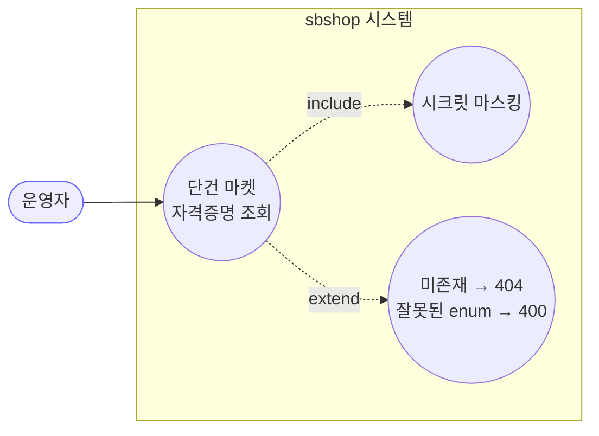
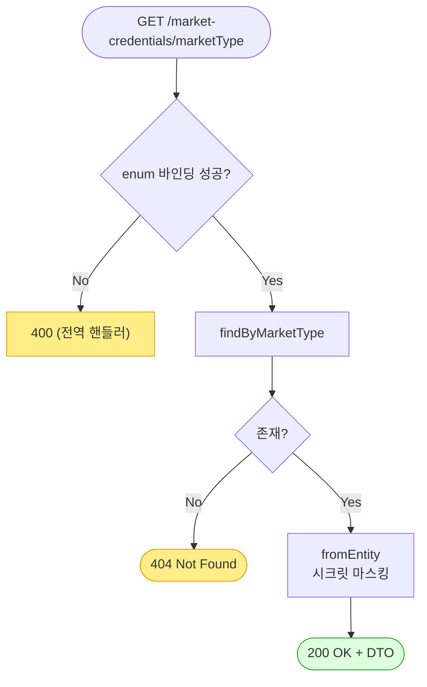

# GET /market-credentials/{marketType} — 단건 마켓 자격증명 조회

## 1. 개요

| 항목 | 내용 |
|------|------|
| **Method / URL** | `GET /api/v1/market-credentials/{marketType}` (경로변수 `marketType`: `MarketType` enum) |
| **목적** | 특정 마켓의 자격증명 1건을 조회한다(설정 폼 프리필용). |
| **핵심 상태전이** | 상태 전이 없음(조회) |
| **부수효과** | 없음. `@Transactional(readOnly = true)`. |
| **응답** | 존재 시 `200 OK` + `MarketCredentialDto`(시크릿 마스킹), 없으면 `404 Not Found`, 잘못된 enum 값이면 `400`(전역 핸들러) |

## 2. 호출 체인

```
MarketCredentialController.getCredential(MarketType marketType)   api/.../controller/MarketCredentialController.java:36-41
  └─ MarketCredentialService.getCredential(marketType)            core/.../application/market/MarketCredentialService.java:27-32  @Transactional(readOnly=true)
       ├─ MarketCredentialRepository.findByMarketType(marketType) core/.../domain/market/repository/MarketCredentialRepository.java:11
       ├─ .map(MarketCredentialDto::fromEntity)                   core/.../application/market/dto/MarketCredentialDto.java:20-31 (시크릿 마스킹)
       └─ .orElse(null)                                           MarketCredentialService.java:31
  └─ dto != null ? ok(dto) : notFound()                           MarketCredentialController.java:40
  (marketType enum 바인딩 실패 시) MethodArgumentTypeMismatchException
       └─ GlobalExceptionHandler.handleTypeMismatch → 400          api/.../exception/GlobalExceptionHandler.java:19-25
```

**경로변수**

| 이름 | 타입 | 비고 |
|------|------|------|
| `marketType` | MarketType(enum) | 미매칭 값(예: `FOO`)은 `MethodArgumentTypeMismatchException` → 전역 핸들러가 400 반환 |

## 3. 유스케이스 다이어그램



## 4. 시퀀스 다이어그램

```mermaid
sequenceDiagram
    autonumber
    actor U as 운영자
    participant C as MarketCredentialController
    participant S as MarketCredentialService
    participant R as MarketCredentialRepository
    participant D as MarketCredentialDto
    participant G as GlobalExceptionHandler
    Note over S: getCredential 는 @Transactional(readOnly=true) — 쓰기·롤백 경계 없음

    U->>C: GET /market-credentials/{marketType}
    alt marketType enum 바인딩 실패
        C-->>G: MethodArgumentTypeMismatchException
        G-->>U: 400 (success:false)
    else 바인딩 성공
        C->>S: getCredential(marketType)
        S->>R: findByMarketType(marketType)
        R-->>S: Optional&lt;MarketCredential&gt;
        alt 존재
            S->>D: fromEntity(credential)
            D-->>S: MarketCredentialDto (마스킹)
            S-->>C: dto
            C-->>U: 200 OK + MarketCredentialDto
        else 없음
            S-->>C: null
            C-->>U: 404 Not Found
        end
    end
```

## 5. 순서도 (플로우차트)



## 6. 상태 전이표

| 진입 상태 | 허용? | 결과 상태 | 마켓 전송 | 비고 |
|-----------|:-----:|-----------|-----------|------|
| — | — | — | — | 상태 전이 없음(조회). 읽기 전용, 부수효과 없음. |

## 7. 🔎 발견사항

### CRED-2 · 🔵 NOTE — 잘못된 enum 경로변수는 전역 핸들러로 400 처리됨(SP-7/F-CRED-4 계약 유지 확인)
- **근거:** `MarketCredentialController.java:37-38`이 `@PathVariable MarketType marketType`을 받고, 미매칭 값은 Spring MVC가 `MethodArgumentTypeMismatchException`을 던진다. `GlobalExceptionHandler.java:19-25`가 이를 `400 + {success:false, message}`로 변환한다. `EnumPathVariableMismatchTest`(`api/.../exception/EnumPathVariableMismatchTest.java:46-53`)가 이 계약을 고정.
- **영향:** 잘못된 마켓명 요청이 500이 아닌 400으로 표면화되어 정상. 발견이 아니라 계약 확인 노트.
- **제안:** 없음(현행 유지). 신규 마켓 enum 추가 시 회귀 테스트 유효.

### CRED-3 · 🔵 NOTE — 무인증 단건 조회(`@CrossOrigin(origins = "*")`)
- **근거:** `MarketCredentialController.java:24` CORS 전체 허용, 인증/인가 애너테이션 부재. 시크릿은 `MarketCredentialDto`(`MarketCredentialDto.java:16-18`)에서 마스킹.
- **영향:** 시크릿 평문 미노출로 유출 위험 낮음. `clientId`·`redirectUri`·연동 여부는 무인증 노출.
- **제안:** 운영 환경 CORS·인증 정책 문서화(list-credentials CRED-1과 동일 성격).

## 8. 테스트 커버리지 메모

- **직접 대상 테스트:** `EnumPathVariableMismatchTest`(`api/.../exception/EnumPathVariableMismatchTest.java`)가 잘못된 enum 경로변수 → 400 계약을 MockMvc로 검증(standalone + `GlobalExceptionHandler` 적용).
- **간접 커버:** `MarketCredentialDtoMaskingTest`가 단건 응답 조립(`fromEntity`)의 시크릿 마스킹을 고정.
- **비어있는 케이스:** ① 존재하는 마켓 조회 시 200 + 정확한 필드 매핑, ② 미존재 마켓 → 404(현재 404 경로 `MarketCredentialController.java:40`에 대한 명시 테스트 없음).

---
*생성: 2026-07-17 · 근거: 현재 워킹트리*
