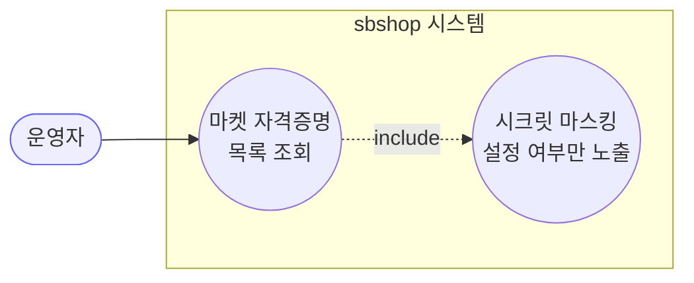

# GET /market-credentials — 마켓 자격증명 전체 조회

## 1. 개요

| 항목 | 내용 |
|------|------|
| **Method / URL** | `GET /api/v1/market-credentials` |
| **목적** | 등록된 모든 마켓 자격증명을 목록으로 반환한다(설정 폼·연동 현황 표시용). |
| **핵심 상태전이** | 상태 전이 없음(조회) |
| **부수효과** | 없음. `@Transactional(readOnly = true)`. |
| **응답** | `200 OK` + `List<MarketCredentialDto>` (시크릿 평문 없음, `hasAccessKey`/`hasSecretKey`/`hasRefreshToken` 불리언만) |

## 2. 호출 체인

```
MarketCredentialController.getAllCredentials()          api/.../controller/MarketCredentialController.java:31-34
  └─ MarketCredentialService.getAllCredentials()        core/.../application/market/MarketCredentialService.java:21-25  @Transactional(readOnly=true)
       ├─ MarketCredentialRepository.findAll()          core/.../domain/market/repository/MarketCredentialRepository.java:10 (JpaRepository)
       └─ .map(MarketCredentialDto::fromEntity)         core/.../application/market/dto/MarketCredentialDto.java:20-31
            ├─ setClientId / setRedirectUri (평문 유지)  MarketCredentialDto.java:25-26
            └─ setHasAccessKey/HasSecretKey/HasRefreshToken (불리언 마스킹)  MarketCredentialDto.java:27-29
  └─ ResponseEntity.ok(...)                              MarketCredentialController.java:33
```

**응답 DTO (`MarketCredentialDto`, `MarketCredentialDto.java:8-31`)**

| 필드 | 타입 | 비고 |
|------|------|------|
| `id` | Long | PK |
| `marketType` | MarketType | 마켓 종류 |
| `clientId` | String | 평문 유지(식별자, 프론트 OAuth 조립에 필요) |
| `redirectUri` | String | 평문 유지 |
| `hasAccessKey` | boolean | accessKey 설정 여부만 노출(평문 미노출) |
| `hasSecretKey` | boolean | secretKey 설정 여부만 노출 |
| `hasRefreshToken` | boolean | refreshToken 설정 여부만 노출 |

## 3. 유스케이스 다이어그램



## 4. 시퀀스 다이어그램

```mermaid
sequenceDiagram
    autonumber
    actor U as 운영자
    participant C as MarketCredentialController
    participant S as MarketCredentialService
    participant R as MarketCredentialRepository
    participant D as MarketCredentialDto
    Note over S: getAllCredentials 는 @Transactional(readOnly=true) — 쓰기·롤백 경계 없음

    U->>C: GET /market-credentials
    C->>S: getAllCredentials()
    S->>R: findAll()
    R-->>S: List&lt;MarketCredential&gt;
    loop 각 엔티티
        S->>D: fromEntity(credential)
        D-->>S: MarketCredentialDto (시크릿 마스킹)
    end
    S-->>C: List&lt;MarketCredentialDto&gt;
    C-->>U: 200 OK + List&lt;MarketCredentialDto&gt;
```

## 5. 순서도 (플로우차트)


## 6. 상태 전이표

| 진입 상태 | 허용? | 결과 상태 | 마켓 전송 | 비고 |
|-----------|:-----:|-----------|-----------|------|
| — | — | — | — | 상태 전이 없음(조회). 읽기 전용, 부수효과 없음. |

## 7. 🔎 발견사항

### CRED-1 · 🔵 NOTE — 무인증 조회 엔드포인트(`@CrossOrigin(origins = "*")`, 인증 필터 없음)
- **근거:** `MarketCredentialController.java:24` `@CrossOrigin(origins = "*")`, 컨트롤러·서비스에 인증/인가 애너테이션 부재. `getAllCredentials`(:31-34)는 누구나 호출 가능.
- **영향:** 시크릿 평문(accessKey·secretKey·refreshToken)은 `MarketCredentialDto`(`MarketCredentialDto.java:16-18`)에서 불리언으로 마스킹되어 노출되지 않으나, `clientId`·`redirectUri`·마켓별 연동 여부(`has*`)는 무인증으로 조회된다. 로컬 프론트 편의 목적의 설계로 보이나, 운영 배포 시 노출 표면.
- **제안:** 시크릿 마스킹은 이미 적용되어 있어 정보 유출 위험은 낮음. 운영 환경에서는 CORS·인증 정책 문서화 권장.

## 8. 테스트 커버리지 메모

- **직접 대상 테스트 없음:** `getAllCredentials` 서비스/컨트롤러 단위 테스트는 검색되지 않음.
- **간접 커버:** `MarketCredentialDtoMaskingTest`(`core/.../application/market/dto/MarketCredentialDtoMaskingTest.java`)가 `fromEntity` 마스킹 계약(시크릿 평문 미노출·`has*` 플래그·JSON 직렬화)을 고정한다. 목록 응답의 원소 조립이 동일 경로이므로 마스킹은 간접 보장됨.
- **비어있는 케이스:** ① 빈 목록(findAll 결과 0건) 응답 형태, ② 다수 마켓 혼재 시 순서·매핑 정합.

---
*생성: 2026-07-17 · 근거: 현재 워킹트리*
