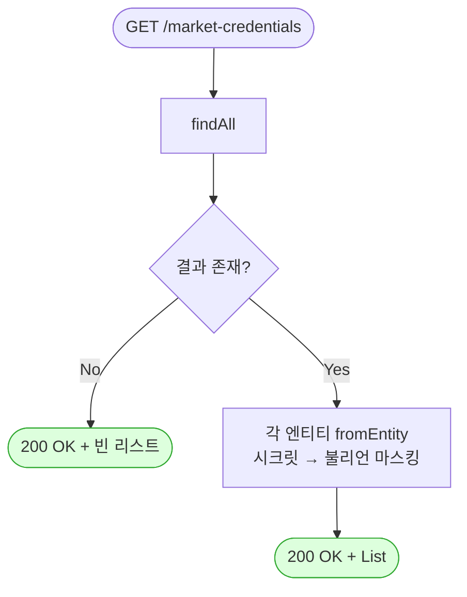

# GET /market-credentials — 등록된 모든 마켓 로그인 정보 목록 보기

> 쉽게 말하면: 우리 시스템에 저장해 둔 "각 마켓(쿠팡·스마트스토어 등)에 접속할 때 쓰는 아이디·열쇠 묶음"을 한 번에 쭉 훑어보는 화면용 API입니다. 설정 페이지에서 "어느 마켓이 연결돼 있고 어느 마켓은 아직 비어 있나"를 보여줄 때 씁니다.

## 1. 개요

| 항목 | 내용 |
|------|------|
| **Method / URL** | `GET /api/v1/market-credentials` (→ 쉽게 말하면: "저장된 마켓 로그인 정보 전부 주세요"라고 요청하는 주소) |
| **목적** | 등록된 모든 마켓 로그인 정보(자격증명)를 목록으로 돌려준다. 설정 화면·연동 현황판을 그릴 때 사용. |
| **핵심 상태전이** | 없음. 그냥 읽어서 보여주기만 하고 아무것도 바꾸지 않음. |
| **부수효과** | 없음. 읽기 전용(`@Transactional(readOnly = true)`)이라 데이터가 바뀔 일이 없음. |
| **응답** | `200 OK` + 로그인 정보 목록. 단, **비밀 열쇠(accessKey·secretKey·refreshToken)의 실제 값은 절대 내보내지 않고**, "이 열쇠가 채워져 있나 없나"를 뜻하는 예/아니오(`hasAccessKey`/`hasSecretKey`/`hasRefreshToken`)만 담아 보냄. |

## 2. 호출 체인

> 아래는 요청이 들어와서 응답이 나가기까지 코드가 거쳐 가는 순서입니다. 각 줄 옆의 "→ 쉽게 말하면"이 그 단계가 실제로 무슨 일을 하는지 풀어 쓴 설명입니다.

```
MarketCredentialController.getAllCredentials()          api/.../controller/MarketCredentialController.java:31-34
  └─ MarketCredentialService.getAllCredentials()        core/.../application/market/MarketCredentialService.java:21-25  @Transactional(readOnly=true)
       ├─ MarketCredentialRepository.findAll()          core/.../domain/market/repository/MarketCredentialRepository.java:10 (JpaRepository)
       └─ .map(MarketCredentialDto::fromEntity)         core/.../application/market/dto/MarketCredentialDto.java:20-31
            ├─ setClientId / setRedirectUri (평문 유지)  MarketCredentialDto.java:25-26
            └─ setHasAccessKey/HasSecretKey/HasRefreshToken (불리언 마스킹)  MarketCredentialDto.java:27-29
  └─ ResponseEntity.ok(...)                              MarketCredentialController.java:33
```

- `getAllCredentials()` (입구 코드) → 쉽게 말하면: 사용자의 "목록 주세요" 요청을 가장 먼저 받는 창구입니다.
- `MarketCredentialService.getAllCredentials()` → 쉽게 말하면: 실제 일을 처리하는 담당자. 읽기 전용이라 저장을 아예 하지 않습니다.
- `findAll()` → 쉽게 말하면: 데이터베이스 서랍을 열어 저장된 마켓 로그인 정보를 몽땅 꺼내 옵니다.
- `.map(...fromEntity)` → 쉽게 말하면: 꺼내 온 원본을 화면에 내보내기 안전한 형태로 한 건씩 바꿔 담습니다. 이때 비밀 열쇠는 예/아니오로만 바꿔 감춥니다(마스킹).
- `setClientId / setRedirectUri (평문 유지)` → 쉽게 말하면: 아이디성 정보(clientId)와 돌아올 주소(redirectUri)는 비밀이 아니라 화면에서 OAuth 연결을 조립할 때 필요하므로 있는 그대로 담습니다.
- `setHasAccessKey/... (불리언 마스킹)` → 쉽게 말하면: 진짜 열쇠 값 대신 "채워져 있음/비어 있음"만 담아 비밀을 지킵니다.
- `ResponseEntity.ok(...)` → 쉽게 말하면: 다 담은 목록을 "성공(200)"으로 사용자에게 돌려줍니다.

**응답으로 나가는 한 건의 모양 (`MarketCredentialDto`, `MarketCredentialDto.java:8-31`)**

| 필드 | 타입 | 쉬운 설명 |
|------|------|------|
| `id` | Long | 이 로그인 정보의 고유 번호(구분용) |
| `marketType` | MarketType | 어느 마켓인지(쿠팡·스마트스토어 등) |
| `clientId` | String | 마켓에서 발급받은 식별용 아이디. 비밀이 아니고 화면에서 OAuth 연결을 만들 때 필요해 그대로 보냄 |
| `redirectUri` | String | 인증 후 되돌아올 주소. 그대로 보냄 |
| `hasAccessKey` | boolean | accessKey가 채워져 있는지 여부(예/아니오)만. 실제 값은 안 보냄 |
| `hasSecretKey` | boolean | secretKey가 채워져 있는지 여부만. 실제 값은 안 보냄 |
| `hasRefreshToken` | boolean | refreshToken이 채워져 있는지 여부만. 실제 값은 안 보냄 |

## 3. 유스케이스 다이어그램

👉 이 그림은 운영자가 "마켓 로그인 정보 목록 조회"를 하면, 그 안에 "비밀 열쇠는 값 대신 채움 여부만 보여주기(마스킹)"가 함께 딸려 온다는 것을 보여줍니다.


## 4. 시퀀스 다이어그램

👉 이 그림은 요청이 들어온 뒤 창구(Controller) → 담당자(Service) → 서랍(Repository) 순으로 오가며, 꺼낸 정보를 한 건씩 안전한 형태(Dto)로 바꿔 담아 목록으로 돌려주는 대화 순서를 보여줍니다.

```mermaid
sequenceDiagram
    autonumber
    actor U as 운영자
    participant C as MarketCredentialController
    participant S as MarketCredentialService
    participant R as MarketCredentialRepository
    participant D as MarketCredentialDto
    Note over S: getAllCredentials 는 @Transactional(readOnly=true) — 쓰기·롤백 경계 없음

    U->>C: GET /market-credentials
    C->>S: getAllCredentials()
    S->>R: findAll()
    R-->>S: List&lt;MarketCredential&gt;
    loop 각 엔티티
        S->>D: fromEntity(credential)
        D-->>S: MarketCredentialDto (시크릿 마스킹)
    end
    S-->>C: List&lt;MarketCredentialDto&gt;
    C-->>U: 200 OK + List&lt;MarketCredentialDto&gt;
```

## 5. 순서도 (플로우차트)

👉 이 그림은 판단의 갈림길을 보여줍니다. 서랍을 열었을 때 저장된 게 하나도 없으면 "빈 목록"을 돌려주고, 있으면 한 건씩 안전한 형태로 바꿔(비밀 열쇠는 예/아니오로 감춤) 목록을 돌려줍니다. 어느 쪽이든 정상(200)으로 끝납니다.



## 6. 상태 전이표

> 이 API는 무언가를 바꾸는 게 아니라 그냥 보여주기만 하므로, 바뀌는 상태가 없습니다.

| 진입 상태 | 허용? | 결과 상태 | 마켓 전송 | 비고 |
|-----------|:-----:|-----------|-----------|------|
| — | — | — | — | 상태 전이 없음(그냥 조회). 읽기 전용이라 아무것도 바뀌거나 마켓으로 나가지 않음. |

## 7. 🔎 발견사항

### CRED-1 · 🔵 NOTE — 로그인 없이 아무나 이 목록을 불러올 수 있음(`@CrossOrigin(origins = "*")`, 인증 검사 없음)
- **무엇이 문제인가:** 이 목록 조회 창구에는 "누가 요청하는지" 확인하는 문지기(인증·인가 검사)가 걸려 있지 않습니다. 게다가 `@CrossOrigin(origins = "*")` 설정 때문에 어떤 웹 페이지에서든 이 주소로 요청을 보낼 수 있습니다. 즉 로그인 없이 누구나 `getAllCredentials`를 호출할 수 있는 상태입니다.
- **근거:** `MarketCredentialController.java:24` `@CrossOrigin(origins = "*")`, 컨트롤러·서비스에 인증/인가 애너테이션 부재. `getAllCredentials`(:31-34)는 누구나 호출 가능.
- **왜 문제인가(영향):** 다행히 진짜 비밀 열쇠(accessKey·secretKey·refreshToken)의 실제 값은 `MarketCredentialDto`(`MarketCredentialDto.java:16-18`)에서 예/아니오로 가려져 새어 나가지 않습니다. 하지만 `clientId`·`redirectUri`와 "어느 마켓이 연동돼 있는지"(`has*`)는 로그인 없이도 조회됩니다. 로컬 개발 편의를 위한 설계로 보이나, 실제 운영 서버에 그대로 배포하면 이 정보가 밖으로 드러나는 창이 됩니다.
- **어떻게 고치면 되나(제안):** 진짜 비밀은 이미 가려져 있어 유출 위험은 낮습니다. 다만 운영 환경에서는 "누가 접근할 수 있는지(CORS·인증)"에 대한 정책을 정하고 문서로 남겨 두길 권합니다.

## 8. 테스트 커버리지 메모

> 이 기능이 자동 검사(테스트)로 얼마나 지켜지고 있는지 정리한 메모입니다.

- **직접 대상 테스트 없음:** `getAllCredentials`(목록 조회) 자체를 겨냥한 단위 테스트는 찾지 못했습니다.
- **간접 커버:** `MarketCredentialDtoMaskingTest`(`core/.../application/market/dto/MarketCredentialDtoMaskingTest.java`)가 한 건을 안전한 형태로 바꾸는 `fromEntity` 규칙(비밀 열쇠의 실제 값이 안 나가는지, `has*` 예/아니오가 맞는지, JSON으로 바꿔도 안전한지)을 지켜 줍니다. 목록도 같은 방식으로 한 건씩 조립하므로 마스킹은 간접적으로 보장됩니다.
- **비어있는(아직 안 만든) 케이스:** ① 저장된 게 하나도 없을 때(0건) 응답이 올바른 빈 목록으로 나오는지, ② 여러 마켓이 섞여 있을 때 순서·짝짓기가 어긋나지 않는지.

---
*(쉬운 설명판 · 2026-07-17 재작성)*
*생성: 2026-07-17 · 근거: 현재 워킹트리*
