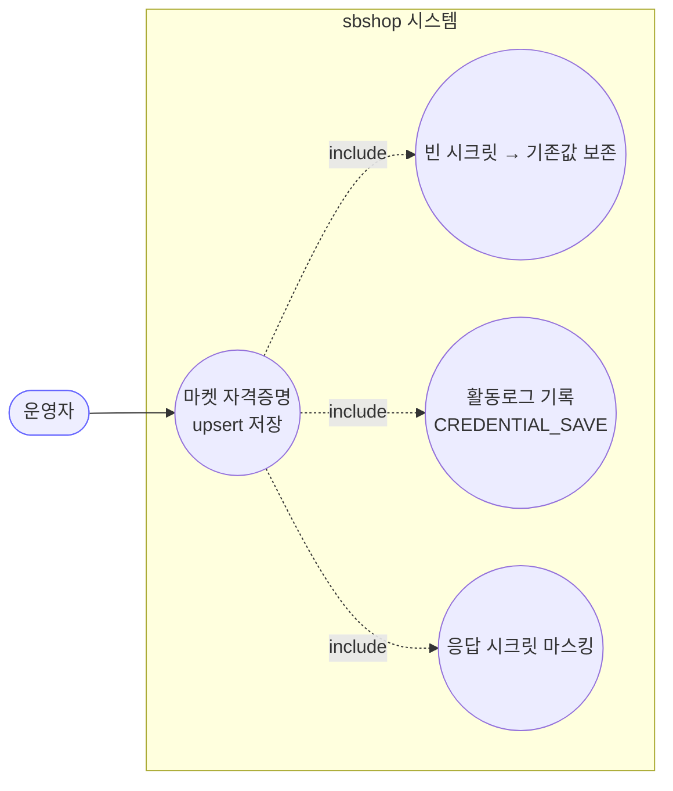
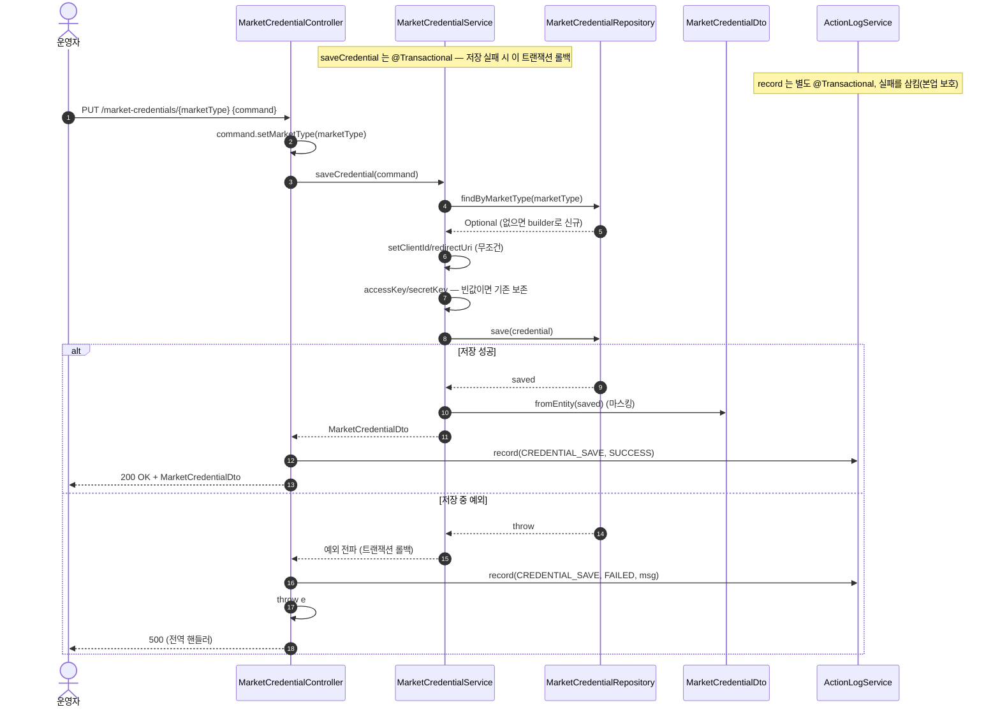
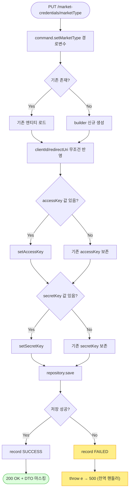

# PUT /market-credentials/{marketType} — 마켓 자격증명 저장(신규/갱신)

## 1. 개요

| 항목 | 내용 |
|------|------|
| **Method / URL** | `PUT /api/v1/market-credentials/{marketType}` (경로변수 `marketType`, 바디 `MarketCredentialSaveCommand`) |
| **목적** | 특정 마켓의 자격증명을 upsert 한다(존재하면 갱신, 없으면 생성). 저장 결과를 활동로그에 기록한다. |
| **핵심 상태전이** | 자격증명 레코드 upsert(없음→존재 또는 필드 갱신). 도메인 상태머신은 없음. |
| **부수효과** | DB 저장(`save`) + 활동로그 기록(`CREDENTIAL_SAVE`, SUCCESS/FAILED). 시크릿 필드는 빈 값이면 기존값 보존. `@Transactional`(서비스). |
| **응답** | `200 OK` + `MarketCredentialDto`(마스킹). 저장 예외 시 재던짐 → 전역 핸들러(대개 500) |

## 2. 호출 체인

```
MarketCredentialController.saveCredential(marketType, command)     api/.../controller/MarketCredentialController.java:43-60
  ├─ command.setMarketType(marketType)  (경로변수 우선)             MarketCredentialController.java:48
  ├─ try:                                                          MarketCredentialController.java:50
  │   └─ MarketCredentialService.saveCredential(command)           core/.../application/market/MarketCredentialService.java:34-56  @Transactional
  │        ├─ repository.findByMarketType(...).orElseGet(builder)   MarketCredentialService.java:36-39 (upsert 대상 결정)
  │        ├─ setClientId / setRedirectUri (무조건 반영)            MarketCredentialService.java:42-43
  │        ├─ isPresent(accessKey) ? setAccessKey : (기존 보존)     MarketCredentialService.java:47-49
  │        ├─ isPresent(secretKey) ? setSecretKey : (기존 보존)     MarketCredentialService.java:50-52
  │        ├─ repository.save(credential)                          MarketCredentialService.java:54
  │        └─ MarketCredentialDto.fromEntity(saved)  (마스킹)       MarketCredentialDto.java:20-31
  │   └─ actionLogService.record(CREDENTIAL_SAVE, SUCCESS)         MarketCredentialController.java:52-53 → ActionLogService.java:27-41
  │   └─ ResponseEntity.ok(saved)                                  MarketCredentialController.java:54
  └─ catch (Exception e):                                          MarketCredentialController.java:55
      ├─ actionLogService.record(CREDENTIAL_SAVE, FAILED, msg)     MarketCredentialController.java:56-57
      └─ throw e  (재던짐 → GlobalExceptionHandler)                MarketCredentialController.java:58
```

**요청 바디 (`MarketCredentialSaveCommand`, `MarketCredentialSaveCommand.java:6-13`)**

| 필드 | 타입 | 필수 | 비고 |
|------|------|------|------|
| `marketType` | MarketType | — | 바디값은 무시되고 경로변수로 덮어씀(`MarketCredentialController.java:48`) |
| `clientId` | String | 아니오 | 무조건 반영(빈 값이면 빈 값으로 덮어씀) |
| `accessKey` | String | 아니오 | 빈/공백이면 기존값 보존, 값 있으면 갱신 |
| `secretKey` | String | 아니오 | 빈/공백이면 기존값 보존, 값 있으면 갱신 |
| `redirectUri` | String | 아니오 | 무조건 반영 |

> `refreshToken`·`accessToken`·`isActive`·`tokenExpiresAt`는 `SaveCommand`에 없어 이 엔드포인트로 설정 불가(OAuth 토큰은 별도 인증 흐름이 관리).

## 3. 유스케이스 다이어그램



## 4. 시퀀스 다이어그램



## 5. 순서도 (플로우차트)



## 6. 상태 전이표

| 진입 상태 | 요청 | 결과 상태 | 부수효과 | 비고 |
|-----------|------|-----------|----------|------|
| 자격증명 없음 | PUT | 신규 레코드 생성(`isActive=true` 기본) | save + 로그 SUCCESS | `MarketCredentialService.java:38-39`, 엔티티 `isActive` 기본 true |
| 자격증명 존재 + 시크릿 값 제출 | PUT | accessKey/secretKey 갱신 | save + 로그 SUCCESS | `MarketCredentialService.java:47-52` |
| 자격증명 존재 + 시크릿 빈값 제출 | PUT | 시크릿 기존값 보존, clientId/redirectUri만 갱신 | save + 로그 SUCCESS | F-CRED-8 보존 로직(`:44-52`) |
| 저장 중 예외 | PUT | 롤백(변경 없음) | 로그 FAILED + 재던짐 | `MarketCredentialController.java:55-58` |

## 7. 🔎 발견사항

### CRED-4 · 🟠 GAP — `clientId`·`redirectUri`는 빈 값 제출 시 무조건 덮어써 기존값이 소거됨(시크릿과 비대칭)
- **근거:** `MarketCredentialService.java:42-43`은 `credential.setClientId(command.getClientId())`·`setRedirectUri(...)`를 조건 없이 반영한다. 반면 accessKey·secretKey는 `isPresent` 가드로 빈 값이면 기존값을 보존(`:47-52`).
- **영향:** 프론트가 일부 필드만 담아 PUT 하거나(부분 갱신 의도), `clientId`/`redirectUri` 폼을 비운 채 저장하면 기존 Vendor ID·Mall ID·리다이렉트 URI가 빈 문자열로 덮어써진다. PUT의 전체교체 의미로 보면 일관되지만, 시크릿만 부분보존 정책을 두어 필드 간 갱신 규칙이 비대칭이라 혼란 소지.
- **제안:** 부분 갱신(PATCH 의미)을 의도했다면 clientId·redirectUri에도 동일한 `isPresent` 보존 정책을 적용하거나, 전체교체(PUT)로 통일하고 프론트가 항상 전체 폼을 전송하도록 계약 명문화.

### CRED-5 · 🟡 SMELL — 저장 예외를 컨트롤러가 잡아 로그만 남기고 그대로 재던져 항상 500으로 표면화(클라이언트 오류 구분 없음)
- **근거:** `MarketCredentialController.java:55-58` catch(Exception)에서 `record(FAILED)` 후 `throw e`. 재던져진 예외는 `GlobalExceptionHandler`로 가는데, unique 제약 위반(`marketType` unique, `MarketCredential.java:30`)·DB 오류 등은 `IllegalState`/`IllegalArgument`가 아니어서 일반 `Exception` 핸들러(대개 500)로 떨어진다.
- **영향:** 입력 문제(예: 길이 초과 `client_id length 100`)로 인한 저장 실패도 서버 오류(500)로 응답되어 클라이언트가 재시도로 오인 가능. 다만 활동로그에 FAILED가 기록되어 추적은 가능.
- **제안:** 예상 가능한 저장 실패(제약 위반·길이 초과)를 400 계열로 변환하는 핸들러 추가 검토. 현재는 재던짐이 로그 목적상 의도된 설계일 수 있어 SMELL 수준.

### CRED-6 · 🔵 NOTE — 입력 검증(`@Valid`) 부재 — 필수값·형식 검증 없이 upsert
- **근거:** `MarketCredentialController.java:44-47` `@RequestBody MarketCredentialSaveCommand command`에 `@Valid` 없음. `MarketCredentialSaveCommand.java`에 Bean Validation 애너테이션 없음. `clientId`가 null이어도 그대로 저장 시도.
- **영향:** 전 필드 빈 바디로도 저장되어 사실상 빈 자격증명 레코드가 생성될 수 있음(신규 생성 경로). 마켓 종류에 따라 필수 필드가 다르지만(예: OAuth 마켓은 clientId·secret 필수) 서버 측 강제가 없다.
- **제안:** 마켓별 필수 필드 검증 정책이 필요하면 서비스 진입부 또는 `@Valid`로 최소 검증 추가 검토.

### CRED-7 · 🔵 NOTE — `refreshToken`/`accessToken`/`isActive`/`tokenExpiresAt`는 이 엔드포인트로 설정 불가
- **근거:** `MarketCredentialSaveCommand.java:8-12`에 해당 필드가 없어 서비스가 손대지 않는다(`MarketCredentialService.java:42-52`). OAuth 토큰류는 Cafe24 인증 흐름 등 별도 경로가 관리.
- **영향:** 의도된 분리(수동 API키 저장 vs OAuth 토큰 자동 발급)로 보임. 신규 생성 시 `isActive`는 엔티티 기본 true(`MarketCredential.java:86`)로만 결정되어, PUT으로 비활성화할 수단은 없다.
- **제안:** 없음(설계 노트). 비활성화 요구가 생기면 별도 엔드포인트/필드 검토.

## 8. 테스트 커버리지 메모

- **직접 대상 테스트:** `MarketCredentialServiceSavePreservationTest`(`core/.../application/market/MarketCredentialServiceSavePreservationTest.java`)가 ① 빈 시크릿 제출 시 기존 accessKey·secretKey 보존, ② 새 시크릿 값 갱신, ③ 저장 응답 마스킹(`has*` 플래그)을 고정한다(F-CRED-8).
- **간접 커버:** `MarketCredentialDtoMaskingTest`가 저장 응답 조립(`fromEntity`)의 시크릿 평문 미노출을 검증.
- **비어있는 케이스:**
  - ① CRED-4: `clientId`/`redirectUri` 빈 값 제출 시 소거 여부(현재 무조건 덮어씀)에 대한 테스트 없음.
  - ② CRED-5: 저장 예외(unique 제약·길이 초과) 시 활동로그 FAILED 기록 + 재던짐 경로에 대한 컨트롤러 테스트 없음.
  - ③ 활동로그 SUCCESS 기록(`MarketCredentialController.java:52-53`) 검증 없음.
  - ④ CRED-6: 빈/누락 바디 저장 시 동작 검증 없음.

---
*생성: 2026-07-17 · 근거: 현재 워킹트리*
