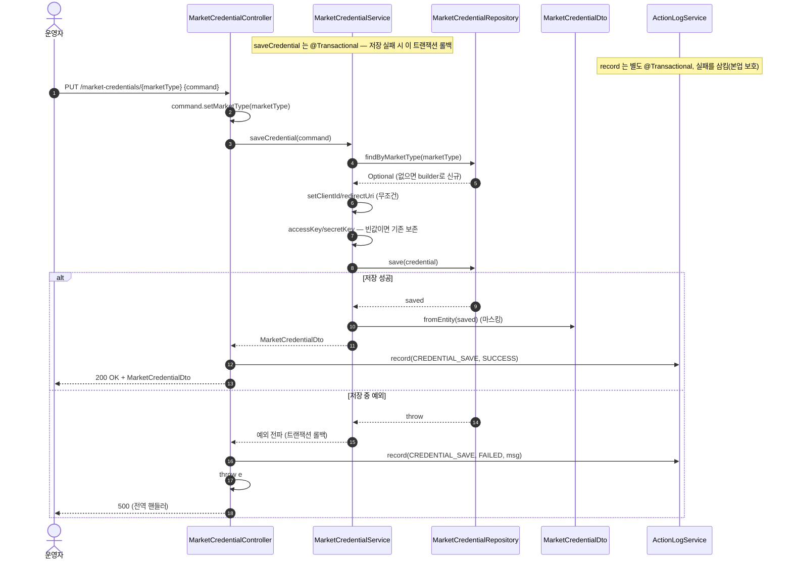

# PUT /market-credentials/{marketType} — 마켓 로그인 정보 저장(새로 만들기 또는 고쳐 쓰기)

> 쉽게 말하면: "쿠팡"처럼 마켓 하나를 정해, 그 마켓의 로그인 정보(아이디·비밀 열쇠)를 저장하는 API입니다. 아직 없으면 새로 만들고, 이미 있으면 값을 고쳐 씁니다. 저장한 결과는 "누가 언제 무엇을 저장했다"는 활동로그로도 남깁니다.

## 1. 개요

| 항목 | 내용 |
|------|------|
| **Method / URL** | `PUT /api/v1/market-credentials/{marketType}` — 주소 끝에 마켓 이름을 넣고, 몸통(바디)에 저장할 값(`MarketCredentialSaveCommand`)을 담아 보냄 |
| **목적** | 지정한 마켓의 로그인 정보를 저장한다. 없으면 새로 만들고 있으면 고쳐 쓰는 방식(이를 "upsert"라 부름). 저장 결과를 활동로그에 남긴다. |
| **핵심 상태전이** | 로그인 정보 한 건을 "없음 → 있음"으로 만들거나, 있는 값의 일부를 고쳐 쓰기. 복잡한 상태 흐름은 없음. |
| **부수효과** | DB에 저장(`save`) + 활동로그 기록(`CREDENTIAL_SAVE`, 성공/실패). **비밀 열쇠는 빈칸으로 보내면 기존 값을 지우지 않고 그대로 지켜 줌.** 저장은 하나의 묶음(`@Transactional`)으로 처리. |
| **응답** | `200 OK` + 저장 결과(비밀 열쇠는 가려짐). 저장 중 오류가 나면 그 오류를 다시 위로 넘겨 공통 오류 처리기가 보통 500으로 응답 |

## 2. 호출 체인

> 아래는 저장 요청이 처리되는 순서입니다. "→ 쉽게 말하면"이 각 단계의 실제 의미입니다.

```
MarketCredentialController.saveCredential(marketType, command)     api/.../controller/MarketCredentialController.java:43-60
  ├─ command.setMarketType(marketType)  (경로변수 우선)             MarketCredentialController.java:48
  ├─ try:                                                          MarketCredentialController.java:50
  │   └─ MarketCredentialService.saveCredential(command)           core/.../application/market/MarketCredentialService.java:34-56  @Transactional
  │        ├─ repository.findByMarketType(...).orElseGet(builder)   MarketCredentialService.java:36-39 (upsert 대상 결정)
  │        ├─ setClientId / setRedirectUri (무조건 반영)            MarketCredentialService.java:42-43
  │        ├─ isPresent(accessKey) ? setAccessKey : (기존 보존)     MarketCredentialService.java:47-49
  │        ├─ isPresent(secretKey) ? setSecretKey : (기존 보존)     MarketCredentialService.java:50-52
  │        ├─ repository.save(credential)                          MarketCredentialService.java:54
  │        └─ MarketCredentialDto.fromEntity(saved)  (마스킹)       MarketCredentialDto.java:20-31
  │   └─ actionLogService.record(CREDENTIAL_SAVE, SUCCESS)         MarketCredentialController.java:52-53 → ActionLogService.java:27-41
  │   └─ ResponseEntity.ok(saved)                                  MarketCredentialController.java:54
  └─ catch (Exception e):                                          MarketCredentialController.java:55
      ├─ actionLogService.record(CREDENTIAL_SAVE, FAILED, msg)     MarketCredentialController.java:56-57
      └─ throw e  (재던짐 → GlobalExceptionHandler)                MarketCredentialController.java:58
```

- `saveCredential(marketType, command)` (입구 코드) → 쉽게 말하면: 저장 요청을 처음 받는 창구입니다.
- `command.setMarketType(marketType)` → 쉽게 말하면: 몸통에 어떤 마켓 이름이 적혀 있든 무시하고, 주소에 적힌 마켓 이름으로 확정합니다(주소가 우선).
- `saveCredential(command)` (담당자) → 쉽게 말하면: 실제 저장을 처리합니다. 이 안의 작업들은 하나의 묶음이라, 중간에 실패하면 전부 없던 일로 되돌립니다.
- `findByMarketType(...).orElseGet(builder)` → 쉽게 말하면: 그 마켓 정보가 이미 있으면 그걸 가져와 고치고, 없으면 새 껍데기를 만듭니다("없으면 새로, 있으면 고쳐 쓰기").
- `setClientId / setRedirectUri (무조건 반영)` → 쉽게 말하면: 아이디(clientId)와 되돌아올 주소(redirectUri)는 들어온 값을 조건 없이 그대로 덮어씁니다(빈칸이면 빈칸으로 덮임 — CRED-4 참고).
- `isPresent(accessKey) ? ... : (기존 보존)` → 쉽게 말하면: 비밀 열쇠 accessKey는 값이 들어왔을 때만 바꾸고, 빈칸이면 기존 값을 그대로 지켜 줍니다.
- `isPresent(secretKey) ? ... : (기존 보존)` → 쉽게 말하면: secretKey도 마찬가지로 빈칸이면 기존 값을 보존합니다.
- `repository.save(credential)` → 쉽게 말하면: 최종 값을 데이터베이스에 실제로 저장합니다.
- `fromEntity(saved) (마스킹)` → 쉽게 말하면: 저장 결과를 돌려줄 때도 비밀 열쇠는 값 대신 채움 여부만 담아 감춥니다.
- `record(CREDENTIAL_SAVE, SUCCESS)` → 쉽게 말하면: "저장 성공"을 활동로그에 남깁니다.
- `catch → record(FAILED) → throw e` → 쉽게 말하면: 저장 중 오류가 나면 "저장 실패"를 활동로그에 남긴 뒤, 그 오류를 위로 다시 넘겨(공통 오류 처리기로) 사용자에게 알립니다.

**보내는 몸통(요청 바디)의 모양 (`MarketCredentialSaveCommand`, `MarketCredentialSaveCommand.java:6-13`)**

| 필드 | 타입 | 필수 | 쉬운 설명 |
|------|------|------|------|
| `marketType` | MarketType | — | 여기 적어도 무시됨. 주소에 적은 마켓 이름으로 덮어씀(`MarketCredentialController.java:48`) |
| `clientId` | String | 아니오 | 들어온 값으로 무조건 덮어씀(빈칸으로 보내면 빈칸이 됨) |
| `accessKey` | String | 아니오 | 빈칸/공백이면 기존 값 보존, 값이 있으면 새 값으로 교체 |
| `secretKey` | String | 아니오 | 빈칸/공백이면 기존 값 보존, 값이 있으면 새 값으로 교체 |
| `redirectUri` | String | 아니오 | 들어온 값으로 무조건 덮어씀 |

> `refreshToken`·`accessToken`·`isActive`·`tokenExpiresAt`는 이 요청 몸통에 아예 칸이 없어서 이 API로는 설정할 수 없습니다. 이런 OAuth 토큰류는 별도의 인증 과정에서 자동으로 관리됩니다.

## 3. 유스케이스 다이어그램

👉 이 그림은 운영자가 "마켓 로그인 정보 저장"을 하면, 그 안에 ①비밀 열쇠 빈칸이면 기존값 지키기 ②활동로그 남기기 ③응답에서 비밀 열쇠 가리기가 함께 딸려 온다는 것을 보여줍니다.


## 4. 시퀀스 다이어그램

👉 이 그림은 저장이 성공할 때와 실패할 때의 두 갈래를 보여줍니다. 성공하면 저장 후 "성공" 로그를 남기고 200을 돌려주며, 저장 중 오류가 나면 묶음이 통째로 되돌려지고 "실패" 로그를 남긴 뒤 오류를 위로 넘겨 500으로 답합니다.



## 5. 순서도 (플로우차트)

👉 이 그림은 저장이 거치는 갈림길을 순서대로 보여줍니다. 기존 정보가 있으면 불러오고 없으면 새로 만든 뒤 → 아이디·주소는 무조건 덮어쓰고 → 비밀 열쇠는 값이 있을 때만 바꾸고(빈칸이면 보존) → 저장에 성공하면 "성공" 로그와 200, 실패하면 "실패" 로그와 500으로 갈립니다.


## 6. 상태 전이표

> 이 표는 "저장 전 상태 + 어떤 요청 → 저장 후 어떻게 되나"를 정리한 것입니다.

| 진입 상태 | 요청 | 결과 상태 | 부수효과 | 비고 |
|-----------|------|-----------|----------|------|
| 그 마켓 정보가 아직 없음 | PUT | 새 정보 한 건 생성(기본으로 "사용 중=true") | 저장 + "성공" 로그 | `MarketCredentialService.java:38-39`, 엔티티 `isActive` 기본 true |
| 그 마켓 정보가 있고 + 비밀 열쇠 값을 채워 보냄 | PUT | accessKey/secretKey를 새 값으로 교체 | 저장 + "성공" 로그 | `MarketCredentialService.java:47-52` |
| 그 마켓 정보가 있고 + 비밀 열쇠를 빈칸으로 보냄 | PUT | 비밀 열쇠는 기존 값 그대로, 아이디·주소만 갱신 | 저장 + "성공" 로그 | F-CRED-8 보존 로직(`:44-52`) |
| 저장 중 오류 발생 | PUT | 되돌림(아무것도 안 바뀜) | "실패" 로그 + 오류를 위로 넘김 | `MarketCredentialController.java:55-58` |

## 7. 🔎 발견사항

### CRED-4 · 🟠 GAP — `clientId`·`redirectUri`는 빈칸으로 보내면 기존 값이 지워져 버림(비밀 열쇠와 규칙이 다름)
- **무엇이 문제인가:** 비밀 열쇠(accessKey·secretKey)는 빈칸으로 보내면 "기존 값을 지키자"며 그대로 두는데, 아이디(clientId)와 되돌아올 주소(redirectUri)는 그런 배려 없이 들어온 값으로 무조건 덮어씁니다. 그래서 이 두 칸을 비운 채 저장을 누르면 기존에 잘 들어 있던 값이 빈 문자열로 지워집니다.
- **근거:** `MarketCredentialService.java:42-43`은 `credential.setClientId(command.getClientId())`·`setRedirectUri(...)`를 조건 없이 반영한다. 반면 accessKey·secretKey는 `isPresent` 가드로 빈 값이면 기존값을 보존(`:47-52`).
- **왜 문제인가(영향):** 프론트에서 일부 칸만 채워 보내거나(부분 수정을 의도했거나), 아이디·주소 칸을 비운 채 저장하면 기존 Vendor ID·Mall ID·되돌아올 주소가 빈 값으로 날아갑니다. "PUT은 전체를 통째로 교체하는 것"이라는 관점에선 일관됩니다만, 비밀 열쇠만 "빈칸이면 보존"이라는 다른 규칙을 두는 바람에 칸마다 저장 규칙이 제각각이라 헷갈릴 수 있습니다.
- **어떻게 고치면 되나(제안):** 부분 수정(일부만 바꾸기)을 의도한 것이라면 clientId·redirectUri에도 "빈칸이면 기존값 보존"을 똑같이 적용하고, 반대로 "항상 통째로 교체"가 맞다면 프론트가 늘 전체 값을 채워 보내도록 규칙을 문서로 명확히 정합니다.

### CRED-5 · 🟡 SMELL — 저장이 실패하면 종류를 안 가리고 전부 서버 오류(500)로 나감(사용자 잘못인지 구분 못 함)
- **무엇이 문제인가:** 컨트롤러는 저장 중 오류가 나면 "실패" 로그를 남긴 뒤 그 오류를 그대로 위로 다시 넘깁니다. 그런데 넘겨진 오류가 "이미 같은 마켓이 등록돼 있음(중복)" 이나 "글자 수 초과" 같은 사용자 입력 문제여도, 이를 400 계열(사용자 잘못)로 바꿔 주는 처리가 없어 결국 공통 오류 처리기에서 대부분 500(서버 오류)으로 떨어집니다.
- **근거:** `MarketCredentialController.java:55-58` catch(Exception)에서 `record(FAILED)` 후 `throw e`. 재던져진 예외는 `GlobalExceptionHandler`로 가는데, unique 제약 위반(`marketType` unique, `MarketCredential.java:30`)·DB 오류 등은 `IllegalState`/`IllegalArgument`가 아니어서 일반 `Exception` 핸들러(대개 500)로 떨어진다.
- **왜 문제인가(영향):** 사실은 입력을 고치면 되는 실패(예: `client_id`가 100자 제한을 넘김)인데도 화면에는 "서버 오류(500)"로 나와, 사용자가 "잠시 후 다시 시도"로 잘못 알 수 있습니다. 그래도 활동로그에 "실패"가 남으므로 나중에 추적은 가능합니다.
- **어떻게 고치면 되나(제안):** 예상 가능한 저장 실패(중복 등록·글자 수 초과 등)를 400 계열로 바꿔 주는 처리를 추가할지 검토합니다. 지금처럼 오류를 그대로 넘기는 것은 로그를 남기기 위한 의도일 수 있어 심각도는 SMELL(당장 오작동은 아님) 수준입니다.

### CRED-6 · 🔵 NOTE — 입력값 검사(`@Valid`)가 없어서 필수값·형식을 확인하지 않고 저장함
- **무엇이 문제인가:** 저장 요청을 받을 때 "필수 값이 채워졌는지, 형식이 맞는지"를 미리 확인하는 장치(`@Valid`)가 없습니다. 그래서 `clientId`가 비어 있어도 그대로 저장을 시도합니다.
- **근거:** `MarketCredentialController.java:44-47` `@RequestBody MarketCredentialSaveCommand command`에 `@Valid` 없음. `MarketCredentialSaveCommand.java`에 Bean Validation 애너테이션 없음. `clientId`가 null이어도 그대로 저장 시도.
- **왜 문제인가(영향):** 모든 칸이 빈 몸통으로 보내도 저장이 되어, 사실상 알맹이 없는 빈 로그인 정보가 새로 만들어질 수 있습니다(신규 생성 경로). 마켓 종류에 따라 꼭 있어야 하는 값이 다른데(예: OAuth 마켓은 clientId·비밀 열쇠가 필수), 서버가 이를 강제하지 않습니다.
- **어떻게 고치면 되나(제안):** 마켓별 필수 값 검사가 필요하면, 담당자(서비스) 진입부나 `@Valid`로 최소한의 검사를 넣을지 검토합니다.

### CRED-7 · 🔵 NOTE — `refreshToken`/`accessToken`/`isActive`/`tokenExpiresAt`는 이 API로는 설정할 수 없음
- **무엇이 문제인가(사실 확인):** 이 저장 API의 요청 몸통에는 refreshToken·accessToken·사용여부(isActive)·토큰 만료시각(tokenExpiresAt) 칸이 아예 없습니다. 그래서 이 API로는 이 값들을 건드릴 수 없습니다.
- **근거:** `MarketCredentialSaveCommand.java:8-12`에 해당 필드가 없어 서비스가 손대지 않는다(`MarketCredentialService.java:42-52`). OAuth 토큰류는 Cafe24 인증 흐름 등 별도 경로가 관리.
- **왜 문제인가(영향):** "수동으로 넣는 API 키 저장"과 "자동으로 발급되는 OAuth 토큰"을 일부러 분리한 설계로 보입니다. 다만 새로 만들 때 사용여부(isActive)는 엔티티 기본값(true)으로만 정해지므로, 이 API로 마켓을 "사용 안 함"으로 꺼 둘 방법은 없습니다.
- **어떻게 고치면 되나(제안):** 없음(설계 메모). 나중에 "사용 안 함으로 끄기"가 필요해지면 별도 API나 칸을 검토합니다.

## 8. 테스트 커버리지 메모

> 이 기능이 자동 검사(테스트)로 얼마나 지켜지는지 정리한 메모입니다.

- **직접 대상 테스트:** `MarketCredentialServiceSavePreservationTest`(`core/.../application/market/MarketCredentialServiceSavePreservationTest.java`)가 ① 비밀 열쇠를 빈칸으로 보낼 때 기존 accessKey·secretKey가 그대로 지켜지는지, ② 새 열쇠 값을 보내면 잘 바뀌는지, ③ 저장 응답에서 비밀 열쇠가 가려지는지(`has*` 예/아니오)를 지켜 줍니다(F-CRED-8).
- **간접 커버:** `MarketCredentialDtoMaskingTest`가 저장 응답을 조립하는 `fromEntity`에서 비밀 열쇠 실제 값이 안 나가는지 검증합니다.
- **비어있는(아직 안 만든) 케이스:**
  - ① CRED-4: `clientId`/`redirectUri`를 빈칸으로 보냈을 때 기존 값이 지워지는지(지금은 무조건 덮어씀)를 확인하는 테스트가 없음.
  - ② CRED-5: 저장 실패(중복 등록·글자 수 초과) 시 "실패" 로그를 남기고 오류를 위로 넘기는 경로를 겨냥한 컨트롤러 테스트가 없음.
  - ③ 저장 성공 시 "성공" 로그를 남기는지(`MarketCredentialController.java:52-53`)에 대한 검증이 없음.
  - ④ CRED-6: 빈 몸통/값 누락으로 저장할 때 어떻게 동작하는지에 대한 검증이 없음.

---
*(쉬운 설명판 · 2026-07-17 재작성)*
*생성: 2026-07-17 · 근거: 현재 워킹트리*
