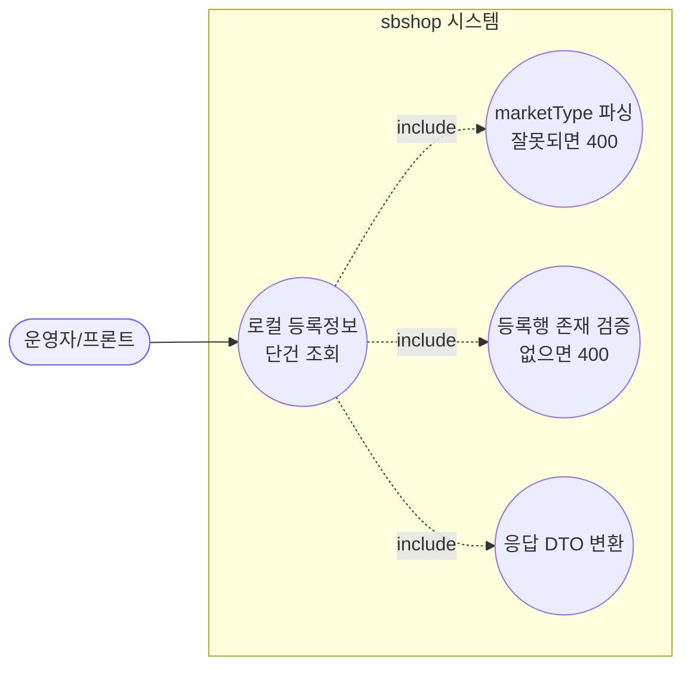
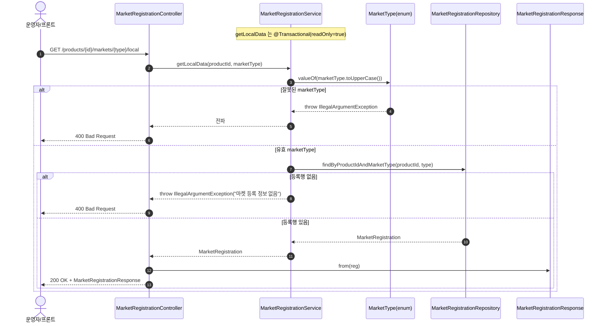
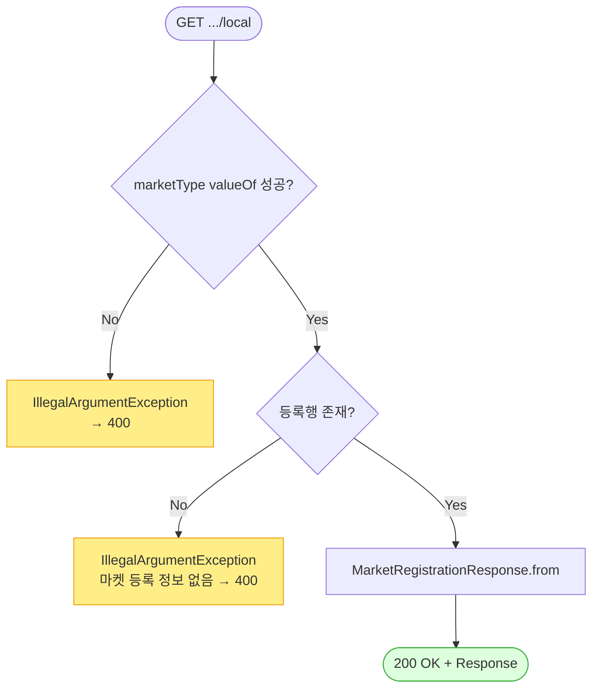

# GET /markets/{marketType}/local — 로컬 마켓 등록정보 단건 조회

## 1. 개요

이 기능은 "어떤 상품이 어떤 마켓에 어떻게 등록돼 있는지"를 딱 한 건만 골라 보여줍니다. 여기서 "로컬"은 "우리 DB에 저장된 값"이라는 뜻으로, 외부 마켓에 물어보지 않고 우리가 가진 값만 봅니다.

| 항목 | 내용 |
|------|------|
| **Method / URL** | `GET /api/v1/products/{productId}/markets/{marketType}/local` |
| **목적** | 상품 + 마켓 조합에 해당하는 등록 정보(`MarketRegistration`) 한 건을 우리 DB에서 찾아 화면용 형태로 돌려줍니다. 외부 마켓 호출은 하지 않고, 저장된 값만 봅니다. |
| **핵심 상태전이** | 없음 — 그냥 조회만 하고 아무 것도 바꾸지 않습니다. |
| **부수효과** | 없음. "읽기 전용" 표시(`@Transactional(readOnly = true)`)가 붙은 단순 조회입니다. |
| **응답** | 정상이면 `200 OK` + 등록 정보 1건. 그런 등록이 없으면 `400`, 마켓 이름을 잘못 적어도 `400`. |

## 2. 호출 체인

아래는 요청이 들어온 뒤 어떤 코드들이 차례로 불려 일이 처리되는지의 흐름입니다.

```
MarketRegistrationController.getLocalMarketData()      api/.../controller/MarketRegistrationController.java:36-45
  └─ MarketRegistrationService.getLocalData(productId, marketType)  core/.../application/market/MarketRegistrationService.java:33-38  @Transactional(readOnly=true)
       ├─ MarketType.valueOf(marketType.toUpperCase())  MarketRegistrationService.java:34  (bad → IllegalArgumentException → 400)
       └─ MarketRegistrationRepository.findByProductIdAndMarketType()  core/.../market/repository/MarketRegistrationRepository.java:21
             └─ orElseThrow → IllegalArgumentException  MarketRegistrationService.java:37  (→ 400)
  └─ MarketRegistrationResponse.from(reg)              api/.../dto/market/MarketRegistrationResponse.java:30-44
  └─ ResponseEntity.ok(response)                       MarketRegistrationController.java:44
```

→ 쉽게 말하면: ① 입구(컨트롤러)가 서비스에 "이 상품의 이 마켓 등록 정보 하나 줘"라고 부탁합니다. ② 서비스는 먼저 넘겨받은 마켓 이름을 대문자로 바꿔 정해진 마켓 목록(enum)에 맞는지 확인합니다(엉뚱한 이름이면 400으로 끝냄). ③ 이름이 맞으면 DB에서 그 상품·마켓 조합의 등록 정보를 찾습니다(없으면 400). ④ 찾으면 화면용 형태로 바꿔 ⑤ `200 OK`와 함께 돌려줍니다.

**경로 변수** (URL 주소에 끼워 넣는 값)

| 변수 | 타입 | 필수 | 비고 |
|------|------|:----:|------|
| `productId` | Long | ✅ | 상품이 실제로 있는지는 따로 확인하지 않음 — 등록 정보가 있느냐 없느냐로만 판단 |
| `marketType` | String | ✅ | 대문자로 바꿔(`MarketType.valueOf(toUpperCase())`) 정해진 마켓 목록과 맞춰봄. 목록에 없는 값이면 `IllegalArgumentException` → 400 |

**정해진 마켓 목록(`MarketType.java:10-15`)**: `COUPANG`, `SMART_STORE`, `ELEVEN_STREET`, `GMARKET`, `AUCTION`, `CAFE24`. (이 여섯 개 중 하나여야 함)

## 3. 유스케이스 다이어그램

👉 이 그림은 "운영자가 로컬 단건 조회를 쓸 때, 시스템이 속으로 함께 처리하는 일들"을 보여줍니다. 마켓 이름 확인, 등록 있는지 확인, 화면용으로 바꾸기가 딸려 붙습니다.



## 4. 시퀀스 다이어그램

👉 이 그림은 "요청 하나가 들어오면 각 담당자가 시간 순서대로 주고받는 대화"를 보여줍니다. 마켓 이름이 틀리면 400, 등록이 없어도 400, 둘 다 통과하면 200으로 값을 돌려줍니다.



## 5. 순서도 (플로우차트)

👉 이 그림은 "조건에 따라 어느 길로 가는지"를 갈림길로 보여줍니다. 먼저 마켓 이름이 올바른지 묻고, 그다음 등록이 있는지 물어, 둘 다 통과할 때만 200으로 값을 돌려줍니다.



## 6. 상태 전이표

이 기능은 아무 상태도 바꾸지 않는 순수 조회입니다. 저장돼 있는 등록 정보를 그대로 보여줄 뿐입니다.

| 진입 조건 | 결과 |
|-----------|------|
| 마켓 이름을 잘못 적음 | 400 (허용 목록에 없는 이름) |
| 마켓 이름은 맞는데 등록이 없음 | 400 ("마켓 등록 정보 없음") |
| 마켓 이름 맞고 등록도 있음 | 200 + 등록 정보 |
| 상품 자체가 아예 없음 | 따로 구분하지 않음 — "등록 없음"과 똑같이 400으로 처리 |

## 7. 🔎 발견사항

### MREG-2 · 🟠 GAP — "등록 정보 없음"을 404가 아닌 400(IllegalArgumentException)으로 반환 — 리소스 부재를 입력오류로 표현
- **무엇이 문제인가:** "찾는 등록 정보가 없다"는 상황을, 마치 "요청을 잘못 보냈다(입력오류)"인 것처럼 400으로 돌려줍니다. 보통 "그런 게 없다"는 404로 알려주는 게 상식인데 여기선 그렇지 않습니다.
- **근거:** `MarketRegistrationService.java:35-37` 는 등록이 없을 때 `IllegalArgumentException("마켓 등록 정보 없음: ...")` 을 던지고, `GlobalExceptionHandler.java:44-50` 이 이를 400으로 바꿉니다. 반면 같은 서비스의 `getRegistrations`(:28-29)는 "없음"을 `ResourceNotFoundException`(404)로 다룹니다.
- **왜 문제인가:** "마켓 이름을 잘못 적은 진짜 입력오류"와 "요청은 멀쩡한데 아직 그 마켓에 안 올린 것"이 똑같이 400으로 나옵니다. 그러면 프론트가 이 둘을 응답 코드만으로 구분할 수 없어, 사용자에게 무슨 안내를 해야 할지 판단하기 어렵습니다.
- **어떻게 고치면 되나:** "아직 등록 안 됨"은 404로, "마켓 이름을 잘못 적음"은 400으로 나누는 것을 검토합니다. 그리고 목록 조회와 응답 코드 규칙을 통일합니다.

### MREG-3 · 🟡 SMELL — 상품 존재 검증 없이 등록행 유무로만 판정(목록 조회와 비대칭)
- **무엇이 문제인가:** 이 기능은 "그 상품이 실제로 있는지"는 확인하지 않고, 오직 "그 상품·마켓 조합의 등록이 있느냐 없느냐"로만 답을 냅니다. 상품 존재를 확인할 도구(`ProductReader`)를 넘겨받고도 이 경로에서는 쓰지 않습니다.
- **근거:** `getLocalData`(`MarketRegistrationService.java:33-38`)는 `ProductReader`를 주입받고도 사용하지 않습니다(목록 조회 경로에서만 씀). 상품이 아예 없어도 그냥 "마켓 등록 정보 없음"으로만 응답합니다.
- **왜 문제인가:** "존재하지도 않는 상품 번호"와 "상품은 있는데 그 마켓엔 아직 안 올린 것"이 응답상 똑같아 보여 구분되지 않습니다.
- **어떻게 고치면 되나:** 필요하다면 먼저 상품이 있는지 확인(없으면 404)하고, 그다음 등록이 있는지 따져서 목록 조회 기능과 규칙을 맞춥니다.

## 8. 테스트 커버리지 메모

이 기능이 약속대로 동작하는지 확인하는 자동 테스트가 어디까지 있는지를 정리한 것입니다.

- `MarketRegistrationServiceTest`:
  - `getLocalData_found`(:70-78) — 등록이 있을 때 그대로 돌려주는지, 그리고 소문자 `"coupang"` 을 `COUPANG` 으로 잘 알아듣는지 확인.
  - `getLocalData_notFound`(:80-88) — 등록이 없으면 `IllegalArgumentException`을 내는지 확인.
- **아직 테스트가 없는 부분:** ① 마켓 이름을 아예 이상하게 적었을 때(예: `"foo"`) 오류가 나는 경로, ② "상품이 없음"과 "마켓에 안 올림"을 구분하는 부분(MREG-2/3), ③ 입구(컨트롤러)까지 묶어 400이 실제 HTTP 상태로 잘 나가는지·화면용 형태로 잘 바뀌는지는 확인되지 않았습니다.

---
*(쉬운 설명판 · 2026-07-17 재작성)*
*생성: 2026-07-17 · 근거: 현재 워킹트리*
