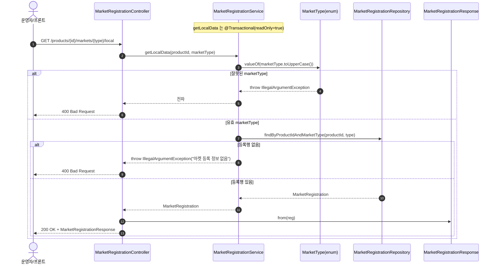

# GET /markets/{marketType}/local — 로컬 마켓 등록정보 단건 조회

## 1. 개요

| 항목 | 내용 |
|------|------|
| **Method / URL** | `GET /api/v1/products/{productId}/markets/{marketType}/local` |
| **목적** | 상품·마켓 조합의 로컬(DB) `MarketRegistration` 단건을 조회해 응답 DTO로 반환한다. 외부 마켓 호출 없이 우리 DB에 저장된 값만 본다. |
| **핵심 상태전이** | 상태 전이 없음(순수 조회) |
| **부수효과** | 없음. `@Transactional(readOnly = true)` 하위 단순 조회. |
| **응답** | `200 OK` + `MarketRegistrationResponse` (미존재 시 `400`, 잘못된 marketType 시 `400`) |

## 2. 호출 체인

```
MarketRegistrationController.getLocalMarketData()      api/.../controller/MarketRegistrationController.java:36-45
  └─ MarketRegistrationService.getLocalData(productId, marketType)  core/.../application/market/MarketRegistrationService.java:33-38  @Transactional(readOnly=true)
       ├─ MarketType.valueOf(marketType.toUpperCase())  MarketRegistrationService.java:34  (bad → IllegalArgumentException → 400)
       └─ MarketRegistrationRepository.findByProductIdAndMarketType()  core/.../market/repository/MarketRegistrationRepository.java:21
             └─ orElseThrow → IllegalArgumentException  MarketRegistrationService.java:37  (→ 400)
  └─ MarketRegistrationResponse.from(reg)              api/.../dto/market/MarketRegistrationResponse.java:30-44
  └─ ResponseEntity.ok(response)                       MarketRegistrationController.java:44
```

**경로 변수**

| 변수 | 타입 | 필수 | 비고 |
|------|------|:----:|------|
| `productId` | Long | ✅ | 상품 존재 여부 미검증 — 등록행 조회 결과로만 판정 |
| `marketType` | String | ✅ | `MarketType.valueOf(toUpperCase())` 로 파싱. enum 밖 값 → `IllegalArgumentException` → 400 |

**enum 값(`MarketType.java:10-15`)**: `COUPANG`, `SMART_STORE`, `ELEVEN_STREET`, `GMARKET`, `AUCTION`, `CAFE24`.

## 3. 유스케이스 다이어그램


## 4. 시퀀스 다이어그램



## 5. 순서도 (플로우차트)


## 6. 상태 전이표

상태 전이 없음(조회). 등록행의 스냅샷만 반환한다.

| 진입 조건 | 결과 |
|-----------|------|
| 잘못된 marketType 문자열 | 400 (IllegalArgumentException) |
| 유효 marketType · 등록행 없음 | 400 (IllegalArgumentException "마켓 등록 정보 없음") |
| 유효 marketType · 등록행 있음 | 200 + Response |
| 상품 자체 미존재 | 별도 판정 없음 — 등록행 없음과 동일하게 400 처리 |

## 7. 🔎 발견사항

### MREG-2 · 🟠 GAP — "등록 정보 없음"을 404가 아닌 400(IllegalArgumentException)으로 반환 — 리소스 부재를 입력오류로 표현
- **근거:** `MarketRegistrationService.java:35-37` 는 등록행 부재 시 `IllegalArgumentException("마켓 등록 정보 없음: ...")` 을 던지고, `GlobalExceptionHandler.java:44-50` 이 이를 400 으로 매핑한다. 같은 서비스의 `getRegistrations`(:28-29)는 부재를 `ResourceNotFoundException`(404)로 다룬다.
- **영향:** 존재하지 않는 리소스 조회가 400(클라이언트 입력오류)으로 나가 REST 시맨틱과 어긋난다. 잘못된 marketType(진짜 입력오류)과 "정상 요청이나 아직 미등록"이 동일하게 400 이라 프론트가 둘을 구분하지 못한다.
- **제안:** 미등록은 `ResourceNotFoundException`(404)로, marketType 파싱 실패는 400 으로 분리. 목록 조회와 상태코드 정책 통일.

### MREG-3 · 🟡 SMELL — 상품 존재 검증 없이 등록행 유무로만 판정(목록 조회와 비대칭)
- **근거:** `getLocalData`(`MarketRegistrationService.java:33-38`)는 `ProductReader`를 주입받고도 사용하지 않는다(목록 경로만 사용). 상품이 아예 없어도 "마켓 등록 정보 없음"으로만 반환.
- **영향:** 존재하지 않는 productId 와 존재하나 해당 마켓 미등록인 productId 를 응답으로 구분할 수 없다.
- **제안:** 필요 시 상품 존재를 먼저 검증(404)하고 그 다음 등록행 유무(404/미등록)를 판정해 목록 경로와 계약을 맞춘다.

## 8. 테스트 커버리지 메모

- `MarketRegistrationServiceTest`:
  - `getLocalData_found`(:70-78) — 등록행 존재 시 그대로 반환, `"coupang"` → `COUPANG` 소문자 파싱 검증.
  - `getLocalData_notFound`(:80-88) — 미존재 시 `IllegalArgumentException`.
- **비어있는 케이스:** ① 잘못된 marketType 문자열(예: `"foo"`) → `IllegalArgumentException` 경로, ② 상품 미존재 vs 마켓 미등록 구분(MREG-2/3), ③ 컨트롤러 통합(400 HTTP 매핑·DTO 직렬화) 미검증.

---
*생성: 2026-07-17 · 근거: 현재 워킹트리*
