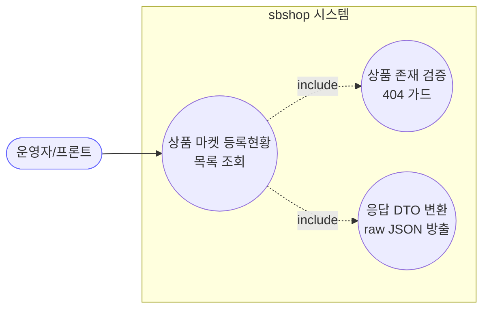

# GET /markets — 상품의 마켓 등록현황 목록

## 1. 개요

| 항목 | 내용 |
|------|------|
| **Method / URL** | `GET /api/v1/products/{productId}/markets` |
| **목적** | 특정 상품(`productId`)의 마켓별 등록행(`MarketRegistration`) 목록을 조회해 응답 DTO로 반환한다. |
| **핵심 상태전이** | 상태 전이 없음(순수 조회) |
| **부수효과** | 없음. `@Transactional(readOnly = true)` 하위 단순 조회. |
| **응답** | `200 OK` + `List<MarketRegistrationResponse>` (상품 미존재 시 `404`) |

## 2. 호출 체인

```
MarketRegistrationController.getMarketRegistrations()   api/.../controller/MarketRegistrationController.java:26-34
  └─ MarketRegistrationService.getRegistrations(productId)  core/.../application/market/MarketRegistrationService.java:27-31  @Transactional(readOnly=true)
       ├─ ProductReader.findById(productId)                 core/.../product/component/ProductReader.java:11
       │     └─ orElseThrow → ResourceNotFoundException     MarketRegistrationService.java:28-29  (→ 404)
       └─ MarketRegistrationRepository.findByProductId()    core/.../market/repository/MarketRegistrationRepository.java:15
  └─ .stream().map(MarketRegistrationResponse::from)        api/.../controller/MarketRegistrationController.java:30-32
       └─ MarketRegistrationResponse.from(MarketRegistration)  api/.../dto/market/MarketRegistrationResponse.java:30-44
  └─ ResponseEntity.ok(registrations)                       MarketRegistrationController.java:33
```

**경로 변수**

| 변수 | 타입 | 필수 | 비고 |
|------|------|:----:|------|
| `productId` | Long | ✅ | 미존재 시 `ResourceNotFoundException` → 404 (`GlobalExceptionHandler.java:28-34`) |

**응답 DTO (`MarketRegistrationResponse`, `MarketRegistrationResponse.java:16-28`)** — 도메인 엔티티 직렬화를 미러. `marketIdentifiers`·`marketDetailedInfo`는 `@JsonRawValue`로 raw JSON 방출, getter가 유효성 폴백(`"{}"`)을 적용(`MarketRegistration.java:69-77`).

## 3. 유스케이스 다이어그램



## 4. 시퀀스 다이어그램

```mermaid
sequenceDiagram
    autonumber
    actor U as 운영자/프론트
    participant C as MarketRegistrationController
    participant S as MarketRegistrationService
    participant PR as ProductReader
    participant R as MarketRegistrationRepository
    participant D as MarketRegistrationResponse
    Note over S: getRegistrations 는 @Transactional(readOnly=true)

    U->>C: GET /products/{id}/markets
    C->>S: getRegistrations(productId)
    S->>PR: findById(productId)
    alt 상품 없음
        S-->>C: throw ResourceNotFoundException
        C-->>U: 404 Not Found
    else 상품 있음
        S->>R: findByProductId(productId)
        R-->>S: List&lt;MarketRegistration&gt;
        S-->>C: List&lt;MarketRegistration&gt;
        C->>D: from(each) 매핑
        C-->>U: 200 OK + List&lt;MarketRegistrationResponse&gt;
    end
```

## 5. 순서도 (플로우차트)

```mermaid
flowchart TD
    START([GET /products/{id}/markets]) --> PF{상품 존재?}
    PF -- No --> NF["throw ResourceNotFoundException<br/>→ 404"]:::warn
    PF -- Yes --> FETCH[findByProductId 조회]
    FETCH --> MAP["MarketRegistrationResponse.from 매핑<br/>(0건이면 빈 리스트)"]
    MAP --> OK([200 OK + List]):::ok

    classDef ok fill:#dfd,stroke:#3a3;
    classDef warn fill:#fe8,stroke:#e90;
```

## 6. 상태 전이표

상태 전이 없음(조회). 진입 상태를 소비하지 않고 등록행 스냅샷을 그대로 반환한다.

| 진입 조건 | 결과 |
|-----------|------|
| 상품 미존재 | 404 (ResourceNotFoundException) |
| 상품 존재 · 등록 0건 | 200 + 빈 리스트 |
| 상품 존재 · 등록 N건 | 200 + N건 리스트 |

## 7. 🔎 발견사항

### MREG-1 · 🔵 NOTE — 목록 조회는 상품 존재를 404로 가드하나 로컬 조회(`getLocalData`)는 미가드로 비대칭
- **근거:** `MarketRegistrationService.java:28-29` 는 `productReader.findById` → `ResourceNotFoundException`(404)로 상품 존재를 명시 검증한다. 반면 같은 서비스의 `getLocalData`(:33-38)는 상품 존재를 전혀 확인하지 않는다. 동일 리소스 트리(`/products/{productId}/markets/...`) 하위인데 상품 미존재 처리가 엔드포인트마다 다르다.
- **영향:** 목록은 404, 로컬 조회는 (등록행이 없으면) 400 을 반환 — 프론트가 "상품 없음"과 "마켓 미등록"을 상태코드로 구분하기 어렵다.
- **제안:** 리소스 트리 하위 조회의 상품 존재 가드 정책을 통일(둘 다 404 또는 문서화된 계약)하는 것을 검토.

## 8. 테스트 커버리지 메모

- `MarketRegistrationServiceTest`(`core/src/test/.../MarketRegistrationServiceTest.java`)가 서비스 계약을 커버한다:
  - `getRegistrations_returnsRepositoryResult`(:41-49) — 상품 존재 시 레포 결과 그대로 반환.
  - `getRegistrations_productExistsButNoRegistrations_returnsEmpty`(:51-58) — 등록 0건 빈 리스트.
  - `getRegistrations_productNotFound_throws`(:60-68) — 상품 미존재 시 `ResourceNotFoundException`.
- **비어있는 케이스:** 컨트롤러 레벨 통합 테스트(DTO 매핑·404 → HTTP 상태 매핑, `@JsonRawValue` raw JSON 방출 계약) 검색되지 않음.

---
*생성: 2026-07-17 · 근거: 현재 워킹트리*
