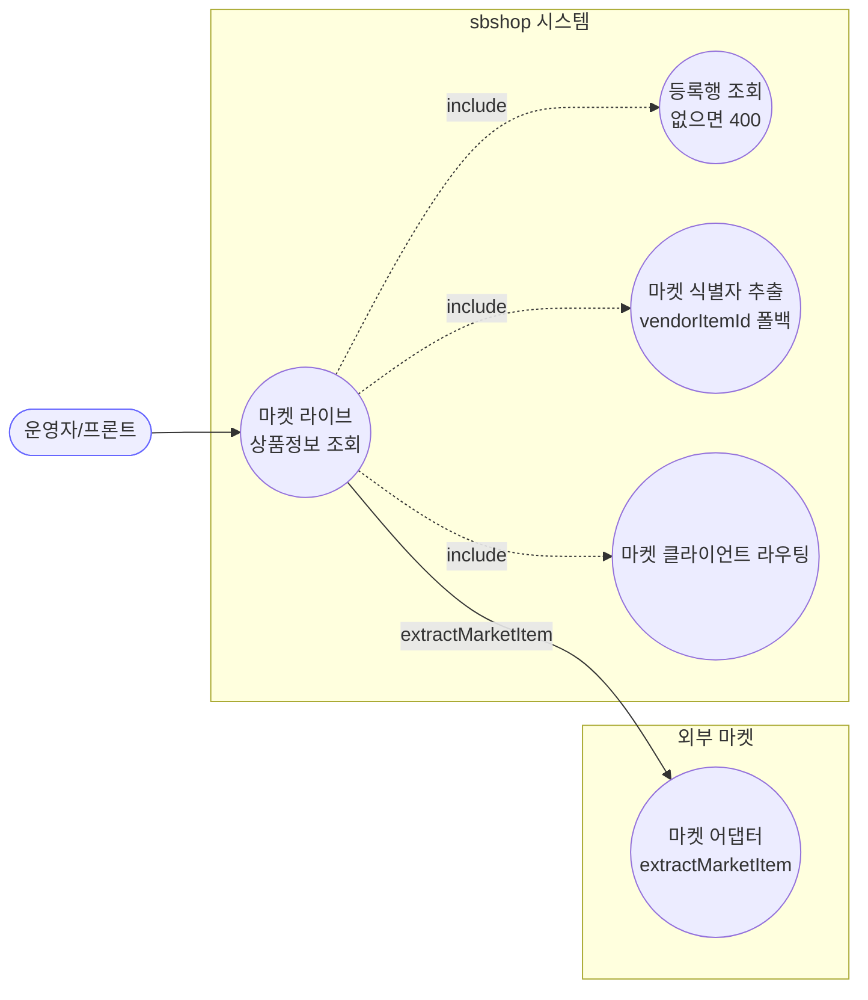
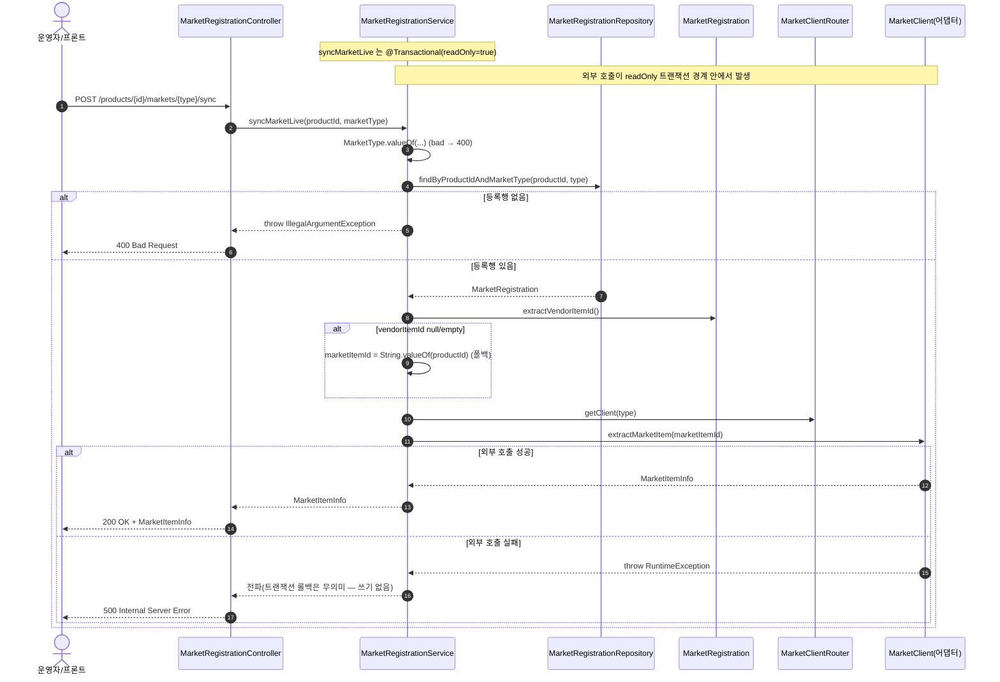
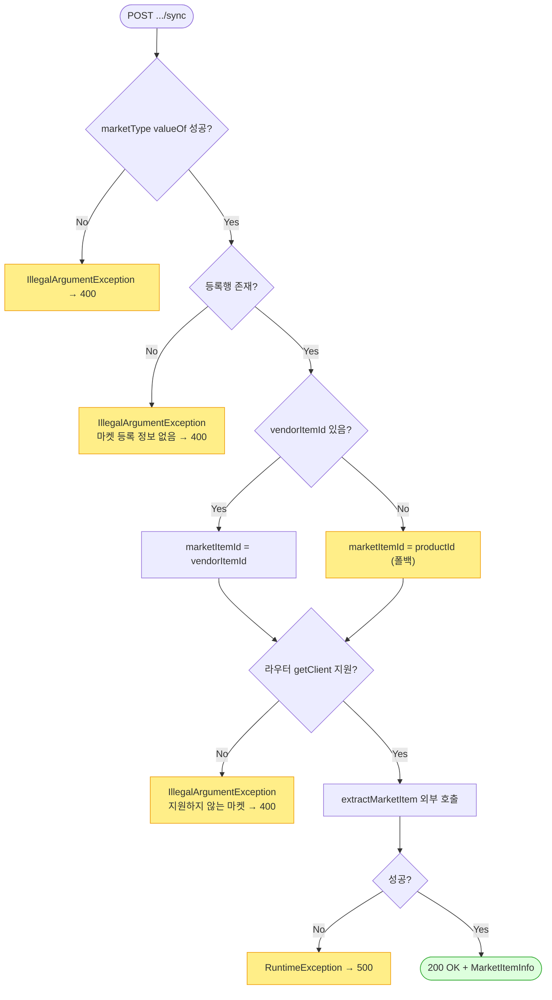

# POST /markets/{marketType}/sync — 마켓 라이브 상품정보 조회(sync)

## 1. 개요

이 기능은 "지금 그 마켓에 이 상품이 실제로 어떻게 올라가 있는지"를 마켓에 직접 물어봐서 그 결과를 그대로 보여줍니다. 이름은 "sync(동기화)"지만, 실제로는 마켓의 현재 상태를 한번 들여다보는 것일 뿐 우리 DB에 저장하지는 않습니다.

| 항목 | 내용 |
|------|------|
| **Method / URL** | `POST /api/v1/products/{productId}/markets/{marketType}/sync` |
| **목적** | 우리 DB의 등록 정보에서 "그 마켓에서의 상품 식별자"를 꺼내, 해당 마켓 API(`extractMarketItem`)에 실제로 물어봐 지금의 상품정보(`MarketItemInfo`)를 받아 돌려줍니다. |
| **핵심 상태전이** | 없음(라이브 조회) — DB 등록 정보를 바꾸거나 저장하지 않습니다(`isSynced`·`lastSyncedAt`도 그대로). |
| **부수효과** | **외부 마켓 API를 실제로 호출**(`MarketClient.extractMarketItem`)합니다. 받아온 결과는 DB에 반영하지 않고 응답으로만 전달합니다. |
| **응답** | 정상이면 `200 OK` + 마켓 상품정보. 등록이 없거나 마켓 이름이 틀리면 `400`, 마켓에 물어보다 실패하면 `500`. |

## 2. 호출 체인

아래는 요청이 들어온 뒤 어떤 코드들이 차례로 불려 일이 처리되는지의 흐름입니다.

```
MarketRegistrationController.syncMarketLive()          api/.../controller/MarketRegistrationController.java:47-54
  └─ MarketRegistrationService.syncMarketLive(productId, marketType)  core/.../application/market/MarketRegistrationService.java:40-53  @Transactional(readOnly=true)
       ├─ MarketType.valueOf(marketType.toUpperCase())   MarketRegistrationService.java:41  (bad → IllegalArgumentException → 400)
       ├─ MarketRegistrationRepository.findByProductIdAndMarketType()  core/.../market/repository/MarketRegistrationRepository.java:21
       │     └─ orElseThrow → IllegalArgumentException   MarketRegistrationService.java:44  (→ 400)
       ├─ reg.extractVendorItemId()                      core/.../market/MarketRegistration.java:117-129
       │     └─ null/empty → marketItemId = productId    MarketRegistrationService.java:47-49  (폴백)
       ├─ MarketClientRouter.getClient(type)             core/.../market/client/MarketClientRouter.java:19-25  (미지원 → IllegalArgumentException)
       └─ MarketClient.extractMarketItem(marketItemId)   core/.../market/client/MarketClient.java:15
             └─ 예: CoupangMarketClient.extractMarketItem  infrastructure/.../coupang/adapter/CoupangMarketClient.java:90-113
                   └─ restClient.get(...) → 실패 시 RuntimeException  CoupangMarketClient.java:109-112  (→ 500)
  └─ ResponseEntity.ok(MarketItemInfo)                   MarketRegistrationController.java:53
```

→ 쉽게 말하면: ① 입구(컨트롤러)가 서비스에 "이 상품의 이 마켓 상태를 실제로 물어봐 달라"고 부탁합니다. ② 서비스는 마켓 이름이 올바른지 확인하고(틀리면 400), ③ DB에서 그 상품·마켓의 등록 정보를 찾습니다(없으면 400). ④ 그 등록 정보에서 "마켓에서 쓰는 상품 식별자(vendorItemId)"를 꺼내는데, 없으면 대신 우리 내부 번호(productId)를 씁니다(이게 뒤에 나오는 문제거리 MREG-4입니다). ⑤ 어느 마켓에 물어볼지 담당 클라이언트를 고르고 ⑥ 실제로 마켓에 물어봅니다. 성공하면 200, 물어보다 실패하면 500이 됩니다.

**경로 변수** (URL 주소에 끼워 넣는 값)

| 변수 | 타입 | 필수 | 비고 |
|------|------|:----:|------|
| `productId` | Long | ✅ | 마켓 식별자(vendorItemId)가 없을 때 대신 마켓 조회에 쓰임 — 잘못된 대상 조회로 이어질 수 있음(MREG-4) |
| `marketType` | String | ✅ | 마켓 이름이 허용 목록에 없으면 `MarketType.valueOf` 단계에서 실패 → 400 |

## 3. 유스케이스 다이어그램

👉 이 그림은 "운영자가 이 조회를 쓸 때, 시스템 안에서 하는 일들과 외부 마켓에 실제로 물어보는 부분"을 함께 보여줍니다. 오른쪽 별도 상자(외부 마켓)가 실제로 마켓에 전화를 거는 부분입니다.



## 4. 시퀀스 다이어그램

👉 이 그림은 "요청 하나가 각 담당자를 거쳐 결국 외부 마켓까지 물어보고 오는 대화 순서"를 보여줍니다. 마켓 식별자가 없으면 내부 번호로 대체(폴백)하는 지점과, 마켓 호출이 실패하면 500이 되는 지점이 표시돼 있습니다.



## 5. 순서도 (플로우차트)

👉 이 그림은 "조건에 따라 어느 길로 가는지"를 갈림길로 보여줍니다. 마켓 이름 확인 → 등록 있는지 확인 → 마켓 식별자가 있으면 그걸, 없으면 내부 번호를 대신 씀 → 담당 마켓이 지원되면 실제로 물어봄 → 성공하면 200, 실패하면 500 순서입니다.



## 6. 상태 전이표

이 기능은 아무 상태도 바꾸지 않습니다(라이브 조회). 이름은 "sync"지만 DB 등록 정보에 **아무 것도 저장하지 않습니다** — "동기화됨" 표시(`markSynced()`)나 실패 표시(`markSyncFailed()`)(`MarketRegistration.java:101-112`)를 부르지도 않고, `isSynced`·`lastSyncedAt`(마지막 동기화 시각)도 그대로 둡니다.

| 진입 조건 | 결과 | 외부 호출 | DB 변경 |
|-----------|------|:--------:|:------:|
| 마켓 이름을 잘못 적음 | 400 | 안 함 | 없음 |
| 등록이 없음 | 400 | 안 함 | 없음 |
| 등록 있고 · 마켓 식별자(vendorItemId)도 있음 | 200 + 마켓 상품정보 | 함(식별자로) | 없음 |
| 등록 있고 · 마켓 식별자가 없음 | 200 또는 마켓 오류 | 함(내부 번호로 대체) | 없음 |
| 지원하지 않는 마켓(라우터) | 400 | 안 함 | 없음 |
| 마켓에 물어보다 실패 | 500 | 시도함 | 없음 |

## 7. 🔎 발견사항

### MREG-4 · 🟠 GAP — vendorItemId 부재 시 `productId`(내부 PK)를 마켓 상품 식별자로 폴백 — 잘못된 대상 조회 가능
- **무엇이 문제인가:** 마켓에 "이 상품 어떻게 올라가 있냐"고 물어보려면 그 마켓이 쓰는 상품 식별자가 필요합니다. 그런데 그 식별자가 없을 때, 코드는 대신 우리 내부 번호(`productId`)를 그 자리에 넣어 물어봅니다. 문제는 이 식별자 꺼내는 함수(`extractVendorItemId`)가 **쿠팡에서만 쓰는 키만** 읽는다는 점입니다. 그래서 스마트스토어·11번가·Cafe24·ESM+는 항상 이 식별자가 비어 있어, 매번 내부 번호로 대체됩니다. 하지만 내부 번호는 어느 마켓에서도 통하는 상품 번호가 아닙니다.
- **근거:** `MarketRegistrationService.java:46-49` — `extractVendorItemId()`가 null/empty면 `marketItemId = String.valueOf(reg.getProductId())`. `extractVendorItemId`(`MarketRegistration.java:117-129`)는 쿠팡 전용 키(`vendorItemId`)만 읽습니다. 도메인에는 이미 마켓별 실제 코드를 읽는 `extractMarketCode()`(`MarketRegistration.java:141-181`)가 있는데 이 경로는 그걸 쓰지 않습니다.
- **왜 문제인가:** 쿠팡이 아닌 마켓에서는 이 조회를 하면 내부 번호를 마켓 상품 번호인 척 넘기게 됩니다. 그러면 마켓 API가 엉뚱한 상품을 조회하거나, 그런 상품이 없다며 오류(→500)를 냅니다. 즉 원래 물어보려던 상품이 아닌 다른 걸 물어볼 위험이 있습니다.
- **어떻게 고치면 되나:** 식별자가 없을 때 내부 번호(`productId`)가 아니라 마켓별 실제 식별자(`extractMarketCode()`)를 쓰도록 바꾸고, 그마저도 없으면 명확히 400/404로 실패시켜 잘못된 대상 조회를 막습니다.

### MREG-5 · 🟡 SMELL — 외부 마켓 HTTP 호출이 `@Transactional(readOnly=true)` 트랜잭션 경계 안에서 수행됨
- **무엇이 문제인가:** 외부 마켓에 물어보는 동안(응답을 기다리는 내내) DB 연결을 붙잡고 있습니다. 이 기능은 DB에 뭔가 쓰지도 않는데도, 코드 구조상 DB 작업 묶음(트랜잭션) 안에서 외부 호출이 이뤄집니다.
- **근거:** 클래스 전체에 붙은 `@Transactional(readOnly = true)`(`MarketRegistrationService.java:20`)가 `syncMarketLive`(:40-53)에도 적용됩니다. 이 메서드는 쓰기가 없는데도 `extractMarketItem`(:52) 외부 호출이 끝날 때까지 DB 연결/트랜잭션을 잡고 있습니다.
- **왜 문제인가:** 마켓 응답이 느리면 그 시간만큼 DB 연결을 붙잡고 있어, 동시 요청이 많을 때 쓸 수 있는 DB 연결이 바닥날 위험(커넥션 풀 고갈)이 있습니다. 게다가 결과를 DB에 저장하지도 않으니 이 트랜잭션 자체가 사실 필요 없습니다.
- **어떻게 고치면 되나:** 이 기능은 DB 작업 묶음 밖에서 외부 호출을 하도록(또는 DB에서 등록 정보를 읽는 부분만 짧게 묶음 안에 두도록) 구조를 다시 짭니다.

### MREG-6 · 🔵 NOTE — "sync" 라는 이름과 달리 동기화 상태를 저장하지 않음(순수 라이브 조회)
- **무엇이 문제인가:** 주소에 "sync(동기화)"라고 적혀 있어 마치 이걸 부르면 우리 데이터가 최신으로 갱신될 것처럼 보이지만, 실제로는 마켓 값을 한번 보여줄 뿐 아무 것도 저장하지 않습니다.
- **근거:** `syncMarketLive`(`MarketRegistrationService.java:40-53`)는 마켓 상품정보(`MarketItemInfo`)를 돌려주기만 하고, "동기화됨" 표시(`markSynced()`)나 `isSynced`·`lastSyncedAt`(`MarketRegistration.java:101-104`)을 전혀 바꾸지 않습니다.
- **왜 문제인가:** 이름만 보고 "이 조회를 했으니 우리 로컬 데이터도 최신으로 반영됐겠지"라고 오해할 수 있습니다. 실제로는 읽기 전용 미리보기일 뿐입니다.
- **어떻게 고치면 되나:** 이름·문서에서 "실제로 저장하는 게 아니라 라이브로 한번 보는 것(preview)"임을 분명히 하거나, 정말 저장까지 하려던 의도였다면 조회 결과를 저장하는 로직을 추가합니다.

## 8. 테스트 커버리지 메모

이 기능이 약속대로 동작하는지 확인하는 자동 테스트가 어디까지 있는지를 정리한 것입니다.

- `MarketRegistrationServiceTest`:
  - `syncMarketLive_usesVendorItemId`(:90-103) — 마켓 식별자(vendorItemId)가 있으면 그걸 그대로 써서 마켓에 물어보는지 확인.
  - `syncMarketLive_fallbackToProductId`(:105-119) — 식별자가 비면 내부 번호(예 `"77"`)로 대체하는지 확인. (**주의: 이 테스트는 지금의 "내부 번호로 대체하는" 동작이 옳다고 못 박아 버려, 앞의 잘못된 폴백 문제 MREG-4를 정상인 것처럼 통과시킵니다.**)
- **아직 테스트가 없는 부분:** ① 등록이 없을 때 400이 나는지, ② 마켓 이름을 잘못 적었을 때, ③ 지원하지 않는 마켓(라우터에서 막힘)일 때, ④ 마켓 호출이 실패해 500이 잘 전달되는지, ⑤ 쿠팡이 아닌 마켓에서 마켓별 실제 식별자(`extractMarketCode`)를 써야 한다는 부분(MREG-4), ⑥ 트랜잭션 경계 문제(MREG-5)는 확인되지 않았습니다.

---
*(쉬운 설명판 · 2026-07-17 재작성)*
*생성: 2026-07-17 · 근거: 현재 워킹트리*
