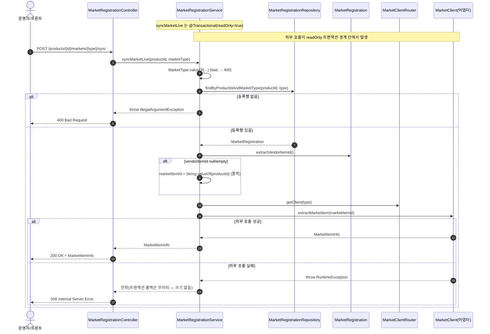

# POST /markets/{marketType}/sync — 마켓 라이브 상품정보 조회(sync)

## 1. 개요

| 항목 | 내용 |
|------|------|
| **Method / URL** | `POST /api/v1/products/{productId}/markets/{marketType}/sync` |
| **목적** | 상품·마켓 등록행에서 마켓 상품 식별자를 추출해, 해당 마켓 API(`extractMarketItem`)로 라이브 상품정보(`MarketItemInfo`)를 조회해 반환한다. |
| **핵심 상태전이** | 상태 전이 없음(라이브 조회) — DB 등록행을 변경/저장하지 않음(`isSynced`·`lastSyncedAt` 미갱신) |
| **부수효과** | **외부 마켓 API 호출**(`MarketClient.extractMarketItem`). 결과는 DB에 반영하지 않고 응답으로만 전달. |
| **응답** | `200 OK` + `MarketItemInfo` (등록행/marketType 오류 → `400`, 외부 호출 실패 → `500`) |

## 2. 호출 체인

```
MarketRegistrationController.syncMarketLive()          api/.../controller/MarketRegistrationController.java:47-54
  └─ MarketRegistrationService.syncMarketLive(productId, marketType)  core/.../application/market/MarketRegistrationService.java:40-53  @Transactional(readOnly=true)
       ├─ MarketType.valueOf(marketType.toUpperCase())   MarketRegistrationService.java:41  (bad → IllegalArgumentException → 400)
       ├─ MarketRegistrationRepository.findByProductIdAndMarketType()  core/.../market/repository/MarketRegistrationRepository.java:21
       │     └─ orElseThrow → IllegalArgumentException   MarketRegistrationService.java:44  (→ 400)
       ├─ reg.extractVendorItemId()                      core/.../market/MarketRegistration.java:117-129
       │     └─ null/empty → marketItemId = productId    MarketRegistrationService.java:47-49  (폴백)
       ├─ MarketClientRouter.getClient(type)             core/.../market/client/MarketClientRouter.java:19-25  (미지원 → IllegalArgumentException)
       └─ MarketClient.extractMarketItem(marketItemId)   core/.../market/client/MarketClient.java:15
             └─ 예: CoupangMarketClient.extractMarketItem  infrastructure/.../coupang/adapter/CoupangMarketClient.java:90-113
                   └─ restClient.get(...) → 실패 시 RuntimeException  CoupangMarketClient.java:109-112  (→ 500)
  └─ ResponseEntity.ok(MarketItemInfo)                   MarketRegistrationController.java:53
```

**경로 변수**

| 변수 | 타입 | 필수 | 비고 |
|------|------|:----:|------|
| `productId` | Long | ✅ | vendorItemId 부재 시 마켓 조회 식별자로 폴백(MREG-4) |
| `marketType` | String | ✅ | `MarketType.valueOf` 파싱 실패 → 400 |

## 3. 유스케이스 다이어그램


## 4. 시퀀스 다이어그램



## 5. 순서도 (플로우차트)


## 6. 상태 전이표

상태 전이 없음(라이브 조회). 이름은 "sync" 이나 DB 등록행에 **아무 것도 쓰지 않는다** — `markSynced()`/`markSyncFailed()`(`MarketRegistration.java:101-112`)를 호출하지 않고 `isSynced`·`lastSyncedAt`도 갱신하지 않는다.

| 진입 조건 | 결과 | 외부 호출 | DB 변경 |
|-----------|------|:--------:|:------:|
| 잘못된 marketType | 400 | — | 없음 |
| 등록행 없음 | 400 | — | 없음 |
| 등록행 있음 · vendorItemId 존재 | 200 + MarketItemInfo | ✅(식별자) | 없음 |
| 등록행 있음 · vendorItemId 부재 | 200 또는 마켓오류 | ✅(productId 폴백) | 없음 |
| 미지원 마켓(라우터) | 400 | — | 없음 |
| 외부 호출 실패 | 500 | 시도됨 | 없음 |

## 7. 🔎 발견사항

### MREG-4 · 🟠 GAP — vendorItemId 부재 시 `productId`(내부 PK)를 마켓 상품 식별자로 폴백 — 잘못된 대상 조회 가능
- **근거:** `MarketRegistrationService.java:46-49` — `extractVendorItemId()`가 null/empty면 `marketItemId = String.valueOf(reg.getProductId())`. `extractVendorItemId`(`MarketRegistration.java:117-129`)는 **쿠팡 전용 키(`vendorItemId`)만** 읽으므로 SMART_STORE·ELEVEN_STREET·CAFE24·ESM+ 는 vendorItemId가 없어 항상 폴백에 걸린다. 폴백 값은 우리 내부 PK(`product_id`)로, 어느 마켓의 상품ID도 아니다.
- **영향:** 쿠팡 외 마켓은 sync 시 내부 PK를 마켓 상품ID로 넘겨 마켓 API가 엉뚱한/존재하지 않는 상품을 조회하거나 오류(→500)를 낸다. 도메인엔 이미 마켓별 실제 코드를 읽는 `extractMarketCode()`(`MarketRegistration.java:141-181`)가 있으나 이 경로는 사용하지 않는다.
- **제안:** 폴백을 `productId`가 아니라 `extractMarketCode()`(마켓별 실제 식별자)로 교체하고, 그마저 없으면 명시 400/404 로 실패시켜 잘못된 대상 조회를 차단.

### MREG-5 · 🟡 SMELL — 외부 마켓 HTTP 호출이 `@Transactional(readOnly=true)` 트랜잭션 경계 안에서 수행됨
- **근거:** 클래스 레벨 `@Transactional(readOnly = true)`(`MarketRegistrationService.java:20`)가 `syncMarketLive`(:40-53)에도 적용된다. 메서드는 쓰기가 없지만 `extractMarketItem`(:52) 외부 HTTP 호출 동안 DB 커넥션/트랜잭션을 잡고 있다.
- **영향:** 마켓 API 지연 시 DB 커넥션을 외부 I/O 시간만큼 점유 — 커넥션 풀 고갈 위험. 조회 결과를 DB에 반영하지도 않으므로 트랜잭션 자체가 불필요.
- **제안:** 이 메서드는 트랜잭션 밖(또는 등록행 조회만 트랜잭션)에서 외부 호출을 수행하도록 경계 재설계.

### MREG-6 · 🔵 NOTE — "sync" 라는 이름과 달리 동기화 상태를 저장하지 않음(순수 라이브 조회)
- **근거:** `syncMarketLive`(`MarketRegistrationService.java:40-53`)는 `MarketItemInfo`를 반환만 하고 `markSynced()`/`isSynced`/`lastSyncedAt`(`MarketRegistration.java:101-104`)를 갱신하지 않는다.
- **영향:** 엔드포인트 이름(`/sync`)이 "동기화(반영)"를 암시하나 실제로는 읽기 전용 미리보기. 소비자가 이 호출 후 로컬 데이터가 갱신됐다고 오인할 수 있다.
- **제안:** 이름/문서에서 "라이브 조회(preview)"임을 명확히 하거나, 의도가 실제 반영이면 조회 결과 저장 로직을 추가.

## 8. 테스트 커버리지 메모

- `MarketRegistrationServiceTest`:
  - `syncMarketLive_usesVendorItemId`(:90-103) — vendorItemId 존재 시 그대로 `extractMarketItem` 호출.
  - `syncMarketLive_fallbackToProductId`(:105-119) — vendorItemId 비면 `productId`(예 `"77"`) 폴백 검증(**현재 폴백 동작을 고정하는 테스트 — MREG-4의 잘못된 폴백을 그린으로 잠금**).
- **비어있는 케이스:** ① 등록행 없음 → 400, ② 잘못된 marketType, ③ 미지원 마켓(라우터 예외), ④ 외부 호출 실패 → 500 전파, ⑤ 쿠팡 외 마켓에서 `extractMarketCode` 사용 여부(MREG-4), ⑥ 트랜잭션 경계(MREG-5) 미검증.

---
*생성: 2026-07-17 · 근거: 현재 워킹트리*
