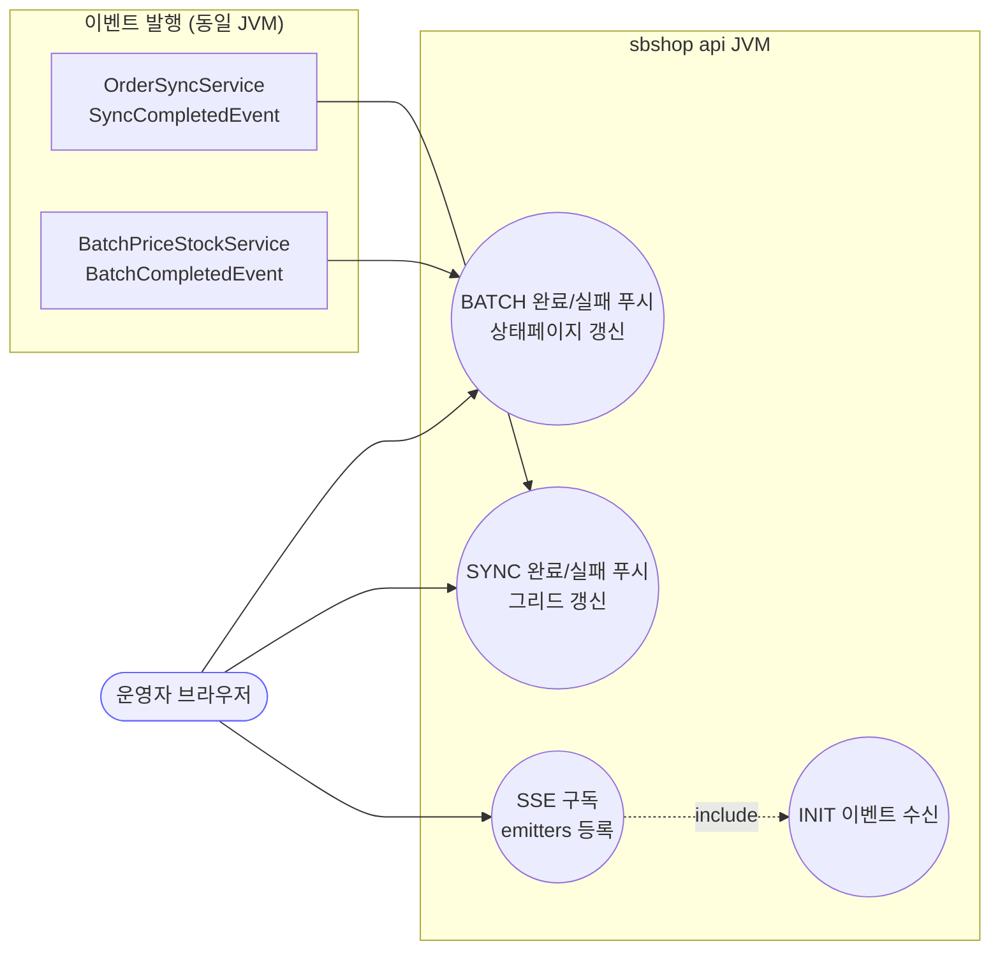
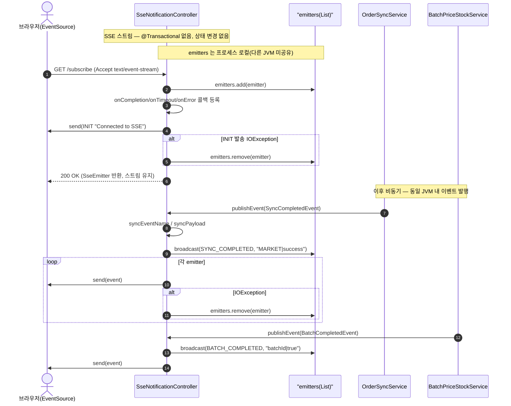

# GET /subscribe — SSE 알림 구독 (동기·배치 완료 푸시)

## 1. 개요

| 항목 | 내용 |
|------|------|
| **Method / URL** | `GET /api/v1/notifications/subscribe` (`produces=text/event-stream`) |
| **목적** | 프론트가 열어 두는 서버-전송(SSE) 스트림. 마켓 주문동기화 완료/실패(`SYNC_COMPLETED`/`SYNC_FAILED`)와 가격·재고 배치 완료/실패(`BATCH_COMPLETED`/`BATCH_FAILED`)를 실시간 푸시받아 UI 로딩·그리드 갱신을 트리거한다. |
| **핵심 상태전이** | 없음(조회/스트림 구독). 서버는 상태를 변경하지 않고 in-memory `emitters` 목록에만 연결을 추가/제거한다. |
| **부수효과** | 프로세스 로컬 `CopyOnWriteArrayList<SseEmitter>` 에 emitter 등록. 연결 종료/타임아웃/오류 시 자동 제거. 접속 즉시 `INIT` 이벤트 1회 발송. |
| **응답** | `200 OK` + `SseEmitter`(타임아웃 24h). 이후 서버 이벤트 스트림. |

## 2. 호출 체인

```
SseNotificationController.subscribe()                       api/.../controller/SseNotificationController.java:23-50  (@GetMapping)
  ├─ new SseEmitter(86400000L)                              :26  (타임아웃 24h)
  ├─ emitters.add(emitter)                                  :29  (프로세스 로컬 목록)
  ├─ emitter.onCompletion/onTimeout/onError → remove        :32-38
  ├─ emitter.send(INIT "Connected to SSE")                  :42  (try, IOException → remove :45)
  └─ return emitter                                         :49

[비동기 이벤트 유입 — 같은 컨트롤러 빈의 @EventListener 로 푸시]
onSyncCompleted(SyncCompletedEvent)                         SseNotificationController.java:63-68  (@EventListener)
  ├─ syncEventName(success) → "SYNC_COMPLETED"|"SYNC_FAILED" :52-54
  ├─ syncPayload(marketType,success,errorMessage)           :56-61  ("COUPANG|success" | "SMART_STORE|fail|msg")
  └─ broadcast(name,data) → 각 emitter.send / 실패 시 remove :86-94
       ▲ 발행처: {Coupang,SmartStore,Elevenst,Cafe24}OrderSyncService  core/.../order/service/*.java
         예) CoupangOrderSyncService.java:87,92 · SmartStoreOrderSyncService.java:74,78

onBatchCompleted(BatchCompletedEvent)                       SseNotificationController.java:78-83  (@EventListener)
  ├─ batchEventName(success) → "BATCH_COMPLETED"|"BATCH_FAILED" :70-72
  ├─ batchPayload(batchId,success)                          :74-76  ("B-1|true")
  └─ broadcast(name,data)                                   :86-94
       ▲ 발행처: BatchPriceStockService.java:104,156,183

[소비처 — 프론트]
frontend/src/pages/OrderGrid.tsx:551-563          EventSource('/sbshop-agent/api/v1/notifications/subscribe')
                                                   addEventListener('SYNC_COMPLETED'/'SYNC_FAILED')
frontend/src/pages/ProcessStatusPage.tsx:121-124  addEventListener('BATCH_COMPLETED'/'BATCH_FAILED')
```

**요청 파라미터** — 없음(무파라미터 GET).

**이벤트 계약**

| 이벤트명 | data 포맷 | 발행 트리거 |
|----------|-----------|-------------|
| `INIT` | `"Connected to SSE"` | 구독 직후 1회 (L42) |
| `SYNC_COMPLETED` | `"<MARKET>|success"` | 주문동기화 성공 (L59) |
| `SYNC_FAILED` | `"<MARKET>|fail|<errorMessage>"` | 주문동기화 실패 (L60) |
| `BATCH_COMPLETED` | `"<batchId>|true"` | 가격·재고 배치 성공 (L75) |
| `BATCH_FAILED` | `"<batchId>|false"` | 가격·재고 배치 실패 (L75) |

## 3. 유스케이스 다이어그램



## 4. 시퀀스 다이어그램



## 5. 순서도 (플로우차트)


## 6. 상태 전이표

**상태 전이 없음(조회/스트림 구독).** 이 엔드포인트는 도메인 상태를 변경하지 않는다. 유일한 부수효과는 in-memory emitter 목록 관리이며, 그 생명주기는 아래와 같다(도메인 상태 아님).

| emitter 생명주기 | 트리거 | 목록 결과 |
|-----------------|--------|-----------|
| 등록 | subscribe 진입(L29) | `emitters += emitter` |
| INIT 발송 실패 | IOException(L45) | 즉시 제거 |
| 클라이언트 정상 종료 | onCompletion(L32) | 제거 |
| 24h 타임아웃 | onTimeout(L35) | 제거 |
| 전송 오류 | onError(L38) / broadcast send 실패(L91) | 제거 |

## 7. 🔎 발견사항

### MISCB-1 · 🟠 GAP — emitters 목록이 프로세스 로컬이라 배포 토폴로지(api/worker 2 JVM)에서 이벤트 전달이 JVM 경계에 갇힘
- **근거:** `SseNotificationController.java:21` `CopyOnWriteArrayList<SseEmitter> emitters` 는 api JVM 인메모리다. `@EventListener`(`:63-83`)는 **같은 JVM 내** Spring `ApplicationEvent` 만 수신한다. 이벤트 발행처인 `OrderSyncService`/`BatchPriceStockService` 는 core 모듈이며, worker JVM(스케줄러)에서도 실행된다(`OrderSyncScheduler.java:39` 등).
- **영향:** 스케줄러(worker JVM)가 주도한 주문동기화·배치 완료는 worker JVM 내에서 이벤트를 발행하므로, api JVM에 붙어 있는 브라우저 SSE에는 **도달하지 않는다**. 사용자 트리거(api JVM 경유)만 SSE로 표면화되고, cron 경로 완료는 프론트에 실시간 통지되지 않는다.
- **제안:** cross-JVM 통지가 필요하면 Redis pub/sub 등 공유 채널로 이벤트를 중계하거나, 최소한 "SSE는 api-트리거 동기화에만 유효" 임을 설계 문서로 명시. (프론트가 D-023 타임아웃 폴백을 둔 것과 정합.)

### MISCB-2 · 🟡 SMELL — 문자열 페이로드(`"MARKET|success"`, `"batchId|true"`)를 구분자로 인코딩 — 스키마 없는 계약
- **근거:** `syncPayload`(`:56-61`), `batchPayload`(`:74-76`) 가 `|` 구분 문자열을 만들고, 프론트(`OrderGrid.tsx:552-563`, `ProcessStatusPage.tsx:123`)가 이벤트명·문자열로 파싱한다. `errorMessage` 가 `|` 를 포함하면 파싱이 어긋난다.
- **영향:** `SYNC_FAILED` 의 `errorMessage` 에 파이프가 섞이면 프론트 필드 분해가 오류날 수 있음. 타입 안전성 없음.
- **제안:** JSON 페이로드(`SseEmitter.event().data(obj, MediaType.APPLICATION_JSON)`)로 전환해 필드 구조를 명시. 계약 테스트로 고정.

### MISCB-3 · 🔵 NOTE — 초기 INIT 이후 keep-alive(heartbeat) 부재 — 프록시/방화벽 유휴 끊김 가능
- **근거:** `subscribe()` 는 `INIT` 1회만 보내고(`:42`) 이후 서버발 이벤트가 없으면 24h 동안 무전송이다. 주기적 comment/heartbeat 이벤트가 없다.
- **영향:** nginx·중간 프록시의 idle timeout(기본 60s 전후)에 걸려 연결이 조용히 끊길 수 있고, 그 사이 발생한 SYNC/BATCH 이벤트를 놓친다. 프론트가 `readyState===CLOSED` 폴백(`OrderGrid.tsx:567`)으로 보완하지만 근본적 heartbeat는 아님.
- **제안:** `ScheduledExecutor` 로 15~30초 heartbeat comment(`:comment`) 전송, 또는 프록시 `proxy_read_timeout` 상향과 함께 문서화.

### MISCB-4 · 🔵 NOTE — CORS 전역 개방(`@CrossOrigin(origins = "*")`) — 인증 없는 브로드캐스트 스트림
- **근거:** `SseNotificationController.java:17` `@CrossOrigin(origins = "*")`. 인증 프레임워크 부재(프로젝트 관례) + 무파라미터 GET이라 누구나 구독 가능하며, 마켓명·배치ID·에러메시지가 브로드캐스트된다.
- **영향:** 운영 도메인 노출 시 임의 오리진이 동기화/배치 이벤트를 수신 가능. 보안 비중요 프로젝트 방침상 즉시 결함은 아니나 기록 필요.
- **제안:** 운영 오리진 화이트리스트로 좁히는 것을 검토(옵트인).

## 8. 테스트 커버리지 메모

- **존재:** `SseNotificationBatchTest.java`(api) — `syncEventName`/`syncPayload`/`batchEventName`/`batchPayload` 순수 매핑을 특성화 테스트로 고정(총 8케이스). 이벤트명/페이로드 계약 회귀는 방어됨.
- **비어있는 케이스:** ① `subscribe()` 자체(emitter 등록/INIT 발송/콜백 제거)의 테스트 없음. ② `broadcast` 중 `IOException` 발생 시 해당 emitter 제거(자기치유) 검증 없음(MISCB 발견과 직접 연관). ③ `@EventListener` 가 실제 이벤트 유입 시 broadcast를 부르는 배선 검증 없음. ④ cross-JVM 미도달(MISCB-1)은 단위 테스트 대상 밖 — 통합/설계 검증 필요.
- 우선순위: MISCB-1(전달 경계)은 설계 확정 후, `broadcast` 실패 시 제거 로직은 단위 테스트로 저비용 보강 권장.

---
*생성: 2026-07-17 · 근거: 현재 워킹트리*
