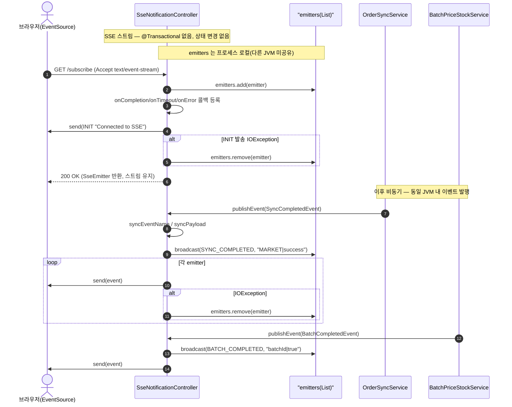
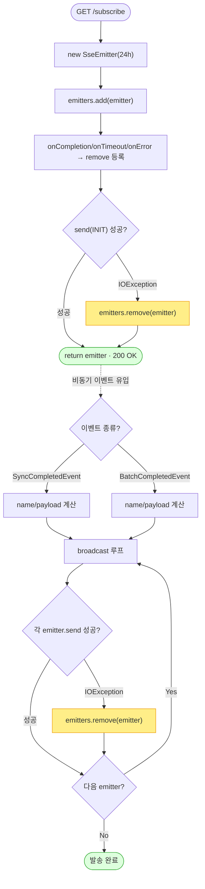

# GET /subscribe — 실시간 알림 받기(동기화·배치 끝나면 화면에 바로 알려주기)

## 1. 개요

이 기능은 브라우저(운영자 화면)가 서버와 계속 연결된 통로를 하나 열어 두고, 서버에서 무슨 일이 끝나면 그 소식을 실시간으로 밀어(push) 넣어 주는 창구입니다. 예를 들어 "마켓 주문 동기화가 끝났다/실패했다", "가격·재고 배치가 끝났다/실패했다" 같은 소식이 오면, 화면이 알아서 로딩을 멈추거나 목록을 새로고침합니다.

| 항목 | 쉬운 설명 |
|------|------|
| **Method / URL** | `GET /api/v1/notifications/subscribe` (`produces=text/event-stream`) — 브라우저가 여는 "실시간 소식 통로" 주소입니다. |
| **목적** | 프론트(화면)가 열어 두는 서버-전송(SSE) 통로입니다. 마켓 주문동기화 완료/실패(`SYNC_COMPLETED`/`SYNC_FAILED`)와 가격·재고 배치 완료/실패(`BATCH_COMPLETED`/`BATCH_FAILED`) 소식을 실시간으로 받아, 화면 로딩 표시를 끄거나 목록을 새로 불러오게 합니다. |
| **핵심 상태전이** | 없음(그냥 소식만 구독). 서버는 아무 데이터도 바꾸지 않고, 메모리 안에 있는 "연결된 브라우저 목록(`emitters`)"에 이 연결을 넣고 빼기만 합니다. |
| **부수효과** | 서버 메모리(한 프로세스 안)의 목록(`CopyOnWriteArrayList<SseEmitter>`)에 이 연결을 등록합니다. 연결이 끊기거나·시간이 다 되거나·오류가 나면 자동으로 목록에서 뺍니다. 연결되자마자 "연결됐다"는 `INIT` 신호를 한 번 보냅니다. |
| **응답** | `200 OK` + 실시간 통로(`SseEmitter`, 최대 24시간 유지). 이후로는 서버가 보내주는 소식이 계속 흘러옵니다. |

## 2. 호출 체인

아래는 이 기능이 실제로 코드에서 어떤 순서로 흘러가는지입니다. 각 줄 옆에 "쉽게 말하면"으로 뜻을 풀어 두었습니다.

```
SseNotificationController.subscribe()                       api/.../controller/SseNotificationController.java:23-50  (@GetMapping)
  ├─ new SseEmitter(86400000L)                              :26  (타임아웃 24h)
  ├─ emitters.add(emitter)                                  :29  (프로세스 로컬 목록)
  ├─ emitter.onCompletion/onTimeout/onError → remove        :32-38
  ├─ emitter.send(INIT "Connected to SSE")                  :42  (try, IOException → remove :45)
  └─ return emitter                                         :49

[비동기 이벤트 유입 — 같은 컨트롤러 빈의 @EventListener 로 푸시]
onSyncCompleted(SyncCompletedEvent)                         SseNotificationController.java:63-68  (@EventListener)
  ├─ syncEventName(success) → "SYNC_COMPLETED"|"SYNC_FAILED" :52-54
  ├─ syncPayload(marketType,success,errorMessage)           :56-61  ("COUPANG|success" | "SMART_STORE|fail|msg")
  └─ broadcast(name,data) → 각 emitter.send / 실패 시 remove :86-94
       ▲ 발행처: {Coupang,SmartStore,Elevenst,Cafe24}OrderSyncService  core/.../order/service/*.java
         예) CoupangOrderSyncService.java:87,92 · SmartStoreOrderSyncService.java:74,78

onBatchCompleted(BatchCompletedEvent)                       SseNotificationController.java:78-83  (@EventListener)
  ├─ batchEventName(success) → "BATCH_COMPLETED"|"BATCH_FAILED" :70-72
  ├─ batchPayload(batchId,success)                          :74-76  ("B-1|true")
  └─ broadcast(name,data)                                   :86-94
       ▲ 발행처: BatchPriceStockService.java:104,156,183

[소비처 — 프론트]
frontend/src/pages/OrderGrid.tsx:551-563          EventSource('/sbshop-agent/api/v1/notifications/subscribe')
                                                   addEventListener('SYNC_COMPLETED'/'SYNC_FAILED')
frontend/src/pages/ProcessStatusPage.tsx:121-124  addEventListener('BATCH_COMPLETED'/'BATCH_FAILED')
```

→ 쉽게 말하면:
- **구독 시작(subscribe):** 브라우저가 접속하면, 서버는 24시간짜리 실시간 통로 한 개(`SseEmitter`)를 새로 만들고(`:26`), 이 통로를 "연결된 브라우저 목록"에 넣습니다(`:29`). 연결이 끊기거나 시간이 다 되거나 오류가 나면 목록에서 자동으로 빼도록 미리 예약해 둡니다(`:32-38`). 그리고 곧바로 "연결됐다(INIT)"는 인사 신호를 한 번 보냅니다(`:42`). 이 인사 보내기가 실패하면 그 통로는 바로 빼 버립니다(`:45`).
- **소식이 들어올 때(onSyncCompleted / onBatchCompleted):** 주문 동기화나 배치 작업이 끝나면, 같은 서버 안에서 "끝났다"는 이벤트가 발생합니다. 그러면 이 코드가 그 소식을 받아, 소식 이름(예: `SYNC_COMPLETED`)과 내용(예: `COUPANG|success`)을 만든 뒤(`:52-61`), 연결된 모든 브라우저에 하나씩 뿌려 줍니다(`broadcast`, `:86-94`). 뿌리다가 어떤 브라우저에 못 보내면(이미 끊긴 연결 등) 그 통로는 목록에서 뺍니다.
- **누가 소식을 만드나:** 주문 동기화 소식은 각 마켓 동기화 서비스(쿠팡·스마트스토어·11번가·Cafe24)가, 배치 소식은 가격·재고 배치 서비스가 만들어 발행합니다.
- **누가 소식을 받나(프론트):** 화면 쪽 코드가 이 통로에 접속해, 주문 그리드 화면은 동기화 소식을, 진행상태 화면은 배치 소식을 받아 화면을 갱신합니다.

**요청 파라미터** — 없음(아무 값도 붙이지 않는 단순 GET 요청입니다).

**이벤트 계약** — 서버가 보내는 소식의 종류와, 그 안에 담기는 내용 형식입니다.

| 이벤트명 | data 포맷 | 발행 트리거 | 쉬운 뜻 |
|----------|-----------|-------------|---------|
| `INIT` | `"Connected to SSE"` | 구독 직후 1회 (L42) | "연결됐어요"라는 첫 인사 |
| `SYNC_COMPLETED` | `"<MARKET>\|success"` | 주문동기화 성공 (L59) | "OO 마켓 주문 동기화가 잘 끝났어요" |
| `SYNC_FAILED` | `"<MARKET>\|fail\|<errorMessage>"` | 주문동기화 실패 (L60) | "OO 마켓 동기화가 실패했어요"(+실패 사유) |
| `BATCH_COMPLETED` | `"<batchId>\|true"` | 가격·재고 배치 성공 (L75) | "이 배치가 잘 끝났어요" |
| `BATCH_FAILED` | `"<batchId>\|false"` | 가격·재고 배치 실패 (L75) | "이 배치가 실패했어요" |

## 3. 유스케이스 다이어그램

👉 이 그림은 운영자 브라우저가 실시간 통로를 열고, 서버 안에서 발생한 "동기화 끝남"·"배치 끝남" 소식이 그 통로를 타고 화면 갱신으로 이어지는 관계를 보여줍니다.


## 4. 시퀀스 다이어그램

👉 이 그림은 브라우저가 통로를 여는 순간부터, 나중에 동기화·배치 소식이 도착해 연결된 모든 브라우저에 뿌려지기까지의 시간 순서를 보여줍니다.



## 5. 순서도 (플로우차트)

👉 이 그림은 접속 시 통로를 만들고 인사 신호를 보내는 처리와, 나중에 소식이 들어왔을 때 연결된 브라우저마다 하나씩 뿌리며 실패한 연결은 빼내는 과정을 순서대로 보여줍니다.



## 6. 상태 전이표

**바뀌는 도메인 상태 없음(그냥 소식 구독).** 이 기능은 주문·상품 같은 실제 데이터를 하나도 바꾸지 않습니다. 유일하게 하는 일은 서버 메모리 안의 "연결된 브라우저 목록"을 넣고 빼는 것뿐이며(이건 도메인 상태가 아닙니다), 그 연결 하나의 생애는 아래와 같습니다.

| 연결(emitter)의 생애 | 언제 | 목록에 생기는 변화 |
|-----------------|--------|-----------|
| 등록 | 브라우저가 접속할 때(L29) | 목록에 이 연결을 추가 |
| 첫 인사(INIT) 보내기 실패 | 보내다 오류(IOException, L45) | 즉시 목록에서 뺌 |
| 브라우저가 정상적으로 연결을 닫음 | 정상 종료(onCompletion, L32) | 목록에서 뺌 |
| 24시간이 다 됨 | 시간 초과(onTimeout, L35) | 목록에서 뺌 |
| 전송 중 오류 | 오류 발생(onError, L38) / 소식 뿌리다 실패(broadcast send 실패, L91) | 목록에서 뺌 |

## 7. 🔎 발견사항

### MISCB-1 · 🟠 GAP — 연결 목록이 한 서버(프로세스) 안에만 있어서, 서버가 둘(api/worker)로 나뉜 실제 배포에서는 소식이 서버 경계를 못 넘는다
- **무엇이 문제인가:** 연결된 브라우저 목록(`emitters`)은 api 서버(JVM) 한 대의 메모리 안에만 존재합니다. 소식을 받아 뿌리는 장치(`@EventListener`)도 **같은 서버 안에서 발생한** 이벤트만 들을 수 있습니다. 그런데 소식을 만드는 주문 동기화·배치 서비스는 공용 코드(core)라, 스케줄러가 도는 worker 서버(JVM)에서도 실행됩니다. 즉 소식이 worker 서버에서 만들어지면 api 서버는 그걸 듣지 못합니다.
- **근거:** `SseNotificationController.java:21` `CopyOnWriteArrayList<SseEmitter> emitters` 는 api JVM 인메모리다. `@EventListener`(`:63-83`)는 **같은 JVM 내** Spring `ApplicationEvent` 만 수신한다. 이벤트 발행처인 `OrderSyncService`/`BatchPriceStockService` 는 core 모듈이며, worker JVM(스케줄러)에서도 실행된다(`OrderSyncScheduler.java:39` 등).
- **왜 문제인가:** 새벽 스케줄러(worker 서버)가 돌린 주문동기화·배치가 끝나도, 그 "끝났다" 소식은 worker 서버 안에서만 발생하므로 api 서버에 붙어 있는 브라우저에는 **전혀 도착하지 않습니다**. 결국 운영자가 직접 버튼을 눌러 돌린(api 서버를 거친) 동기화만 실시간으로 화면에 뜨고, 자동 스케줄로 끝난 작업은 화면에 실시간 통지가 안 됩니다.
- **제안:** 서버 사이를 넘는 통지가 필요하면 Redis pub/sub 같은 공유 채널로 소식을 중계하거나, 최소한 "이 실시간 알림은 운영자가 직접 돌린(api 경유) 동기화에만 유효하다"는 점을 설계 문서에 명확히 적어 둡니다. (프론트가 이미 D-023 타임아웃 대비책을 둔 것과도 맞아떨어집니다.)

### MISCB-2 · 🟡 SMELL — 소식 내용을 `"MARKET|success"`, `"batchId|true"` 처럼 막대기(`|`)로 이어붙인 문자열로 주고받아, 정해진 틀(스키마)이 없다
- **무엇이 문제인가:** 서버는 소식 내용을 `|` 로 항목을 이어 붙인 한 줄 문자열로 만들고, 화면 쪽은 그 문자열을 `|` 기준으로 쪼개 각 항목을 읽습니다. 그런데 실패 사유(`errorMessage`) 안에 `|` 가 우연히 들어 있으면, 쪼개는 위치가 어긋나 값이 뒤섞입니다.
- **근거:** `syncPayload`(`:56-61`), `batchPayload`(`:74-76`) 가 `|` 구분 문자열을 만들고, 프론트(`OrderGrid.tsx:552-563`, `ProcessStatusPage.tsx:123`)가 이벤트명·문자열로 파싱한다. `errorMessage` 가 `|` 를 포함하면 파싱이 어긋난다.
- **왜 문제인가:** `SYNC_FAILED` 의 실패 사유에 `|` 가 섞이면 화면 쪽에서 값 나누기가 틀어질 수 있습니다. 또 값마다 정해진 형식(타입)이 없어 실수를 잡아주지 못합니다.
- **제안:** 소식 내용을 JSON(`SseEmitter.event().data(obj, MediaType.APPLICATION_JSON)`) 형태로 바꿔 각 항목의 이름과 구조를 분명히 하고, 계약 테스트로 그 형식을 고정합니다.

### MISCB-3 · 🔵 NOTE — 첫 인사(INIT) 이후로는 살아있음 신호(heartbeat)를 안 보내, 중간 장비(프록시/방화벽)가 조용히 연결을 끊을 수 있다
- **무엇이 문제인가:** 접속 직후 `INIT` 한 번만 보내고, 그 뒤로 보낼 소식이 없으면 최대 24시간 동안 아무것도 안 보낼 수 있습니다. "나 아직 살아있어요" 하고 주기적으로 툭툭 보내는 신호가 없습니다.
- **근거:** `subscribe()` 는 `INIT` 1회만 보내고(`:42`) 이후 서버발 이벤트가 없으면 24h 동안 무전송이다. 주기적 comment/heartbeat 이벤트가 없다.
- **왜 문제인가:** nginx나 중간 프록시는 대개 일정 시간(보통 60초 안팎) 아무 통신이 없으면 연결을 끊습니다. 그 사이에 동기화·배치 소식이 발생하면 그 소식을 놓칩니다. 화면 쪽이 "연결이 닫혔으면 다시 붙는" 대비책(`OrderGrid.tsx:567`)으로 어느 정도 보완하긴 하지만, 근본적인 살아있음 신호는 아닙니다.
- **제안:** `ScheduledExecutor` 로 15~30초마다 살아있음 신호(주석 형태의 `:comment`)를 보내거나, 프록시의 `proxy_read_timeout` 을 늘리고 그 사실을 문서로 남깁니다.

### MISCB-4 · 🔵 NOTE — 아무 출처나 접속 가능(`@CrossOrigin(origins = "*")`)하고 로그인도 없어서, 누구나 이 소식 통로를 열어 볼 수 있다
- **무엇이 문제인가:** 이 통로는 어떤 웹사이트(출처)에서든 접속을 허용하도록 활짝 열려 있고(`@CrossOrigin(origins = "*")`), 로그인 확인도 없으며, 값 없이 그냥 접속하면 되는 GET이라 사실상 누구나 연결해 마켓 이름·배치 ID·실패 메시지 같은 소식을 받아볼 수 있습니다.
- **근거:** `SseNotificationController.java:17` `@CrossOrigin(origins = "*")`. 인증 프레임워크 부재(프로젝트 관례) + 무파라미터 GET이라 누구나 구독 가능하며, 마켓명·배치ID·에러메시지가 브로드캐스트된다.
- **왜 문제인가:** 운영 도메인이 외부에 노출되면 아무 출처나 이 동기화·배치 소식을 받아갈 수 있습니다. 이 프로젝트는 보안이 중요 항목은 아니라 당장 큰 결함은 아니지만, 기록은 남겨 둡니다.
- **제안:** 접속을 허용할 출처를 운영 도메인 몇 개로 좁히는 방안을 (선택적으로) 검토합니다.

## 8. 테스트 커버리지 메모

- **이미 있는 테스트:** `SseNotificationBatchTest.java`(api) — 소식 이름/내용 만들기 로직(`syncEventName`/`syncPayload`/`batchEventName`/`batchPayload`)이 늘 같은 결과를 내는지 못박아 두는 특성화 테스트(총 8케이스)가 있습니다. 덕분에 소식 이름·내용 형식이 나중에 실수로 바뀌는 것은 막힙니다.
- **아직 없는 테스트:** ① 구독(`subscribe()`) 자체(연결 등록·첫 인사 보내기·끊길 때 목록에서 빼기)를 확인하는 테스트가 없습니다. ② 소식을 뿌리다(`broadcast`) 어떤 연결에 실패했을 때 그 연결을 스스로 빼내는 "자가 치유" 동작을 확인하는 테스트가 없습니다(MISCB 발견과 직접 관련). ③ 실제로 소식 이벤트가 들어왔을 때 뿌리기(`broadcast`)가 제대로 호출되는지 그 연결 배선을 확인하는 테스트가 없습니다. ④ 서버가 둘로 나뉘어 소식이 안 넘어가는 문제(MISCB-1)는 단위 테스트로는 잡기 어렵고, 통합·설계 차원의 검증이 필요합니다.
- 우선순위: 서버 경계 문제(MISCB-1)는 설계를 먼저 확정한 뒤에, 뿌리기 실패 시 연결을 빼는 로직은 적은 비용으로 단위 테스트를 붙여 보강하기를 권합니다.

---
*(쉬운 설명판 · 2026-07-17 재작성)*
*생성: 2026-07-17 · 근거: 현재 워킹트리*
