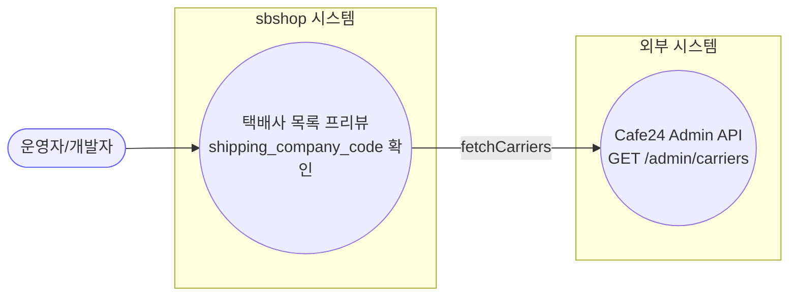
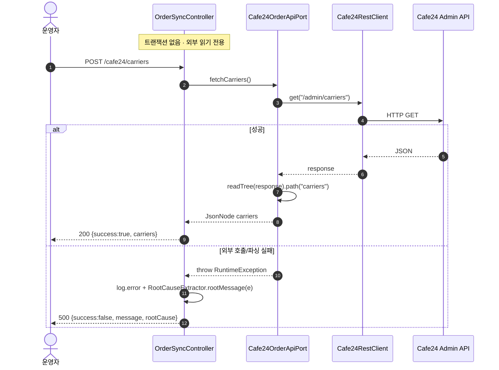

# POST /cafe24/carriers — 몰 등록 택배사 목록 프리뷰(진단)

## 1. 개요

| 항목 | 내용 |
|------|------|
| **Method / URL** | `POST /api/v1/orders/sync/cafe24/carriers` (바디 없음) |
| **목적** | Cafe24 몰에 등록된 택배사 목록(`shipping_company_code`)을 원시로 조회하는 **진단 전용** 엔드포인트. 송장 등록 시 택배사 코드 매핑 검증용. |
| **핵심 상태전이** | 상태 전이 없음(외부 API 읽기 전용 프록시) |
| **부수효과** | Cafe24 `GET /admin/carriers` 외부 호출 1회. DB 쓰기·상태 변경·ActionLog 기록 없음. |
| **응답** | `200 OK` + `{success:true, carriers:<원시 JsonNode>}` / 실패 시 `500` + `{success:false, message, rootCause}` |

## 2. 호출 체인

```
OrderSyncController.previewCafe24Carriers()                     api/.../controller/OrderSyncController.java:182-191  @PostMapping("/cafe24/carriers")
  ├─ cafe24OrderApiPort.fetchCarriers()                         :185
  │    └─ Cafe24OrderApiClient.fetchCarriers()                  infrastructure/.../cafe24/client/Cafe24OrderApiClient.java:51-59
  │         ├─ restClient.get("/admin/carriers")                :53  (Cafe24RestClient — 토큰 자동관리)
  │         └─ objectMapper.readTree(response).path("carriers") :55  (파싱 실패 시 RuntimeException :57)
  └─ (catch Exception) log.error + RootCauseExtractor.rootMessage(e)  :187-189
       └─ RootCauseExtractor.rootMessage()                      core/.../domain/common/RootCauseExtractor.java
```

**요청 바디** — 없음.

## 3. 유스케이스 다이어그램



## 4. 시퀀스 다이어그램



## 5. 순서도 (플로우차트)


## 6. 상태 전이표

| 진입 상태 | 허용? | 결과 상태 | 마켓 전송 | 비고 |
|-----------|:-----:|-----------|-----------|------|
| — | — | — | — | **상태 전이 없음(조회)** — 외부 API 읽기 전용 진단 프록시. |

## 7. 🔎 발견사항

### SYNCB-4 · 🟡 SMELL — 실패 로그 메시지가 "Cafe24 주문 프리뷰 실패"로 오기(실제는 택배사 조회)
- **근거:** `OrderSyncController.java:187` `log.error("Cafe24 주문 프리뷰 실패", e)` — `previewCafe24Orders`(:175)와 완전히 동일한 로그 문구를 택배사 조회 핸들러에서 재사용한다. 실제 실패한 호출은 `fetchCarriers()`(택배사) 인데 로그는 "주문 프리뷰"라 말한다.
- **영향:** 운영 로그에서 어느 진단 호출이 실패했는지 구분 불가. 두 엔드포인트 실패가 같은 문구로 찍혀 원인 추적을 방해.
- **제안:** `"Cafe24 택배사 프리뷰 실패"` 등으로 문구 분리.

### SYNCB-5 · 🔵 NOTE — 진단 전용인데 `POST` 매핑 + `ActionLog` 미기록
- **근거:** `OrderSyncController.java:182` 부작용 없는 읽기 조회를 `@PostMapping` 으로 노출하고 `actionLogService.record(...)` 호출이 없다.
- **영향:** SYNCB-2와 동일 — REST 관례상 GET이 자연스럽고, 감사 흔적이 남지 않는다.
- **제안:** POST 유지가 의도면 문서화. (cafe24-preview SYNCB-2와 공통 이슈.)

## 8. 테스트 커버리지 메모

- `OrderSyncControllerPreviewContractTest.carriers_success_bodyTreeUnchanged`(:98) — 성공 시 `{success:true, carriers:<원시 JsonNode 그대로>}` 트리 보존 검증.
- `OrderSyncControllerPreviewContractTest.carriers_failure_bodyTreeUnchanged`(:114) — 실패 시 `{success:false, message, rootCause}` 트리 보존 검증.
- **비어있는 케이스:** ① `path("carriers")` 미싱 노드 시 응답 형태, ② 로그 문구 정확성(SYNCB-4)은 테스트 대상 아님.

---
*생성: 2026-07-17 · 근거: 현재 워킹트리*
