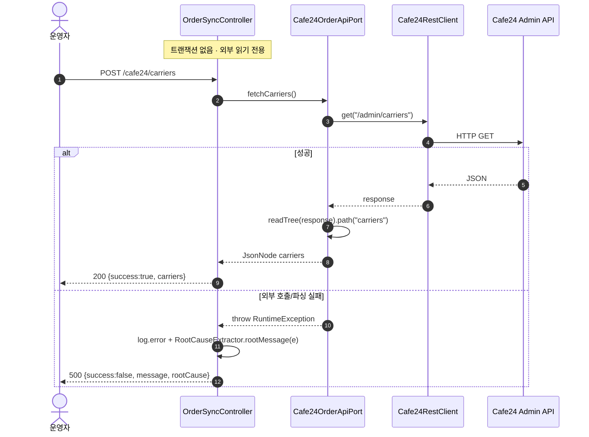
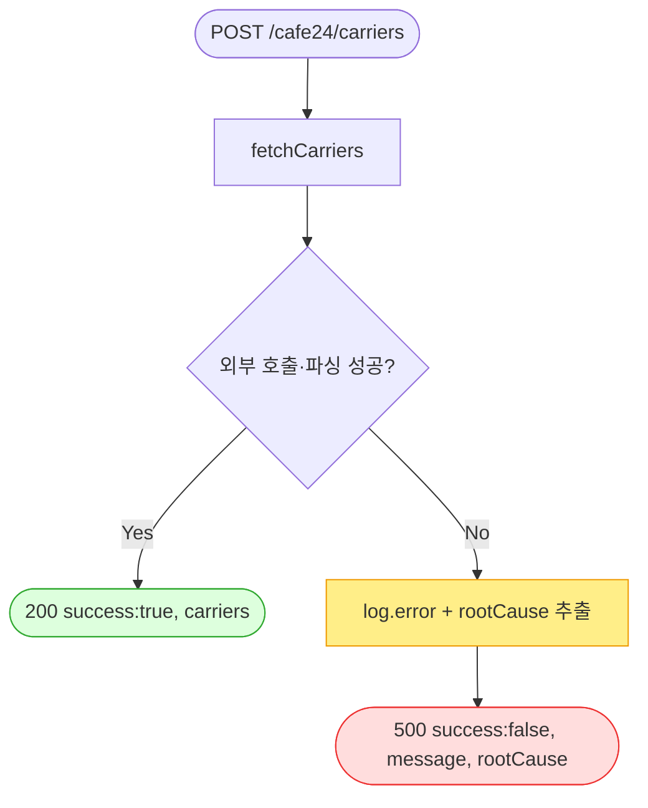

# POST /cafe24/carriers — 몰 등록 택배사 목록 프리뷰(진단)

## 1. 개요

이 기능을 한마디로 하면: **우리 Cafe24 쇼핑몰에 어떤 택배사들이 등록돼 있는지 그 목록을 그대로 한번 들여다보는 점검용 도구**입니다. 나중에 송장을 넣을 때 "우리가 쓰는 택배사 코드가 Cafe24 쪽 코드와 잘 맞는지" 확인하려고 씁니다.

| 항목 | 내용(쉬운 설명) |
|------|------|
| **Method / URL** | `POST /api/v1/orders/sync/cafe24/carriers` (바디 없음) — 이 주소로 호출하며, 따로 보낼 값은 없습니다. |
| **목적** | Cafe24 몰에 등록된 택배사 목록(`shipping_company_code`)을 날것 그대로 조회하는 **진단 전용** 창구입니다. 송장 등록 시 택배사 코드가 서로 맞는지 확인하는 용도입니다. |
| **핵심 상태전이** | 상태 전이 없음(외부 API를 읽기만 하는 통로). → 우리 데이터는 하나도 바뀌지 않습니다. |
| **부수효과** | Cafe24 `GET /admin/carriers`를 딱 1번 부릅니다. DB에 쓰지 않고, 상태도 안 바꾸고, 기록(ActionLog)도 남기지 않습니다. |
| **응답** | 성공하면 `200 OK` + `{success:true, carriers:<원시 JsonNode>}` (Cafe24가 준 목록을 그대로 담음) / 실패하면 `500` + `{success:false, message, rootCause}` (원인까지 함께 담음). |

## 2. 호출 체인

아래는 이 기능이 거치는 코드 흐름입니다. `파일:라인`은 실제 코드 위치이고, 뒤에 그 줄이 무슨 일을 하는지 쉽게 풀어 적었습니다.

```
OrderSyncController.previewCafe24Carriers()                     api/.../controller/OrderSyncController.java:182-191  @PostMapping("/cafe24/carriers")
  ├─ cafe24OrderApiPort.fetchCarriers()                         :185
  │    └─ Cafe24OrderApiClient.fetchCarriers()                  infrastructure/.../cafe24/client/Cafe24OrderApiClient.java:51-59
  │         ├─ restClient.get("/admin/carriers")                :53  (Cafe24RestClient — 토큰 자동관리)
  │         └─ objectMapper.readTree(response).path("carriers") :55  (파싱 실패 시 RuntimeException :57)
  └─ (catch Exception) log.error + RootCauseExtractor.rootMessage(e)  :187-189
       └─ RootCauseExtractor.rootMessage()                      core/.../domain/common/RootCauseExtractor.java
```

쉽게 풀어 읽으면:
- **입구(Controller)** — 요청이 들어오면 택배사 목록을 달라고 요청합니다(`fetchCarriers`).
- **실제 통신(Client)** — Cafe24의 택배사 조회 주소를 두드리는데, 로그인 토큰은 알아서 챙깁니다. 돌아온 응답에서 `carriers`(택배사 목록) 부분만 꺼냅니다. → 응답 해석이 실패하면 오류로 처리합니다.
- **오류 처리** — 도중에 문제가 생기면 로그를 남기고, 진짜 근본 원인을 뽑아 사용자에게 함께 알려줍니다.

**요청 바디** — 없음.

## 3. 유스케이스 다이어그램

👉 이 그림은 "운영자/개발자가 이 기능을 부르면, 시스템이 Cafe24의 택배사 목록 API를 대신 두드려 코드를 보여준다"는 큰 그림을 보여줍니다.


## 4. 시퀀스 다이어그램

👉 이 그림은 "요청이 들어온 뒤, 시스템 내부 부품들과 Cafe24가 순서대로 어떤 대화를 주고받는지"를 시간 순서로 보여줍니다. 성공/실패로 갈라지는 지점도 함께 담겨 있습니다.



## 5. 순서도 (플로우차트)

👉 이 그림은 "요청 → Cafe24 택배사 조회 → 성공이면 200, 실패면 원인과 함께 500"으로 갈라지는 판단 흐름을 한눈에 보여줍니다.



## 6. 상태 전이표

이 기능은 데이터를 바꾸지 않는 "읽기 전용"이라 바뀌는 상태가 없습니다.

| 진입 상태 | 허용? | 결과 상태 | 마켓 전송 | 비고 |
|-----------|:-----:|-----------|-----------|------|
| — | — | — | — | **상태 전이 없음(조회)** — 외부 API를 읽기만 하는 진단용 통로입니다. |

## 7. 🔎 발견사항

### SYNCB-4 · 🟡 SMELL — 실패 로그 메시지가 "Cafe24 주문 프리뷰 실패"로 오기(실제는 택배사 조회)
- **무엇이 문제인가:** 택배사 조회가 실패했을 때 로그에 남는 문구가 "Cafe24 주문 프리뷰 실패"라고 찍힙니다. 실제로 실패한 건 택배사 조회인데, 옆 기능(주문 프리뷰)의 문구를 그대로 복사해 써서 엉뚱하게 "주문"이라고 적혀 있습니다.
- **근거:** `OrderSyncController.java:187` `log.error("Cafe24 주문 프리뷰 실패", e)` — `previewCafe24Orders`(:175)와 완전히 동일한 로그 문구를 택배사 조회 핸들러에서 재사용한다. 실제 실패한 호출은 `fetchCarriers()`(택배사) 인데 로그는 "주문 프리뷰"라 말한다.
- **왜 문제인가:** 운영 로그만 봐서는 "주문 미리보기가 실패한 건지, 택배사 조회가 실패한 건지" 구분할 수 없습니다. 두 기능의 실패가 똑같은 문구로 찍혀 원인 추적을 방해합니다.
- **어떻게 고치면 되나:** 문구를 `"Cafe24 택배사 프리뷰 실패"` 처럼 실제에 맞게 바꿔 구분합니다.

### SYNCB-5 · 🔵 NOTE — 진단 전용인데 `POST` 매핑 + `ActionLog` 미기록
- **무엇이 문제인가:** 이것도 아무것도 바꾸지 않고 읽어만 보는 기능인데, 데이터를 바꿀 때 쓰는 방식(`POST`)으로 열려 있고, "누가 언제 이걸 눌렀는지" 기록(`ActionLog`)을 남기지 않습니다.
- **근거:** `OrderSyncController.java:182` 부작용 없는 읽기 조회를 `@PostMapping` 으로 노출하고 `actionLogService.record(...)` 호출이 없다.
- **왜 문제인가:** SYNCB-2와 같은 이야기입니다 — 웹 관례상 읽기는 `GET`이 자연스럽고, 기록이 없어 추적 흔적이 남지 않습니다.
- **어떻게 고치면 되나:** `POST` 유지가 의도면 문서로 남깁니다. (주문 프리뷰의 SYNCB-2와 똑같은 이슈입니다.)

## 8. 테스트 커버리지 메모

- `OrderSyncControllerPreviewContractTest.carriers_success_bodyTreeUnchanged`(:98) — 성공했을 때 응답이 `{success:true, carriers:<Cafe24가 준 원시 목록 그대로>}` 모양으로, 손대지 않고 그대로 담아 돌려주는지 확인합니다.
- `OrderSyncControllerPreviewContractTest.carriers_failure_bodyTreeUnchanged`(:114) — 실패했을 때 응답이 `{success:false, message, rootCause}` 모양대로 나오는지 확인합니다.
- **아직 확인 안 하는 경우(빈 케이스):** ① 응답에 `carriers` 항목이 아예 없을 때 어떤 모양으로 돌려주는지, ② 로그 문구가 정확한지(SYNCB-4)는 테스트로 확인하지 않음.

---
*(쉬운 설명판 · 2026-07-17 재작성)*
*생성: 2026-07-17 · 근거: 현재 워킹트리*
