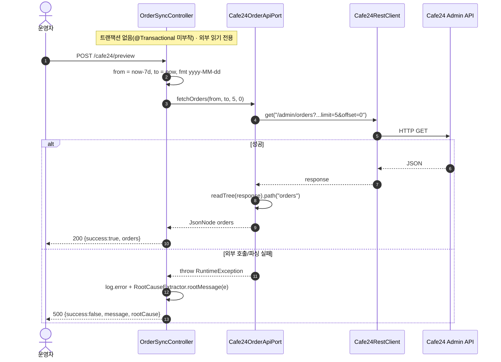

# POST /cafe24/preview — Cafe24 주문 API 원시 응답 프리뷰(진단)

## 1. 개요

| 항목 | 내용 |
|------|------|
| **Method / URL** | `POST /api/v1/orders/sync/cafe24/preview` (바디 없음) |
| **목적** | Cafe24 주문 Admin API의 원시 응답을 그대로 조회하는 **진단 전용** 엔드포인트. 최근 7일(오늘 기준 -7일 ~ 오늘) 첫 페이지 5건을 파싱 검증·구조 확인용으로 반환한다. |
| **핵심 상태전이** | 상태 전이 없음(외부 API 읽기 전용 프록시) |
| **부수효과** | Cafe24 `GET /admin/orders` 외부 호출 1회. DB 쓰기·주문 상태 변경 없음. `ActionLog` 기록도 없음. |
| **응답** | `200 OK` + `{success:true, orders:<원시 JsonNode>}` / 실패 시 `500` + `{success:false, message, rootCause}` |

## 2. 호출 체인

```
OrderSyncController.previewCafe24Orders()                       api/.../controller/OrderSyncController.java:166-179  @PostMapping("/cafe24/preview")
  ├─ LocalDate to = now(); from = to.minusDays(7)               :169-170
  ├─ DateTimeFormatter f = ofPattern("yyyy-MM-dd")              :171
  ├─ cafe24OrderApiPort.fetchOrders(from, to, 5, 0)             :172
  │    └─ Cafe24OrderApiClient.fetchOrders()                    infrastructure/.../cafe24/client/Cafe24OrderApiClient.java:24-39
  │         ├─ path = "/admin/orders?embed=items,receivers,buyer&date_type=order_date&start_date=..&end_date=..&limit=5&offset=0"  :26-31
  │         ├─ restClient.get(path)                             :32  (Cafe24RestClient — 토큰 자동관리)
  │         └─ objectMapper.readTree(response).path("orders")   :34  (파싱 실패 시 RuntimeException :37)
  └─ (catch Exception) log.error + RootCauseExtractor.rootMessage(e)  :175-177
       └─ RootCauseExtractor.rootMessage()                      core/.../domain/common/RootCauseExtractor.java
```

**요청 바디** — 없음(파라미터 없음, 서버가 날짜·페이지를 고정 계산).

## 3. 유스케이스 다이어그램


## 4. 시퀀스 다이어그램



## 5. 순서도 (플로우차트)


## 6. 상태 전이표

| 진입 상태 | 허용? | 결과 상태 | 마켓 전송 | 비고 |
|-----------|:-----:|-----------|-----------|------|
| — | — | — | — | **상태 전이 없음(조회)** — 외부 API 읽기 전용 진단 프록시. DB·주문 상태를 변경하지 않는다. |

## 7. 🔎 발견사항

### SYNCB-1 · 🟠 GAP — 날짜 포맷 불일치: 포트 계약은 `"yyyy-MM-dd HH:mm:ss"` 인데 컨트롤러는 `"yyyy-MM-dd"` 로 전달
- **근거:** 포트 Javadoc `Cafe24OrderApiPort.java:15-16` 은 `startDate`/`endDate` 를 `"yyyy-MM-dd HH:mm:ss"` 로 명시하나, 컨트롤러 `OrderSyncController.java:171-172` 는 `ofPattern("yyyy-MM-dd")` 로 시:분:초 없이 전달한다. 클라이언트 `Cafe24OrderApiClient.java:28-31` 는 값을 그대로 URL 인코딩해 붙인다.
- **영향:** 진단 프리뷰는 시각 정보 없이 날짜 경계만 넘겨 Cafe24가 해석하는 시각 범위가 실제 동기화 경로와 다를 수 있다. 프리뷰로 "보이는" 주문 집합이 실제 `Cafe24OrderSyncService` 가 가져오는 집합과 불일치할 수 있어 진단 도구로서 오해를 유발한다.
- **제안:** 프리뷰도 동기화 경로와 동일한 포맷(`yyyy-MM-dd HH:mm:ss`, 예 `00:00:00`~`23:59:59`)을 사용해 계약과 정합화하거나, 포트 Javadoc을 실제 허용 포맷으로 정정.

### SYNCB-2 · 🔵 NOTE — 진단 전용인데 `POST` 매핑 + `ActionLog` 미기록
- **근거:** `OrderSyncController.java:166` 부작용 없는 읽기 조회를 `@PostMapping` 으로 노출하고, 다른 동기화 엔드포인트와 달리 `actionLogService.record(...)` 호출이 없다(같은 컨트롤러의 `/coupang` 등은 STARTED/SUCCESS/FAILED 기록).
- **영향:** REST 관례상 부작용 없는 조회는 GET이 자연스럽다. 감사 관점에서 이 진단 호출은 흔적이 남지 않아, 누가 언제 외부 API를 두드렸는지 추적 불가.
- **제안:** 진단 편의상 POST 유지가 의도라면 문서화. 감사 필요 시 최소 로그 레벨 기록 검토.

### SYNCB-3 · 🔵 NOTE — 페이지 크기 5·오프셋 0 하드코딩(첫 페이지만)
- **근거:** `OrderSyncController.java:172` `fetchOrders(..., 5, 0)`. limit/offset이 파라미터화되지 않아 항상 첫 5건만 본다.
- **영향:** 특정 주문 구조를 확인하려 해도 페이지네이션이 불가해 진단 범위가 제한적.
- **제안:** 필요 시 쿼리 파라미터로 limit/offset 노출(진단 도구 한정).

## 8. 테스트 커버리지 메모

- `OrderSyncControllerPreviewContractTest.preview_success_bodyTreeUnchanged`(:65) — 성공 시 `{success:true, orders:<원시 JsonNode 그대로>}` 트리 보존 검증(F-SYNC-16 계약).
- `OrderSyncControllerPreviewContractTest.preview_failure_bodyTreeUnchanged`(:82) — 실패 시 `{success:false, message, rootCause}` 트리 보존 검증.
- **비어있는 케이스:** ① 날짜 포맷 계약 불일치(SYNCB-1) — 어떤 포맷으로 fetchOrders가 불리는지 검증하는 테스트 없음, ② `path("orders")` 미싱 노드(빈 배열) 시 응답 형태, ③ limit/offset 인자값 검증(5,0) 없음.

---
*생성: 2026-07-17 · 근거: 현재 워킹트리*
