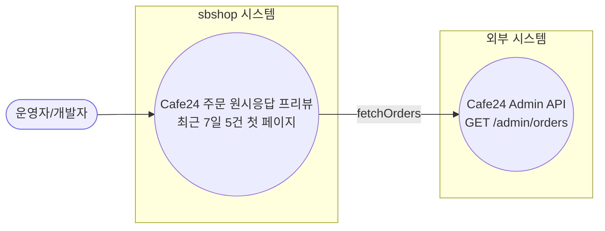
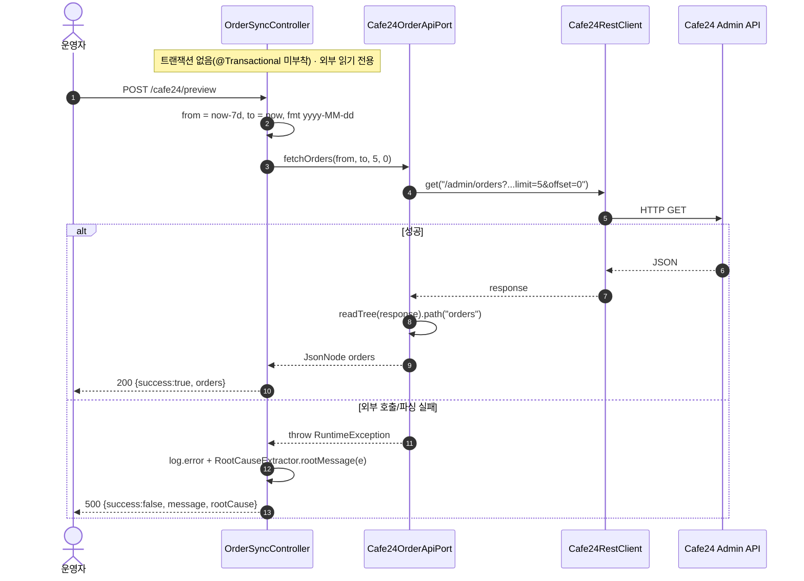
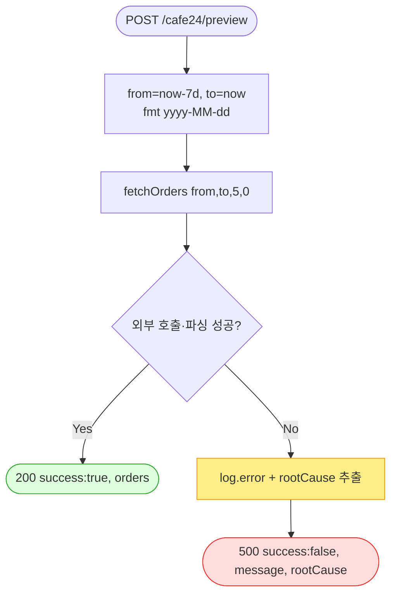

# POST /cafe24/preview — Cafe24 주문 API 원시 응답 프리뷰(진단)

## 1. 개요

이 기능을 한마디로 하면: **Cafe24가 우리에게 보내주는 주문 데이터의 "날것" 모습을 그대로 한번 들여다보는 점검용 도구**입니다. 실제로 주문을 가져와 저장하는 게 아니라, "Cafe24가 이런 모양으로 응답을 주는구나"를 눈으로 확인만 하는 용도입니다.

| 항목 | 내용(쉬운 설명) |
|------|------|
| **Method / URL** | `POST /api/v1/orders/sync/cafe24/preview` (바디 없음) — 주소를 이렇게 호출하며, 따로 보낼 값은 없습니다. |
| **목적** | Cafe24 주문 Admin API의 원시 응답을 그대로 조회하는 **진단 전용** 창구입니다. 최근 7일(오늘 기준 -7일 ~ 오늘)의 첫 페이지 5건만 가져와, 데이터 구조가 제대로 읽히는지 확인하는 용도입니다. → 쉽게 말하면 "Cafe24가 주는 응답을 5건만 맛보기로 보여주는 미리보기 창"입니다. |
| **핵심 상태전이** | 상태 전이 없음(외부 API를 읽기만 하는 통로). → 우리 데이터는 하나도 바뀌지 않습니다. |
| **부수효과** | Cafe24 `GET /admin/orders`를 딱 1번 부릅니다. 우리 DB에 쓰지 않고, 주문 상태도 안 바꾸고, 기록(`ActionLog`)도 남기지 않습니다. |
| **응답** | 성공하면 `200 OK` + `{success:true, orders:<원시 JsonNode>}` (Cafe24가 준 데이터를 손대지 않고 그대로 담아 돌려줌) / 실패하면 `500` + `{success:false, message, rootCause}` (무엇 때문에 실패했는지 원인까지 담음). |

## 2. 호출 체인

아래는 이 기능이 어떤 코드들을 거쳐 동작하는지의 흐름입니다. 각 줄 옆의 `파일:라인`은 실제 코드 위치이고, "→ 쉽게 말하면"으로 그 줄이 무슨 일을 하는지 풀어 적었습니다.

```
OrderSyncController.previewCafe24Orders()                       api/.../controller/OrderSyncController.java:166-179  @PostMapping("/cafe24/preview")
  ├─ LocalDate to = now(); from = to.minusDays(7)               :169-170
  ├─ DateTimeFormatter f = ofPattern("yyyy-MM-dd")              :171
  ├─ cafe24OrderApiPort.fetchOrders(from, to, 5, 0)             :172
  │    └─ Cafe24OrderApiClient.fetchOrders()                    infrastructure/.../cafe24/client/Cafe24OrderApiClient.java:24-39
  │         ├─ path = "/admin/orders?embed=items,receivers,buyer&date_type=order_date&start_date=..&end_date=..&limit=5&offset=0"  :26-31
  │         ├─ restClient.get(path)                             :32  (Cafe24RestClient — 토큰 자동관리)
  │         └─ objectMapper.readTree(response).path("orders")   :34  (파싱 실패 시 RuntimeException :37)
  └─ (catch Exception) log.error + RootCauseExtractor.rootMessage(e)  :175-177
       └─ RootCauseExtractor.rootMessage()                      core/.../domain/common/RootCauseExtractor.java
```

쉽게 풀어 읽으면:
- **입구(Controller)** — 요청이 들어오면 먼저 조회할 기간을 "오늘"과 "오늘로부터 7일 전"으로 잡습니다. → 쉽게 말하면 "최근 7일치를 보자"고 스스로 정합니다.
- **날짜 형식 만들기** — 날짜를 "년-월-일" 모양(`yyyy-MM-dd`)으로 준비합니다.
- **Cafe24에 요청(fetchOrders)** — 준비한 기간으로 "5건만, 첫 페이지(0번부터)"를 달라고 Cafe24에 보냅니다.
- **실제 통신(Client)** — Cafe24에 붙일 주소를 만들고, 로그인 토큰을 알아서 챙겨 붙인 뒤 요청합니다. 돌아온 응답에서 `orders`(주문 목록) 부분만 꺼냅니다. → 응답을 해석하다 형식이 깨지면 오류로 처리합니다.
- **오류 처리** — 도중에 뭔가 잘못되면 로그를 남기고, "진짜 근본 원인이 무엇인지"를 뽑아내 사용자에게 함께 알려줍니다.

**요청 바디** — 없음(보낼 값이 없습니다. 서버가 날짜·페이지 크기를 알아서 정합니다).

## 3. 유스케이스 다이어그램

👉 이 그림은 "운영자/개발자가 이 미리보기 기능을 부르면, 시스템이 Cafe24의 주문 조회 API를 대신 두드려 결과를 보여준다"는 큰 그림을 보여줍니다.



## 4. 시퀀스 다이어그램

👉 이 그림은 "요청이 들어온 뒤, 시스템 내부 부품들과 Cafe24가 순서대로 어떤 대화를 주고받는지"를 시간 순서로 보여줍니다. 성공한 경우와 실패한 경우가 갈라지는 지점도 함께 담겨 있습니다.



## 5. 순서도 (플로우차트)

👉 이 그림은 "요청 → 기간 계산 → Cafe24 조회 → 성공이면 200, 실패면 원인과 함께 500"으로 갈라지는 판단 흐름을 한눈에 보여줍니다.



## 6. 상태 전이표

이 기능은 데이터를 바꾸지 않는 "읽기 전용"이라 바뀌는 상태가 없습니다. 표 구조는 그대로 두되, 아래 한 줄이 그 사실을 말해 줍니다.

| 진입 상태 | 허용? | 결과 상태 | 마켓 전송 | 비고 |
|-----------|:-----:|-----------|-----------|------|
| — | — | — | — | **상태 전이 없음(조회)** — 외부 API를 읽기만 하는 진단용 통로입니다. 우리 DB나 주문 상태를 하나도 바꾸지 않습니다. |

## 7. 🔎 발견사항

### SYNCB-1 · 🟠 GAP — 날짜 포맷 불일치: 포트 계약은 `"yyyy-MM-dd HH:mm:ss"` 인데 컨트롤러는 `"yyyy-MM-dd"` 로 전달
- **무엇이 문제인가:** 이 기능이 Cafe24에 날짜를 넘길 때 지키기로 약속한 형식은 "년-월-일 시:분:초"(`yyyy-MM-dd HH:mm:ss`)입니다. 그런데 실제로는 시:분:초를 뺀 "년-월-일"만 넘깁니다.
- **근거:** 포트 Javadoc `Cafe24OrderApiPort.java:15-16` 은 `startDate`/`endDate` 를 `"yyyy-MM-dd HH:mm:ss"` 로 명시하나, 컨트롤러 `OrderSyncController.java:171-172` 는 `ofPattern("yyyy-MM-dd")` 로 시:분:초 없이 전달한다. 클라이언트 `Cafe24OrderApiClient.java:28-31` 는 값을 그대로 URL 인코딩해 붙인다.
- **왜 문제인가:** 시각 정보가 빠지면 Cafe24가 "언제부터 언제까지"로 해석하는 범위가 실제 동기화 경로와 달라질 수 있습니다. 그러면 이 미리보기로 "보이는" 주문 묶음이, 실제로 가져오는(`Cafe24OrderSyncService`) 주문 묶음과 어긋나게 됩니다. 진단하려고 만든 도구인데 오히려 오해를 부르는 셈입니다.
- **어떻게 고치면 되나:** 미리보기도 실제 동기화와 똑같은 형식(예: `00:00:00`~`23:59:59`)을 쓰거나, 아니면 애초의 약속(문서)을 실제로 허용되는 형식으로 정정합니다.

### SYNCB-2 · 🔵 NOTE — 진단 전용인데 `POST` 매핑 + `ActionLog` 미기록
- **무엇이 문제인가:** 이건 아무것도 바꾸지 않고 그냥 읽어보는 기능인데, 데이터를 바꿀 때 쓰는 방식(`POST`)으로 열려 있고, 다른 동기화 기능들과 달리 "누가 언제 이걸 눌렀는지" 기록(`ActionLog`)을 전혀 남기지 않습니다.
- **근거:** `OrderSyncController.java:166` 부작용 없는 읽기 조회를 `@PostMapping` 으로 노출하고, 다른 동기화 엔드포인트와 달리 `actionLogService.record(...)` 호출이 없다(같은 컨트롤러의 `/coupang` 등은 STARTED/SUCCESS/FAILED 기록).
- **왜 문제인가:** 웹 관례상 "읽기만 하는" 조회는 `GET`으로 만드는 게 자연스럽습니다. 또 기록이 없으니 나중에 "누가 언제 외부 API를 두드렸는지" 추적할 수가 없습니다.
- **어떻게 고치면 되나:** 진단 편의상 `POST`를 유지하는 게 의도라면 그 이유를 문서로 남깁니다. 추적이 필요하면 최소한의 로그라도 남기는 걸 검토합니다.

### SYNCB-3 · 🔵 NOTE — 페이지 크기 5·오프셋 0 하드코딩(첫 페이지만)
- **무엇이 문제인가:** 미리보기는 항상 "첫 페이지 5건"만 보여주도록 숫자가 코드에 박혀 있습니다. 몇 건을, 몇 번째 페이지부터 볼지 바꿀 수 없습니다.
- **근거:** `OrderSyncController.java:172` `fetchOrders(..., 5, 0)`. limit/offset이 파라미터화되지 않아 항상 첫 5건만 본다.
- **왜 문제인가:** 특정 주문의 구조를 확인하고 싶어도 뒷 페이지로 넘길 수 없어, 진단으로 살펴볼 수 있는 범위가 좁습니다.
- **어떻게 고치면 되나:** 필요하면 몇 건·몇 페이지를 요청 값으로 받도록 열어 둡니다(진단 도구에 한해서만).

## 8. 테스트 커버리지 메모

- `OrderSyncControllerPreviewContractTest.preview_success_bodyTreeUnchanged`(:65) — 성공했을 때 응답이 `{success:true, orders:<Cafe24가 준 원시 데이터 그대로>}` 모양으로, 데이터를 손대지 않고 그대로 담아 돌려주는지 확인합니다(F-SYNC-16 계약).
- `OrderSyncControllerPreviewContractTest.preview_failure_bodyTreeUnchanged`(:82) — 실패했을 때 응답이 `{success:false, message, rootCause}` 모양대로 나오는지 확인합니다.
- **아직 확인 안 하는 경우(빈 케이스):** ① 날짜 형식이 약속과 어긋나는 문제(SYNCB-1) — 어떤 형식으로 Cafe24를 부르는지 검증하는 테스트가 없음, ② 응답에 `orders` 항목이 아예 없을(빈 배열일) 때 어떤 모양으로 돌려주는지, ③ "5건, 첫 페이지"라는 값이 실제로 그렇게 전달되는지 확인이 없음.

---
*(쉬운 설명판 · 2026-07-17 재작성)*
*생성: 2026-07-17 · 근거: 현재 워킹트리*
