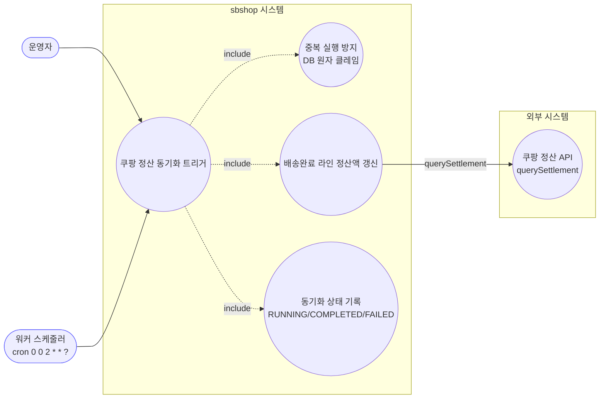
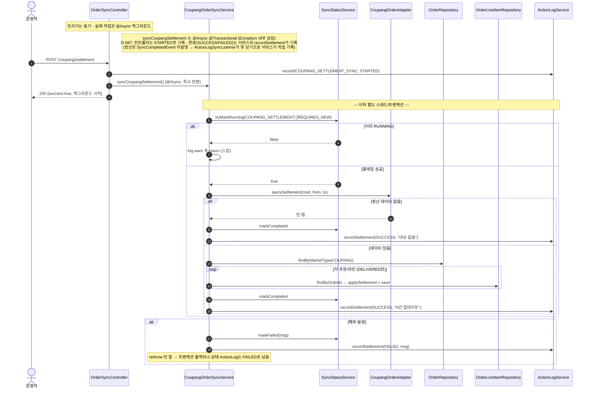
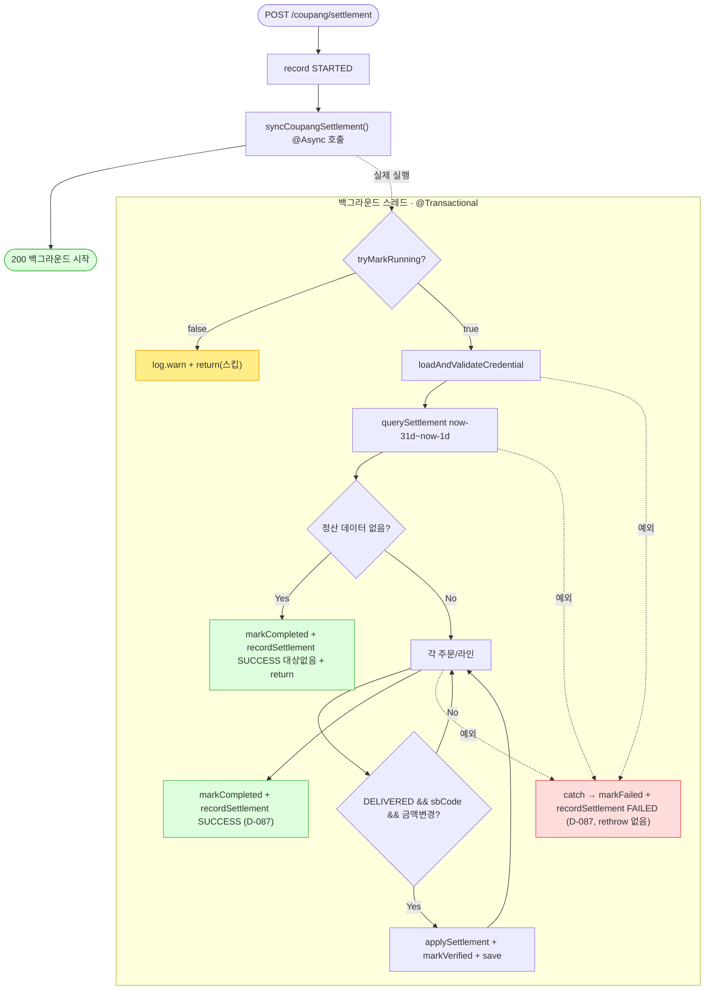

# POST /coupang/settlement — 쿠팡 정산 데이터 동기화 트리거

## 1. 개요

| 항목 | 내용 |
|------|------|
| **Method / URL** | `POST /api/v1/orders/sync/coupang/settlement` (바디 없음) |
| **목적** | 최근 31~1일 전 쿠팡 정산 API를 호출해 배송완료(`DELIVERED`) 라인아이템의 실제 정산금액을 갱신한다. |
| **핵심 상태전이** | 주문 상태 전이 없음. 라인아이템 `settlementData` 금액 갱신 + `settlementVerified` 마킹만 발생. |
| **부수효과** | 쿠팡 정산 API 호출 + 라인별 정산액 저장. **서비스는 `@Async @Transactional`** — 컨트롤러 호출 즉시 반환(백그라운드 실행). `SyncStatusService` DB 원자 클레임(중복 방지). 완료(SUCCESS/FAILED) ActionLog는 서비스의 `recordSettlement`가 직접 기록(D-087 — 정산은 `SyncCompletedEvent` 미발행 경로라 리스너가 못 남김). |
| **응답** | `200 OK` + `{success:true, message:"...백그라운드에서 시작..."}` (트리거 성공 여부만) |

## 2. 호출 체인

```
OrderSyncController.syncCoupangSettlement()                     api/.../controller/OrderSyncController.java:187-209  @PostMapping("/coupang/settlement")
  ├─ actionLogService.record(COUPANG_SETTLEMENT_SYNC, "COUPANG", STARTED)  :191-192
  ├─ coupangOrderSyncService.syncCoupangSettlement()            :195   ★ @Async — 즉시 반환
  │    └─ CoupangOrderSyncService.syncCoupangSettlement()       core/.../order/service/CoupangOrderSyncService.java:101-185  @Async("syncTaskExecutor") @Transactional
  │         ├─ syncStatusService.tryMarkRunning(COUPANG_SETTLEMENT) → false면 스킵  :107-111
  │         │    └─ SyncStatusService.tryMarkRunning()          core/.../sync/SyncStatusService.java:54-75  @Transactional(REQUIRES_NEW)
  │         ├─ loadAndValidateCredential()                      :114  (:196 이하)
  │         ├─ coupangOrderAdapter.querySettlement(cred, from, to)  :122-123  (sbCode → BigDecimal 맵)
  │         ├─ settlementMap.isEmpty() → markCompleted + recordSettlement(SUCCESS "대상 없음") + return  :125-133
  │         ├─ orderRepository.findByMarketType(COUPANG)        :136
  │         └─ for order → for lineItem:                        :139-169
  │              ├─ shippingStatus != DELIVERED → continue      :143-147
  │              ├─ productId null → continue                   :149-150
  │              ├─ productRepository.findById → sbCode 없으면 continue  :151-154
  │              ├─ settlementMap.get(sbCode) 있고 값 변경 시:   :156-161
  │              │    item.applySettlement() + markSettlementVerified() + save  :162-165
  │              ├─ (성공) markCompleted + recordSettlement(SUCCESS, "N건 업데이트")  :172-176
  │              └─ (catch) markFailed + recordSettlement(FAILED, msg)  :177-184  ★ Exception 삼킴(rethrow 없음)
  │         └─ recordSettlement(status, msg) 헬퍼: actionLogService.record(COUPANG_SETTLEMENT_SYNC, "COUPANG", status, msg)  :188-193  (D-087)
  └─ (D-087) 컨트롤러는 STARTED만 기록 — 트리거 직후 SUCCESS 기록은 제거됨(:196 주석). 완료(SUCCESS/FAILED)는 서비스의 recordSettlement가 기록(정산은 SyncCompletedEvent 미발행 경로라 리스너가 못 남김).
       (동기 디스패치 실패 시에만 catch → record(FAILED))       :200-204
```

**요청 바디** — 없음(서버가 `now-31일 ~ now-1일` 고정 범위 계산, :113-114).

## 3. 유스케이스 다이어그램



## 4. 시퀀스 다이어그램



## 5. 순서도 (플로우차트)



## 6. 상태 전이표

| 진입 라인상태 | 허용? | 결과 | 마켓 전송 | 비고 |
|-----------|:-----:|------|-----------|------|
| shippingStatus ≠ DELIVERED | — | 미변경 | — | 스킵(:137-141) |
| DELIVERED + productId null | — | 미변경 | — | 스킵(:143-144) |
| DELIVERED + sbCode 없음 | — | 미변경 | — | 스킵(:145-148) |
| DELIVERED + sbCode + 정산액 미변경 | — | 미변경 | 조회됨 | 값 동일 시 저장 안 함(:155) |
| DELIVERED + sbCode + 정산액 변경 | ✅ | `settlementData` 금액 갱신 + `settlementVerified` | querySettlement | 라인 단위 save(:156-159) |

> **주문 상태(orderStatus/shippingStatus) 자체는 전이하지 않는다** — 정산 금액 필드만 갱신.

## 7. 🔎 발견사항

### SYNCB-6 · 🔴 BUG — `@Async` 서비스를 감싼 컨트롤러의 SUCCESS/FAILED 기록이 실제 결과와 무관(항상 SUCCESS)
> ✅ **해결됨** (D-087, 커밋 c4c7faa) — 컨트롤러의 트리거 직후 `record(SUCCESS)`(구 :204-205)를 제거하고, 정산은 `SyncCompletedEvent`를 발행하지 않아 리스너가 완료를 못 남기던 진짜 버그라서 `CoupangOrderSyncService.syncCoupangSettlement`의 `markCompleted`/`markFailed` 지점에서 `recordSettlement`로 `COUPANG_SETTLEMENT_SYNC` SUCCESS/FAILED를 서비스가 직접 기록하도록 했다.
- **근거:** 서비스 `CoupangOrderSyncService.syncCoupangSettlement()` 는 `@Async("syncTaskExecutor")`(:101). 컨트롤러 `OrderSyncController.java:195` 는 이를 호출하고 곧바로 `구 :204-205` 에서 `record(..., SUCCESS)` 를 기록했다. `@Async` 는 즉시 반환하므로 컨트롤러의 `try/catch`(:200-208)는 백그라운드 예외를 **절대 볼 수 없다.** 게다가 서비스 내부도 예외를 `catch` 후 `markFailed` 만 하고 rethrow 하지 않아(:177-184) 어차피 전파되지 않는다. 또한 정산 경로는 다른 sync와 달리 `SyncCompletedEvent`를 발행하지 않아 `ActionLogSyncListener` 완료 기록 경로조차 없었다(실패가 ActionLog 어디에도 안 남음).
- **영향:** 정산 동기화가 크레덴셜 오류·정산 API 실패로 실제 실패해도 ActionLog에는 항상 `COUPANG_SETTLEMENT_SYNC SUCCESS` 만 남았다. 운영자는 로그로 실패를 인지할 수 없고, 진짜 결과는 `SyncStatusService` 의 RUNNING/FAILED 상태(`/status` 조회)에만 반영됐다. STARTED 직후 SUCCESS가 찍혀 "트리거 성공"과 "작업 성공"이 구분되지 않았다.
- **제안:** 컨트롤러 로그를 "트리거 접수(STARTED만)"로 한정하고 SUCCESS/FAILED 기록은 서비스 종료 시점(비동기 콜백/이벤트)으로 이관하거나, `SyncStatus` 를 정본으로 삼고 컨트롤러 SUCCESS 기록을 제거. (참고: 같은 컨트롤러의 `/customs` 는 동기 실행이라 SUCCESS/FAILED가 정확하다 — 비대칭.) (반영됨 — 컨트롤러 가짜 SUCCESS 제거 + 서비스 `recordSettlement`가 실제 완료/실패를 직접 기록.)

### SYNCB-7 · 🟠 GAP — 서비스가 예외를 삼켜(rethrow 없음) `@Async` 실패가 어디에도 전파되지 않음
> ⚠️ **부분 완화** (D-087, 커밋 c4c7faa) — rethrow 여부는 그대로(예외는 여전히 삼킨다)지만, `catch` 블록에서 `recordSettlement(FAILED)`를 추가해 실패가 최소한 ActionLog(`COUPANG_SETTLEMENT_SYNC FAILED`)에는 남게 됐다. 스케줄러 로그로의 전파는 여전히 미해결(별건).
- **근거:** `CoupangOrderSyncService.java:177-184` `catch (Exception e) { log.error(...); markFailed(...); recordSettlement(FAILED, ...); }` — `syncCoupangOrders`(:85-90 부근)와 달리 rethrow가 없다. `@Async @Transactional` 조합에서 예외를 삼키면 트랜잭션은 롤백되지만(런타임 예외 기준) 호출자·스케줄러 어디에도 신호가 가지 않는다.
- **영향:** 워커 스케줄러(`OrderSyncScheduler.syncCoupangSettlement` cron `0 0 2`)로 실행돼도 실패가 스케줄러 로그에 잡히지 않는다. `markFailed`·`recordSettlement(FAILED)` 로 상태·ActionLog에는 남지만, `@Transactional` 롤백과 `markFailed`(REQUIRES_NEW로 별도 커밋) 사이 부분 저장/상태 정합은 케이스별 검증이 필요.
- **제안:** `syncCoupangOrders` 처럼 rethrow 일관화 여부 결정. 삼킴이 의도라면 `markFailed`·`recordSettlement` 가 정본임을 명문화. (D-087에서 SYNCB-6의 SUCCESS 오기록 제거 + FAILED ActionLog 기록은 반영됨.)

### SYNCB-8 · 🟡 SMELL — 정산 조회 범위(`now-31 ~ now-1`)가 서비스에 하드코딩·파라미터 불가
- **근거:** `CoupangOrderSyncService.java:113-114` `minusDays(31)` / `minusDays(1)`. 조회 창이 고정이라 과거 정산 재동기·특정 기간 재처리가 불가.
- **영향:** 31일보다 늦게 확정되는 정산이나, 누락분 소급 반영이 이 엔드포인트로는 불가능.
- **제안:** 기간을 선택적 요청 파라미터로 노출(기본값 유지).

### SYNCB-9 · 🟡 SMELL — 전 쿠팡 주문 풀스캔(N+1) 후 라인별 개별 save
- **근거:** `CoupangOrderSyncService.java:130-163` `findByMarketType(COUPANG)` 로 모든 쿠팡 주문을 로드하고, 주문마다 `findByOrderId`(라인) + 상품마다 `productRepository.findById` 를 호출하며 변경 라인마다 개별 `save`.
- **영향:** 쿠팡 주문 누적 시 정산 1회 실행이 대량 쿼리(주문수 × 라인수 + 상품조회)로 팽창. 단일 `@Transactional` 안에서 장시간 실행 → 커넥션·락 장기 점유 위험(통관 경로는 F-SYNC-19로 배치 분리한 것과 대조).
- **제안:** DELIVERED 라인만 조회하는 쿼리·sbCode 배치 조회·`saveAll` 로 왕복 축소, 또는 통관처럼 배치 트랜잭션 분리 검토.

## 8. 테스트 커버리지 메모

- **컨트롤러:** `OrderSyncControllerActionLogTest`의 정산 케이스는 D-087에서 새 계약(트리거=STARTED만·컨트롤러 SUCCESS 없음·동기 디스패치 예외 시에만 FAILED)으로 재작성됨. 완료 SUCCESS/FAILED는 이제 서비스 책임이라 컨트롤러 단위 테스트 범위 밖.
- **서비스(신규):** `CoupangSettlementActionLogTest`(D-087) — 정산 완료/실패/중복스킵 시 `recordSettlement`가 `COUPANG_SETTLEMENT_SYNC` SUCCESS/FAILED를 올바로 남기는지 검증(SYNCB-6 해소 재현).
- `SyncStatusTryMarkRunningTest` / `SyncStatusServiceTest` — `tryMarkRunning` 원자 클레임·상태 전이 검증(중복 방지 로직).
- **비어있는 케이스:** ① 정산 데이터 없음/부분 갱신 라인 카운트, ② DELIVERED 아닌 라인 스킵, ③ sbCode 미매핑 스킵, ④ 정산액 동일 시 미저장(:161) 계약. (①~④는 `recordSettlement` 기록 검증과는 별개 — SYNCB-6은 D-087 신규 테스트로 커버됨.)

---
*생성: 2026-07-17 · 근거: 현재 워킹트리*
