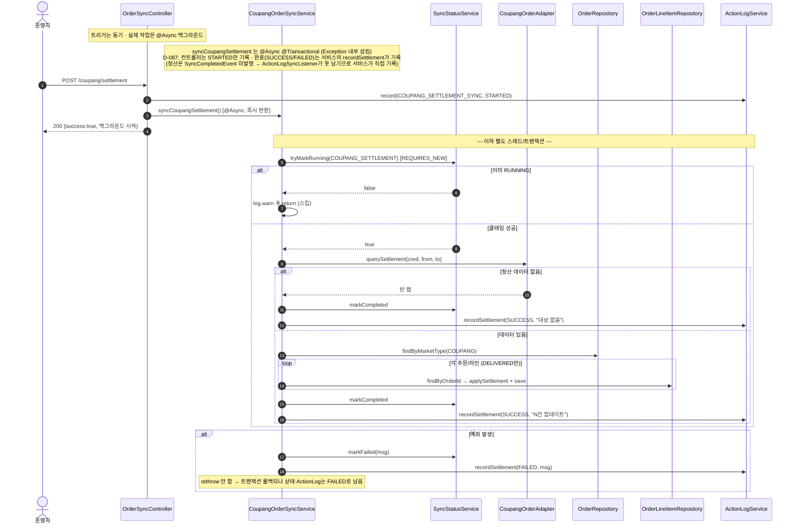

# POST /coupang/settlement — 쿠팡 정산 데이터 동기화 트리거

## 1. 개요

이 기능을 한마디로 하면: **쿠팡에서 배송이 끝난 주문들의 "실제 정산금액(쿠팡이 우리에게 얼마 주는지)"을 가져와 우리 데이터에 채워 넣는 작업을 시작시키는 버튼**입니다. 무겁고 오래 걸리는 작업이라, 버튼을 누르면 "접수했다"고만 바로 답하고 실제 계산은 뒤에서(백그라운드) 돌립니다.

| 항목 | 내용(쉬운 설명) |
|------|------|
| **Method / URL** | `POST /api/v1/orders/sync/coupang/settlement` (바디 없음) — 이 주소로 호출하며, 보낼 값은 없습니다. |
| **목적** | 최근 31~1일 전 구간의 쿠팡 정산 API를 불러, 배송완료(`DELIVERED`)된 상품 줄의 실제 정산금액을 갱신합니다. → 쉽게 말하면 "배송 끝난 건들의 진짜 받을 돈을 쿠팡에서 받아와 채워 넣기". |
| **핵심 상태전이** | 주문 상태 자체는 안 바뀝니다. 상품 줄의 `settlementData`(정산금액)만 갱신하고 "정산 확인됨(`settlementVerified`)" 표시만 붙입니다. |
| **부수효과** | 쿠팡 정산 API를 부르고 줄별로 정산액을 저장합니다. **실제 작업은 백그라운드(`@Async @Transactional`)로 돌아서**, 버튼을 누르는 즉시 응답이 돌아옵니다. 같은 작업이 동시에 두 번 돌지 않도록 DB에 "지금 실행 중" 표시를 원자적으로 찍습니다(`SyncStatusService`). 최종 성공/실패 기록(ActionLog)은 서비스 안의 `recordSettlement`가 직접 남깁니다(D-087 — 정산은 완료 이벤트를 발행하지 않는 경로라 이벤트 리스너가 대신 못 남기기 때문). |
| **응답** | `200 OK` + `{success:true, message:"...백그라운드에서 시작..."}` — 어디까지나 "작업을 시작시키는 데 성공했다"는 뜻이지, "정산 계산이 성공했다"는 뜻이 아닙니다. |

## 2. 호출 체인

아래는 이 기능이 거치는 코드 흐름입니다. `파일:라인`은 실제 위치이고, 핵심 부분은 뒤에 쉽게 풀어 적었습니다. `★` 표시가 특히 중요한 대목입니다.

```
OrderSyncController.syncCoupangSettlement()                     api/.../controller/OrderSyncController.java:187-209  @PostMapping("/coupang/settlement")
  ├─ actionLogService.record(COUPANG_SETTLEMENT_SYNC, "COUPANG", STARTED)  :191-192
  ├─ coupangOrderSyncService.syncCoupangSettlement()            :195   ★ @Async — 즉시 반환
  │    └─ CoupangOrderSyncService.syncCoupangSettlement()       core/.../order/service/CoupangOrderSyncService.java:101-185  @Async("syncTaskExecutor") @Transactional
  │         ├─ syncStatusService.tryMarkRunning(COUPANG_SETTLEMENT) → false면 스킵  :107-111
  │         │    └─ SyncStatusService.tryMarkRunning()          core/.../sync/SyncStatusService.java:54-75  @Transactional(REQUIRES_NEW)
  │         ├─ loadAndValidateCredential()                      :114  (:196 이하)
  │         ├─ coupangOrderAdapter.querySettlement(cred, from, to)  :122-123  (sbCode → BigDecimal 맵)
  │         ├─ settlementMap.isEmpty() → markCompleted + recordSettlement(SUCCESS "대상 없음") + return  :125-133
  │         ├─ orderRepository.findByMarketType(COUPANG)        :136
  │         └─ for order → for lineItem:                        :139-169
  │              ├─ shippingStatus != DELIVERED → continue      :143-147
  │              ├─ productId null → continue                   :149-150
  │              ├─ productRepository.findById → sbCode 없으면 continue  :151-154
  │              ├─ settlementMap.get(sbCode) 있고 값 변경 시:   :156-161
  │              │    item.applySettlement() + markSettlementVerified() + save  :162-165
  │              ├─ (성공) markCompleted + recordSettlement(SUCCESS, "N건 업데이트")  :172-176
  │              └─ (catch) markFailed + recordSettlement(FAILED, msg)  :177-184  ★ Exception 삼킴(rethrow 없음)
  │         └─ recordSettlement(status, msg) 헬퍼: actionLogService.record(COUPANG_SETTLEMENT_SYNC, "COUPANG", status, msg)  :188-193  (D-087)
  └─ (D-087) 컨트롤러는 STARTED만 기록 — 트리거 직후 SUCCESS 기록은 제거됨(:196 주석). 완료(SUCCESS/FAILED)는 서비스의 recordSettlement가 기록(정산은 SyncCompletedEvent 미발행 경로라 리스너가 못 남김).
       (동기 디스패치 실패 시에만 catch → record(FAILED))       :200-204
```

쉽게 풀어 읽으면:
- **입구(Controller)** — 먼저 "정산 동기화를 시작했다(STARTED)"고 기록합니다. 그리고 실제 작업을 부르는데, 이 작업은 `@Async`라 **바로 되돌아옵니다**. → 즉, 컨트롤러는 작업이 실제로 끝날 때까지 기다리지 않습니다.
- **중복 방지(tryMarkRunning)** — 백그라운드 작업은 시작할 때 "지금 내가 정산을 돌리는 중"이라고 DB에 표시합니다. 이미 누가 돌리는 중이면 그냥 건너뜁니다. → 같은 작업이 두 번 겹쳐 도는 걸 막습니다.
- **인증정보 확인 → 쿠팡 조회** — 쿠팡에 붙을 인증정보를 확인하고, 정산 금액표(상품코드 → 금액)를 받아옵니다.
- **대상 없으면 종료** — 받아온 정산 데이터가 비어 있으면 "대상 없음"으로 성공 처리하고 끝냅니다.
- **줄별로 채우기** — 쿠팡 주문을 모두 불러와, 각 상품 줄이 "배송완료 + 우리 상품코드 있음 + 정산액이 실제로 바뀜" 조건을 만족할 때만 새 정산액을 저장합니다.
- **마무리 기록** — 문제없이 끝나면 "성공(N건 업데이트)"을, 도중에 예외가 나면 "실패"를 각각 상태와 기록에 남깁니다. → ★ 다만 예외를 잡은 뒤 밖으로 다시 던지지 않아(rethrow 없음), 이 실패가 이 작업을 부른 쪽(스케줄러 등)까지는 전달되지 않습니다.

**요청 바디** — 없음(서버가 `now-31일 ~ now-1일` 기간을 알아서 정합니다, :113-114).

## 3. 유스케이스 다이어그램

👉 이 그림은 "운영자 또는 새벽 2시 자동 스케줄러가 정산 동기화를 시작시키면, 시스템이 중복 실행을 막고 쿠팡 정산 API에서 배송완료 건의 정산액을 받아 갱신하며 그 상태를 기록한다"는 큰 그림을 보여줍니다.


## 4. 시퀀스 다이어그램

👉 이 그림은 "버튼을 누르면 곧바로 200이 돌아가고, 실제 정산 작업은 별도 스레드에서 따로 진행된다"는 두 갈래 흐름을, 성공·중복스킵·예외 경우까지 시간 순서로 보여줍니다.



## 5. 순서도 (플로우차트)

👉 이 그림은 "STARTED 기록 → 비동기 호출 → 즉시 200" 위쪽 흐름과, 그 아래 별도 스레드에서 "중복확인 → 인증 → 쿠팡조회 → 대상 유무 → 줄별 갱신 → 완료/실패 기록"으로 이어지는 실제 작업 흐름을 함께 보여줍니다.


## 6. 상태 전이표

아래 표는 "각 상품 줄이 어떤 상태로 들어오면 정산액을 채워 넣는지"를 정리한 것입니다. 표 구조는 그대로 두고 칸 문구만 쉽게 다듬었습니다.

| 진입 라인상태 | 허용? | 결과 | 마켓 전송 | 비고(쉬운 설명) |
|-----------|:-----:|------|-----------|------|
| shippingStatus ≠ DELIVERED | — | 미변경 | — | 배송완료가 아니면 건너뜀(:137-141) |
| DELIVERED + productId null | — | 미변경 | — | 상품 정보가 없으면 건너뜀(:143-144) |
| DELIVERED + sbCode 없음 | — | 미변경 | — | 우리 상품코드를 못 찾으면 건너뜀(:145-148) |
| DELIVERED + sbCode + 정산액 미변경 | — | 미변경 | 조회됨 | 조회는 했지만 금액이 그대로면 저장 안 함(:155) |
| DELIVERED + sbCode + 정산액 변경 | ✅ | `settlementData` 금액 갱신 + `settlementVerified` | querySettlement | 금액이 바뀐 줄만 저장(:156-159) |

> **주문 자체의 상태(orderStatus/shippingStatus)는 바뀌지 않습니다** — 오직 정산 금액 칸만 갱신됩니다.

## 7. 🔎 발견사항

### SYNCB-6 · 🔴 BUG — `@Async` 서비스를 감싼 컨트롤러의 SUCCESS/FAILED 기록이 실제 결과와 무관(항상 SUCCESS)
> ✅ **해결됨** (D-087, 커밋 c4c7faa) — 컨트롤러의 트리거 직후 `record(SUCCESS)`(구 :204-205)를 제거하고, 정산은 `SyncCompletedEvent`를 발행하지 않아 리스너가 완료를 못 남기던 진짜 버그라서 `CoupangOrderSyncService.syncCoupangSettlement`의 `markCompleted`/`markFailed` 지점에서 `recordSettlement`로 `COUPANG_SETTLEMENT_SYNC` SUCCESS/FAILED를 서비스가 직접 기록하도록 했다.
- **무엇이 문제였나:** 실제 정산 작업은 백그라운드에서 따로 도는데, 입구 코드(컨트롤러)가 작업을 시작시키자마자 곧바로 "성공"이라고 기록했습니다. 백그라운드에서 나중에 진짜로 실패해도 그 실패는 이 기록에 절대 반영될 수 없었습니다.
- **근거:** 서비스 `CoupangOrderSyncService.syncCoupangSettlement()` 는 `@Async("syncTaskExecutor")`(:101). 컨트롤러 `OrderSyncController.java:195` 는 이를 호출하고 곧바로 `구 :204-205` 에서 `record(..., SUCCESS)` 를 기록했다. `@Async` 는 즉시 반환하므로 컨트롤러의 `try/catch`(:200-208)는 백그라운드 예외를 **절대 볼 수 없다.** 게다가 서비스 내부도 예외를 `catch` 후 `markFailed` 만 하고 rethrow 하지 않아(:177-184) 어차피 전파되지 않는다. 또한 정산 경로는 다른 sync와 달리 `SyncCompletedEvent`를 발행하지 않아 `ActionLogSyncListener` 완료 기록 경로조차 없었다(실패가 ActionLog 어디에도 안 남음).
- **왜 문제였나:** 인증 오류나 쿠팡 API 실패로 정산이 실제로 실패해도, 기록(ActionLog)에는 언제나 "정산 동기화 성공"만 남았습니다. 운영자는 로그만 봐서는 실패를 전혀 알아챌 수 없었고, 진짜 결과는 별도의 상태 화면(`/status`)에만 반영됐습니다. "버튼 눌러 시작 성공"과 "정산 계산 성공"이 구분되지 않았던 것입니다.
- **어떻게 고쳤나(제안):** 컨트롤러 기록은 "접수했다(STARTED)"까지만 하고, 진짜 성공/실패는 백그라운드 작업이 끝나는 시점에 남기도록 옮기거나, `SyncStatus`를 정본으로 삼고 컨트롤러의 가짜 성공 기록을 제거합니다. (참고: 같은 컨트롤러의 `/customs` 는 앞에서 끝까지 기다리는 방식이라 성공/실패가 정확합니다 — 비대칭이었음.) (반영됨 — 컨트롤러의 가짜 SUCCESS 제거 + 서비스 `recordSettlement`가 실제 완료/실패를 직접 기록.)

### SYNCB-7 · 🟠 GAP — 서비스가 예외를 삼켜(rethrow 없음) `@Async` 실패가 어디에도 전파되지 않음
> ⚠️ **부분 완화** (D-087, 커밋 c4c7faa) — rethrow 여부는 그대로(예외는 여전히 삼킨다)지만, `catch` 블록에서 `recordSettlement(FAILED)`를 추가해 실패가 최소한 ActionLog(`COUPANG_SETTLEMENT_SYNC FAILED`)에는 남게 됐다. 스케줄러 로그로의 전파는 여전히 미해결(별건).
- **무엇이 문제인가:** 정산 서비스는 오류가 나면 안에서 조용히 처리(로그만 남기고 마무리)하고, 그 오류를 바깥으로 다시 던지지 않습니다. 그래서 실패했다는 신호가 이 작업을 부른 스케줄러 쪽으로 전달되지 않습니다.
- **근거:** `CoupangOrderSyncService.java:177-184` `catch (Exception e) { log.error(...); markFailed(...); recordSettlement(FAILED, ...); }` — `syncCoupangOrders`(:85-90 부근)와 달리 rethrow가 없다. `@Async @Transactional` 조합에서 예외를 삼키면 트랜잭션은 롤백되지만(런타임 예외 기준) 호출자·스케줄러 어디에도 신호가 가지 않는다.
- **왜 문제인가:** 워커의 정기 스케줄러(새벽 2시, `OrderSyncScheduler.syncCoupangSettlement` cron `0 0 2`)로 돌다가 실패해도 스케줄러 로그에는 실패가 잡히지 않습니다. 상태와 ActionLog에는 남지만, 트랜잭션 되돌리기(롤백)와 `markFailed`(별도 커밋)가 서로 어긋나며 데이터가 일부만 저장되는 상황은 케이스별로 따로 확인이 필요합니다.
- **어떻게 고치면 되나:** 다른 동기화(`syncCoupangOrders`)처럼 실패를 다시 던져 일관되게 할지 정합니다. 조용히 처리하는 게 의도라면 "`markFailed`·`recordSettlement`가 정본"임을 문서로 명확히 남깁니다. (D-087에서 SYNCB-6의 가짜 성공 기록 제거 + 실패 시 ActionLog 기록은 반영됨.)

### SYNCB-8 · 🟡 SMELL — 정산 조회 범위(`now-31 ~ now-1`)가 서비스에 하드코딩·파라미터 불가
- **무엇이 문제인가:** "최근 31일 전 ~ 1일 전"이라는 조회 기간이 코드에 숫자로 박혀 있어, 과거 정산을 다시 맞추거나 특정 기간만 골라 다시 처리하는 게 불가능합니다.
- **근거:** `CoupangOrderSyncService.java:113-114` `minusDays(31)` / `minusDays(1)`. 조회 창이 고정이라 과거 정산 재동기·특정 기간 재처리가 불가.
- **왜 문제인가:** 31일보다 늦게 확정되는 정산이나, 놓친 정산을 소급해 반영하는 일을 이 기능만으로는 할 수 없습니다.
- **어떻게 고치면 되나:** 기간을 선택적으로 넘길 수 있는 요청 값으로 열어 둡니다(기본값은 지금 그대로 유지).

### SYNCB-9 · 🟡 SMELL — 전 쿠팡 주문 풀스캔(N+1) 후 라인별 개별 save
- **무엇이 문제인가:** 정산을 한 번 돌릴 때 쿠팡 주문을 통째로 다 불러오고, 주문마다 그 안의 줄들을 또 조회하고, 줄마다 상품을 또 조회하며, 바뀐 줄은 하나씩 따로 저장합니다. → 쉽게 말하면 "필요한 것만 콕 집어오지 않고, 전부 훑은 뒤 한 건씩 저장"하는 비효율입니다.
- **근거:** `CoupangOrderSyncService.java:130-163` `findByMarketType(COUPANG)` 로 모든 쿠팡 주문을 로드하고, 주문마다 `findByOrderId`(라인) + 상품마다 `productRepository.findById` 를 호출하며 변경 라인마다 개별 `save`.
- **왜 문제인가:** 쿠팡 주문이 쌓일수록 정산 한 번에 엄청난 수의 조회(주문수 × 줄수 + 상품조회)가 발생합니다. 이 모든 게 하나의 긴 트랜잭션 안에서 오래 돌아, DB 연결과 잠금을 오래 붙잡습니다(통관 경로는 F-SYNC-19로 배치를 나눠 이 문제를 피한 것과 대조적).
- **어떻게 고치면 되나:** 배송완료 줄만 골라오는 조회, 상품코드 한꺼번에 조회, 여러 건 모아 저장(`saveAll`)으로 왕복을 줄이거나, 통관처럼 작업을 배치로 나눠 트랜잭션을 분리하는 걸 검토합니다.

## 8. 테스트 커버리지 메모

- **컨트롤러:** `OrderSyncControllerActionLogTest`의 정산 케이스는 D-087에서 새 약속(시작=STARTED만 기록·컨트롤러는 SUCCESS 안 남김·작업을 넘기는 단계에서 예외가 났을 때만 FAILED)으로 다시 작성됐습니다. 최종 성공/실패는 이제 서비스가 남기므로 컨트롤러 단위 테스트 범위 밖입니다.
- **서비스(신규):** `CoupangSettlementActionLogTest`(D-087) — 정산 완료/실패/중복스킵 때 `recordSettlement`가 SUCCESS/FAILED를 올바로 남기는지 확인합니다(SYNCB-6 해소를 재현).
- `SyncStatusTryMarkRunningTest` / `SyncStatusServiceTest` — "지금 실행 중" 표시를 겹치지 않게 찍는 로직과 상태 전이를 확인합니다(중복 방지).
- **아직 확인 안 하는 경우(빈 케이스):** ① 정산 데이터 없음/부분 갱신 시 건수, ② 배송완료 아닌 줄 건너뛰기, ③ 우리 상품코드가 안 맞는 줄 건너뛰기, ④ 정산액이 같을 때 저장 안 함(:161). (①~④는 기록 검증과는 별개이며, SYNCB-6은 D-087 신규 테스트로 다룸.)

---
*(쉬운 설명판 · 2026-07-17 재작성)*
*생성: 2026-07-17 · 근거: 현재 워킹트리*
