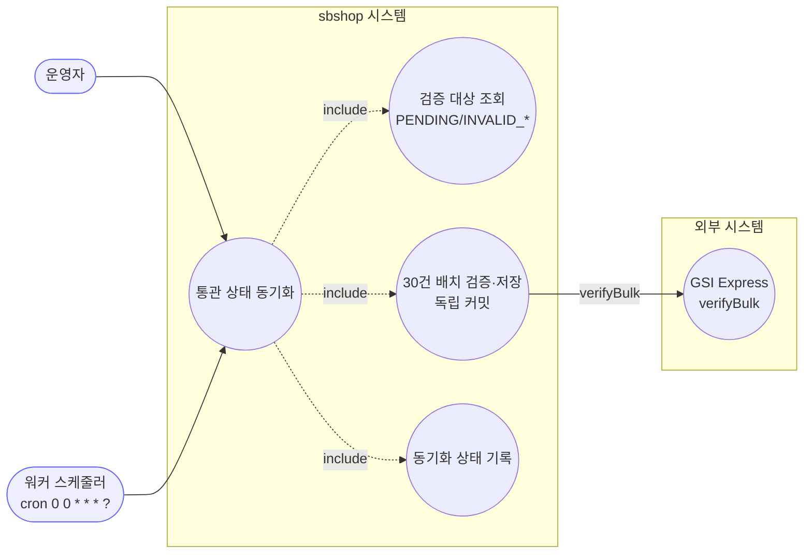
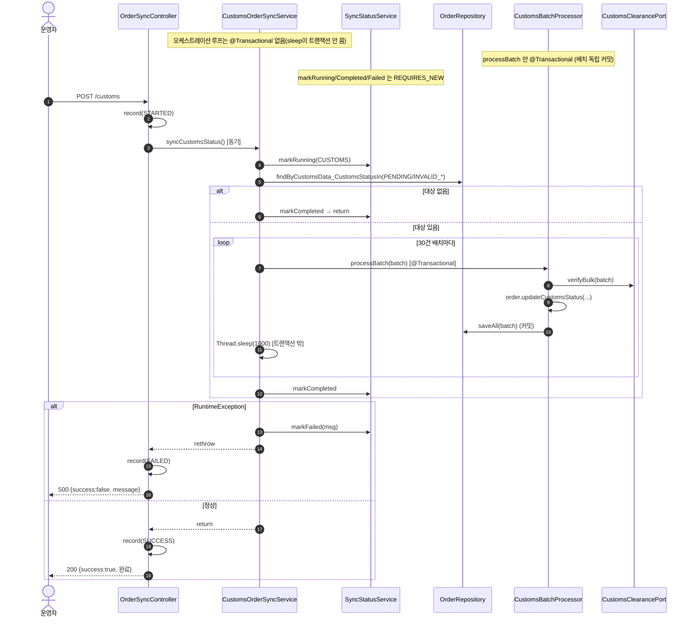

# POST /customs — 통관 상태 동기화 트리거

## 1. 개요

이 기능을 한마디로 하면: **해외배송 주문의 통관(세관 통과) 상태를 외부 통관업체(GSI Express)에 물어보고, 그 결과로 우리 주문의 통관 상태를 최신으로 갱신하는 작업**입니다. 한 번에 몰아서 물어보면 부담이 크니 30건씩 나눠서 확인하고, 각 묶음이 끝날 때마다 그때그때 저장합니다.

| 항목 | 내용(쉬운 설명) |
|------|------|
| **Method / URL** | `POST /api/v1/orders/sync/customs` (바디 없음) — 이 주소로 호출하며, 보낼 값은 없습니다. |
| **목적** | 통관번호가 있고 아직 확인 안 됨(`PENDING`)이거나 오류(`INVALID_*`) 상태인 주문을 GSI Express로 30건씩 검증해, 통관 상태를 갱신합니다. |
| **핵심 상태전이** | 주문의 통관 상태(`customsData.customsStatus`)가 `PENDING`/`INVALID_*` → 검증 결과(`VALID`/`INVALID_*`/`PENDING`)로 바뀝니다. |
| **부수효과** | GSI Express에 30건 단위로 검증을 요청하고, 묶음마다 따로 저장(커밋)합니다. 묶음 사이에 1초씩 쉽니다(`Thread.sleep(1000)`). **전체를 지휘하는 바깥 흐름은 하나의 트랜잭션으로 묶지 않고**, 실제 저장은 각 묶음 처리(`CustomsBatchProcessor.processBatch`)가 자기 트랜잭션 안에서 합니다. → 쉽게 말하면 "묶음 하나 끝나면 바로 저장하고 다음 묶음으로". |
| **응답** | 이 작업은 끝까지 기다렸다가 답합니다. 성공하면 `200 OK` + `{success:true, message:"완료"}` / 실패하면 `500` + `{success:false, message}`. |

## 2. 호출 체인

아래는 이 기능이 거치는 코드 흐름입니다. `파일:라인`은 실제 위치이고, 핵심은 뒤에 쉽게 풀어 적었습니다. `★` 표시가 특히 눈여겨볼 대목입니다.

```
OrderSyncController.syncCustomsOrders()                         api/.../controller/OrderSyncController.java:221-245  @PostMapping("/customs")
  ├─ actionLogService.record(CUSTOMS_SYNC, null, STARTED)       :225-226
  ├─ customsOrderSyncService.syncCustomsStatus()                :229   ★ 동기 실행(@Async 아님)
  │    └─ CustomsOrderSyncService.syncCustomsStatus()           core/.../order/service/CustomsOrderSyncService.java:40-93  (@Transactional 없음)
  │         ├─ syncStatusService.markRunning(CUSTOMS)           :43   (REQUIRES_NEW)
  │         ├─ orderRepository.findByCustomsData_CustomsStatusIn([PENDING, INVALID_PCCC, INVALID_PHONE, INVALID_ZIPCODE])  :48-53
  │         ├─ targetOrders.isEmpty() → markCompleted + return  :58-62
  │         └─ for (i += 30) 배치 루프:                          :68-82
  │              ├─ customsBatchProcessor.processBatch(batch)   :73   @Transactional(배치 독립 커밋)
  │              │    └─ CustomsBatchProcessor.processBatch()   core/.../order/service/CustomsBatchProcessor.java:37-47
  │              │         ├─ customsClearancePort.verifyBulk(batch)  :39
  │              │         ├─ order.updateCustomsStatus(status, verifiedPerson)  :43
  │              │         └─ orderRepository.saveAll(batch)    :46
  │              └─ Thread.sleep(1000) (트랜잭션 밖)             :77
  │         ├─ markCompleted(CUSTOMS)                           :85-86
  │         └─ catch RuntimeException → markFailed + rethrow    :87-92  ★ rethrow 함
  ├─ actionLogService.record(CUSTOMS_SYNC, null, SUCCESS)       :231-232  (동기 완료 후)
  └─ (catch Exception) actionLogService.record(..., FAILED)     :239-240
```

쉽게 풀어 읽으면:
- **입구(Controller)** — 먼저 "통관 동기화를 시작했다(STARTED)"고 기록하고 실제 작업을 부릅니다. → ★ 이 작업은 백그라운드가 아니라 **끝까지 기다리는 방식**이라, 컨트롤러가 진짜 성공/실패를 직접 보고 정확히 기록할 수 있습니다.
- **실행 중 표시 → 대상 조회** — "지금 통관 검증 중"이라고 표시하고, 통관 상태가 `PENDING`이거나 오류(`INVALID_*`)인 주문들을 찾아옵니다.
- **대상 없으면 종료** — 검증할 주문이 없으면 완료로 표시하고 끝냅니다.
- **30건씩 묶어 검증(배치 루프)** — 주문을 30건씩 나눠, 각 묶음을 GSI Express에 보내 검증하고, 그 결과로 통관 상태를 바꿔 저장합니다. 각 묶음은 자기 트랜잭션 안에서 저장되어 바로 확정됩니다. 묶음 사이에 1초 쉽니다(외부 사이트에 부담을 덜기 위해).
- **마무리** — 다 끝나면 완료로 표시하고, 컨트롤러가 "성공(SUCCESS)"을 기록합니다. → ★ 도중에 오류가 나면 서비스가 "실패"로 표시한 뒤 오류를 밖으로 다시 던져(rethrow), 컨트롤러가 "실패(FAILED)"로 기록하고 500으로 응답합니다.

**요청 바디** — 없음.

## 3. 유스케이스 다이어그램

👉 이 그림은 "운영자 또는 정시 스케줄러가 통관 동기화를 시작시키면, 시스템이 검증 대상을 찾아 30건씩 GSI Express에 검증을 맡기고 그 상태를 기록한다"는 큰 그림을 보여줍니다.



## 4. 시퀀스 다이어그램

👉 이 그림은 "요청 → 실행표시 → 대상조회 → (대상 있으면) 30건 묶음마다 검증·저장·1초 대기 반복 → 완료"까지, 성공과 실패로 갈라지는 흐름을 시간 순서로 보여줍니다. 저장은 묶음별로만 트랜잭션에 묶입니다.



## 5. 순서도 (플로우차트)

👉 이 그림은 "요청 → 실행표시 → 대상조회 → 대상 유무 → 30건 묶음 검증·저장·1초대기 반복 → 완료/실패 기록 → 200 또는 500"으로 갈라지는 판단 흐름을 한눈에 보여줍니다.


## 6. 상태 전이표

아래 표는 "통관 상태가 어떤 값으로 들어오면 검증 대상이 되고 어떻게 바뀌는지"를 정리한 것입니다. 표 구조는 그대로 두고 문구만 쉽게 다듬었습니다.

| 진입 통관상태 | 허용? | 결과 상태 | 외부 전송 | 비고(쉬운 설명) |
|-----------|:-----:|-----------|-----------|------|
| `PENDING` | ✅ | 검증 결과(`VALID`/`INVALID_*`/`PENDING`) | verifyBulk | 결과에 그 건이 안 오면 그대로 대기 유지(:41-42) |
| `INVALID_PCCC`/`INVALID_PHONE`/`INVALID_ZIPCODE` | ✅ | 재검증 결과 | verifyBulk | 오류 상태는 다시 검증 대상(:48-53) |
| `VALID` | — | 미변경 | — | 이미 통과라 조회 대상에서 빠짐(건너뜀) |
| 통관번호 없음(空) | — | 미변경 | — | 주석상으로는 건너뛰기로 되어 있음(주석 :29) |

> 묶음마다 따로 저장(커밋)합니다 — 중간 묶음이 실패하면 오류를 다시 던지지만, 그 전에 저장된 묶음의 진행분은 그대로 남습니다(F-SYNC-20).

## 7. 🔎 발견사항

### SYNCB-10 · 🟠 GAP — 통관번호 유무 필터가 상태 쿼리에 없음(주석과 코드 불일치 가능)
- **무엇이 문제인가:** 코드 주석은 "통관번호가 없거나 비어 있으면 건너뛰고, 통관번호가 있고 대기/오류 상태인 주문만 검증한다"고 적혀 있는데, 실제 조회는 상태만 보고 통관번호가 비었는지는 걸러내지 않습니다. → 주석이 약속한 "건너뛰기"가 실제 코드에는 없습니다.
- **근거:** 서비스 주석 `CustomsOrderSyncService.java:29,45-47` 은 "통관번호가 없거나 空白이면 스킵, 통관번호가 있고 PENDING/INVALID인 주문만 대상"이라 명시하나, 실제 쿼리 `:48-53` 은 `findByCustomsData_CustomsStatusIn(...)` 로 **상태만** 필터링한다. 통관번호 null/공백 여부는 쿼리에서 걸러지지 않는다.
- **왜 문제인가:** 통관번호가 비었는데 상태가 대기(`PENDING`)인 주문도 외부 통관 검증(`verifyBulk`)으로 넘어갑니다. GSI Express가 빈 통관번호를 어떻게 다루느냐에 따라, 의미 없는 외부 호출이 나가거나 배치가 불필요하게 커질 수 있습니다.
- **어떻게 고치면 되나:** 조회 조건에 "통관번호가 비어있지 않음"을 추가하거나, 검증 직전에 걸러냅니다. 주석과 실제 동작을 일치시킵니다.

### SYNCB-11 · 🟠 GAP — `markCompleted`/`markFailed`(REQUIRES_NEW)와 배치 커밋 사이 상태-데이터 정합 취약
- **무엇이 문제인가:** 통관 검증은 30건씩 나눠 각 묶음을 따로 저장(커밋)합니다. 그러다 중간 묶음에서 오류가 나면 전체 상태는 "실패"로 기록되지만, 그 전까지 저장된 묶음의 통관 상태는 이미 갱신된 채 남습니다. → 상태는 "실패"인데 실제로는 일부가 이미 검증돼 있는 뒤섞인 상태입니다.
- **근거:** 오케스트레이션은 비트랜잭션이고 각 배치는 독립 커밋(`CustomsBatchProcessor.java:37`), 상태 기록은 `SyncStatusService` REQUIRES_NEW(:43/:85/:89). 중간 배치에서 `RuntimeException` 발생 시 `:87-92` 에서 `markFailed` + rethrow 하지만, **그 전까지 커밋된 배치는 이미 통관상태가 갱신된 채로 남는다.** 상태는 `FAILED`인데 데이터 일부는 갱신된 혼합 상태.
- **왜 문제인가:** 상태 화면(`/status`)에는 "실패"로 보이지만 실제로는 일부 주문이 검증 완료돼 있습니다. 다시 실행하면 이미 통과(`VALID`)된 건은 대상에서 빠지므로 큰 문제는 아니지만(같은 작업을 반복해도 결과가 안 망가짐), "부분 성공"이 "완전 실패"로 오해될 수 있습니다.
- **어떻게 고치면 되나:** 부분 성공/실패를 표현하는 상태(예: 처리한 건수·실패한 묶음 번호)를 함께 남기거나, 실패해도 진행분을 따로 드러냅니다.

### SYNCB-12 · 🟡 SMELL — 배치 크기·딜레이·검증 대상 상태 집합이 하드코딩
- **무엇이 문제인가:** 한 묶음 크기(30건), 묶음 사이 대기 시간(1초), 그리고 "어떤 상태를 검증 대상으로 볼지" 목록이 모두 코드에 박혀 있습니다.
- **근거:** `CustomsOrderSyncService.java:17-19` `VERIFICATION_BATCH_SIZE=30`, `BATCH_DELAY_MS=1000`, 그리고 대상 상태 리스트 `:49-53` 가 코드에 고정.
- **왜 문제인가:** 외부 사이트 부하나 응답 속도가 바뀌어도 이 값들을 손대지 않고는 조절할 수 없습니다. 또 새로운 오류(INVALID) 상태가 생기면 이 목록에 추가하는 걸 깜빡할 위험이 있습니다.
- **어떻게 고치면 되나:** 이 값들을 설정으로 빼내고, 대상 상태를 한곳(예: `CustomsStatus.retryable()`)에 모아 관리합니다.

## 8. 테스트 커버리지 메모

- `CustomsSyncTransactionBoundaryTest`(:41, 테스트 4개) — 전체 지휘 흐름은 트랜잭션에 안 묶이고 묶음별로만 저장·확정되는 경계를 확인합니다(F-SYNC-19/20). 1초 대기가 트랜잭션 안에 들어가지 않는지, 묶음 단위 저장으로 부분 진행이 보존되는지 확인합니다.
- `SyncServiceSelfRecordsStatusTest` — 동기화 서비스가 자기 상태(실행중/완료/실패)를 스스로 기록하는지 확인합니다(F-SYNC-2).
- `OrderSyncControllerActionLogTest`(:76-127 부근) — `/customs` 의 시작/성공/실패 기록 약속을 확인합니다(끝까지 기다리는 방식이라 기록이 정확).
- **아직 확인 안 하는 경우(빈 케이스):** ① 통관번호가 없는 대기 주문이 대상에 섞이는지(SYNCB-10), ② 중간 묶음 실패 시 상태와 데이터가 뒤섞이는 상황(SYNCB-11), ③ 대상 0건일 때 바로 종료(:58-62), ④ 결과에 그 건이 안 왔을 때 대기 유지로 되돌아가는 처리(`CustomsBatchProcessor.java:41-42`).

---
*(쉬운 설명판 · 2026-07-17 재작성)*
*생성: 2026-07-17 · 근거: 현재 워킹트리*
