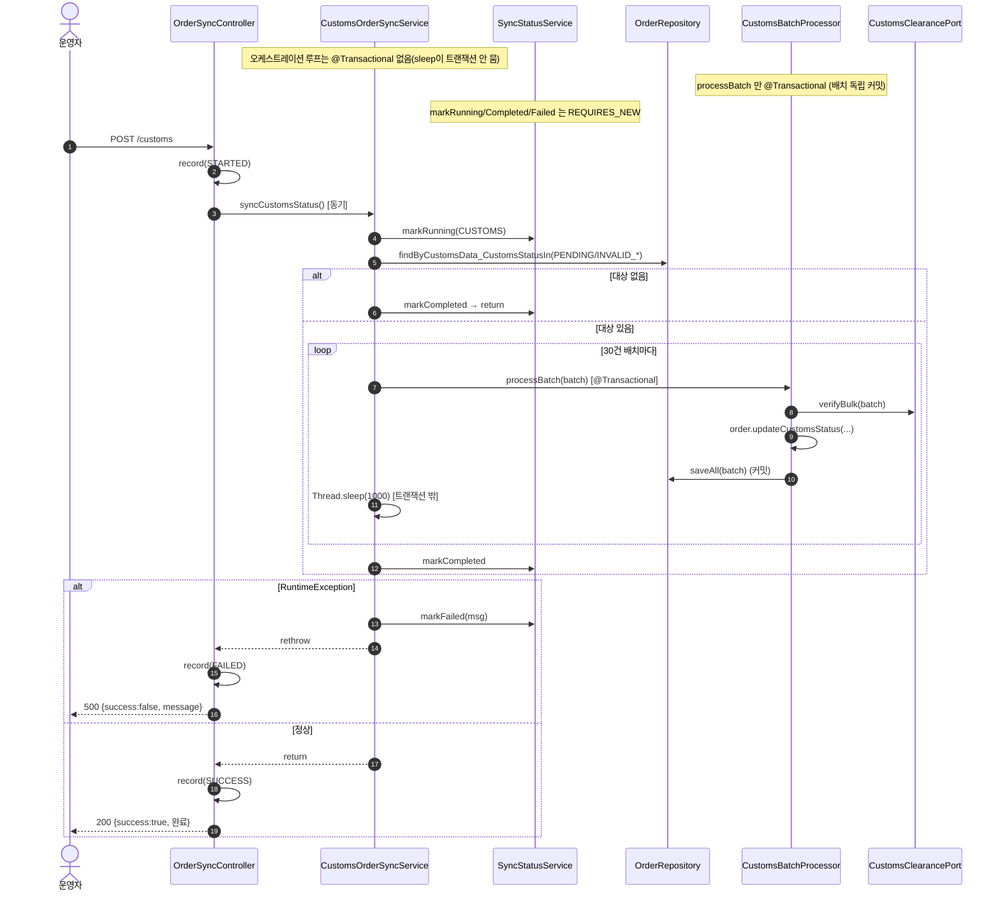
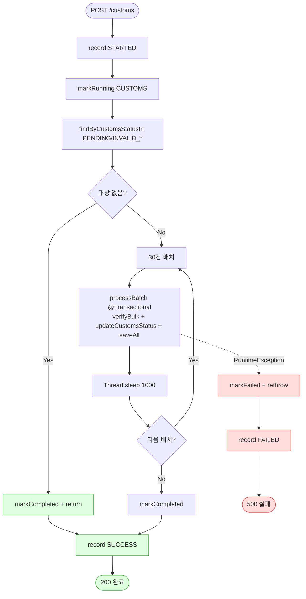

# POST /customs — 통관 상태 동기화 트리거

## 1. 개요

| 항목 | 내용 |
|------|------|
| **Method / URL** | `POST /api/v1/orders/sync/customs` (바디 없음) |
| **목적** | 통관번호가 있고 `PENDING`/`INVALID_*` 상태인 주문을 GSI Express로 벌크 검증(30건씩)하여 통관 상태를 갱신한다. |
| **핵심 상태전이** | 주문 `customsData.customsStatus`: `PENDING`/`INVALID_*` → 검증 결과(`VALID`/`INVALID_*`/`PENDING`) |
| **부수효과** | GSI Express 외부 검증 호출(30건 배치) + 배치별 독립 커밋. 배치 간 `Thread.sleep(1000)`. **오케스트레이션은 비트랜잭션(동기 실행)**, 실제 저장은 `CustomsBatchProcessor.processBatch`(@Transactional). |
| **응답** | `200 OK` + `{success:true, message:"완료"}` (동기 완료 후 반환) / 실패 시 `500` + `{success:false, message}` |

## 2. 호출 체인

```
OrderSyncController.syncCustomsOrders()                         api/.../controller/OrderSyncController.java:221-245  @PostMapping("/customs")
  ├─ actionLogService.record(CUSTOMS_SYNC, null, STARTED)       :225-226
  ├─ customsOrderSyncService.syncCustomsStatus()                :229   ★ 동기 실행(@Async 아님)
  │    └─ CustomsOrderSyncService.syncCustomsStatus()           core/.../order/service/CustomsOrderSyncService.java:40-93  (@Transactional 없음)
  │         ├─ syncStatusService.markRunning(CUSTOMS)           :43   (REQUIRES_NEW)
  │         ├─ orderRepository.findByCustomsData_CustomsStatusIn([PENDING, INVALID_PCCC, INVALID_PHONE, INVALID_ZIPCODE])  :48-53
  │         ├─ targetOrders.isEmpty() → markCompleted + return  :58-62
  │         └─ for (i += 30) 배치 루프:                          :68-82
  │              ├─ customsBatchProcessor.processBatch(batch)   :73   @Transactional(배치 독립 커밋)
  │              │    └─ CustomsBatchProcessor.processBatch()   core/.../order/service/CustomsBatchProcessor.java:37-47
  │              │         ├─ customsClearancePort.verifyBulk(batch)  :39
  │              │         ├─ order.updateCustomsStatus(status, verifiedPerson)  :43
  │              │         └─ orderRepository.saveAll(batch)    :46
  │              └─ Thread.sleep(1000) (트랜잭션 밖)             :77
  │         ├─ markCompleted(CUSTOMS)                           :85-86
  │         └─ catch RuntimeException → markFailed + rethrow    :87-92  ★ rethrow 함
  ├─ actionLogService.record(CUSTOMS_SYNC, null, SUCCESS)       :231-232  (동기 완료 후)
  └─ (catch Exception) actionLogService.record(..., FAILED)     :239-240
```

**요청 바디** — 없음.

## 3. 유스케이스 다이어그램


## 4. 시퀀스 다이어그램



## 5. 순서도 (플로우차트)



## 6. 상태 전이표

| 진입 통관상태 | 허용? | 결과 상태 | 외부 전송 | 비고 |
|-----------|:-----:|-----------|-----------|------|
| `PENDING` | ✅ | 검증 결과(`VALID`/`INVALID_*`/`PENDING`) | verifyBulk | 결과맵 미싱 시 `pending()` 유지(:41-42) |
| `INVALID_PCCC`/`INVALID_PHONE`/`INVALID_ZIPCODE` | ✅ | 재검증 결과 | verifyBulk | 재검증 대상(:48-53) |
| `VALID` | — | 미변경 | — | 조회 대상에서 제외(스킵) |
| 통관번호 없음(空) | — | 미변경 | — | 서비스 주석상 스킵 대상(주석 :29) |

> 배치 단위 독립 커밋 — 중간 배치 실패 시 rethrow 되나 앞선 커밋된 배치의 진행은 보존(F-SYNC-20).

## 7. 🔎 발견사항

### SYNCB-10 · 🟠 GAP — 통관번호 유무 필터가 상태 쿼리에 없음(주석과 코드 불일치 가능)
- **근거:** 서비스 주석 `CustomsOrderSyncService.java:29,45-47` 은 "통관번호가 없거나 空白이면 스킵, 통관번호가 있고 PENDING/INVALID인 주문만 대상"이라 명시하나, 실제 쿼리 `:48-53` 은 `findByCustomsData_CustomsStatusIn(...)` 로 **상태만** 필터링한다. 통관번호 null/공백 여부는 쿼리에서 걸러지지 않는다.
- **영향:** 통관번호가 비어 있는데 상태가 `PENDING`인 주문도 검증 대상에 포함돼 `verifyBulk` 로 넘어간다. GSI Express가 빈 통관번호를 어떻게 처리하는지에 따라 무의미한 외부 호출·불필요한 배치 팽창이 발생할 수 있다(주석이 약속한 스킵이 실코드에 없음).
- **제안:** 리포지토리 쿼리에 통관번호 non-blank 조건 추가하거나, `verifyBulk` 진입 전 필터링. 주석과 실제 계약 일치.

### SYNCB-11 · 🟠 GAP — `markCompleted`/`markFailed`(REQUIRES_NEW)와 배치 커밋 사이 상태-데이터 정합 취약
- **근거:** 오케스트레이션은 비트랜잭션이고 각 배치는 독립 커밋(`CustomsBatchProcessor.java:37`), 상태 기록은 `SyncStatusService` REQUIRES_NEW(:43/:85/:89). 중간 배치에서 `RuntimeException` 발생 시 `:87-92` 에서 `markFailed` + rethrow 하지만, **그 전까지 커밋된 배치는 이미 통관상태가 갱신된 채로 남는다.** 상태는 `FAILED`인데 데이터 일부는 갱신된 혼합 상태.
- **영향:** `/status` 조회는 `FAILED`로 보이나 실제로는 일부 주문이 검증 완료돼 있어, 재실행 시 이미 `VALID`가 된 건은 다시 대상에서 빠진다(멱등성은 있으나 상태 신호가 부분 성공을 표현 못 함). 부분 실패가 "완전 실패"로 오인될 수 있다.
- **제안:** 부분 성공/실패를 표현하는 상태(예: 처리 건수·실패 배치 인덱스)를 남기거나, 실패 시에도 진행분을 별도로 표면화.

### SYNCB-12 · 🟡 SMELL — 배치 크기·딜레이·검증 대상 상태 집합이 하드코딩
- **근거:** `CustomsOrderSyncService.java:17-19` `VERIFICATION_BATCH_SIZE=30`, `BATCH_DELAY_MS=1000`, 그리고 대상 상태 리스트 `:49-53` 가 코드에 고정.
- **영향:** 외부 사이트 부하·응답속도 변화에 튜닝 불가. 새로운 INVALID 상태 추가 시 이 리스트 수정 누락 위험.
- **제안:** 설정값 외부화, 대상 상태를 enum 헬퍼(예: `CustomsStatus.retryable()`)로 중앙화.

## 8. 테스트 커버리지 메모

- `CustomsSyncTransactionBoundaryTest`(:41, 테스트 4개) — 오케스트레이션 비트랜잭션·배치 독립 커밋 경계(F-SYNC-19/20) 검증. `sleep`이 트랜잭션을 물지 않는지, 배치 단위 커밋으로 부분 진행 보존되는지 확인.
- `SyncServiceSelfRecordsStatusTest` — 동기화 서비스가 자기 상태를 스스로 기록(markRunning/Completed/Failed)하는지 검증(F-SYNC-2).
- `OrderSyncControllerActionLogTest`(:76-127 부근) — `/customs` STARTED/SUCCESS/FAILED 기록 계약(동기 경로라 정확).
- **비어있는 케이스:** ① 통관번호 없는 PENDING 주문의 대상 포함 여부(SYNCB-10), ② 중간 배치 실패 시 상태-데이터 혼합(SYNCB-11), ③ 대상 0건 조기 종료(:58-62), ④ 결과맵 미싱 → `pending()` 폴백(`CustomsBatchProcessor.java:41-42`).

---
*생성: 2026-07-17 · 근거: 현재 워킹트리*
