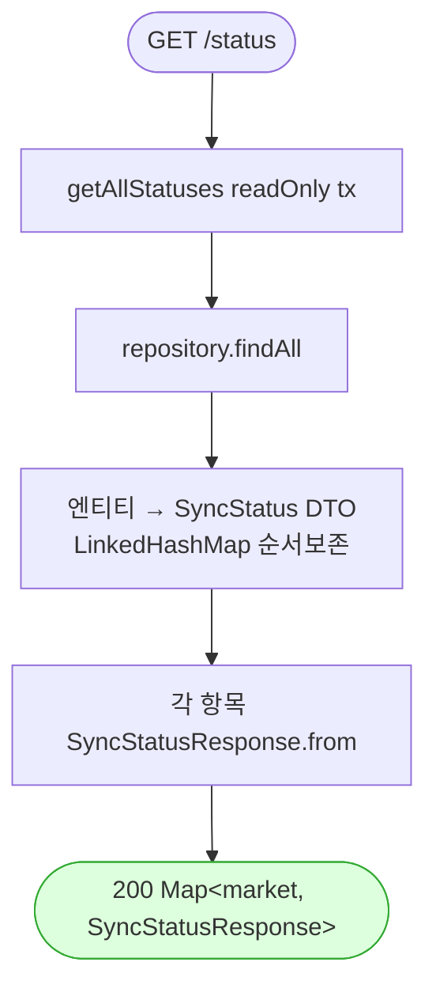

# GET /status — 마켓 동기화 상태 조회

## 1. 개요

이 기능을 한마디로 하면: **각 마켓의 주문·정산·통관 동기화가 지금 어떤 상태인지(돌고 있는지, 끝났는지, 실패했는지)를 한 번에 조회하는 현황판**입니다. 아무것도 바꾸지 않고, 지금 저장돼 있는 상태 값을 그대로 읽어서 보여줍니다.

| 항목 | 내용(쉬운 설명) |
|------|------|
| **Method / URL** | `GET /api/v1/orders/sync/status` (파라미터 없음) — 이 주소로 조회하며, 보낼 값은 없습니다. |
| **목적** | 마켓별 동기화 상태(`RUNNING`=진행 중 / `COMPLETED`=완료 / `FAILED`=실패, 마지막 동기 시각, 에러 메시지)를 조회합니다. |
| **핵심 상태전이** | 상태 전이 없음(읽기만 하는 조회). → 아무것도 바꾸지 않습니다. |
| **부수효과** | 없습니다. `sb_market_sync_status` 테이블을 통째로 읽기만 합니다(읽기 전용). |
| **응답** | `200 OK` + `마켓별 상태 목록`(마켓 이름 → 상태 정보). 목록의 순서는 그대로 유지됩니다(LinkedHashMap). |

## 2. 호출 체인

아래는 이 기능이 거치는 코드 흐름입니다. `파일:라인`은 실제 위치이고, 뒤에 쉽게 풀어 적었습니다.

```
OrderSyncController.getSyncStatus()                             api/.../controller/OrderSyncController.java:248-256  @GetMapping("/status")
  ├─ new LinkedHashMap<String, SyncStatusResponse>()           :252  (순서 보존)
  ├─ syncStatusService.getAllStatuses()                        :253
  │    └─ SyncStatusService.getAllStatuses()                   core/.../sync/SyncStatusService.java:99-110  @Transactional(readOnly=true)
  │         └─ repository.findAll() → 각 엔티티를 SyncStatus DTO로 매핑  :102-108
  │              └─ MarketSyncStatusRepository.findAll()        core/.../domain/sync/repository/MarketSyncStatusRepository.java
  └─ forEach → SyncStatusResponse.from(status)                 :254
       └─ SyncStatusResponse.from()                            api/.../dto/sync/SyncStatusResponse.java:19-25  (marketType/status/lastSyncAt/errorMessage 미러)
```

쉽게 풀어 읽으면:
- **입구(Controller)** — 결과를 담을 빈 목록을 만드는데, 넣은 순서가 흐트러지지 않는 형태(LinkedHashMap)로 만듭니다.
- **상태 전부 가져오기(getAllStatuses)** — 서비스가 DB에서 마켓 동기화 상태를 전부 읽어옵니다(읽기 전용). → 읽어온 각 줄을 내부용 상태 객체로 한번 옮겨 담습니다.
- **응답 형태로 변환** — 컨트롤러가 그 상태들을 화면에 내보낼 응답 형태(`SyncStatusResponse`)로 하나씩 옮겨 담아 돌려줍니다.

**요청 바디** — 없음.

## 3. 유스케이스 다이어그램

👉 이 그림은 "운영자나 프론트 화면이 이 기능을 부르면, 시스템이 동기화 상태 테이블을 읽어 마켓별 현황을 돌려준다"는 단순한 큰 그림을 보여줍니다.


## 4. 시퀀스 다이어그램

👉 이 그림은 "요청 → 상태 전부 조회 → 내부 형태로 변환 → 응답 형태로 다시 변환 → 돌려주기" 순서를 시간 흐름대로 보여줍니다.

```mermaid
sequenceDiagram
    autonumber
    actor U as 프론트/운영자
    participant C as OrderSyncController
    participant S as SyncStatusService
    participant R as MarketSyncStatusRepository
    participant D as SyncStatusResponse
    Note over S: getAllStatuses 는 @Transactional(readOnly=true)

    U->>C: GET /status
    C->>S: getAllStatuses()
    S->>R: findAll()
    R-->>S: List&lt;MarketSyncStatus&gt;
    S->>S: 각 엔티티 → SyncStatus DTO (LinkedHashMap)
    S-->>C: Map&lt;market, SyncStatus&gt;
    loop 각 항목
        C->>D: SyncStatusResponse.from(status)
    end
    C-->>U: 200 Map&lt;market, SyncStatusResponse&gt;
```

## 5. 순서도 (플로우차트)

👉 이 그림은 "요청 → 읽기 전용 조회 → DB 전건 읽기 → 내부 형태 변환(순서 유지) → 응답 형태 변환 → 200"으로 이어지는 단순한 한 줄기 흐름을 보여줍니다.



## 6. 상태 전이표

이 기능은 데이터를 바꾸지 않는 "읽기 전용"이라 바뀌는 상태가 없습니다.

| 진입 상태 | 허용? | 결과 상태 | 부수효과 | 비고 |
|-----------|:-----:|-----------|-----------|------|
| — | — | — | — | **상태 전이 없음(조회)** — `sb_market_sync_status` 를 읽기만 합니다. 상태를 바꾸지 않고 지금 값을 그대로 돌려줍니다. |

## 7. 🔎 발견사항

### SYNCB-13 · 🔵 NOTE — 이중 매핑(엔티티 → 내부 `SyncStatus` DTO → `SyncStatusResponse`)
- **무엇이 문제인가:** DB에서 읽은 상태를 화면에 내보내기까지, 같은 4개 값을 두 번 옮겨 담습니다. 먼저 서비스가 내부용 객체로 옮기고, 컨트롤러가 다시 응답용 객체로 옮깁니다.
- **근거:** `SyncStatusService.getAllStatuses()`(`SyncStatusService.java:102-108`)가 엔티티를 내부 정적클래스 `SyncStatus` 로 한 번 매핑하고, 컨트롤러(`OrderSyncController.java:254`)가 다시 `SyncStatusResponse.from()` 으로 미러한다. `SyncStatusResponse.from`(`SyncStatusResponse.java:19-25`)의 매핑 필드는 내부 `SyncStatus` 와 동일하다.
- **왜 문제인가:** 같은 4개 값을 두 번 옮기는 겹치는 작업입니다(내부 클래스가 밖으로 새어나가지 않게 막느라 생긴 잔여 비용, F-SYNC-24). 지금 동작에는 문제가 없지만, 나중에 항목을 하나 추가하면 두 곳을 다 같이 고쳐야 해 실수가 나기 쉽습니다.
- **어떻게 고치면 되나:** 서비스가 곧바로 응답용 객체를 돌려주도록 단순화하는 걸 검토합니다. 지금 계약을 지키는 게 우선이면 그대로 두고 문서로 남깁니다.

### SYNCB-14 · 🔵 NOTE — 상태 조회에 인증/권한 게이트 부재(`@CrossOrigin(origins="*")`)
- **무엇이 문제인가:** 이 상태 조회는 별도의 로그인·권한 확인 없이 열려 있고, 어디서든 부를 수 있게 설정돼 있습니다(`@CrossOrigin(origins="*")`). 응답에는 외부 API 실패 원문이 담긴 에러 메시지(`errorMessage`)가 포함될 수 있습니다.
- **근거:** 컨트롤러 클래스 `OrderSyncController.java:34` `@CrossOrigin(origins = "*")`, `/status` 는 별도 인증 어노테이션 없이 노출. 응답에 `errorMessage`(외부 API 실패 원문)가 포함될 수 있다(`SyncStatusService.java:107`).
- **왜 문제인가:** 이 프로젝트는 보안을 중요하게 두지 않기로 사용자가 정했으므로 당장의 결함은 아닙니다. 다만 에러 메시지에 내부 오류 조각이나 외부 응답 일부가 드러날 여지가 있습니다.
- **어떻게 고치면 되나:** 필요하면 에러 메시지를 어디까지 보여줄지(운영자 전용으로 가릴지) 검토합니다. 현재 정책상으로는 참고(NOTE)로만 남깁니다.

## 8. 테스트 커버리지 메모

- `SyncStatusServiceTest`(:22, 테스트 4개) — "실행중/완료/실패로 표시하기"와 "전체 조회"가 제대로 동작하는지, 상태를 새로 넣거나 갱신하는 처리가 맞는지 확인합니다. 상태가 DB 한 곳에 저장돼 여러 JVM이 공유한다는 약속도 확인합니다(F-SYNC-1).
- `SyncStatusTryMarkRunningTest` — "지금 실행 중" 표시를 겹치지 않게 찍는 로직을 확인합니다(이 조회 기능과 직접 관련은 없지만 같은 서비스).
- `SyncStatusResponse` 의 `from()` 변환이 값을 그대로 옮기는지 직접 확인하는 테스트는 찾지 못했습니다(`ResponseDtoContractTest`가 있으나 이 항목을 포함하는지 미확인).
- **아직 확인 안 하는 경우(빈 케이스):** ① 조회 결과의 순서가 응답까지 그대로 유지되는지, ② 테이블이 비었을(마켓 0건) 때 빈 목록을 돌려주는지, ③ `SyncStatusResponse.from` 이 값을 정확히 옮기는지.

---
*(쉬운 설명판 · 2026-07-17 재작성)*
*생성: 2026-07-17 · 근거: 현재 워킹트리*
