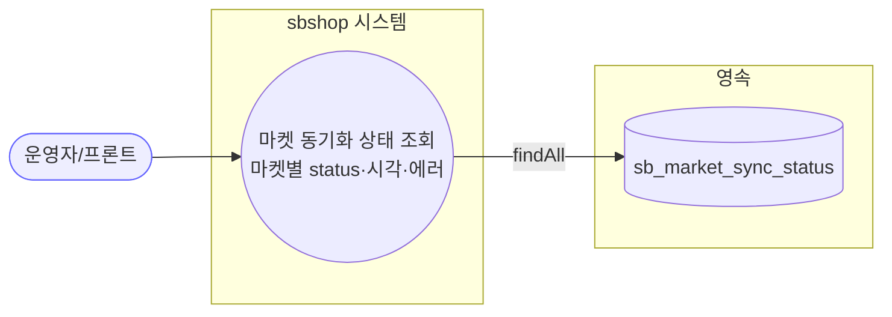

# GET /status — 마켓 동기화 상태 조회

## 1. 개요

| 항목 | 내용 |
|------|------|
| **Method / URL** | `GET /api/v1/orders/sync/status` (파라미터 없음) |
| **목적** | 마켓별 주문/정산/통관 동기화 상태(`RUNNING`/`COMPLETED`/`FAILED`, 마지막 동기 시각·에러 메시지)를 조회한다. |
| **핵심 상태전이** | 상태 전이 없음(읽기 전용 조회) |
| **부수효과** | 없음. `sb_market_sync_status` 테이블 전건 조회(readOnly 트랜잭션). |
| **응답** | `200 OK` + `Map<String(marketType), SyncStatusResponse>` (순서 보존 LinkedHashMap) |

## 2. 호출 체인

```
OrderSyncController.getSyncStatus()                             api/.../controller/OrderSyncController.java:248-256  @GetMapping("/status")
  ├─ new LinkedHashMap<String, SyncStatusResponse>()           :252  (순서 보존)
  ├─ syncStatusService.getAllStatuses()                        :253
  │    └─ SyncStatusService.getAllStatuses()                   core/.../sync/SyncStatusService.java:99-110  @Transactional(readOnly=true)
  │         └─ repository.findAll() → 각 엔티티를 SyncStatus DTO로 매핑  :102-108
  │              └─ MarketSyncStatusRepository.findAll()        core/.../domain/sync/repository/MarketSyncStatusRepository.java
  └─ forEach → SyncStatusResponse.from(status)                 :254
       └─ SyncStatusResponse.from()                            api/.../dto/sync/SyncStatusResponse.java:19-25  (marketType/status/lastSyncAt/errorMessage 미러)
```

**요청 바디** — 없음.

## 3. 유스케이스 다이어그램



## 4. 시퀀스 다이어그램

```mermaid
sequenceDiagram
    autonumber
    actor U as 프론트/운영자
    participant C as OrderSyncController
    participant S as SyncStatusService
    participant R as MarketSyncStatusRepository
    participant D as SyncStatusResponse
    Note over S: getAllStatuses 는 @Transactional(readOnly=true)

    U->>C: GET /status
    C->>S: getAllStatuses()
    S->>R: findAll()
    R-->>S: List&lt;MarketSyncStatus&gt;
    S->>S: 각 엔티티 → SyncStatus DTO (LinkedHashMap)
    S-->>C: Map&lt;market, SyncStatus&gt;
    loop 각 항목
        C->>D: SyncStatusResponse.from(status)
    end
    C-->>U: 200 Map&lt;market, SyncStatusResponse&gt;
```

## 5. 순서도 (플로우차트)


## 6. 상태 전이표

| 진입 상태 | 허용? | 결과 상태 | 부수효과 | 비고 |
|-----------|:-----:|-----------|-----------|------|
| — | — | — | — | **상태 전이 없음(조회)** — `sb_market_sync_status` 읽기 전용. 상태를 변경하지 않고 현재 값을 그대로 반환한다. |

## 7. 🔎 발견사항

### SYNCB-13 · 🔵 NOTE — 이중 매핑(엔티티 → 내부 `SyncStatus` DTO → `SyncStatusResponse`)
- **근거:** `SyncStatusService.getAllStatuses()`(`SyncStatusService.java:102-108`)가 엔티티를 내부 정적클래스 `SyncStatus` 로 한 번 매핑하고, 컨트롤러(`OrderSyncController.java:254`)가 다시 `SyncStatusResponse.from()` 으로 미러한다. `SyncStatusResponse.from`(`SyncStatusResponse.java:19-25`)의 매핑 필드는 내부 `SyncStatus` 와 동일하다.
- **영향:** 동일 4필드를 두 번 옮긴다(F-SYNC-24로 내부클래스 직접 노출을 막은 결과의 잔여 비용). 기능 문제는 없으나 필드 추가 시 두 곳을 함께 고쳐야 한다.
- **제안:** 서비스가 곧바로 응답 DTO(또는 record 프로젝션)를 반환하도록 단순화 검토. 계약 보존이 우선이면 현행 유지 + 문서화.

### SYNCB-14 · 🔵 NOTE — 상태 조회에 인증/권한 게이트 부재(`@CrossOrigin(origins="*")`)
- **근거:** 컨트롤러 클래스 `OrderSyncController.java:34` `@CrossOrigin(origins = "*")`, `/status` 는 별도 인증 어노테이션 없이 노출. 응답에 `errorMessage`(외부 API 실패 원문)가 포함될 수 있다(`SyncStatusService.java:107`).
- **영향:** 프로젝트 정책상 보안 비중요(사용자 명시)라 즉시 결함은 아니나, `errorMessage`에 내부 스택/외부 응답 조각이 노출될 여지가 있다.
- **제안:** 필요 시 `errorMessage` 노출 범위를 검토(운영자 전용 필드로 마스킹 여부). 현 정책상 NOTE로만 기록.

## 8. 테스트 커버리지 메모

- `SyncStatusServiceTest`(:22, 테스트 4개) — `markRunning`/`markCompleted`/`markFailed`/`getAllStatuses` 의 upsert·상태 전이·조회를 검증. DB 단일 원본(교차 JVM 공유) 계약 확인(F-SYNC-1).
- `SyncStatusTryMarkRunningTest` — 원자 클레임(`tryMarkRunning`) 검증(이 엔드포인트와 직접 관련은 없으나 같은 서비스).
- `SyncStatusResponse` 의 `from()` 미러 계약을 직접 검증하는 테스트는 검색되지 않음(`ResponseDtoContractTest` 존재하나 이 record 포함 여부 미확인).
- **비어있는 케이스:** ① `getAllStatuses` 의 LinkedHashMap 순서 보존이 컨트롤러 응답까지 유지되는지, ② 빈 테이블(마켓 0건) 시 빈 맵 반환, ③ `SyncStatusResponse.from` 필드 매핑 정합.

---
*생성: 2026-07-17 · 근거: 현재 워킹트리*
