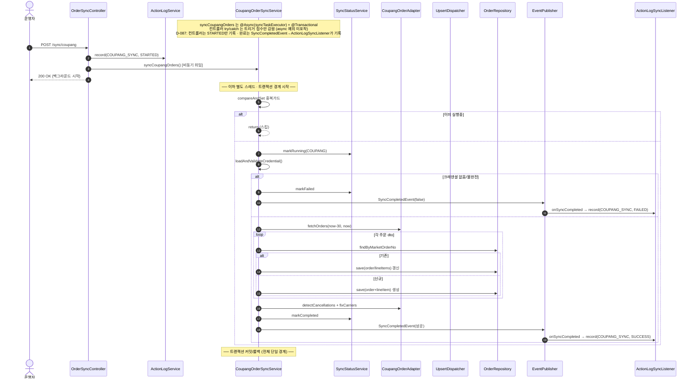
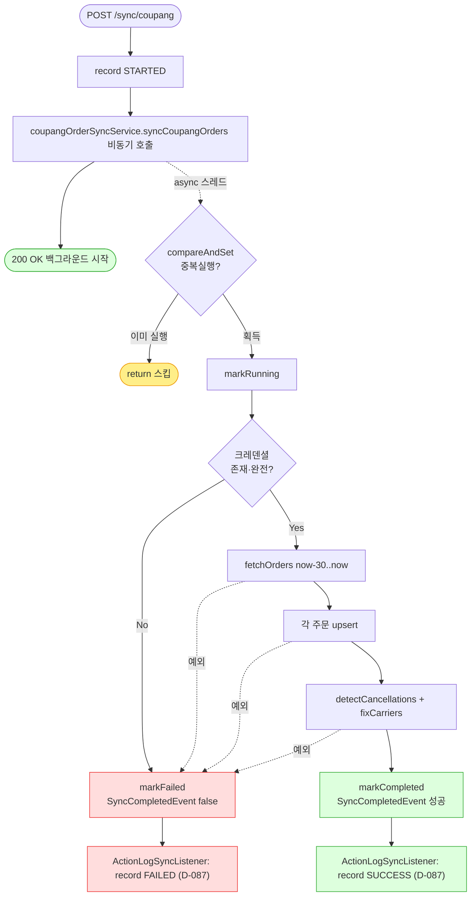

# POST /api/v1/orders/sync/coupang — 쿠팡 주문 동기화 트리거

## 1. 개요

| 항목 | 내용 |
|------|------|
| **Method / URL** | `POST /api/v1/orders/sync/coupang` (바디 없음) |
| **목적** | 쿠팡 주문을 최근 30일 범위로 조회해 upsert(신규 생성/기존 갱신)하고, 취소감지·택배사 보정까지 백그라운드에서 수행한다. |
| **핵심 상태전이** | 주문 라인아이템 `shippingStatus`를 마켓 응답값으로 갱신(신규는 마켓상태로 생성). 취소감지 시 `→ CANCELED`. |
| **부수효과** | 외부 쿠팡 API 호출, DB upsert, 정산액 초기계산(FeePolicy), `vendorItemId` 보강, SSE(`SyncCompletedEvent`), 동기화 상태 테이블 갱신, 액션로그 기록. |
| **실행 모델** | 서비스 진입점이 `@Async("syncTaskExecutor")` + `@Transactional` → 컨트롤러는 **트리거(STARTED 기록)만** 하고 즉시 200 반환. 실제 동기화는 별도 스레드. 완료(SUCCESS/FAILED) 액션로그는 `SyncCompletedEvent`→`ActionLogSyncListener`가 기록(D-087에서 컨트롤러 가짜 SUCCESS 제거). |
| **응답** | `200 OK` `{success:true, message:"...백그라운드에서 시작..."}` (트리거 접수 성공). 트리거 실패 시 `500`. |

## 2. 호출 체인

```
OrderSyncController.syncCoupangOrders()                       api/.../controller/OrderSyncController.java:54-80
  ├─ ActionLogService.record(COUPANG_SYNC, STARTED)           OrderSyncController.java:58 → core/.../actionlog/ActionLogService.java:29
  ├─ CoupangOrderSyncService.syncCoupangOrders()  @Async @Transactional   OrderSyncController.java:62 → core/.../order/service/CoupangOrderSyncService.java:56-95
  │    ├─ isSyncing.compareAndSet(false,true) 중복 가드        CoupangOrderSyncService.java:60-63
  │    ├─ syncStatusService.markRunning(COUPANG)              :66 → sync/SyncStatusService.java:28
  │    ├─ loadAndValidateCredential()                         :70 / :176-186 (없거나 불완전 → IllegalArgumentException)
  │    ├─ coupangOrderAdapter.fetchOrders(cred, now-30, now)  :72-73 (외부 쿠팡 API)
  │    ├─ processOrders(orders, cred)                         :75 / :189-194
  │    │    └─ MarketOrderUpsertDispatcher.dispatch(...)      :192 → order/service/MarketOrderUpsertDispatcher.java:33-52
  │    │         ├─ findByMarketOrderNo → 존재 → updateExistingOrder  Dispatcher.java:41-46 / Coupang:197-209
  │    │         │     ├─ updateLineItemFromDto (trackingSentToMarket 가드)  :212-228
  │    │         │     └─ updateOrderInfoFromDto (progressed 시 주소보호)     :231-248
  │    │         └─ 없음 → createNewOrder                     Dispatcher.java:47-49 / Coupang:251-259
  │    │               ├─ buildOrderFromDto                   :262-277
  │    │               └─ buildLineItemFromDto (marketFeeService.settlementAmount)  :280-301 → fee/MarketFeeService.java:43
  │    ├─ postSyncProcess(orders)                             :77 / :350-357
  │    │    ├─ coupangOrderAdapter.detectCancellations(...)   :354 (API 부재 주문 → CANCELED)
  │    │    └─ coupangOrderAdapter.fixCarriers(orders)        :356
  │    ├─ (성공) markCompleted + SyncCompletedEvent           :84 / :94-96
  │    └─ (실패) catch → markFailed + SyncCompletedEvent(false)  :85-90
  │         └─ (완료 기록) ActionLogSyncListener.onSyncCompleted → record(COUPANG_SYNC, SUCCESS/FAILED)  core/.../actionlog/ActionLogSyncListener.java:22-34
  └─ (D-087) 컨트롤러는 STARTED만 기록 — 트리거 직후 SUCCESS 기록은 제거됨(:63 주석). 완료는 SyncCompletedEvent→ActionLogSyncListener가 기록.
       (동기 디스패치 실패 시에만 catch → record(FAILED))     OrderSyncController.java:68-78
```

**요청 바디:** 없음. 파라미터 없음 — 조회 범위는 서비스가 `now-30 ~ now`로 고정(`CoupangOrderSyncService.java:73`).

## 3. 유스케이스 다이어그램


## 4. 시퀀스 다이어그램



## 5. 순서도 (플로우차트)



## 6. 상태 전이표

| 진입 라인상태 | 조건 | 결과 상태 | 마켓 전송 | 비고 |
|-----------|------|-----------|-----------|------|
| (신규 주문) | 마켓 응답 | 마켓상태로 생성 | 조회만 | `buildLineItemFromDto`가 `dto.getStatus()` 그대로 설정(:293) |
| 기존 · 임의 상태 | 마켓 응답 존재 | 마켓상태로 갱신 | 조회만 | `updateLineItemFromDto`가 `dto.getStatus()` 무조건 반영(:225) — 진입 상태 가드 없음 |
| 기존 · non-terminal | API 응답에 부재 | `CANCELED` | detectCancellations | 어댑터가 처리(:354) |
| 기존 · terminal(DELIVERED 등) | API 응답에 부재 | 미변경 | — | 어댑터 detectCancellations의 terminal 제외 로직에 의존 |
| trackingNo/carrier | `trackingSentToMarket != true` | 트래킹 보존 | — | 마켓에 아직 전송 안 한 송장은 API값으로 안 덮음(:218-227) |

## 7. 🔎 발견사항

### SYNCA-1 · 🟠 GAP — 컨트롤러 try/catch·FAILED 기록이 async 예외를 포착하지 못함(항상 SUCCESS 기록)
> ✅ **해결됨** (D-087, 커밋 c4c7faa) — 컨트롤러의 트리거 직후 `record(SUCCESS)`(구 :64)를 제거해 컨트롤러는 STARTED만 남기고, 실제 완료(SUCCESS/FAILED)는 기존 `SyncCompletedEvent`→`ActionLogSyncListener` 경로에 위임했다(중복 제거·정합화).
- **근거:** `CoupangOrderSyncService.syncCoupangOrders`는 `@Async("syncTaskExecutor")` + `void` 반환(`CoupangOrderSyncService.java:59-61`). 컨트롤러(`OrderSyncController.java:60-79`)는 이 호출을 try로 감싸고 정상 반환 시 `record(...SUCCESS)`(구 :64), 예외 시 `record(...FAILED)`(:72)를 하지만, `@Async` 위임은 즉시 반환하므로 동기화 본문에서 던지는 예외는 **다른 스레드**에서 발생해 이 catch에 절대 도달하지 않는다.
- **영향:** 실제 동기화가 실패해도 액션로그에는 항상 `COUPANG_SYNC SUCCESS`가 남았다. `record(FAILED)`(:72)는 사실상 데드코드(트리거 자체가 즉시 실패할 때만 도달). 운영자는 액션로그만으로는 동기화 성공/실패를 구분할 수 없고 실제 결과는 `SyncCompletedEvent`/동기화 상태 테이블(`/status`)로만 알 수 있었다.
- **제안:** 액션로그 SUCCESS/FAILED 기록을 서비스 본문(markCompleted/markFailed 지점, `CoupangOrderSyncService.java:84`·`:87`)으로 이동하거나, 컨트롤러 로그 메시지를 "접수됨"으로 명확히 하고 SUCCESS 표기를 "요청 완료"가 아닌 "트리거 접수"로 정정. (반영됨 — 컨트롤러 가짜 SUCCESS 제거, 완료는 `ActionLogSyncListener`가 기록.)

### SYNCA-2 · 🟡 SMELL — 장시간 외부 동기화 전체가 단일 `@Transactional` 경계
- **근거:** `syncCoupangOrders`가 `@Transactional`(`CoupangOrderSyncService.java:57`) 하나로 `fetchOrders`(외부 API, :72)·전체 주문 upsert(:75)·`postSyncProcess`(취소감지·택배사보정, :77)를 감싼다.
- **영향:** ① DB 커넥션·트랜잭션이 외부 API 왕복 시간만큼 열려 있어 커넥션 점유가 길다. ② 마지막 주문 처리나 postSyncProcess에서 예외가 나면 앞서 upsert한 **모든 주문 저장이 함께 롤백**된다(부분 성공 확정 불가). 마켓엔 이미 조회/보정 요청이 나갔을 수 있어 재실행 의존.
- **제안:** 주문(또는 배치) 단위 트랜잭션 분리를 검토. 최소한 외부 API 호출을 트랜잭션 밖으로 빼고 저장만 트랜잭션 안에서 수행.

### SYNCA-3 · 🔵 NOTE — 조회 범위 30일이 하드코딩되어 파라미터화되지 않음
- **근거:** `CoupangOrderSyncService.java:73` `LocalDate.now().minusDays(30)`. 컨트롤러는 바디·쿼리 파라미터를 받지 않는다(`OrderSyncController.java:55`).
- **영향:** 30일보다 오래 전 취소/변경은 감지 대상에서 벗어난다(detectCancellations도 동일 범위 :351). 재처리·백필이 필요할 때 코드 수정 없이 범위 조정 불가.
- **제안:** 의도된 운영 정책이면 문서화, 아니면 조회 범위를 설정값/파라미터로 외부화.

### SYNCA-4 · 🔵 NOTE — in-JVM `AtomicBoolean` 중복가드는 교차 JVM(워커+api)을 막지 못함
- **근거:** 주문 동기화 중복가드는 `isSyncing` `AtomicBoolean`(`CoupangOrderSyncService.java:53,60`)에 의존. 반면 정산 동기화(`syncCoupangSettlement`)는 같은 파일 :104에서 DB 원자 클레임(`tryMarkRunning`)을 쓴다고 주석(:101-103)으로 명시. 스케줄러(`worker/.../OrderSyncScheduler.java:49-53`)와 이 API 트리거는 서로 다른 JVM이다.
- **영향:** 워커 스케줄러와 API 수동 트리거가 거의 동시에 실행되면 두 JVM의 `AtomicBoolean`이 독립적이라 쿠팡 주문 동기화가 **동시 2회** 돌 수 있다(정산 경로만 교차 JVM 가드 보유). MEMORY의 2-JVM 토폴로지 전제와 상충.
- **제안:** 주문 동기화도 정산과 동일하게 DB advisory lock/`tryMarkRunning` 기반 교차 JVM 가드로 통일 검토.

## 8. 테스트 커버리지 메모

- **컨트롤러:** `OrderSyncControllerActionLogTest`가 D-087에서 새 계약(트리거=STARTED만 기록·SUCCESS는 컨트롤러가 남기지 않음·동기 디스패치 예외 시에만 FAILED)으로 재작성됨. 완료 SUCCESS/FAILED는 `ActionLogSyncListener`의 책임이라 컨트롤러 단위 테스트 범위 밖(SYNCA-1 해소로 컨트롤러의 가짜 SUCCESS 자체가 사라짐).
- **서비스:** `CoupangOrderProductMappingTest`(D-046 sellerProductId 역조회·vendorItemId 보강), `OrderAddressProtectionTest`(progressed 주소 보호), `MarketCredentialValidationTest`(불완전 크레덴셜 fast-fail), `OrderSyncEventEmissionTest`(실패 시 성공 이벤트 미발행), `SyncServiceSelfRecordsStatusTest`(markRunning→markCompleted/markFailed).
- **비어있는 케이스:** ① 단일 트랜잭션 부분실패 롤백(SYNCA-2), ② 교차 JVM 중복실행(SYNCA-4), ③ detectCancellations/fixCarriers는 어댑터 계층 테스트에 위임(여기선 미검증).

---
*생성: 2026-07-17 · 근거: 현재 워킹트리*
