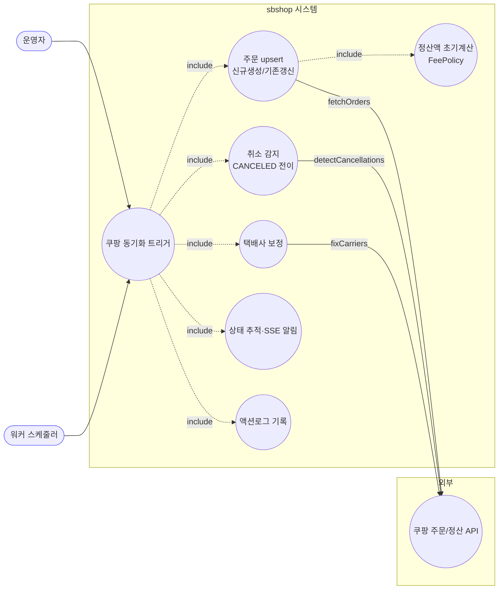
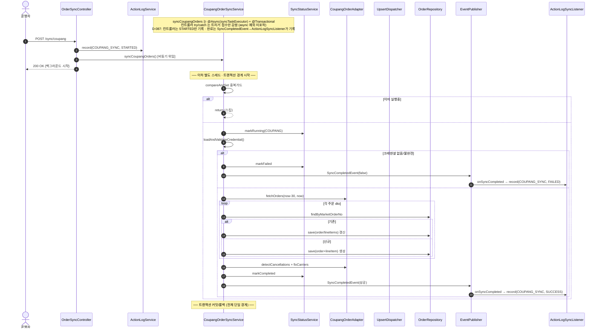

# POST /api/v1/orders/sync/coupang — 쿠팡 주문 동기화 시작

## 1. 개요

이 API는 "쿠팡에 들어온 주문을 우리 시스템으로 가져오는 작업을 시작해줘"라고 요청하는 버튼입니다. 요청을 받으면 곧바로 무거운 작업을 다 끝내고 답하는 게 아니라, "알겠다, 뒤에서 작업 시작할게"라고 먼저 답하고 실제 가져오기·저장은 백그라운드에서 따로 돌립니다.

| 항목 | 쉬운 설명 |
|------|------|
| **부르는 방법 / 주소** | `POST /api/v1/orders/sync/coupang` — 함께 보낼 내용(바디)은 없습니다. 그냥 "시작해줘"만 누르는 버튼입니다. |
| **무엇을 하나** | 쿠팡 주문을 최근 30일치 가져와서, 없던 주문은 새로 만들고 있던 주문은 최신 내용으로 갱신합니다(이걸 upsert라 합니다). 이어서 취소된 주문 찾기·택배사 정보 바로잡기까지 뒤에서 이어서 합니다. |
| **주문 상태가 어떻게 바뀌나** | 각 주문 상품의 배송상태(`shippingStatus`)를 쿠팡이 알려준 값으로 맞춥니다(새 주문은 쿠팡 상태 그대로 만들어집니다). 쿠팡에서 사라진 주문은 "취소됨(`CANCELED`)"으로 바꿉니다. |
| **덤으로 벌어지는 일(부수효과)** | 쿠팡 API를 실제로 호출하고, DB에 저장하고, 정산액을 처음 계산해두고(FeePolicy), 상품 식별값(`vendorItemId`)을 채워 넣고, 화면에 실시간 알림(SSE)을 보내고, 동기화 진행상태 표를 갱신하고, 운영 기록(액션로그)을 남깁니다. |
| **어떻게 돌아가나(실행 방식)** | 실제 동기화 함수는 "별도 스레드에서 돌리기(`@Async`)" + "하나의 저장 묶음(`@Transactional`)"으로 표시돼 있습니다. 그래서 요청을 받는 입구 코드(컨트롤러)는 "시작했다(STARTED)"만 기록하고 즉시 200(성공 접수)을 돌려줍니다. 진짜 성공/실패 기록은 백그라운드 작업이 끝날 때 이벤트(`SyncCompletedEvent`)를 통해 `ActionLogSyncListener`가 남깁니다. (예전에는 입구에서 무조건 성공이라 적던 걸 D-087에서 없앴습니다.) |
| **돌려주는 답** | `200 OK` 와 `{success:true, message:"...백그라운드에서 시작..."}` — "작업을 잘 접수했다"는 뜻입니다. 시작조차 못 하면 `500`. |

## 2. 호출 체인

아래는 이 버튼을 눌렀을 때 코드가 어떤 순서로 서로를 불러가며 일하는지를 위에서 아래로 늘어놓은 것입니다. 각 줄 끝의 `파일.java:줄번호`는 실제 코드 위치입니다.

```
OrderSyncController.syncCoupangOrders()                       api/.../controller/OrderSyncController.java:54-80
  ├─ ActionLogService.record(COUPANG_SYNC, STARTED)           OrderSyncController.java:58 → core/.../actionlog/ActionLogService.java:29
  ├─ CoupangOrderSyncService.syncCoupangOrders()  @Async @Transactional   OrderSyncController.java:62 → core/.../order/service/CoupangOrderSyncService.java:56-95
  │    ├─ isSyncing.compareAndSet(false,true) 중복 가드        CoupangOrderSyncService.java:60-63
  │    ├─ syncStatusService.markRunning(COUPANG)              :66 → sync/SyncStatusService.java:28
  │    ├─ loadAndValidateCredential()                         :70 / :176-186 (없거나 불완전 → IllegalArgumentException)
  │    ├─ coupangOrderAdapter.fetchOrders(cred, now-30, now)  :72-73 (외부 쿠팡 API)
  │    ├─ processOrders(orders, cred)                         :75 / :189-194
  │    │    └─ MarketOrderUpsertDispatcher.dispatch(...)      :192 → order/service/MarketOrderUpsertDispatcher.java:33-52
  │    │         ├─ findByMarketOrderNo → 존재 → updateExistingOrder  Dispatcher.java:41-46 / Coupang:197-209
  │    │         │     ├─ updateLineItemFromDto (trackingSentToMarket 가드)  :212-228
  │    │         │     └─ updateOrderInfoFromDto (progressed 시 주소보호)     :231-248
  │    │         └─ 없음 → createNewOrder                     Dispatcher.java:47-49 / Coupang:251-259
  │    │               ├─ buildOrderFromDto                   :262-277
  │    │               └─ buildLineItemFromDto (marketFeeService.settlementAmount)  :280-301 → fee/MarketFeeService.java:43
  │    ├─ postSyncProcess(orders)                             :77 / :350-357
  │    │    ├─ coupangOrderAdapter.detectCancellations(...)   :354 (API 부재 주문 → CANCELED)
  │    │    └─ coupangOrderAdapter.fixCarriers(orders)        :356
  │    ├─ (성공) markCompleted + SyncCompletedEvent           :84 / :94-96
  │    └─ (실패) catch → markFailed + SyncCompletedEvent(false)  :85-90
  │         └─ (완료 기록) ActionLogSyncListener.onSyncCompleted → record(COUPANG_SYNC, SUCCESS/FAILED)  core/.../actionlog/ActionLogSyncListener.java:22-34
  └─ (D-087) 컨트롤러는 STARTED만 기록 — 트리거 직후 SUCCESS 기록은 제거됨(:63 주석). 완료는 SyncCompletedEvent→ActionLogSyncListener가 기록.
       (동기 디스패치 실패 시에만 catch → record(FAILED))     OrderSyncController.java:68-78
```

→ 쉽게 말하면 이런 흐름입니다: ① 입구 코드가 "시작했다"고 먼저 기록한다 → ② 실제 동기화를 백그라운드로 떠넘긴다 → ③ 백그라운드는 "지금 다른 애가 이미 돌고 있나?"를 확인하고(중복 방지), 쿠팡 접속 열쇠(인증정보)가 제대로 있는지 검사한 뒤 → ④ 쿠팡에서 최근 30일 주문을 받아온다 → ⑤ 받아온 주문을 하나씩 "있으면 갱신, 없으면 새로 생성" → ⑥ 사라진 주문은 취소로 잡고 택배사 정보를 바로잡는다 → ⑦ 끝나면 성공/실패를 기록한다.

**요청 바디:** 없음. 파라미터도 없습니다. 조회할 기간은 코드가 알아서 "오늘로부터 30일 전 ~ 오늘"로 고정합니다(`CoupangOrderSyncService.java:73`).

## 3. 유스케이스 다이어그램

👉 이 그림은 "누가(운영자·워커 스케줄러) 이 동기화를 시작시키고, 그 안에서 어떤 일들이 벌어지며, 어디서 쿠팡 API를 부르는지"를 한눈에 보여줍니다.



## 4. 시퀀스 다이어그램

👉 이 그림은 "시간 순서대로" 누가 누구에게 무엇을 요청하는지를 보여줍니다. 특히 입구 코드는 곧바로 200을 돌려주고(빠른 응답), 실제 일은 별도 스레드에서 이어진다는 점, 그리고 성공/실패 기록이 맨 마지막에 이벤트를 통해 남는다는 점을 담고 있습니다.



## 5. 순서도 (플로우차트)

👉 이 그림은 "어떤 갈림길에서 어떻게 갈라지는지"를 보여줍니다. 이미 다른 동기화가 돌고 있으면 그냥 건너뛰고, 인증정보가 없으면 실패로 빠지고, 정상이면 받아오기→저장→취소감지→완료로 이어지는 길입니다.


## 6. 상태 전이표

이 표는 "주문 상품이 어떤 상태로 들어왔을 때, 어떤 조건이면, 어떤 상태로 바뀌는지"를 정리한 것입니다.

| 들어올 때 상태 | 조건 | 바뀐 뒤 상태 | 마켓에 뭔가 보내나 | 쉬운 설명 |
|-----------|------|-----------|-----------|------|
| (아예 새 주문) | 쿠팡이 알려줌 | 쿠팡 상태 그대로 새로 만듦 | 조회만(안 보냄) | 새 주문은 쿠팡이 준 상태값(`dto.getStatus()`)을 그대로 붙여 만듭니다(:293). |
| 기존 · 아무 상태나 | 쿠팡 응답에 있음 | 쿠팡 상태로 갱신 | 조회만 | 지금 상태가 뭐든 따지지 않고 쿠팡이 준 상태로 무조건 덮습니다(:225) — 들어올 때 상태를 막는 검사가 없습니다. |
| 기존 · 아직 안 끝난 주문 | 쿠팡 응답에서 사라짐 | `CANCELED`(취소됨) | detectCancellations | 쿠팡에서 빠진 주문은 취소로 봅니다. 어댑터가 처리(:354). |
| 기존 · 이미 끝난 주문(배송완료 등) | 쿠팡 응답에서 사라짐 | 그대로 둠 | — | 이미 끝난 주문은 취소로 바꾸지 않습니다. 어댑터의 "끝난 주문 제외" 규칙에 맡깁니다. |
| 송장번호/택배사 | 아직 마켓에 안 보낸 송장(`trackingSentToMarket != true`) | 우리 송장 유지 | — | 우리가 먼저 넣었지만 아직 마켓에 안 보낸 송장은 쿠팡 값으로 덮지 않고 지켜줍니다(:218-227). |

## 7. 🔎 발견사항

### SYNCA-1 · 🟠 GAP — 입구 코드의 성공/실패 기록이 백그라운드 예외를 못 잡아, 실제 실패해도 늘 "성공"으로 남던 문제
> ✅ **해결됨** (D-087, 커밋 c4c7faa) — 컨트롤러의 트리거 직후 `record(SUCCESS)`(구 :64)를 제거해 컨트롤러는 STARTED만 남기고, 실제 완료(SUCCESS/FAILED)는 기존 `SyncCompletedEvent`→`ActionLogSyncListener` 경로에 위임했다(중복 제거·정합화).
- **근거:** `CoupangOrderSyncService.syncCoupangOrders`는 `@Async("syncTaskExecutor")`로 별도 스레드에서 돌고 아무것도 돌려주지 않는(`void`) 함수입니다(`CoupangOrderSyncService.java:59-61`). 입구 코드(`OrderSyncController.java:60-79`)는 이 호출을 감싸서 정상이면 성공(구 :64), 예외면 실패(:72)를 적었지만, `@Async` 위임은 "떠넘기자마자 곧바로 돌아오기" 때문에 실제 동기화 도중 터진 오류는 **다른 스레드**에서 발생해 이 감싸기(try/catch)에 절대 닿지 못했습니다.
- **영향:** 그래서 실제 동기화가 실패해도 운영 기록에는 항상 `COUPANG_SYNC SUCCESS`만 남았습니다. 실패를 적는 `record(FAILED)`(:72)는 사실상 절대 실행되지 않는 죽은 코드였고(시작 자체가 즉시 실패할 때만 실행), 운영자는 기록만 봐서는 성공/실패를 구분할 수 없었습니다. 진짜 결과는 이벤트(`SyncCompletedEvent`)나 진행상태 표(`/status`)로만 알 수 있었습니다.
- **제안:** 성공/실패 기록을 백그라운드 작업의 끝나는 지점(markCompleted/markFailed, `CoupangOrderSyncService.java:84`·`:87`)으로 옮기거나, 입구 코드의 표현을 "요청 완료"가 아니라 "접수됨"으로 바로잡습니다. (반영됨 — 입구의 가짜 성공 기록을 없애고, 완료는 `ActionLogSyncListener`가 기록.)

### SYNCA-2 · 🟡 SMELL — 오래 걸리는 외부 동기화 전체가 하나의 저장 묶음(트랜잭션)으로 통째로 묶여 있음
- **근거:** `syncCoupangOrders`가 `@Transactional`(`CoupangOrderSyncService.java:57`) 하나로 쿠팡 API 호출(:72)·전체 주문 저장(:75)·후처리(취소감지·택배사보정, :77)를 전부 감쌉니다.
- **영향:** ① DB 연결과 저장 묶음이 외부 API를 왔다갔다 하는 시간 내내 계속 붙잡혀 있어 연결을 오래 점유합니다. ② 마지막 주문 처리나 후처리에서 오류가 나면 앞서 저장해둔 **모든 주문이 함께 취소(롤백)**됩니다(중간까지 성공한 걸 확정하지 못함). 게다가 마켓에는 이미 조회·보정 요청이 나갔을 수 있어 다시 돌려서 맞춰야 합니다.
- **제안:** 주문(또는 묶음) 단위로 저장 묶음을 쪼개는 것을 검토합니다. 최소한 외부 API 호출은 저장 묶음 밖으로 빼고 저장만 안에서 하도록 합니다.

### SYNCA-3 · 🔵 NOTE — 조회 기간 30일이 코드에 박혀 있어(하드코딩) 바깥에서 못 바꿈
- **근거:** `CoupangOrderSyncService.java:73`에 `LocalDate.now().minusDays(30)`으로 30일이 박혀 있습니다. 입구 코드는 기간을 지정하는 값을 아무것도 받지 않습니다(`OrderSyncController.java:55`).
- **영향:** 30일보다 더 오래 전에 취소·변경된 주문은 감지 대상에서 벗어납니다(취소감지도 같은 기간, :351). 나중에 밀린 데이터를 다시 채워넣고(백필) 싶어도 코드를 고치지 않으면 기간을 바꿀 수 없습니다.
- **제안:** 30일이 의도한 운영 정책이면 그렇게 문서로 남기고, 아니면 조회 기간을 설정값이나 파라미터로 바깥에서 조절할 수 있게 합니다.

### SYNCA-4 · 🔵 NOTE — 중복 실행 방지 장치가 한 프로그램(JVM) 안에서만 유효해, 워커+api 두 프로그램 동시 실행은 못 막음
- **근거:** 주문 동기화의 중복 방지는 `isSyncing`이라는 메모리 상의 스위치(`AtomicBoolean`, `CoupangOrderSyncService.java:53,60`)에 의존합니다. 반면 정산 동기화(`syncCoupangSettlement`)는 같은 파일 :104에서 DB에 원자적으로 "내가 지금 돈다"고 찜하는 방식(`tryMarkRunning`)을 쓴다고 주석(:101-103)에 명시돼 있습니다. 워커의 스케줄러(`worker/.../OrderSyncScheduler.java:49-53`)와 이 API 버튼은 서로 다른 프로그램(JVM)입니다.
- **영향:** 워커 스케줄러와 API 수동 버튼이 거의 동시에 실행되면, 두 프로그램의 메모리 스위치가 서로 남남이라 쿠팡 주문 동기화가 **동시에 2번** 돌 수 있습니다(정산 경로만 두 프로그램을 아우르는 방지 장치가 있음). 우리 시스템이 한 컨테이너에서 2개 프로그램으로 돈다는 전제와 어긋납니다.
- **제안:** 주문 동기화도 정산처럼 DB 기반 잠금(advisory lock/`tryMarkRunning`)으로 두 프로그램을 아우르는 중복 방지로 통일하는 걸 검토합니다.

## 8. 테스트 커버리지 메모

- **입구 코드(컨트롤러):** `OrderSyncControllerActionLogTest`가 D-087에서 새 약속(시작 시 STARTED만 기록·성공은 입구가 남기지 않음·시작 자체가 즉시 실패할 때만 FAILED)에 맞게 다시 작성됐습니다. 완료 성공/실패는 `ActionLogSyncListener`의 몫이라 입구 코드 단위 테스트의 범위 밖입니다(SYNCA-1이 해결되며 입구의 가짜 성공 자체가 사라짐).
- **서비스:** `CoupangOrderProductMappingTest`(상품 역조회·`vendorItemId` 보강, D-046), `OrderAddressProtectionTest`(진행된 주문의 주소 보호), `MarketCredentialValidationTest`(인증정보가 불완전하면 빨리 실패), `OrderSyncEventEmissionTest`(실패했을 때 성공 이벤트를 내보내지 않음), `SyncServiceSelfRecordsStatusTest`(markRunning→markCompleted/markFailed 진행상태 기록).
- **아직 테스트가 없는 부분:** ① 하나의 저장 묶음이라 부분 실패 시 전부 롤백되는 문제(SYNCA-2), ② 두 프로그램 동시 실행(SYNCA-4), ③ 취소감지·택배사보정은 어댑터 계층 테스트에 맡기고 여기서는 검증하지 않음.

---
*(쉬운 설명판 · 2026-07-17 재작성)*
*생성: 2026-07-17 · 근거: 현재 워킹트리*
