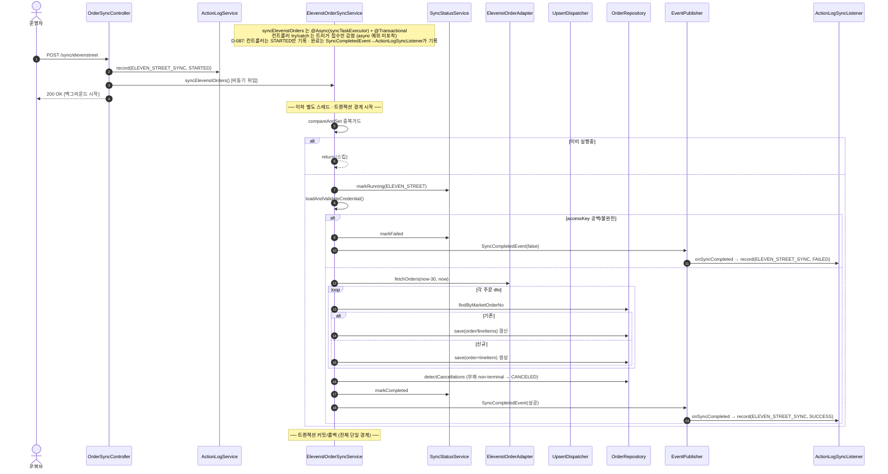
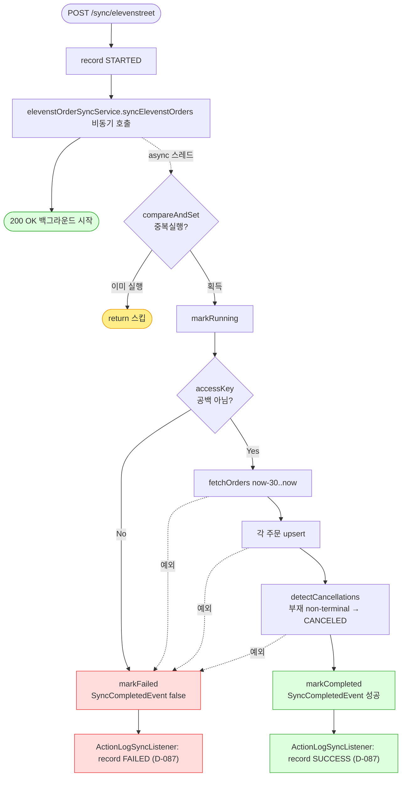

# POST /api/v1/orders/sync/elevenstreet — 11번가 주문 동기화 시작

## 1. 개요

이 API는 "11번가에 들어온 주문을 우리 시스템으로 가져오는 작업을 시작해줘"라고 요청하는 버튼입니다. 요청을 받으면 "알겠다, 뒤에서 시작할게"라고 먼저 답하고 실제 가져오기·저장은 백그라운드에서 따로 돌립니다. 11번가는 "응답에서 사라진, 아직 안 끝난 주문을 취소로 잡아주는" 취소감지를 갖추고 있습니다(D-028).

| 항목 | 쉬운 설명 |
|------|------|
| **부르는 방법 / 주소** | `POST /api/v1/orders/sync/elevenstreet` — 함께 보낼 내용(바디)은 없습니다. |
| **무엇을 하나** | 11번가 주문을 최근 30일치 가져와서 없던 주문은 새로 만들고 있던 주문은 갱신하고(upsert), 응답에서 빠진 "아직 안 끝난 주문"은 취소(CANCELED)로 잡아줍니다(D-028). |
| **주문 상태가 어떻게 바뀌나** | 각 주문 상품의 배송상태(`shippingStatus`)를 마켓이 준 값으로 맞춥니다. 응답에서 사라진 안 끝난 주문은 취소(`CANCELED`)로 바꿉니다. |
| **덤으로 벌어지는 일(부수효과)** | 11번가 API 호출, DB 저장, 정산액 초기계산(FeePolicy), 마켓 고유정보(`marketSpecificData`) 반영, 실시간 알림(SSE), 진행상태 표 갱신, 운영 기록(액션로그). |
| **어떻게 돌아가나(실행 방식)** | 실제 동기화 함수는 "별도 스레드(`@Async`)" + "하나의 저장 묶음(`@Transactional`)"으로 돌고, 입구 코드는 "시작했다(STARTED)"만 기록하고 즉시 200을 돌려줍니다. 진짜 성공/실패는 백그라운드가 끝날 때 이벤트(`SyncCompletedEvent`)를 통해 `ActionLogSyncListener`가 기록합니다(예전의 무조건 성공 기록은 D-087에서 제거). |
| **돌려주는 답** | `200 OK` 와 `{success:true, message:"...백그라운드에서 시작..."}`. 시작조차 못 하면 `500`. |

## 2. 호출 체인

아래는 이 버튼을 눌렀을 때 코드가 어떤 순서로 서로를 불러가며 일하는지를 위에서 아래로 늘어놓은 것입니다. 각 줄 끝의 `파일.java:줄번호`는 실제 코드 위치입니다.

```
OrderSyncController.syncElevenStreetOrders()                  api/.../controller/OrderSyncController.java:114-137
  ├─ ActionLogService.record(ELEVEN_STREET_SYNC, STARTED)     OrderSyncController.java:117 → core/.../actionlog/ActionLogService.java:29
  ├─ ElevenstOrderSyncService.syncElevenstOrders()  @Async @Transactional   OrderSyncController.java:121 → core/.../order/service/ElevenstOrderSyncService.java:48-82
  │    ├─ isSyncing.compareAndSet(false,true) 중복 가드        ElevenstOrderSyncService.java:51-54
  │    ├─ syncStatusService.markRunning(ELEVEN_STREET)        :57 → sync/SyncStatusService.java:28
  │    ├─ loadAndValidateCredential()                         :60 / :84-93 (accessKey 공백 → IllegalArgumentException, D-043)
  │    ├─ elevenstOrderAdapter.fetchOrders(cred, now-30, now) :61-62 (외부 API)
  │    ├─ processOrders(orders, cred)                         :64 / :95-101
  │    │    └─ MarketOrderUpsertDispatcher.dispatch(...)      :99 → order/service/MarketOrderUpsertDispatcher.java:33-52
  │    │         ├─ 존재 → updateExistingOrder                Dispatcher.java:41-46 / Elevenst:103-113
  │    │         │     ├─ updateLineItemFromDto (트래킹 무조건 반영)  :115-126
  │    │         │     └─ updateOrderInfoFromDto (progressed 주소보호 + marketSpecificData)  :128-146
  │    │         └─ 없음 → createNewOrder                     Dispatcher.java:47-49 / Elevenst:148-155
  │    │               ├─ buildOrderFromDto (marketSpecificData 세팅)  :157-182
  │    │               └─ buildLineItemFromDto (settlementAmount)  :184-201 → fee/MarketFeeService.java:43
  │    ├─ postSyncProcess(orders) → detectCancellations       :65 / :222-267 (D-028: non-terminal 부재 → CANCELED)
  │    │       └─ isNonTerminal 판정 (CANCELED/DELIVERED/RETURNED/EXCHANGED 제외)  :273-282
  │    ├─ (성공) markCompleted + SyncCompletedEvent           :69 / :78-79
  │    └─ (실패) catch → markFailed + SyncCompletedEvent(false)  :70-75
  │         └─ (완료 기록) ActionLogSyncListener.onSyncCompleted → record(ELEVEN_STREET_SYNC, SUCCESS/FAILED)  core/.../actionlog/ActionLogSyncListener.java:22-34
  └─ (D-087) 컨트롤러는 STARTED만 기록 — 트리거 직후 SUCCESS 기록은 제거됨(:119 주석). 완료는 SyncCompletedEvent→ActionLogSyncListener가 기록.
       (동기 디스패치 실패 시에만 catch → record(FAILED))     OrderSyncController.java:123-131
```

→ 쉽게 말하면 이런 흐름입니다: ① 입구 코드가 "시작했다"고 먼저 기록한다 → ② 실제 동기화를 백그라운드로 떠넘긴다 → ③ 백그라운드는 "이미 도는 중인가?"를 확인하고, 11번가 접속 열쇠(accessKey)가 비어있지 않은지 검사한 뒤 → ④ 11번가에서 최근 30일 주문을 받아온다 → ⑤ 하나씩 "있으면 갱신, 없으면 새로 생성" → ⑥ 받아온 목록에서 빠졌는데 아직 안 끝난 주문은 취소로 잡는다(취소감지) → ⑦ 끝나면 성공/실패를 기록한다.

**요청 바디:** 없음. 조회할 기간은 코드가 "오늘로부터 30일 전 ~ 오늘"로 고정하고(`ElevenstOrderSyncService.java:62`), 취소감지도 같은 기간을 씁니다(:223-224).

## 3. 유스케이스 다이어그램

👉 이 그림은 "누가 이 동기화를 시작시키고, 그 안에서 어떤 일들이 벌어지며(취소감지 포함), 어디서 11번가 API를 부르는지"를 한눈에 보여줍니다.


## 4. 시퀀스 다이어그램

👉 이 그림은 "시간 순서대로" 누가 누구에게 무엇을 요청하는지를 보여줍니다. 입구 코드는 곧바로 200을 돌려주고, 실제 일은 별도 스레드에서 이어지며, 저장이 끝난 뒤 취소감지(사라진 안 끝난 주문 → 취소)가 이어진다는 점을 담고 있습니다.



## 5. 순서도 (플로우차트)

👉 이 그림은 "어떤 갈림길에서 어떻게 갈라지는지"를 보여줍니다. 이미 도는 중이면 건너뛰고, accessKey가 비었으면 실패로 빠지고, 정상이면 받아오기→저장→취소감지→완료로 이어지는 길입니다.



## 6. 상태 전이표

이 표는 "주문 상품이 어떤 상태로 들어왔을 때, 어떤 조건이면, 어떤 상태로 바뀌는지"를 정리한 것입니다. 11번가는 "이미 끝난 주문(취소/배송완료/반품/교환)"은 응답에서 빠져도 취소로 바꾸지 않는 오취소 방지가 있다는 점을 눈여겨보세요.

| 들어올 때 상태 | 조건 | 바뀐 뒤 상태 | 마켓에 뭔가 보내나 | 쉬운 설명 |
|-----------|------|-----------|-----------|------|
| (아예 새 주문) | 마켓이 알려줌 | 마켓 상태 그대로 새로 만듦 | 조회만(안 보냄) | 새 주문은 마켓이 준 상태값(`dto.getStatus()`)을 그대로 붙입니다(:193). |
| 기존 · 아무 상태나 | 마켓 응답에 있음 | 마켓 상태로 갱신 | 조회만 | 지금 상태가 뭐든 따지지 않고 마켓이 준 상태로 무조건 덮습니다(:123) — 막는 검사가 없습니다. |
| 아직 안 끝난 주문(신규/준비중/발송됨) | 마켓 응답에 없음 + 주문일이 조회 기간 안 | `CANCELED`(취소됨) | detectCancellations | "안 끝난 주문인지" 판정한 뒤 취소로 바꿉니다(:245-259). |
| 이미 끝난 주문(취소/배송완료/반품/교환) | 마켓 응답에 없음 | **그대로 둠(안 바뀜)** | — | 잘못 취소하는 걸 막습니다(:273-282, D-028). |
| 주문일이 조회 기간 밖 | — | 그대로 둠 | — | 기간을 벗어난 주문은 취소감지에서 건너뜁니다(:238-243). |

## 7. 🔎 발견사항

### SYNCA-9 · 🟠 GAP — 입구 코드의 성공/실패 기록이 백그라운드 예외를 못 잡아, 실제 실패해도 늘 "성공"으로 남던 문제
> ✅ **해결됨** (D-087, 커밋 c4c7faa) — 컨트롤러의 트리거 직후 `record(SUCCESS)`(구 :123)를 제거해 컨트롤러는 STARTED만 남기고, 완료(SUCCESS/FAILED)는 기존 `SyncCompletedEvent`→`ActionLogSyncListener`가 기록하도록 위임했다.
- **근거:** `ElevenstOrderSyncService.syncElevenstOrders`는 별도 스레드에서 돌고 아무것도 돌려주지 않는(`@Async("syncTaskExecutor")` + `void`) 함수입니다(`ElevenstOrderSyncService.java:48-50`). 입구 코드(`OrderSyncController.java:117-131`)의 감싸기(try/catch)는 "떠넘기는 호출"만 감싸므로, 실제 동기화 도중 터진 오류는 다른 스레드에서 발생해 이 감싸기에 닿지 못합니다. 예전에는 그래서 언제나 성공(구 :123)이 기록됐습니다.
- **영향:** 실제 실패가 운영 기록에 실패로 남지 않았습니다. 실패를 적는 `record(FAILED)`(:126)는 시작 자체가 즉시 실패할 때만 실행되는 사실상 죽은 코드였습니다. 진짜 결과는 진행상태 표(`/status`)나 이벤트(`SyncCompletedEvent`)로만 알 수 있었습니다.
- **제안:** 기록을 백그라운드 작업의 끝나는 지점(markCompleted/markFailed, `ElevenstOrderSyncService.java:69`·`:72`)으로 옮기거나, 입구 코드 메시지를 "접수됨"으로 바로잡습니다. (쿠팡·스마트스토어와 똑같은 결함이라 세 경로를 한꺼번에 처리하는 게 좋습니다.) (반영됨 — 4개 마켓 동기화 입구의 가짜 성공을 한꺼번에 없애고, 완료는 `ActionLogSyncListener`가 기록.)

### SYNCA-10 · 🟡 SMELL — 같은 "취소감지" 기능이 마켓마다 서로 다른 자리에 3가지로 흩어져 구현됨
- **근거:** 취소감지가 11번가는 서비스 안에 자체 구현(`ElevenstOrderSyncService.java:228-267` + `isNonTerminal` :273-282), 쿠팡은 어댑터에(`CoupangOrderSyncService.java:354`의 `coupangOrderAdapter.detectCancellations`), 스마트스토어는 아예 없음(빈 껍데기)입니다. "끝난 것으로 볼 상태 목록(취소/배송완료/반품/교환)" 판정도 마켓마다 따로따로 존재합니다.
- **영향:** 똑같은 개념(사라진 주문을 취소로 잡기)이 세 갈래로 나뉘어 있어, "끝난 상태 목록"이나 기준이 마켓마다 어긋날 위험이 있습니다. 나중에 한 곳만 고치면 정합이 틀어지기 쉽습니다.
- **제안:** "안 끝난 주문인지" 판정과 취소감지 뼈대를 공통 도우미로 뽑아내고(주문 upsert 디스패처처럼), 마켓별 조회원(어댑터)만 끼워 넣어, "끝난 상태 목록"을 한 곳에서만 관리하도록 합니다.

### SYNCA-11 · 🟡 SMELL — 오래 걸리는 외부 동기화 전체가 하나의 저장 묶음 + 한 프로그램 안에서만 중복 방지
- **근거:** `syncElevenstOrders`가 `@Transactional`(`ElevenstOrderSyncService.java:49`) 하나로 외부 호출(`fetchOrders`, :61)·전체 저장(:64)·취소감지(:65, DB 재조회 포함 :234·:246)를 감쌉니다. 중복 방지는 메모리 상의 스위치(`AtomicBoolean`, :46,51)에만 의존합니다.
- **영향:** ① 외부 API를 오가는 동안 저장 묶음·DB 연결을 오래 붙잡습니다. ② 취소감지 단계에서 오류가 나면 앞서 저장한 전부가 함께 취소(롤백)됩니다. ③ 워커 스케줄러(`OrderSyncScheduler.java:73-77`)와 API 버튼은 서로 다른 프로그램(JVM)이라, 메모리 스위치로는 두 프로그램 동시 실행을 못 막습니다.
- **제안:** 저장을 묶음 단위 트랜잭션으로 쪼개고, 중복 방지는 정산 경로(DB 찜하기)처럼 두 프로그램을 아우르는 방식으로 통일하는 걸 검토합니다.

### SYNCA-12 · 🔵 NOTE — "우리가 먼저 넣은 송장 지키기" 장치가 없음(쿠팡과 다름)
- **근거:** `ElevenstOrderSyncService.updateLineItemFromDto`(:115-126)는 쿠팡의 "아직 안 보낸 송장 지키기"(`trackingSentToMarket` 확인, `CoupangOrderSyncService.java:218-227`) 없이 마켓이 준 송장번호·택배사를 무조건 덮어씁니다.
- **영향:** sbshop에서 먼저 등록했지만 아직 마켓에 안 보낸 송장이 있으면, 동기화가 마켓 값으로 덮어써 사라질 수 있습니다(마켓 처리 방식에 따라 생기는 문제).
- **제안:** 11번가의 송장 처리 방식을 확인해 쿠팡과 같은 지키기 장치가 필요한지 판단합니다.

## 8. 테스트 커버리지 메모

- **입구 코드(컨트롤러):** `OrderSyncControllerActionLogTest`가 D-087에서 새 약속(시작 시 STARTED만·성공은 입구가 남기지 않음·시작 자체가 즉시 실패할 때만 FAILED)에 맞게 다시 작성됐습니다. 완료 성공/실패는 `ActionLogSyncListener`의 몫이라 입구 코드 단위 테스트 범위 밖입니다(SYNCA-9 해결로 입구의 가짜 성공 자체가 사라짐).
- **서비스:** `ElevenstDetectCancellationsTest`가 D-028 취소감지를 꼼꼼히 검증합니다 — 신규(NEW) 주문이 사라지면 취소로, 반품/교환/배송완료가 사라지면 취소하지 않음(잘못 취소 방지). `MarketCredentialValidationTest`(`elevenst_blankAccessKey_failsFast`)로 인증정보가 비면 빨리 실패하는지, `OrderSyncEventEmissionTest`(elevenst 실패 이벤트)로 이벤트 약속을 검증합니다.
- **아직 테스트가 없는 부분:** ① 진행된 주문의 주소 보호는 쿠팡/스마트스토어만 테스트됨(11번가 `updateOrderInfoFromDto`의 주소 보호 :130은 미검증), ② 마켓 고유정보 반영(:139-145), ③ 하나의 저장 묶음이라 부분 실패 시 전부 롤백되는 문제(SYNCA-11), ④ "우리가 먼저 넣은 송장 지키기" 장치(SYNCA-12).

---
*(쉬운 설명판 · 2026-07-17 재작성)*
*생성: 2026-07-17 · 근거: 현재 워킹트리*
