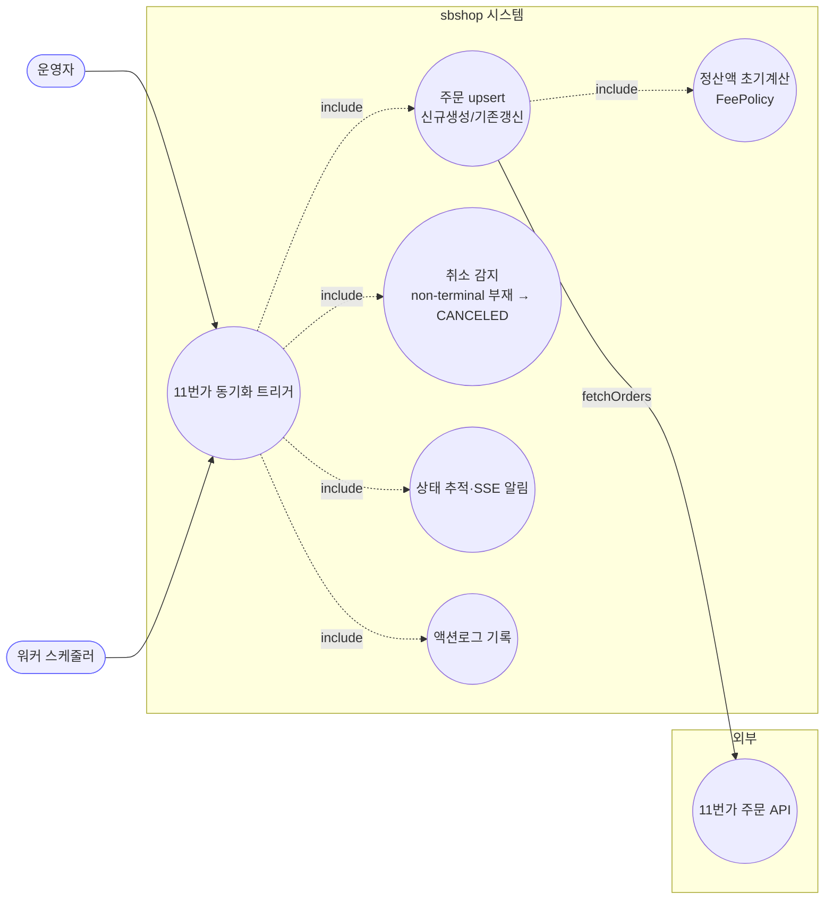
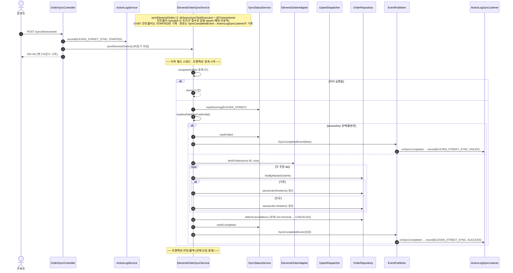

# POST /api/v1/orders/sync/elevenstreet — 11번가 주문 동기화 트리거

## 1. 개요

| 항목 | 내용 |
|------|------|
| **Method / URL** | `POST /api/v1/orders/sync/elevenstreet` (바디 없음) |
| **목적** | 11번가 주문을 최근 30일 범위로 조회해 upsert하고, API 응답에 사라진 non-terminal 주문을 CANCELED로 감지한다(D-028). |
| **핵심 상태전이** | 라인아이템 `shippingStatus`를 마켓 응답값으로 갱신. API 부재 non-terminal → `CANCELED`. |
| **부수효과** | 외부 11번가 API 호출, DB upsert, 정산액 초기계산(FeePolicy), `marketSpecificData` 반영, SSE(`SyncCompletedEvent`), 동기화 상태 테이블 갱신, 액션로그 기록. |
| **실행 모델** | 서비스 진입점 `@Async("syncTaskExecutor")` + `@Transactional` → 컨트롤러는 트리거(STARTED 기록)만 하고 즉시 200 반환. 완료(SUCCESS/FAILED) 액션로그는 `SyncCompletedEvent`→`ActionLogSyncListener`가 기록(D-087에서 컨트롤러 가짜 SUCCESS 제거). |
| **응답** | `200 OK` `{success:true, message:"...백그라운드에서 시작..."}`. 트리거 실패 시 `500`. |

## 2. 호출 체인

```
OrderSyncController.syncElevenStreetOrders()                  api/.../controller/OrderSyncController.java:114-137
  ├─ ActionLogService.record(ELEVEN_STREET_SYNC, STARTED)     OrderSyncController.java:117 → core/.../actionlog/ActionLogService.java:29
  ├─ ElevenstOrderSyncService.syncElevenstOrders()  @Async @Transactional   OrderSyncController.java:121 → core/.../order/service/ElevenstOrderSyncService.java:48-82
  │    ├─ isSyncing.compareAndSet(false,true) 중복 가드        ElevenstOrderSyncService.java:51-54
  │    ├─ syncStatusService.markRunning(ELEVEN_STREET)        :57 → sync/SyncStatusService.java:28
  │    ├─ loadAndValidateCredential()                         :60 / :84-93 (accessKey 공백 → IllegalArgumentException, D-043)
  │    ├─ elevenstOrderAdapter.fetchOrders(cred, now-30, now) :61-62 (외부 API)
  │    ├─ processOrders(orders, cred)                         :64 / :95-101
  │    │    └─ MarketOrderUpsertDispatcher.dispatch(...)      :99 → order/service/MarketOrderUpsertDispatcher.java:33-52
  │    │         ├─ 존재 → updateExistingOrder                Dispatcher.java:41-46 / Elevenst:103-113
  │    │         │     ├─ updateLineItemFromDto (트래킹 무조건 반영)  :115-126
  │    │         │     └─ updateOrderInfoFromDto (progressed 주소보호 + marketSpecificData)  :128-146
  │    │         └─ 없음 → createNewOrder                     Dispatcher.java:47-49 / Elevenst:148-155
  │    │               ├─ buildOrderFromDto (marketSpecificData 세팅)  :157-182
  │    │               └─ buildLineItemFromDto (settlementAmount)  :184-201 → fee/MarketFeeService.java:43
  │    ├─ postSyncProcess(orders) → detectCancellations       :65 / :222-267 (D-028: non-terminal 부재 → CANCELED)
  │    │       └─ isNonTerminal 판정 (CANCELED/DELIVERED/RETURNED/EXCHANGED 제외)  :273-282
  │    ├─ (성공) markCompleted + SyncCompletedEvent           :69 / :78-79
  │    └─ (실패) catch → markFailed + SyncCompletedEvent(false)  :70-75
  │         └─ (완료 기록) ActionLogSyncListener.onSyncCompleted → record(ELEVEN_STREET_SYNC, SUCCESS/FAILED)  core/.../actionlog/ActionLogSyncListener.java:22-34
  └─ (D-087) 컨트롤러는 STARTED만 기록 — 트리거 직후 SUCCESS 기록은 제거됨(:119 주석). 완료는 SyncCompletedEvent→ActionLogSyncListener가 기록.
       (동기 디스패치 실패 시에만 catch → record(FAILED))     OrderSyncController.java:123-131
```

**요청 바디:** 없음. 조회 범위는 서비스가 `now-30 ~ now` 고정(`ElevenstOrderSyncService.java:62`), detectCancellations도 동일(:223-224).

## 3. 유스케이스 다이어그램



## 4. 시퀀스 다이어그램



## 5. 순서도 (플로우차트)


## 6. 상태 전이표

| 진입 라인상태 | 조건 | 결과 상태 | 마켓 전송 | 비고 |
|-----------|------|-----------|-----------|------|
| (신규 주문) | 마켓 응답 | 마켓상태로 생성 | 조회만 | `buildLineItemFromDto`가 `dto.getStatus()`(:193) |
| 기존 · 임의 상태 | 마켓 응답 존재 | 마켓상태로 갱신 | 조회만 | `updateLineItemFromDto`가 `dto.getStatus()` 무조건 반영(:123) — 진입 상태 가드 없음 |
| non-terminal(NEW/PREPARING/SHIPPED) | API 응답에 부재 + 주문일 범위내 | `CANCELED` | detectCancellations | `isNonTerminal` 판정 후 전이(:245-259) |
| terminal(CANCELED/DELIVERED/RETURNED/EXCHANGED) | API 응답에 부재 | **미변경** | — | 오취소 방지(:273-282, D-028) |
| 주문일이 조회 범위 밖 | — | 미변경 | — | 범위 밖은 취소감지 스킵(:238-243) |

## 7. 🔎 발견사항

### SYNCA-9 · 🟠 GAP — 컨트롤러 try/catch·FAILED 기록이 async 예외를 포착하지 못함(항상 SUCCESS 기록)
> ✅ **해결됨** (D-087, 커밋 c4c7faa) — 컨트롤러의 트리거 직후 `record(SUCCESS)`(구 :123)를 제거해 컨트롤러는 STARTED만 남기고, 완료(SUCCESS/FAILED)는 기존 `SyncCompletedEvent`→`ActionLogSyncListener`가 기록하도록 위임했다.
- **근거:** `ElevenstOrderSyncService.syncElevenstOrders`는 `@Async("syncTaskExecutor")` + `void`(`ElevenstOrderSyncService.java:48-50`). 컨트롤러(`OrderSyncController.java:117-131`)의 try/catch는 비동기 위임 호출만 감싸므로 동기화 본문 예외는 별도 스레드에서 발생, catch 미도달. 이전에는 항상 `record(ELEVEN_STREET_SYNC, SUCCESS)`(구 :123)가 기록됐다.
- **영향:** 실제 실패가 액션로그에 FAILED로 남지 않았음. `record(FAILED)`(:126)는 트리거 즉시 실패 시에만 도달하는 사실상 데드코드. 실제 결과는 `/status`·`SyncCompletedEvent`에만 반영됐다.
- **제안:** 액션로그 기록을 서비스 본문(markCompleted/markFailed, `ElevenstOrderSyncService.java:69`·`:72`)으로 이동하거나 컨트롤러 메시지를 "트리거 접수"로 정정. (쿠팡·스마트스토어와 공통 결함 — 세 경로 일괄 처리 권장.) (반영됨 — 4개 sync 컨트롤러 가짜 SUCCESS를 일괄 제거, 완료는 `ActionLogSyncListener`가 기록.)

### SYNCA-10 · 🟡 SMELL — 취소감지가 마켓별로 3중 구현(어댑터 vs 서비스 내장)되어 로직 분산
- **근거:** 취소감지가 11번가는 서비스 안에 자체 구현(`ElevenstOrderSyncService.java:228-267` + `isNonTerminal` :273-282), 쿠팡은 어댑터(`CoupangOrderSyncService.java:354` `coupangOrderAdapter.detectCancellations`), 스마트스토어는 아예 없음(no-op). terminal 제외 집합(CANCELED/DELIVERED/RETURNED/EXCHANGED) 판정이 마켓마다 별개로 존재.
- **영향:** 동일 개념(부재 주문 취소 감지)의 3원화로 terminal 집합·범위 기준이 마켓별로 달라질 위험. 유지보수 시 한 곳만 고쳐 정합이 어긋날 수 있다.
- **제안:** `isNonTerminal`/취소감지 골격을 공통 헬퍼로 추출(upsert dispatcher처럼)해 마켓별 조회원(어댑터)만 주입, terminal 집합을 단일 원천화.

### SYNCA-11 · 🟡 SMELL — 장시간 외부 동기화 전체가 단일 `@Transactional` 경계 + in-JVM 중복가드
- **근거:** `syncElevenstOrders`가 `@Transactional`(`ElevenstOrderSyncService.java:49`) 하나로 외부 `fetchOrders`(:61)·전체 upsert(:64)·detectCancellations(:65, DB 재조회 포함 :234·:246)를 감싼다. 중복가드는 in-JVM `AtomicBoolean`(:46,51).
- **영향:** ① 외부 API 왕복 동안 트랜잭션·커넥션 장기 점유. ② detectCancellations 단계 예외 시 앞선 upsert 전체 롤백. ③ 워커 스케줄러(`OrderSyncScheduler.java:73-77`)와 API 트리거는 서로 다른 JVM이라 `AtomicBoolean`이 교차 JVM 동시실행을 막지 못함.
- **제안:** 배치 단위 트랜잭션 분리, 중복가드를 정산 경로(DB 클레임)처럼 교차 JVM 방식으로 통일 검토.

### SYNCA-12 · 🔵 NOTE — 트래킹번호 마켓전송 보존 가드 부재(쿠팡과 비대칭)
- **근거:** `ElevenstOrderSyncService.updateLineItemFromDto`(:115-126)는 쿠팡의 `trackingSentToMarket` 보존 가드(`CoupangOrderSyncService.java:218-227`) 없이 `dto.getTrackingNo()`/`carrier`를 무조건 반영.
- **영향:** sbshop 선등록·마켓 미전송 송장이 있으면 동기화가 마켓값으로 덮어써 유실 가능(마켓 write-path에 따라 조건부).
- **제안:** 11번가 송장 write-path 특성 확인 후 보존 가드 필요성 판정.

## 8. 테스트 커버리지 메모

- **컨트롤러:** `OrderSyncControllerActionLogTest`가 D-087에서 새 계약(트리거=STARTED만·SUCCESS는 컨트롤러가 남기지 않음·동기 디스패치 예외 시에만 FAILED)으로 재작성됨. 완료 SUCCESS/FAILED는 `ActionLogSyncListener`의 책임이라 컨트롤러 단위 테스트 범위 밖(SYNCA-9 해소로 컨트롤러의 가짜 SUCCESS 자체가 사라짐).
- **서비스:** `ElevenstDetectCancellationsTest`가 D-028 취소감지를 정밀 검증 — NEW 부재→CANCELED, RETURNED/EXCHANGED/DELIVERED 부재→미취소(오취소 방지). `MarketCredentialValidationTest`(`elevenst_blankAccessKey_failsFast`)로 크레덴셜 fast-fail, `OrderSyncEventEmissionTest`(elevenst 실패 이벤트)로 이벤트 계약 검증.
- **비어있는 케이스:** ① 진행 주문 주소 보호는 쿠팡/스마트스토어만 테스트(11번가 `updateOrderInfoFromDto` 주소보호 :130 미검증), ② marketSpecificData 반영(:139-145), ③ 단일 트랜잭션 부분실패 롤백(SYNCA-11), ④ 트래킹 보존 가드(SYNCA-12).

---
*생성: 2026-07-17 · 근거: 현재 워킹트리*
